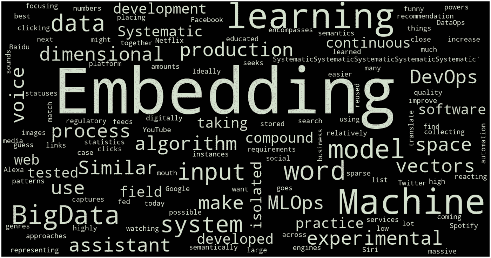
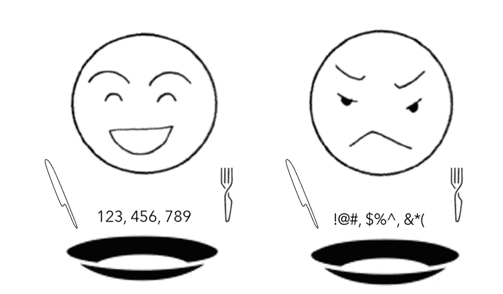
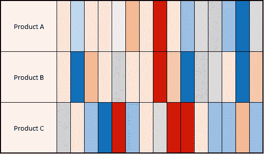
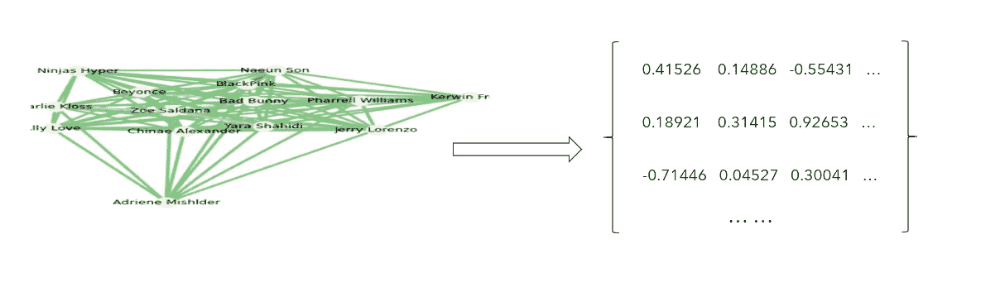

# 什么是嵌入，你能用它做什么

> 原文：<https://towardsdatascience.com/what-is-embedding-and-what-can-you-do-with-it-61ba7c05efd8?source=collection_archive---------9----------------------->

作者图片

W ord2vec(由托马斯·米科洛夫领导的谷歌研究团队发表)作为自然语言处理领域的“突破性技术”，至今已有八年历史。他们开创了单词嵌入的概念，作为技术的基础。

到目前为止，嵌入的使用已经被应用到广泛的分析中，并且产生了显著的影响。机器学习或深度学习中的许多概念都是建立在彼此之上的，嵌入的概念也不例外。对嵌入有一个坚实的理解将使学习许多更高级的 ML 技术变得容易得多。

因此，在今天的博客中，我将引导您浏览以下主题，以帮助您彻底理解嵌入的定义和应用:

1.  **外行人解释:一个特定任务的字典**
2.  **直观解释:正在行走的点**
3.  ***为什么我们想要嵌入***
4.  ***嵌入的各种应用***
5.  ***汇总***

# 外行人的解释:特定任务的字典

从 Google 的[机器学习速成班](https://developers.google.com/machine-learning/crash-course/embeddings/video-lecture)中，我找到了关于嵌入的描述:一个**嵌入**是一个相对低维的空间，你可以将高维向量平移到其中。嵌入使得在大量输入上进行机器学习变得更加容易，比如表示单词的稀疏向量。理想情况下，嵌入通过在嵌入空间中将语义相似的输入放在一起来捕获输入的一些语义。嵌入可以跨模型学习和重用。

太棒了！这可能是我在网上能找到的关于嵌入的最精确和简洁的描述。尽管如此，它仍然有点令人费解和模糊。那么，在假装对机器学习只有初步了解的情况下，又该如何通俗易懂地解释呢？

作者图片

这里有一个例子:当应用于文本挖掘项目时，嵌入可以帮助我们通过研究一个词经常出现在什么其他词旁边来学习这个词的语义。然后我们可以产生一个嵌入列表，可以把它当作 ***一个任务专用字典*** 。如果你想了解语料库中某个特定单词的更多信息，去“字典”里查一下。然而，它并没有为你提供人类语言的定义，而是返回 ***一个数值向量来反映它的语义*** 。此外，这些向量之间的距离度量了项目中术语之间的相似性和关系。

从 word2vec 的名字可以看出——“单词到向量”，它将单词转换成数字的向量。换句话说， ***嵌入是一串数字，作为唯一标识符*** 。我们可以使用嵌入技术为一个单词、一个人、一个声音、一幅图像等分配一个唯一的数字 ID。在你的研究中。科学家利用这种想法，创造了许多有趣的 2vec 风格的模型，以促进机器学习过程。

# 直观解释:行走的点

通常，嵌入被保存为向量。矢量的定义是“一个有方向和大小的量，特别是确定空间中一点相对于另一点的位置。”由于**嵌入被假定为在空间**中具有方向和大小，直观地，我们可以将每个矢量视为步行点的路线图。我们可以想象，所有的嵌入大概都是从同一点出发，它们会开始沿着自己的方向和权重在空间中行走。**在行走之后，每个嵌入将到达不同的端点，并且相邻点彼此更加相似，因此应该被分类到相同的组中。**因此，我们倾向于借助余弦相似度使用嵌入进行社区检测或群组聚类。它通常也用于分类任务。

为了说明上面提到的想法，我们可以做的是使用维度演绎技术(主成分分析，UMAP 等)。)将高维向量的大小缩小到 2D/3D，并在图上画出点。这里有一个博客专门向你展示如何在 3D 空间中实现这一点:

 [## 使用 3D 360 度动画散点图可视化高维网络数据

### 使用 node2vec，networkx，pca，seaborn 等。可视化高维网络数据

towardsdatascience.com](/visualize-high-dimensional-network-data-with-3d-360-degree-animated-scatter-plot-d583932d3693) 

# ***为什么我们要嵌入***

以下是我们希望在项目中包含嵌入的几个原因:

首先，当前的**机器学习模型继续倾向于将数值作为输入**。他们类似于数学书呆子，当输入数字时，他们可以快速捕捉重要信息，但对离散的分类变量反应迟钝。然而，当研究计算机视觉或语音识别等时，我们不太可能能够收集或仅收集我们的目标/因变量的数字数据。**将这些离散的分类变量转换成数字有助于模型拟合**。

作者图片

第二，它有助于**减小尺寸**。有人可能会说，一次性编码技术是我们处理分类变量的方式。然而，在今天的数据科学世界中，它被证明是非常低效的。

当处理一个有四种不同类型的变量时，我们通常会创建四个新的虚拟变量来处理它。此外，它以前运行良好。

然而，考虑以下场景:我们正在研究三种产品的消费者反馈。对于每个观察，我们只有一个变量——评论内容。我们可以建立一个术语-文档矩阵，然后将其放入分类器或其他算法中。然而，让我们假设每个产品有 5 万条评论，语料库中的唯一单词总数是一百万。那么我们最终会得到一个形状为(150K x 1M)的矩阵。对于任何模型来说，这都是一个大得离谱的输入。这就是我们需要引入嵌入概念的时候。

假设我们将维度减少到 15(每个产品有一个 15 位数的 ID)，取每个产品嵌入的平均值，然后根据数值给它们着色；这是我们得到的:

作者图片

即使没有人类语言呈现，我们仍然可以感知到客户对产品 A 和 B 的感知彼此更相似，而对产品 C 的感知不同。而这个矩阵的形状只有(3×15)。

这是另一个在谷歌机器学习速成班上讲过的例子，讲的是如何为一个电影推荐系统使用嵌入:[嵌入:分类输入数据](https://developers.google.com/machine-learning/crash-course/embeddings/categorical-input-data)。

第三个原因是为了**降低复杂度**。这有点像第二个原因的延伸。嵌入还有助于将非常复杂的信息转化为数字向量。下面是一个社交网络分析的例子:

作者图片

最初，我们从社交媒体收集数据，并将其转换为社交网络分析图。在图中，我们可以使用节点之间的距离和纽带的颜色来解释节点之间的相似性。但是，它很复杂，很难读懂。现在，我们在图中只有 14 个节点，而且已经很乱了。你能想象如果我们调查 100 个节点会发生什么吗？这被称为复杂(高维)数据。然而，通过使用某些技术来帮助降维，我们可以将图转换成嵌入列表。结果，我们现在有了一个新的、干净的节点“字典”,而不是杂乱的图。我们可以使用“字典”来制作一个人类可读的可视化。

# T ***he 嵌入的各种应用***

在发现了嵌入是什么以及我们为什么需要它之后，您一定很兴奋地看到了它在实践中的一些应用。因此，我选择了一系列有趣的应用程序，这些应用程序使用了嵌入的思想以及一些相关的文献或用法演示。

## 自然语言处理:

word2vec:

*   论文:[https://papers . nips . cc/paper/5021-distributed-presentations-of-words-and-phrases-and-they-composition ity . pdf](https://papers.nips.cc/paper/5021-distributed-representations-of-words-and-phrases-and-their-compositionality.pdf)
*   解说:[https://jalammar.github.io/illustrated-word2vec/](https://jalammar.github.io/illustrated-word2vec/)

sent2vec:

*   论文:[https://arxiv.org/abs/1703.02507](https://arxiv.org/abs/1703.02507)
*   解说:[https://bit.ly/3uxFJ7S](https://bit.ly/3uxFJ7S)

doc2vec:

*   论文:[https://cs.stanford.edu/~quocle/paragraph_vector.pdf](https://cs.stanford.edu/~quocle/paragraph_vector.pdf)
*   演示:[https://towards data science . com/detecting-document-similarity-with-doc 2 vec-f 8289 a 9 a 7 db 7](/detecting-document-similarity-with-doc2vec-f8289a9a7db7)

## 图像分析:

Img2vec:

*   解释和示范:[https://becoming human . ai/extract-a-feature-vector-for-any-image-with-py torch-9717561 d1d 4c](https://becominghuman.ai/extract-a-feature-vector-for-any-image-with-pytorch-9717561d1d4c)

## 社交网络分析:

node2vec:

*   论文:[https://arxiv.org/abs/1607.00653](https://arxiv.org/abs/1607.00653)
*   案例分析&代码:[https://medium . com/analytics-vid hya/analyzing-disease-co-occurrence-using-networkx-ge phi-and-node 2 vec-53941 da 35 a 0 f](https://medium.com/analytics-vidhya/analyzing-disease-co-occurrence-using-networkx-gephi-and-node2vec-53941da35a0f)

# 总结:

在机器学习的背景下，嵌入的功能相当于特定任务的字典。它用一系列数字对我们的目标进行编码，作为一个唯一的 ID。我们喜欢使用嵌入，因为它可以帮助将离散的分类变量转换成模型可读的数据，还可以帮助降低数据的维度和复杂性。我还列举了几款精选的 2vec 风格的车型。

本月晚些时候，我可能会写另一篇文章来演示嵌入的一种用法。上面的算法只是 2vec 风格模型的一小部分。如果你感兴趣，我想[这个网站](https://github.com/chihming/awesome-network-embedding)可能会帮助你。

***请随时与我联系***[***LinkedIn***](https://www.linkedin.com/in/jinhangjiang/)***。***