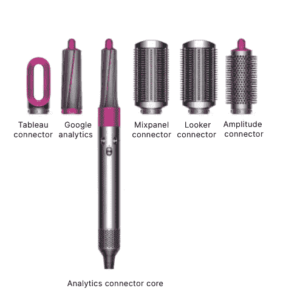

# 什么是 ETL？

> 原文：<https://towardsdatascience.com/what-is-etl-88154bdcde58?source=collection_archive---------22----------------------->

## 三代 ETL/ELT 工具，以及生态系统如何发展

图片来自 [Castor 的](https://www.castordoc.com/blog/etl-benchmark-for-mid-market-companies)网站

ETL (Extract-Load-Transform)是最广泛的**数据集成**方法，即整合来自不同源系统的数据以改善数据访问的实践。故事还是老样子:企业有海量数据要处理，理解这些数据有助于提高企业绩效。ETL 在这一探索中扮演着核心角色:它是将原始的、杂乱的数据转化为干净的、新鲜的、可靠的数据的过程，从这些数据中可以获得业务洞察力。这篇文章试图阐明这个过程是如何进行的，ETL 工具是如何发展的，以及当今对您的组织可用的最佳工具。

# 什么是 ETL？

如今，组织从多个不同的业务源系统收集数据:云应用程序、CRM 系统、文件等。ETL 过程包括汇集来自这些不同来源的数据，以构建唯一的真实来源:数据仓库。 **ETL 管道**是数据管道，它有一个非常具体的作用:从它的源系统/数据库中提取数据，转换它，并将其加载到数据仓库中，数据仓库是一个集中式的数据库。**数据管道**本身是**数据基础设施**的一个子集，该层支持整个组织的数据编排、管理和消费。

ETL 管道—图片由 Louise de Leyritz 提供

ETL 不只是移动数据:杂乱的数据是从其原始源系统中提取出来的，通过转换变得可靠，最后装载到数据仓库中。

# 提取

数据集成过程的第一步是数据提取。在这个阶段，数据管道从多个数据源和数据库中提取数据，并将其汇集到一个**暂存区**。

ETL 流程—图片由 Louise de Leyriyz 提供

临时区域的用途如下:

1.  通常不可能同时从所有源系统中提取所有数据。staging area 允许在不同时间将数据集合在一起，这是一种不会淹没数据源的方法。
2.  它避免了同时执行提取和转换，这也会使数据源负担过重。
3.  最后，当将数据加载到集中式数据库中出现问题时，临时区域非常有用。这允许根据需要回滚和恢复同步。

# 改变

数据集成的第二步是转换数据，将数据转换成适合分析的格式。使数据符合目的有两个部分。

*   在原始的源系统中，数据通常是杂乱的，因此很难解释。转换的一部分在于提高数据的质量:清除无效数据，删除重复数据，标准化测量单位，根据类型组织数据，等等。
*   在转换阶段，数据也被**结构化和重新格式化**，以使其适合特定的业务目的。很多时候，事务数据与运营数据集成在一起，这使得它对于数据分析和商业智能非常有用。例如，ETL 可以将业务运营中使用的名称、地点和定价数据与交易数据结合起来，例如零售或医疗保健索赔，如果最终用户需要这种结构来进行数据分析的话。**因此，转型主要由寻求用数据解决精确业务问题的分析师的特定需求**决定。

# 负荷

数据集成的最后一步是将经过转换、格式正确的数据加载到数据仓库中。数据可以一次全部加载(全加载)，也可以按预定的时间间隔加载(增量加载)。这通过使用**批次**或**流装载**来实现。批量加载是指 ETL 软件从源系统中提取批量数据，通常基于一个时间表(例如每小时)。流式 ETL，也称为实时 ETL 或流处理，是一种替代方法，在这种方法中，一旦数据源系统提供了信息，数据管道就会接收这些信息。特定的业务用例决定了处理的选择。例如，当你进行高频交易时，你通常更喜欢获得实时数据，并获得一个支持流处理的工具。

# 为什么我们需要 ETL？

ETL 可以在多个方面为您的组织带来好处:

✅ ETL 将数据库和各种形式的数据组合成一个单一的、统一的视图。这使得查找数据和进行有意义的业务分析变得更加容易。

✅ ETL 提高了**数据人员的生产力**，因为它整理并重用了移动数据的过程。

✅ ETL 提供了深刻的历史背景，这培养了对数据的信任。

✅ ETL 允许源系统和目标系统之间的样本数据比较

# 有哪些可用的工具？

ETL 工具已经存在有一段时间了，但是在过去的几年中，作为他们努力跟上数据基础设施发展的一部分，它们已经有了很大的发展。数据集成过程最重要的演变是从 ETL(提取-转换-加载)工具到 EL-T(提取-加载-转换工具)的转变。这基本上是过程顺序的改变，有着有趣的应用。

我们区分了三代 ETL/ELT 工具:

**第一代**:标准 ETL(提取-转换-加载)工具。它们遵循 20 世纪 90 年代特有的严格的存储、带宽和计算约束所决定的过程

**第二代** : ELT(提取-加载-转换)流程源于云数据仓库的到来以及存储和带宽限制的解除。

**第三代:**第三代 ETL 工具提供了更多的连接器，因为它们能够标准化连接器并利用它们的社区。

# ETL 1.0:构建数据仓库

数据集成(ETL)的标准方法可以追溯到 20 世纪 70 年代，当时企业开始使用中央数据存储库。但是专门用于帮助将数据加载到数据仓库中的工具只出现在 20 世纪 90 年代早期，当时数据仓库占据了中心位置。

传统的 ETL 工具从孤立的系统和数据库中提取数据，根据所需的结构进行转换，然后将其加载到集中式数据库中。这是根据以下过程实现的:

1.  定义数据项目及其所对应的业务需求
2.  确定项目的相关数据源
3.  定义分析师解决特定业务问题所需的数据模型/结构。
4.  构建 ETL 管道(提取、转换和加载功能)
5.  进行数据分析并获得业务洞察力

传统 ETL 工具的主要特征是执行过程的顺序。具体来说，数据在被加载到数据仓库之前被转换**。原因很简单:在 20 世纪 90 年代，存储、计算和带宽极其稀缺和昂贵。因此，在将数据加载到仓库之前减少数据量至关重要。**

这个过程发生的特定顺序是与第一代 ETL 工具相关的大多数障碍的根源。

首先，它导致了重要的**可伸缩性问题**。ETL 管道不仅仅从数据库中提取数据，还执行复杂的转换，以满足终端用户的特定需求。这涉及到大量的时间和定制代码。当数据用户想要进行业务分析，需要尚不存在的配置中的数据时，数据工程师需要为新的用例重写转换代码。当数据量增加时，就不可能构建和维护高度定制的数据管道。

将转换步骤放在加载步骤之前的第二个问题是，这会导致 ETL 管道的持续维护。因为管道一起提取和转换数据，所以一旦数据源系统中的模式改变，它们就中断；例如，当删除或添加字段时。这使得用于将数据转换为预定义模型的代码失效，需要由数据工程师重新编写。

这个可伸缩性问题没什么大不了的，因为传统的本地数据仓库基础设施无论如何都无法容纳和处理这么多数据。

# ETL 2.0:云计算时代

在过去的几十年里，存储和计算成本下降了数百万倍，带宽成本下降了数千倍。这导致了云的指数级增长，以及**云数据仓库**的到来，如亚马逊红移或谷歌 BigQuery。云数据仓库的独特之处在于，它们比传统数据仓库具有无限的可扩展性，能够容纳几乎任何数量的数据。不仅如此，云数据仓库还支持大规模并行处理(MPP)，能够以令人难以置信的速度和可扩展性协调大量工作负载。

这些新的云数据仓库要求对 ETL 过程进行彻底的改变。传统的 ETL 适用于传统的数据仓库。既然组织已经有了可伸缩的基础设施，是时候**获得可伸缩的 ETL** 管道了；可以处理和转换任何数量的数据。传统 ETL 工具的性能在云中并没有提高，因为可伸缩性问题是在仓库中移动数据的过程所固有的。因此，在使用传统 ETL 工具的同时投资一个云数据仓库，会给你留下与旧数据仓库相同的瓶颈。

ETL 过程必须改变，它确实改变了。值得注意的是，数据集成技术不再受到存储、计算和带宽的限制。这意味着组织可以在仓库中加载大量未转换的数据，而不用担心成本和限制。你猜怎么着，他们确实这么做了。

这就是提取-加载-转换(ELT)过程取代传统 ETL 的原因。这里的想法是**从源系统中提取**数据，并直接**将**数据加载到云数据仓库中，而不进行转换。我们现在谈到 ELT **连接器，**ELT 工具的组件，它们建立到数据源的连接，构建管道，并允许提取和加载步骤发生。连接器不处理特定业务用例的转换；一旦数据被加载到数据仓库中，就会通过 dbt 之类的工具对其进行处理。

EL-T 过程—图片由 Louise de Leyritz 提供

在工作流程的最后移动变换层有几个主要优点:

✅将加载和转换步骤分离开来，这意味着数据管道不再是高度定制的、耗时的过程。事实上，使用 ELT，管道只是将数据从源移动到目的地，除了数据清理/规范化之外什么也不做。不再为最终用户定制转换。这意味着 ELT 的提取和加载阶段可以自动化，并且可以根据需要放大或缩小。

✅在云数据仓库中，转换过程本身要简单得多。转换不再用复杂的语言编写，比如 Python。转换和数据建模发生在 SQL 中，这是一种由 BI 专业人员、数据分析师和数据科学家共享的语言。这意味着曾经由数据工程师**专有的**转换**，现在可以由分析师**和技术人员处理。

✅将转换层从提取和加载中分离出来还有另一个好处:**转换层的故障**(当上游模式或下游数据模型改变时)**不会阻止数据被加载到云数据仓库中**。相反，随着数据继续被提取和加载，分析师可以重写转换。实用。

ETL 和 ELT 因此在三个层次上有所不同:**当**转换发生时，**在**哪里发生，以及由**谁**执行。转换步骤是 ETL 过程中最复杂的步骤，这解释了为什么拥有云数据仓库的组织现在使用 ELT 工具。

❌第二代工具是对传统 ETL 过程的巨大改进，但是它们仍然不能完全解决数据集成问题。事实上，市面上大多数 ELT 工具**都没有破解过连接器外壳。**性能最好的 ELT 工具建议数据源和数据目的地之间最多有 150–200 个连接器。这已经很好了。问题是，全球组织使用的营销/技术工具超过 5000 种。这些组织是做什么的？嗯，他们要么不使用任何工具，而是使用 Airflow 或 Python 来构建连接器([是的，人们仍然这样做！或者他们在购买诸如 Stitch 或 Fivetran 等 ETL 工具的基础上构建和维护自己的定制连接器。不理想？我们知道，但整合游戏并不容易。](https://www.reddit.com/r/dataengineering/comments/pbaw2f/what_etl_tool_do_you_use/)

# ETL 3.0:连接器的商品化

第三代 ETL 工具面临着一个严峻的挑战:如果他们想给客户带来价值，他们需要在**连接器**和维护工作方面达到预期。解决方案在于连接器的商品化，但如何实现呢？

## 连接器标准化

ETL 工具不建议使用 150/200 以上的现成连接器的原因是，构建这些连接器确实很痛苦。因此，第三代工具在**中投入了巨大的努力，使得构建新的连接器变得很简单。**但是，如何使连接器易于构建呢？您需要标准化连接器的工作方式。这意味着构建连接器的核心，数据工程师只需调整这个核心就可以获得他们需要的定制连接器。

这相当于为 ETL 工具构建 Dyson 吹风机。戴森彻底改变了头发护理，这要归功于一个小装置，你可以根据你的头发情绪，在其上插上卷发器、吹风机、加热刷、直发器和其他新奇的东西。开发这款设备花费了 7100 万美元，还有数百名工程师，但是顾客很高兴他们不必根据他们想要的发型购买 6 种不同的设备。对于 ETL 工具来说，这是同样的挑战:寻找、构建和提供定义**连接器核心的东西。**这样就可以根据具体的使用情况轻松定制，就像开关吹风机的末端一样。

定制 ETL 连接器的最后一部分，而不是从头开始——图片来自 Dyson

在一个连接器没有标准化的世界里，构建 Tableau 的连接器需要很长时间。您需要访问源/目标文档、测试帐户、使用最适合任务的语言、定义输入等。这需要时间，而且令人厌倦。使用标准化连接器，您只需访问“分析”连接器核心，它本身是通过丰富为所有连接器设计的核心而构建的。在这种配置中，构建 Tableau 连接器需要几个小时，而不是几天。

## 开源:利用社区的力量

比构建连接器更难的是什么？**维护连接器。**谢天谢地，开源 ELT 工具可能已经解决了这个问题。ELT 工具有一个特别之处:它们是由使用它们的同一批人构建的:**数据工程师**。因此，开源 ELT 工具和发展一个强大的数据工程师社区可以带来巨大的成果。一个工程师需要造一个不存在的连接器？多亏了连接器的标准化，他花了两个小时。更好的是，整个社区，根据定义，所有其他客户都将受益于这种新的连接器。一个连接器有问题？检测到它的工程师为每个人修理它。简化维护:分担负担。

# 哪个 ETL/ELT 工具适合您的组织？

下面，你会发现一个 ETL 工具的场景，它可以帮助你选择一个适合你公司需求的解决方案。

ETL/ELT 工具前景—图片由 Louise de Leyritz 提供

点击[这里](https://notion.castordoc.com/catalog-of-etl-tools)查看完整的 ETL 工具和更多标准。

在选择 ETL 工具时，有各种各样的考虑因素。您希望确保选择适合您业务的工具。我们建议关注以下几个方面:

1.  **内置集成:**或者更准确地说，工具是否提出了您所关心的集成。最先进的 ETL 工具为 150–200 种最常用的应用程序提供了现成的连接器。如果您需要与一个特定的应用程序集成，请确保您选择了一个提供这种集成的工具。很可能你的 ETL 工具不能与你所有的应用程序/数据库集成。在这种情况下，请确保您选择的工具能够与其他具有所需连接器的 ETL 工具集成，连接到可以充当原始数据源和 ETL 工具之间中介的 S3 桶，或者从手动编码的管道中获取数据。
2.  **维护:**在寻找数据处理解决方案时，不要忘了维护对流程有多关键。如果您需要一个全职的工程团队来保持 ETL 管道正常运行，也许您应该考虑另一个解决方案。
3.  **可扩展性:**根据您是企业客户还是中小型公司，您选择的工具会有所不同。如果您是一个企业客户，您应该选择一个 ETL 工具，它可以轻松扩展，具有高可用性基础设施和每天处理数百万个表的能力。
4.  **支持:**无论你使用哪种工具，你最终都会需要帮助。如果您得不到所需的帮助，您的团队将无法开展其关键的数据处理活动，这将严重影响您的业务。

# 更现代的数据堆栈基准？

点击此处，了解更多关于现代数据堆栈[的性能指标评测和分析。我们写了利用数据资产时涉及的所有过程:从现代数据堆栈到数据团队的组成，再到数据治理。我们的博客涵盖了从数据中创造有形价值的技术和非技术方面。](https://notion.castordoc.com)

在 Castor，我们正在开发一个数据文档工具 Figma，Slack generation。或者对 Fivetran，Looker，Snowflake，DBT 的狂热爱好者来说是数据方面的。我们把我们的目录设计成**易于使用、令人愉快和友好。**

想去看看吗？[联系我们](https://meetings.hubspot.com/xavier76/trist-xav-calendar)，我们将向您展示一个演示。

*原载于*[*https://www.castordoc.com*](https://www.castordoc.com/blog/etl-benchmark-for-mid-market-companies)*。*