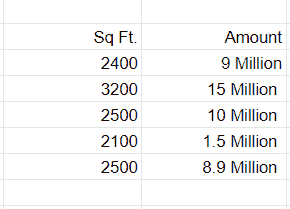
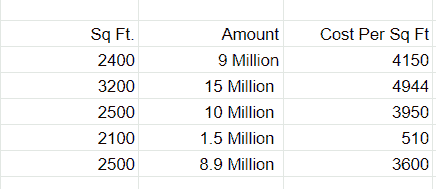
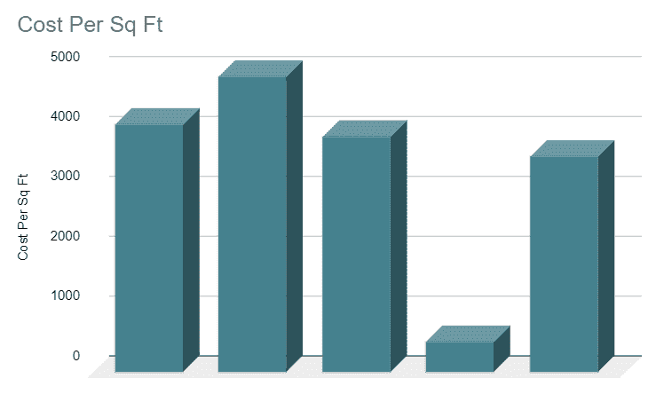
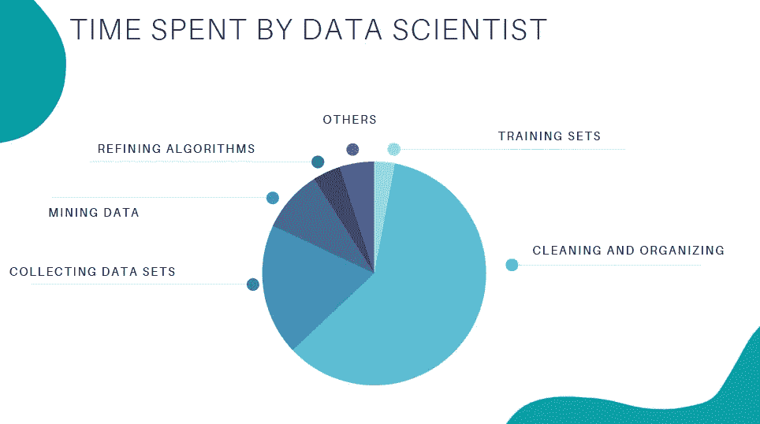
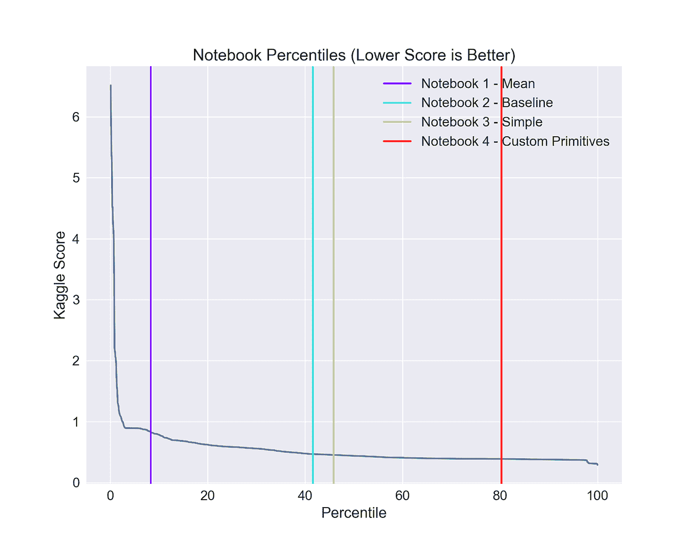
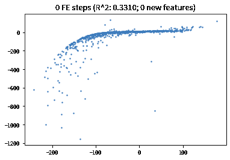
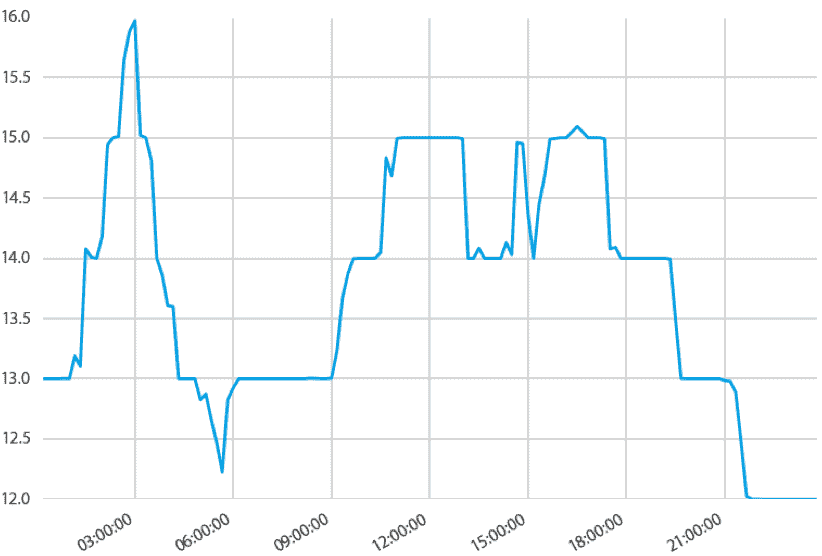

# 什么是特征工程——机器学习的重要性、工具和技术

> 原文：<https://towardsdatascience.com/what-is-feature-engineering-importance-tools-and-techniques-for-machine-learning-2080b0269f10?source=collection_archive---------0----------------------->

## 用于机器学习的特征工程技术是机器学习中的一个基本主题，但也是一个经常被忽视或看似简单的主题。

作者图片

特征工程是选择、操作原始数据并将其转换为可用于监督学习的特征的过程。为了让机器学习在新任务上工作得更好，可能有必要设计和训练更好的功能。如您所知,“特征”是可以在预测模型中使用的任何可测量的输入，可以是某个对象的颜色或某人的声音。简而言之，特征工程是使用统计或机器学习方法将原始观察结果转换成所需特征的行为。

在本文中我们将看到:

*   什么是特征工程，
*   特征工程的重要性，
*   机器学习的特征工程技术，
*   几个最好的特征工程工具。

# 什么是特征工程

特征工程是一种机器学习技术，它利用数据来创建训练集中没有的新变量。它可以为监督和非监督学习产生新的功能，目标是**简化和加速数据转换**，同时**提高模型准确性**。使用机器学习模型时需要特征工程。不管是数据还是架构，一个可怕的特性都会对你的模型产生直接的影响。

现在为了更容易地理解它，让我们看一个简单的例子。以下是 x 市的房价。它显示了房子的面积和总价。

抽样资料

现在，这些数据可能有一些错误或可能不正确，并不是互联网上的所有来源都是正确的。首先，我们将添加一个新列来显示每平方英尺的成本。

抽样资料

这项新功能将帮助我们了解更多关于我们的数据。因此，我们有了一个新的列来显示每平方英尺的成本。有三种主要的方法可以找到任何错误。你可以利用**领域知识**联系物业顾问或房地产经纪人，向他展示每平方英尺的价格。如果你的律师说每平方英尺的价格不能低于 3400 英镑，你可能会有问题。数据可以通过**可视化**。

当你绘制数据时，你会注意到一个价格与其他价格有很大的不同。在**观想方法**中，你可以很容易地注意到这个问题。第三种方法是用**统计**分析你的数据，发现什么问题。特征工程由各种过程组成

*   **特征创建**:创建特征包括创建对我们的模型最有帮助的新变量。这可以是添加或删除一些功能。正如我们上面看到的，每平方英尺的成本。英国《金融时报》专栏是一个特色创作。
*   **转换**:特征转换就是将特征从一种表示转换成另一种表示的功能。这里的目标是绘制和可视化数据，如果某些东西与新特征不符，我们可以减少使用的特征数量，加快训练速度，或提高某个模型的准确性。
*   **特征提取**:特征提取是从数据集中提取特征以识别有用信息的过程。在不扭曲原始关系或重要信息的情况下，这将数据量压缩为便于算法处理的可管理数量。
*   **探索性数据分析:**探索性数据分析(EDA)是一个强大而简单的工具，可以通过探索数据的属性来提高对数据的理解。当目标是创建新的假设或在数据中发现模式时，经常应用该技术。它通常用于大量以前没有分析过的定性或定量数据。
*   基准测试:基准测试模型是最用户友好的、可靠的、透明的和可解释的模型，你可以用它来衡量你自己的模型。运行测试数据集，看看你的新机器学习模型是否优于公认的基准，这是一个好主意。这些基准通常用作比较不同机器学习模型(如神经网络和支持向量机、线性和非线性分类器，或者不同方法(如 bagging 和 boosting)之间的性能的衡量标准。要了解关于特征工程步骤和过程的更多信息，请查看本文末尾提供的链接。现在，让我们来看看为什么在机器学习中需要特征工程。

# 特征工程的重要性

特征工程是机器学习中非常重要的一步。特征工程是指将人工特征设计成算法的过程。然后，该算法使用这些人工特征来提高其性能，或者换句话说，获得更好的结果。数据科学家大部分时间都在和数据打交道，让模型准确变得很重要。

作者图片

当特征工程活动正确完成时，产生的数据集是最佳的，并且包含影响业务问题的所有重要因素。作为这些数据集的结果，产生了最准确的预测模型和最有用的见解。

# 机器学习的特征工程技术

让我们看看一些你可以使用的特征工程最佳技术。列出的一些技术可能更适合某些算法或数据集，而其他技术可能在所有情况下都有用。

**1。插补**

在为机器学习准备数据时，缺失值是最典型的问题之一。人为错误、数据流中断、隐私问题和其他因素都可能导致丢失值。不管什么原因，缺失值都会对机器学习模型的性能产生影响。插补的主要目标是处理这些缺失值。有两种类型的插补:

*   **数字插补**:为了计算出当前人口中应该分配多少数字，我们通常使用已完成的调查或人口普查的数据。这些数据集可以包括关于有多少人吃不同类型的食物，他们是否生活在气候寒冷的城市或国家，以及他们每年挣多少钱的信息。这就是为什么当某些信息缺失时，数字插补被用来填补调查或普查中的空白。

> #用 0 填充所有缺少的值
> 
> data = data.fillna(0)

*   **分类插补:**处理分类列时，用列中的最高值替换缺失值是一个聪明的解决方案。但是，如果您认为该列中的值是均匀分布的，并且没有占主导地位的值，则输入类似“其他”的类别将是一个更好的选择，因为在这种情况下，您的插补更有可能收敛到随机选择。

> #分类列的最大填充函数
> 
> 数据['列名']。fillna(data['column_name']。value_counts()。idxmax()，inplace=True)

**2。处理异常值**

异常值处理是一种从数据集中移除异常值的技术。这种方法可用于各种规模，以产生更准确的数据表示。这对模型的性能有影响。根据型号的不同，影响可能很大，也可能很小；例如，线性回归特别容易受到异常值的影响。该程序应在模型训练之前完成。处理异常值的各种方法包括:

1.  **删除**:从分布中删除包含异常值的条目。然而，如果在众多变量中存在异常值，这种策略可能会导致数据手册的大部分内容丢失。
2.  **替换值**:或者，异常值可作为缺失值处理，并用适当的插补替换。
3.  **封顶**:用任意值或变量分布的值来代替最大值和最小值。
4.  **离散化:**离散化是将连续的变量、模型、函数转化为离散的过程。这是通过构建一系列连续的区间(或箱)来实现的，这些区间跨越了我们期望的变量/模型/函数的范围。

**3。日志转换**

对数变换是数据科学家使用最多的技术。它主要用于将偏态分布转化为正态分布或不太偏态的分布。我们取一列中值的对数，并利用这些值作为这个转换中的列。它用于处理混乱的数据，数据变得更接近正常的应用程序。

> //日志示例
> 
> df[log _ Price]= NP . log(df[' Price '])

**4。一键编码**

独热编码是一种编码类型，其中有限集合的元素由该集合中的索引来表示，其中只有一个元素将其索引设置为“1”，并且所有其他元素被分配范围[0，n-1]内的索引。与二进制编码方案相反，在二进制编码方案中，每个比特可以表示 2 个值(即 0 和 1)，该方案为每个可能的情况分配唯一的值。

**5。缩放比例**

特征缩放是机器学习中最普遍和最困难的问题之一，但它是正确处理的最重要的事情之一。为了训练一个预测模型，我们需要具有一组已知特征的数据，这些数据需要适当地放大或缩小。这篇博文将解释特征缩放是如何工作的，为什么它很重要，以及一些关于开始特征缩放的提示。

在缩放操作之后，连续特征在范围方面变得相似。尽管许多算法不需要这一步，但这样做仍然是个好主意。另一方面，k-NN 和 k-Means 等基于距离的算法需要缩放的连续特征作为模型输入。有两种常见的缩放方式:

**标准化**:通过标准化(或最小-最大标准化)，所有值在 0 和 1 之间的指定范围内缩放。这种修改对要素的分布没有影响，但是由于标准差较低，它会加剧异常值的影响。因此，建议在标准化之前处理异常值。

**标准化**:标准化(也称为 z 分数标准化)是在考虑标准偏差的同时缩放值的过程。如果特征的标准偏差不同，这些特征的范围也将不同。结果降低了特征中异常值的影响。为了得到一个平均值为 0、方差为 1 的分布，所有数据点都要减去它们的平均值，结果再除以分布的方差。

**了解更多关于** [**特征工程技术**](/feature-engineering-for-machine-learning-3a5e293a5114#3abe)

# 少数最佳功能工程工具

有许多工具可以帮助您自动化整个特征工程过程，并在短时间内为分类和回归任务生成大量特征。让我们来看看工程工具的一些特性。

# 功能工具

Featuretools 是一个执行自动化特征工程的框架。它擅长将时态和关系数据集转换为机器学习的特征矩阵。Featuretools 与您已经拥有的机器学习管道构建工具相集成。只需手动操作的一小部分时间，您就可以加载 pandas 数据框架并自动构建重要要素。

[图像来源](https://github.com/Featuretools/predict-taxi-trip-duration)

## 功能工具摘要

*   易于上手，良好的文档和社区支持
*   它通过将原始数据与您对数据的了解相结合，帮助您为机器学习和预测建模构建有意义的特征。
*   它提供 API 来验证只有合法的数据被用于计算，防止你的特征向量中的标签泄漏。
*   Featuretools 包括一个低级函数库，可分层生成要素。
*   它的 AutoML 库(EvalML)可以帮助您构建、优化和评估机器学习管道。
*   擅长处理关系数据库。

**了解更多关于** [**功能工具**](https://www.featuretools.com/) **。**

# 自动吃饭

AutoFeat 有助于通过自动特征工程和选择来执行线性预测模型。AutoFeat 允许您选择输入变量的单位，以避免构建物理上无意义的特征。

[来源](https://github.com/cod3licious/autofeat/blob/master/autofeat_examples.ipynb)

## 自动汇总

*   AutoFeat 可以通过一个热编码轻松处理分类特征。
*   该包中的 AutoFeatRegressor 和 AutoFeatClassifier 模型具有与 scikit-learn 模型相似的界面
*   不擅长处理关系数据的通用自动特征工程。
*   它在物流数据中很有用

**了解更多关于** [**自动调整**](https://github.com/cod3licious/autofeat/blob/master/autofeat_examples.ipynb) **。**

# TsFresh

tsfresh 是一个 python 包。它自动计算大量的时间序列特征。此外，该软件包包括在回归和分类任务中评估这些性状的解释力和显著性的方法。

[图像来源](https://tsfresh.readthedocs.io/en/latest/)

## t 最新摘要

*   它是时间序列分类和回归的最佳开源 python 工具。
*   它有助于提取峰值数量、平均值、最大值、[时间反转对称性统计](https://en.wikipedia.org/wiki/T-symmetry)等信息。
*   它可以与 FeatureTools 集成。

**了解更多** [**TsFresh**](https://tsfresh.readthedocs.io/en/latest/) **。**

# OneBM

OneBM 直接与数据库的原始表交互。它慢慢地连接表，在关系树上选择不同的路径。它识别联合结果中的简单数据类型(数字或分类)和复杂数据类型(一组数字、一组类别、序列、时间序列和文本),并对提供的类型应用预定义的特征工程方法。

*   关系数据和非关系数据都受支持。
*   与 FeatureTools 相比，它可以生成简单和复杂的特征。
*   它在 Kaggle 比赛中接受了测试，并超过了最先进的模型。

**了解更多关于** [**OneBM**](https://arxiv.org/pdf/1706.00327.pdf)

# ExploreKit

ExploreKit 基于这样一种想法，即极其丰富的功能通常是操作基本功能的结果，它确定了常用的操作符来独立地改变每个功能或组合多个功能。元学习用于对候选特征进行排序，而不是对所有已开发的特征进行特征选择，这可能非常庞大。

**了解更多关于**[**explore kit**](https://people.eecs.berkeley.edu/~dawnsong/papers/icdm-2016.pdf)

**对比**

# 结论

特征工程是从原始数据开发新的数据特征。通过这种技术，工程师分析原始数据和潜在信息，以提取新的或更有价值的特征集。特征工程可以被看作是数学优化的一种概括，它允许更好的分析。希望你了解了特征工程，它的技术和工程师使用的工具。如果你对这篇文章有任何疑问，你可以发表评论。

保持安全和愉快的体验！！

# 参考文献及推荐阅读:

*   [https://www . omni sci . com/technical-glossary/feature-engineering](https://www.omnisci.com/technical-glossary/feature-engineering)
*   [https://a cuvate . com/blog/the-what-why-and-how-of-feature-engineering/](https://acuvate.com/blog/the-what-why-and-how-of-feature-engineering/)
*   [https://neptune.ai/blog/feature-engineering-tools](https://neptune.ai/blog/feature-engineering-tools)
*   [https://www . analyticsvidhya . com/blog/2021/03/step-by-step-process-of-feature-engineering-for-machine-learning-algorithms-in-data-science/](https://www.analyticsvidhya.com/blog/2021/03/step-by-step-process-of-feature-engineering-for-machine-learning-algorithms-in-data-science/)
*   [https://analyticsindiamag . com/guide-to-automatic-feature-engineering-using-autofat/](https://analyticsindiamag.com/guide-to-automatic-feature-engineering-using-autofeat/)
*   [https://medium . com/analytics-vid hya/automated-feature-engineering-tools-44d 00 be 56 e3a](https://medium.com/analytics-vidhya/automated-feature-engineering-tools-44d00be56e3a)
*   [https://neptune.ai/blog/ml-from-research-to-production](https://neptune.ai/blog/ml-from-research-to-production)