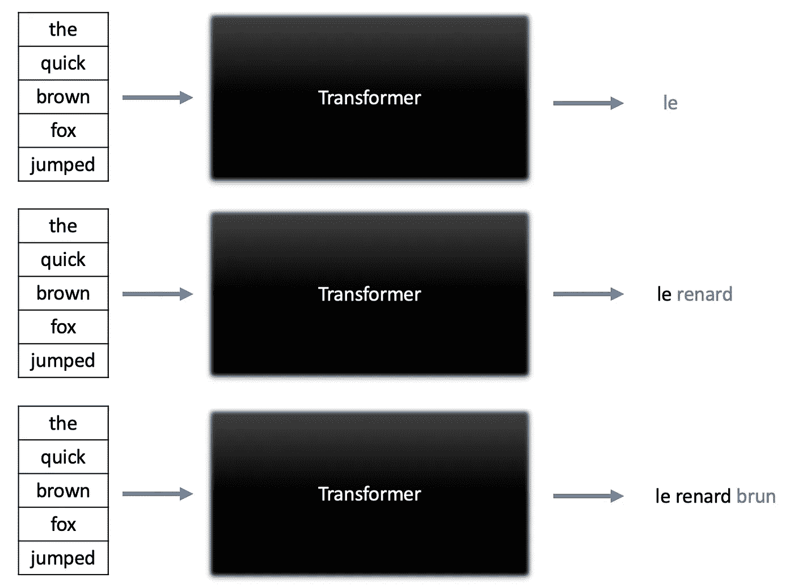

# 什么是 GPT-3，为什么它如此强大？

> 原文：<https://towardsdatascience.com/what-is-gpt-3-and-why-is-it-so-powerful-21ea1ba59811?source=collection_archive---------3----------------------->

## 理解这种生成类似人类文本的语言模型背后的宣传

帕特里克·托马索在 [Unsplash](https://unsplash.com/s/photos/books?utm_source=unsplash&utm_medium=referral&utm_content=creditCopyText) 上的照片

GPT-3(预训练生成变压器 3)是一种语言模型，由旧金山人工智能研究实验室 OpenAI 创建。这个拥有 1750 亿个参数的深度学习模型能够产生类似人类的文本，并在拥有数千亿个单词的大型文本数据集上进行训练。

> “我对拥有 302 个神经元的蠕虫是有意识的这一想法持开放态度，因此我对拥有 1750 亿个参数的 GPT-3 也是有意识的这一想法持开放态度。”—大卫·查尔莫斯

自去年夏天以来，GPT-3 已经成为头条新闻，整个创业公司都是使用这个工具创建的。然而，重要的是要了解 GPT-3 背后的事实以及它是如何工作的，而不是迷失在围绕它的所有宣传中，并将其视为可以解决任何问题的黑匣子。

**在这篇文章中，我将为您提供 GPT-3 如何工作的高级概述，以及该模型的优势和局限性，以及您自己如何使用它。**

# GPT 3 号是如何工作的

在其核心，GPT-3 基本上是一个变压器模型。Transformer 模型是序列到序列深度学习模型，可以在给定输入序列的情况下产生一系列文本。这些模型是为文本生成任务设计的，例如问答、文本摘要和机器翻译。下图展示了在给定英语输入序列的情况下，transformer 模型如何迭代生成法语翻译。

在机器翻译任务中，转换器反复预测下一个单词。图片由作者提供。

Transformer 模型的操作与 LSTMs 不同，它使用多个被称为注意块的单元来学习文本序列中哪些部分值得关注。单个转换器可以具有几个独立的注意块，每个注意块学习从词类到命名实体的语言的独立方面。对于变压器如何工作的深入概述，你应该看看我下面的文章。

 [## 什么是变压器，你如何使用它们？

### 介绍在过去的几年中彻底改变了自然语言处理的模型。

towardsdatascience.com](/what-are-transformers-and-how-can-you-use-them-f7ccd546071a) 

GPT-3 是由 OpenAI 创建的第三代 GPT 语言模型。GPT 3 号与之前型号的主要区别在于它的大小。GPT-3 包含 1750 亿个参数，是 GPT-2 的 17 倍，大约是微软图灵 NLG 模型的 10 倍。参考我在上面列出的前一篇文章中描述的转换器架构，GPT-3 有 96 个关注块，每个关注块包含 96 个关注头。换句话说，GPT 3 基本上是一个巨大的变形金刚模型。

基于介绍该模型的[原始论文](https://arxiv.org/pdf/2005.14165.pdf)，使用以下大型文本数据集的组合来训练 GPT-3:

*   普通爬行
*   网络文本 2
*   书籍 1
*   书籍 2
*   维基百科语料库

最终的数据集包含了很大一部分来自互联网的网页、大量的书籍和所有的维基百科。研究人员使用这个拥有数千亿单词的数据集来训练 GPT-3 生成其他几种语言的英语文本。

# 为什么 GPT 3 号如此强大

自去年夏天以来，GPT-3 已经成为头条新闻，因为它可以执行各种各样的自然语言任务，并生成类似人类的文本。GPT-3 可以执行的任务包括但不限于:

*   文本分类(即。情感分析)
*   问题回答
*   文本生成
*   文本摘要
*   命名实体识别
*   语言翻译

基于 GPT-3 可以执行的任务，我们可以认为它是一个可以在接近人类的水平上执行阅读理解和写作任务的模型，只是它看到的文本比任何人一生中阅读的文本都多。这正是 GPT 3 号如此强大的原因。整个创业公司都是用 GPT-3 创建的，因为我们可以把它想象成一把通用的瑞士军刀，用来解决自然语言处理中的各种问题。

# GPT 新协议的局限性

虽然在撰写本文时，GPT-3 是最大的，也可以说是最强大的语言模型，但它有自己的局限性。事实上，每一个机器学习模型，无论多么强大，都有一定的局限性。这个概念是我在下面关于没有免费的午餐定理的文章中详细探讨过的。

 [## “没有免费的午餐”在机器学习中真正意味着什么

### 揭开这个经常被误解的定理。

towardsdatascience.com](/what-no-free-lunch-really-means-in-machine-learning-85493215625d) 

考虑下面列出的 GPT 协议-3 的一些限制:

*   **GPT 3 号缺乏长期记忆**——该模型不像人类那样从长期互动中学到任何东西。
*   **缺乏可解释性**——这是一个影响极其广泛和复杂的问题。GPT-3 是如此之大，以至于很难解释或说明它产生的输出。
*   **有限的输入大小** —变压器有固定的最大输入大小，这意味着 GPT-3 可以处理的提示不能超过几句话。
*   **缓慢的推断时间**——因为 GPT 3 号太大了，模型产生预测需要更多的时间。
*   **GPT-3 遭受偏见**——所有的模型都只和用来训练它们的数据一样好，GPT-3 也不例外。例如，这篇[论文](https://arxiv.org/pdf/2101.05783.pdf)表明 GPT-3 和其他大型语言模型包含反穆斯林偏见。

虽然 GPT-3 很强大，但它仍然有局限性，这使它远远不是一个完美的语言模型或人工通用智能的例子(AGI)。

# 如何使用 GPT-3

目前，GPT-3 不是开源的，OpenAI 决定通过商业 API 提供该模型，你可以在这里找到。该 API 处于私人测试阶段，这意味着您必须填写 [OpenAI API 等待列表表单](https://share.hsforms.com/1Lfc7WtPLRk2ppXhPjcYY-A4sk30)才能加入使用该 API 的等待列表。

OpenAI 还为希望使用 GPT-3 的学术研究人员提供了一个特殊的项目。如果你想使用 GPT-3 进行学术研究，你应该填写[学术访问申请](https://share.hsforms.com/1b-BEAq_qQpKcfFGKwwuhxA4sk30)。

虽然 GPT 3 不是开源或公开的，但它的前身 GPT 2 是开源的，可以通过拥抱脸的[变形金刚库](https://github.com/huggingface/transformers)访问。如果你想使用这个更小但仍然强大的语言模型，请随意查看拥抱脸的 GPT-2 实现的文档。

# 摘要

自去年夏天以来，GPT-3 受到了很多关注，因为它是目前为止在撰写本文时创建的最大的、可以说是最强大的语言模型。然而，GPT-3 仍然受到几个限制，使它远远不是一个完美的语言模型或 AGI 的例子。如果你想将 GPT-3 用于研究或商业目的，你可以申请使用开放人工智能的 API，它目前处于私人测试阶段。否则，你总是可以直接使用 GPT 2，这是公开可用和开源的，这要感谢 HuggingFace 的变形金刚库。

# 加入我的邮件列表

你想在数据科学和机器学习方面变得更好吗？您想了解数据科学和机器学习社区的最新图书馆、开发和研究吗？

加入我的[邮件列表](https://mailchi.mp/e8dd82679724/amols-data-science-blog)，获取我的数据科学内容的更新。当你[注册](https://mailchi.mp/e8dd82679724/amols-data-science-blog)的时候，你还会得到我免费的**解决机器学习问题的逐步指南**！

# 来源

1.  T.布朗，b .曼，n .赖德等。语言模型是少量学习者，(2020)，arXiv.org。
2.  A.Abid，M. Farooqi 和 J. Zou，[大型语言模型中持续的反穆斯林偏见](https://arxiv.org/abs/2101.05783)，(2021)，arXiv.org。
3.  维基百科，[人工通用智能](https://en.wikipedia.org/wiki/Artificial_general_intelligence)，(2021)，维基百科免费百科。
4.  G.Brockman，M. Murati，P. Welinder 和 OpenAI， [OpenAI API](https://openai.com/blog/openai-api/) ，(2020)，OpenAI 博客。
5.  A.瓦斯瓦尼，n .沙泽尔等人。al，[注意力是你所需要的全部](https://arxiv.org/abs/1706.03762)，(2017)，第 31 届神经信息处理系统会议。