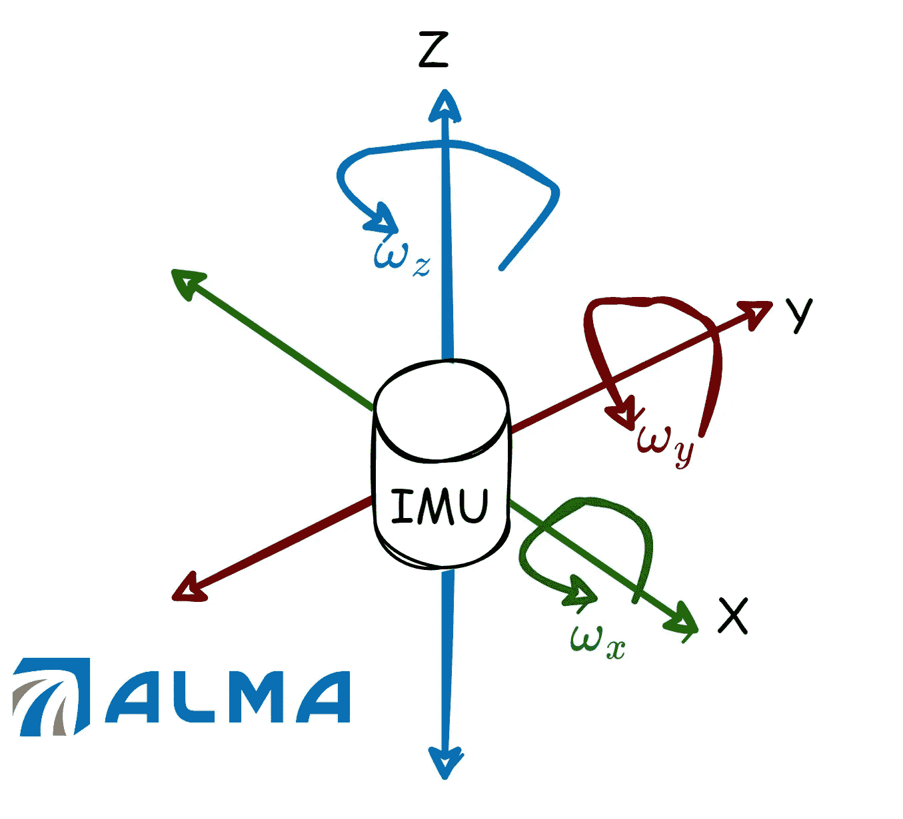
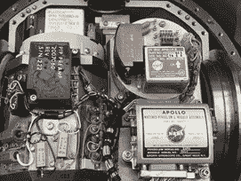
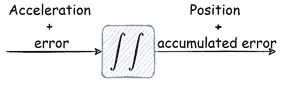

# IMU 是什么？

> 原文：<https://towardsdatascience.com/what-is-imu-9565e55b44c?source=collection_archive---------10----------------------->

## IMU(惯性测量单元)是以时间序列格式提供运动数据的常用传感器之一。在本帖中，我们来回顾一下。

# **简介**

IMU(惯性测量单元)传感器提供时间序列数据，用于人类活动识别问题、跟踪和导航问题等。在人工智能时代，这种廉价而可靠的传感器可以提供大量数据，因此人们可能会使用机器/深度学习将其推广到各个领域的许多有用的见解。

## **我们在哪里可以找到 IMU 传感器？**

实际上，几乎到处都是！先说我们的智能手机。大多数智能手机设备内部都配备了 IMU 传感器，这是一种 MEMS(微机电系统)技术。很多平板设备里也有。IMU 在汽车和航空工业中非常常见，因为它可以更好地确定车辆的位置和方向。

# **总体描述**

惯性测量单元是导航领域常见的传感器之一(但不是唯一的)。它包含一个加速度计和陀螺仪(有时也有一个磁力计，很少也有一个气压计)。第一个负责加速度测量，第二个负责角速度测量。每一个度量都在三轴坐标系中表示，所以一般来说，它们一起产生 6 维度量时间序列流。

作者图片

## 它是如何工作的？

因此，让我们针对 4 种不同的传感器将讨论分为 4 个部分:

1.加速度计是一种测量特定力的传感器(身体质量将力归一化)。它在其局部框架中提供 x、y 和 z 轴上的加速度。

2.陀螺仪是一种传感器，在其局部坐标系中测量围绕 x、y 和 z 轴的角速度。一般来说，对测量结果进行积分会得到角度本身。

3.磁力计是一种测量地球磁场并提供航向的传感器(指南针就是这样一种设备)。如果它包含在 IMU 中，我们通常称之为“9 轴 IMU”

4.气压计是一种测量气压的传感器，可以提供海拔高度。

阿波罗 11 号惯性测量单元

## **跟踪关系及主要缺点**

IMU 的一个主要缺点是当为了找到位置而单独将它们与导航方程结合时会产生累积误差。例如，噪声加速度的双重积分导致不准确的位置解，最终导致巨大的漂移。因此，许多跟踪/导航应用使用额外的传感器，例如 GNSS 接收器和照相机。这些传感器以较低的频率提供位置信息，并提供累积误差的复位。

作者图片

# **利用 IMU 传感器数据解决 HAR 问题**

其中一个著名的时间序列数据集是 2014 年发布的包含记录的 IMU 信号的人类活动识别。以 50[Hz]的频率对一些活动的集合进行标记和存储。它被广泛用于评估最先进的时间序列分类算法。要了解更多，可以参考原论文。建立了许多算法来仅基于 IMU 信号识别人类活动，因为它可以被公式化为分类问题。与图像/视频等相比，将 IMU 信号用于 HAR 的主要优势。，就是数据量小。这个优点允许 HAR 分类器的紧凑表示。

# **总结和个人笔记**

IMU 是世界范围内常见的传感器之一，几乎在任何地方都被用于各种任务。2021 年，我创办了阿尔玛理工。LTD 仅提供 IMU 导航解决方案。我邀请你关注我们的 LinkedIn:【https://www.linkedin.com/company/alma-tech-ltd/】T4。感谢你阅读这篇文章。

# 进一步阅读

[1]一些生产和销售 IMU 的伟大公司有 [VectorNav](https://www.vectornav.com/products/detail/vn-100?gclid=CjwKCAjwxo6IBhBKEiwAXSYBs2NYkKuEwwl1XUwZAdNGv3JTjGY9IVzUoqQMtiLs4L-h2iHTfJJwVxoCjuEQAvD_BwE) 、 [WIT-motion](https://www.wit-motion.com/) 和 [Sparton](https://www.spartonnavex.com/imu/) 。

[2] Anguita，Davide 等，“使用智能手机进行人类活动识别的公共领域数据集。”*埃桑*。第三卷。2013.

— — — — — — — — — — — — — — — — — — — — — — — —

# 关于作者

Barak 获得了以色列理工学院的航空工程学士学位(2016 年)、硕士学位(2018 年)以及经济和管理学士学位(2016 年，成绩优异)。他曾在高通工作(2019-2020)，在那里他主要研究机器学习和信号处理算法。巴拉克目前正在海法大学攻读博士学位。他的研究兴趣包括传感器融合、导航、深度学习和估计理论。‏