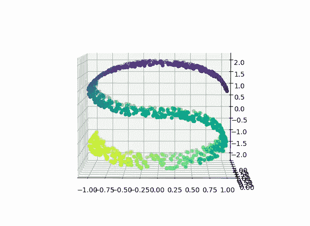
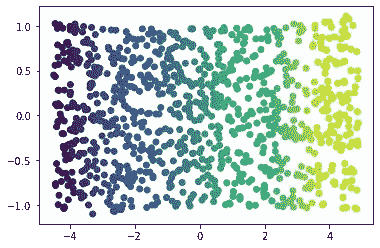
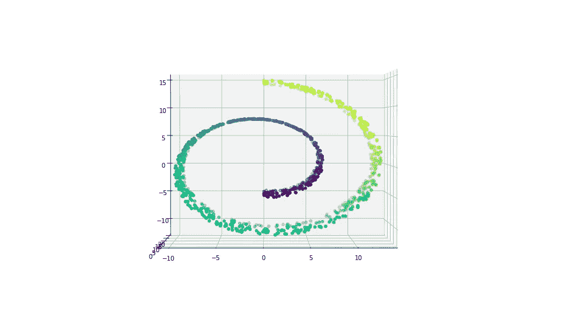
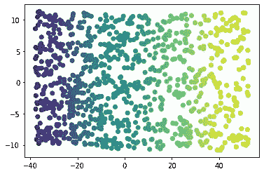

# 什么是 Isomap？

> 原文：<https://towardsdatascience.com/what-is-isomap-6e4c1d706b54?source=collection_archive---------27----------------------->

## 如何借鉴和减少复杂高维的形状？

# 介绍

我们无法将 3 维以上的高维数据可视化。那么，当我们面对这种几乎在每个数据科学应用中都很常见的情况时，我们该怎么办呢？像 PCA 这样的降维技术经常失败，因为这些方法有一个简单的假设:数据可以线性减少。然而，对于大多数类型的高维数据，可能存在非线性关系，因此我们需要在降维时保持这种形状。这就是像 Isomap 这样的多种学习技术发挥作用的地方。

*注意:我将在后续文章中讨论许多其他多样的学习技巧，所以也要留意这一点！*

你可以把流形想象成一个形状或曲面。这意味着 Isomap 正在尝试学习数据的形状。从高层次来看，这比看起来要简单。然而，理解这项技术试图做到这一点的细微差别可能需要一些时间。

# Isomap

Isomap 是 ***等距映射的简称。*** 该映射的目标是保持两点之间的测地线距离。测地线更正式的定义是表面上的最短路径。通过了解成对测地线距离，Isomap 的目标是在将数据向下投影到指定的维度之前近似数据的几何。Isomap 分 3 个主要步骤运行:***【1】***

*   构建一个邻域图，通常通过 k-最近邻
*   通过 Dijkstra 算法或 Floyd-Warshall 算法计算两点之间的最短路径。
*   通过部分特征值分解构造 d 维嵌入(即取核的 d 个最大特征值。

以下是 Isomap 如何在两个用于流形学习可视化的基础数据集上操作，即 S 曲线和瑞士卷。

## s 曲线:

首先，使用`sklearn.datasets`，我们将在`s-curve`上生成 1000 个点。

现在我们已经生成了 S 曲线，让我们利用 Isomap 尝试将其降低到二维。

就像在`k-Nearest Neighbors`中一样，邻居的数量是一个需要调整以获得理想性能的参数。虽然我用 35 向您展示了实现流形学习过程的最佳可能方式，但是使用这段代码并调整`n_neighbors`参数来看看这如何影响最终的形状。

正如我们所看到的，S 曲线的黄色部分距离 3d 图中的深紫色/蓝色最远，这意味着我们希望流形的这些部分彼此相距最远，这是在最短路径构造过程中实现的。

## 瑞士卷:

现在，使用相同的模块，我们将在一个`swiss_roll`上生成 1000 个点。

现在，使用 Isomap，我们也将尝试从这个形状中学习。

同样，我们能够像`s-curve`一样“展开”形状。在我们能够区分和分离彼此相距较远的形状段的情况下，上述相同的性质也成立。此外，由于上面列出的第 2 步和第 3 步，我们还允许相互靠近的形状段能够在距离上更近。

# 最后的想法

到目前为止，对于 Isomap 如何尝试从不同的形状中学习，我们应该有了一个坚实的直觉。虽然这些数据集通常用于获得关于这些类型的算法如何执行的直觉，但尝试从非常高维的数据中创建和学习以很好地理解这如何在大规模下工作是很重要的。

如果有什么问题，欢迎在下面留言！感谢您的阅读。

*所有图片均为作者所有，除非另有说明。*

# 参考

***【1】***特南鲍姆，J.B 德席尔瓦五世；非线性降维的全局几何框架。理科 290 (5500)