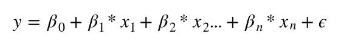

# 什么是线性回归？

> 原文：<https://towardsdatascience.com/what-is-linear-regression-e44d2c4bf025?source=collection_archive---------46----------------------->

## **线性回归是数据科学家和机器学习实践者的基本工具之一**


照片由[卢克·切瑟](https://unsplash.com/@lukechesser?utm_source=medium&utm_medium=referral)在 [Unsplash](https://unsplash.com?utm_source=medium&utm_medium=referral) 上拍摄

# 概观

本教程是关于线性回归的基础。这也是机器学习入门文章“什么是机器学习？”，可以在这里找到[。](https://medium.com/swlh/what-is-machine-learning-ff27b518909b)

# 那么什么是线性回归呢？

线性回归是数据科学家和机器学习实践者的基本工具之一。我们引用“什么是机器学习？”中的等式`y = mx + b`post，可以认为是线性回归的基础。线性回归模型具有高度的可解释性，训练速度快，可以提供对数据的洞察，并进一步优化以做出更好的预测。如果您刚刚开始学习数据科学或机器学习，深入线性回归以了解如何使用函数来估计数据是一个好主意。

# 线性回归和 y = mx + b 方程有什么关系？

公式很像！对于线性回归，我们通常将等式写成:



线性回归方程

或者没有乘法符号:


线性回归方程图 2

不要担心，它没有看起来那么复杂！

# 让我们来看看这个等式

## y 是什么？

我们仍然有`y`，就像在`y = mx + b`中一样，这是输出。这是您所关心的 y 轴值，并希望找到影响它的列或特性。

## β0 是什么？

我们也有β0，读作“Not ”,并认为这是 y 截距，在`y = mx + b`中是`b`。

## βx 的东西呢？

既然你知道我们有来自`y = mx + b`的`y`和`b`，那么我们还有`mx`。如果你猜对了，这就是我们看到的βx 或βx 对应的 x。贝塔就像`y = mx + b`中的斜坡或`m`。x 是来自数据的输入。`x`的一个例子可以是你在一个项目中投入的营销资金，然后你想让`y`告诉你大概从中获得了多少收入。因为在线性回归和机器学习中，我们通常有不止一个`x`或一列数据来帮助我们确定它与`y`的关系，所以我们也有许多 Betas 来与那些众多的`x`配对。这就像你的`y = mx + b`等式中有多个`mx`一样。

## 那么贝塔到底是什么？

至于β，这就是所谓的系数。这些非常重要，从本质上解释了你的模型。这些是来自线性回归的权重和学习值，可告诉您每个要素或列对预测或 y 轴变量的影响程度。

## 好吧，那最后一个希腊字母ε是什么？

那个希腊字母是 epsilon。这实质上意味着你的模型中会有一些无法解释的误差。另一种说法是，你可能无法用这个简短的等式解释数据中发生的所有事情，所以我们在最后加上ε，表示只是发生了一些我们现在无法解释的错误或噪声。

# 让我们看一个例子

对于这个例子，我们真的只需要 Scikit Learn。如果你不熟悉 Scikit Learn，它是最流行的运行机器学习算法的 Python 库之一。我将创建一些关于房价的假样本数据。我将创建卧室数量，浴室数量，平方英尺的列，然后是房子的价格。在本例中，将房屋价格视为 y 轴或`y`，所有其他列视为等式中的倍数`x`。通过线性回归模型运行数据后，我们应该看到它们是如何影响房价的。

**注意**:我将生成一些样本数据，并使用 Numpy 将数据存储在一个对象中。这并不是运行线性回归所特别需要的，只是为了举例而使用。

# 进口

这里我们导入库 Numpy 和 Scikit Learn。Numpy 用于创建数据结构，而 scikit learn 用于许多机器学习用例。

```
*# Import numpy to create numpy arrays*
**import** **numpy** **as** **np***# Import Scikit-Learn to allow us to run Linear Regression*
**from** **sklearn.linear_model** **import** LinearRegression
```

# 创建一些示例数据

我们在这里创建的数据是一些关于房价及其各自特征的虚假样本数据，这些特征与卧室、浴室的数量及其面积相关联。

**注**:这些价格以 100k 为单位。所以 150 实际上意味着 150，000 美元，而不仅仅是 150 美元。

```
*# Creating sample data*
*# Price is represented in 100k dollars*
price = np.array([150, 500, 225, 975, 735, 950, 325, 680, 220, 330])
beds = [2, 4, 3, 5, 4, 5, 3, 4, 2, 3]
baths = [1, 2, 2, 3, 2, 3, 2, 2, 1, 2]
sq_ft = [1100, 2800, 1500, 4800, 3500, 5000, 2200, 3100, 1650, 2000]
```

# 结构化数据

这两行用于正确地形成数据，以便与 scikit learn 一起使用。我们将多个数组(或 x)堆叠成一个 numpy 对象。同时还指定价格数组的“形状”。

```
*# Combining the multiple lists into one object called "X"*
X = np.column_stack([beds, baths, sq_ft])*# Reshaping the price list to work with scikit learn*
y = price.reshape(-1, 1)
```

# 创建线性回归模型

现在，我们可以使用下面这条线创建线性回归模型的外壳。

```
*# Instantiating the model object*
model = LinearRegression()
```

一旦我们创建了外壳，我们需要用数据来拟合模型。这就是我们如何获得 Beta 值，并找到一些函数，可以近似一所房子的价格，给定它的卧室，浴室的数量，以及它的平方英尺。

```
*# Fitting the model with data*
fitted_model = model.fit(X, y)
```

我们训练了一个线性回归模型！现在让我们看看这些系数，并解读它们的含义。

```
The coefficient, or the beta one value, for number of bedrooms = 115.55210418237826The coefficient, or the beta two value, for number of bathrooms = -112.47160198590979The coefficient, or the beta three value, for square footage = 0.18603883444673386The y-intercept, or the 'beta not' value = 
-184.8865379117235
```

# 解释模型及其系数

# 那么这些β值或系数意味着什么呢？

## 先说 y 截距 a.k.a β0 或者“Not”。

这个值大约是-184.89，那么这意味着什么呢？这意味着，如果我们有 0 间卧室，0 间浴室，0 平方英尺(所有的都是 0 ),我们最终会得到-184k 的负价格。显然这是不现实的，但是请记住，这样的模型并不了解房价是如何运行的。真的就把这当成 y 轴截距，不管它在这种情况下是否有意义。

## 接下来让我们看看其他系数。

从卧室数量开始，系数值约为 115.56。这意味着，如果卧室的数量增加一间(而其他投入没有变化),房屋的价格将平均增加约 11.5 万美元。这与平方英尺系数相同，只是如果平方英尺增加 1 平方英尺，价格将平均增加 0.19 万美元。将系数视为斜率值或`y = mx + b`中的`m`。随着`x`的增加，在卧室的情况下，斜率约为 115.56，并使 y 轴增加这个数值。

## 负系数和浴室是怎么回事？

这是一个很棒的问题。这意味着浴室数量每增加一个，模型预计价格会下降 11.2 万美元。这就是为什么我们看到一个负值。这有道理吗？不完全是。然而，这是一个很好的示例问题，展示了你可以有负系数，以及我们如何解释它们。在机器学习中，我们还必须警惕共线性，或者当多个特征彼此高度相关时。此外，更多的数据有助于欠拟合机器学习模型。

# 接下来你会怎么做？

关于如何使您的模型更好的一些后续步骤包括:

*   添加更多行数据
*   规范化您的数据。在 0 和 1 之间或-1 和 1 之间缩放每一列以帮助建模。当您不缩放数据时，模型的学习会变得很困难，因为它可能会对自然值较高的要素进行加权，比其他要素更高。
*   使用套索或岭回归进行正则化(尝试使用对模型影响较大的要素或输入，同时降低其他要素或输入的权重)。
*   查找更多要使用的功能或列。
*   研究加法模型或其他回归模型。

# 结论

我希望这篇教程是有启发性的，你可以学到关于线性回归的知识。线性回归是任何数据科学家工具箱中的基本工具。您可以查看系数，并尝试了解哪些数据会影响您的模型。您可以使用线性回归作为基线工具来确定其他模型是否可能更好。线性回归训练速度快，不需要大量数据。虽然，在很多情况下可能太简单了。所以，不要把更复杂的方法或者额外的方法算出来，让你的线性模型更好！

# 链接

*   [原 Jupyter 笔记本](https://github.com/frankiecancino/ML_Tutorials/blob/master/linear_regression.ipynb)
*   [sci kit-学习文档](https://scikit-learn.org/stable/)
*   [领英](https://www.linkedin.com/in/frankie-cancino/)
*   [推特](https://twitter.com/frankiecancino)