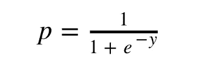
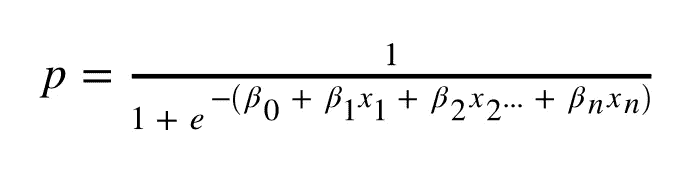
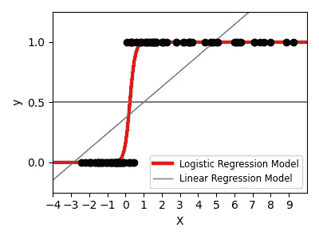

# 什么是逻辑回归？

> 原文：<https://towardsdatascience.com/what-is-logistic-regression-d3f59ef1a9b?source=collection_archive---------22----------------------->

## 逻辑回归是数据科学家和机器学习工程师的基本分类工具。


[克莱班克斯](https://unsplash.com/@claybanks?utm_source=medium&utm_medium=referral)在 [Unsplash](https://unsplash.com?utm_source=medium&utm_medium=referral) 拍摄的照片

本教程是关于应用逻辑回归的基础，使用了一点 Python。也是《什么是线性回归》这篇帖子的延续。，可以在这里找到[。](/what-is-linear-regression-e44d2c4bf025)

# 关于逻辑回归

这有点违反直觉，但逻辑回归通常被用作分类器。事实上，逻辑回归是科学家使用的最常用和最著名的数据分类方法之一。这种分类方法背后的思想是输出将在 0 和 1 之间。本质上是返回你给模型的数据属于某个组或类的概率。在那里，开发者可以根据他们想要的谨慎程度来设置阈值。

例如，我可以将阈值设置为 0.8。这意味着逻辑回归模型的任何输出等于或大于 0.8 将被归类为 1。任何低于 0 的都将被归类为 0。从那里，我可以根据我的用例以及我关心的指标，将 0.8 的阈值向上或向下移动。

# 逻辑回归和线性回归有什么关系？

线性回归公式可以包含在逻辑回归公式中。如果你还记得，线性回归公式是:


线性回归方程

嗯……逻辑回归的公式是:



逻辑回归方程

我们可以用线性回归公式替换掉`y`:



逻辑回归方程 2

# 这个逻辑回归方程是干什么的？

线性回归部分提供一些输出值，逻辑回归部分将这些值推到 0 和 1 之间(包括 0 和 1)。这在某种程度上形成了一条 S 曲线，你可能以前见过。

如果没有，下面是 Scikit 学习文档中的一个示例:



[https://sci kit-learn . org/stable/auto _ examples/linear _ model/plot _ logistic . html](https://scikit-learn.org/stable/auto_examples/linear_model/plot_logistic.html)

# 让我们用 Python 编写一个例子

我们主要需要流行的机器学习库 Scikit Learn。Numpy 稍后用于构建一些数据结构，将数据输入 Scikit Learn。

我们将创建关于患者的样本数据，以及他们是否应该被批准进行某种类型的治疗。我们将为年龄、体重、平均静息心率创建列，然后为批准决定创建列。除了批准决定之外，我们使用所有的列作为我们的特征。我们的模型应该估计每个特征对于批准决定的重要性，并且我们应该得到患者被批准治疗的概率。

**注**:这个数据完全是编造的。这并不表示医疗专业人员进行了任何真正的治疗或决策。

## 库导入

```
*# Import numpy to create numpy arrays*
**import** **numpy** **as** **np**

*# Import Scikit-Learn to allow us to run Logistic Regression*
**from** **sklearn.linear_model** **import** LogisticRegression
```

## 为我们的模型创建数据

我们正在创建的数据包含与年龄、体重和平均心率相关的特征。我们的批准决定将是一个名为`approved`的列，包含 0 或 1，表示患者是否被批准。0 表示患者未被批准，1 表示患者被批准。

```
*# Sample Data*
approved = np.array([1, 1, 1, 0, 0, 0, 1, 1, 0, 0])
age = [21, 42, 35, 33, 63, 70, 26, 31, 52, 53]
weight = [110, 180, 175, 235, 95, 90, 175, 190, 250, 185]
avg_hrt = [65, 70, 72, 77, 67, 62, 68, 65, 73, 75]
```

## 构建要素和标签

我们将多个 Python 数组堆叠成一个 numpy 对象。此外，指定认可阵列的“形状”。

```
*# Combining the multiple lists into one object called "X"*
X = np.column_stack([age, weight, avg_hrt])*# Reshaping the approvals to work with scikit learn*
y = approved.reshape(len(approved), )
```

## 让我们建立一个逻辑回归模型

首先，我们实例化模型。

```
*# Instantiating the model object*
model = LogisticRegression()
```

现在我们可以用数据来拟合模型。这就是我们如何估计患者的认可状态——给定他们的年龄、体重和平均静息心率。

```
*# Fitting the model with data*
fitted_model = model.fit(X, y)
```

现在模型已经训练好了，让我们来看看系数。

> 年龄的系数= -0.6785458695283049
> 体重的系数=-0.10023841185826
> 平均静息心率的系数=-0.49686

## 解释系数

这些系数告诉我们，年龄是最重要的因素。紧随其后的是平均静息心率。对于这个特定的数据+案例，患者的体重排在最后。

系数的值量化了这些特性对获得批准的可能性有多大的影响。请这样想:

随着特征值(左侧*)的增加，获得批准的概率降低，因为系数为负。减少量由系数值量化(右侧*)。

*左侧和右侧指的是系数的打印结果，如上所示。

这有助于了解哪些特征有助于您的模型并影响您的决策。当谈到可解释的人工智能时，通常有一种方法来解释模型并看到模型如何做出决定是极其重要的。在这种情况下，我们可以查看系数来确定每个功能的影响程度，以及为什么算法可能会选择批准某个人，而不是其他人。

# 让我们用新数据来检验这个模型

## **创建新数据**

```
new_age = [20, 45, 33, 31, 62, 71, 72, 25, 30, 53, 55]
new_weight = [105, 175, 170, 240, 100, 95, 200, 170, 195, 255, 180]
new_avg_hrt = [64, 68, 70, 78, 67, 61, 68, 67, 66, 75, 76]*# Combining the multiple lists into one object called "test_X"*
test_X = np.column_stack([new_age, new_weight, new_avg_hrt])
```

## 通过模型运行新数据

```
results = fitted_model.predict(test_X)
```

## 看一看结果

```
print(f"Our approval results are: **{**results**}**")
```

> 我们的审批结果是:[1 1 1 0 0 0 1 1 0 0]

如您所见，Scikit Learn 自动为我们设置了一个阈值，并决定了我们的批准。如果您想查看实际的概率，我们可以使用 Scikit Learn 提供的另一个函数- `predict_proba()`:

```
results_w_probs = fitted_model.predict_proba(test_X)print("Our approval results with their probabilites:")
**for** result **in** results_w_probs:
    print(f"Probability not approved = **{**result[0]**:**.2f**}**, Probability approved = **{**result[1]**:**.2f**}**")
```

> 我们的批准结果及其概率:
> 不批准概率= 0.00，批准概率= 1.00
> 不批准概率= 0.28，批准概率= 0.72
> 不批准概率= 0.00，批准概率= 1.00
> 不批准概率= 0.84，批准概率= 0.16
> 不批准概率= 0.92，批准概率= 0.08
> 不批准概率= 0.99，批准概率= 0.01 【T8 通过概率= 0.00
> 未通过概率= 0.00，通过概率= 1.00
> 未通过概率= 0.00，通过概率= 1.00
> 未通过概率= 1.00，通过概率= 0.00
> 未通过概率= 1.00，通过概率= 0.00

**注意**:1 和 0 的概率列表与我们之前传递给`predict_proba()`函数的初始 numpy 数组顺序相同。

在这里，我们可以设置不同的阈值，根据概率提供不同数量的批准。如果要谨慎审批人，可以把门槛设成 0.8 或者 0.9。如果治疗是安全的，非侵入性的，并且成本很低——我们可以将阈值降低到 0.25 或 0.3。这完全取决于用例。

# 后续步骤

我希望你喜欢这个教程，并发现它很有用！如果你想让你的模型变得更好，下面是你应该考虑的一些后续步骤:

*   查找并添加更多数据，无论是更多行数据还是新功能。
*   测试不同的阈值。
*   了解分类指标。(Scikit Learn 的[分类报告](https://scikit-learn.org/stable/modules/generated/sklearn.metrics.classification_report.html)是一个很好的起点)
*   针对对您的用例有意义的分类指标定制您的模型。准确性可能不是最好的衡量标准。(一个例子是当你的班级不平衡时)
*   探索更复杂的模型，如 XGBoost、LightGBM、SVM、神经网络等。

# 链接

*   [原 Jupyter 笔记本](https://github.com/frankiecancino/ML_Tutorials/blob/master/logistic_regression.ipynb)
*   [sci kit-学习文档](https://scikit-learn.org/stable/)
*   [领英](https://www.linkedin.com/in/frankie-cancino/)
*   [推特](https://twitter.com/frankiecancino)