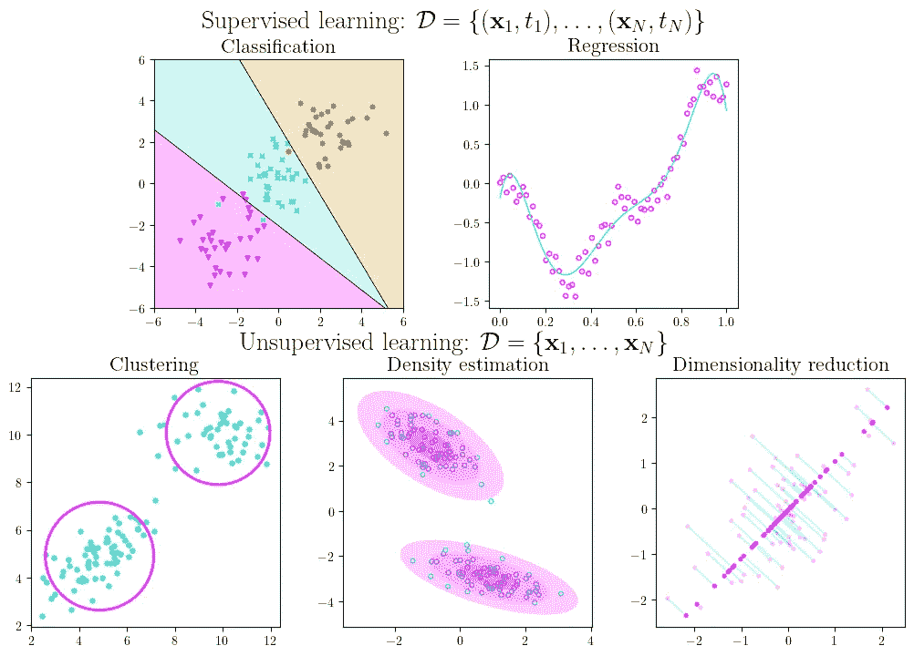
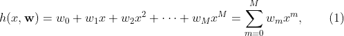
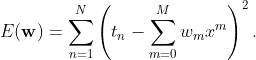
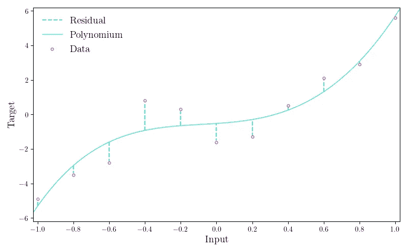
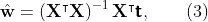
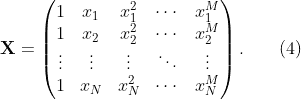
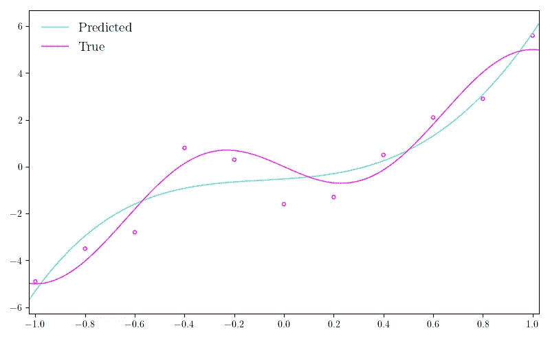

# 什么是机器学习？

> 原文：<https://towardsdatascience.com/what-is-machine-learning-91040db474f9?source=collection_archive---------17----------------------->

## 以 Python 实现的多项式回归为例介绍监督和非监督学习



机器学习大类概述。

# 内容

这篇文章是我将要发表的一系列文章的一部分。你可以通过点击[这里](https://cookieblues.github.io/guides/2021/03/08/bsmalea-notes-1a/)在我的个人博客上阅读这篇文章的更详细版本。下面你可以看到该系列的概述。

## 1.机器学习导论

*   **(一)什么是机器学习？**
*   [(b)机器学习中的模型选择](/model-selection-in-machine-learning-813fe2e63ec6)
*   [(c)维度的诅咒](/the-curse-of-dimensionality-5673118fe6d2)
*   [(d)什么是贝叶斯推理？](/what-is-bayesian-inference-4eda9f9e20a6)

## 2.回归

*   [(a)线性回归的实际工作原理](/how-linear-regression-actually-works-theory-and-implementation-8d8dcae3222c)
*   [(b)如何使用基函数和正则化改进您的线性回归](/how-to-improve-your-linear-regression-with-basis-functions-and-regularization-8a6fcebdc11c)

## 3.分类

*   [(a)分类器概述](/overview-of-classifiers-d0a0d3eecfd1)
*   [(b)二次判别分析(QDA)](/quadratic-discriminant-analysis-ae55d8a8148a#204a-71584f33e137)
*   [(c)线性判别分析](/linear-discriminant-analysis-1894bbf04359)
*   [(d)(高斯)朴素贝叶斯](/gaussian-naive-bayes-4d2895d139a)

# 一点历史

看起来，大多数人对机器学习的定义来自阿瑟·李·塞缪尔 1959 年的一句话:“让计算机从经验中学习，最终应该消除对这种详细编程工作的需求。”对此的解释是，“机器学习是一个研究领域，它赋予计算机无需显式编程就能学习的能力。”

机器学习从统计学中汲取了很多方法，但这两个领域有一个明显的区别:**统计学主要涉及估计**，而**机器学习主要涉及预测**。这种区别导致了巨大的差异，我们很快就会看到这一点。

# 机器学习的类别

有许多不同的机器学习方法可以解决不同的任务，并且将它们都归入严格的类别本身就是一项相当艰巨的任务。我的文章将涵盖两个基本的问题；**有监督的**学习和**无监督的**学习，可以进一步分为更小的类别，如上图所示。

值得注意的是，这些类别并不严格，例如，降维并不总是不受监督的，您可以使用密度估计进行聚类和分类。

## 监督学习

监督学习指的是机器学习任务的子集，在这里我们得到了一个由 *N* 个输入输出对组成的数据集，我们的目标是从输入到输出得出一个函数 *h* 。每个输入变量 variable 是一个 *D* 维向量(或标量)，用数值表示观察值。输入变量的不同维度通常被称为**特征**或**属性**。同样，每个**目标**变量通常是一个标量。

在**分类**中，目标变量的可能值形成有限数量的离散类别，通常称为**类**。一个经典的例子是识别手写数字[1]。给定一个 28×28 像素的图像，我们可以将每个图像表示为一个 784 维的向量，这将是我们的输入变量，我们的目标变量将是从 0 到 9 的标量，每个标量表示一个不同的数字。

你可能以前听说过**回归**。像分类一样，我们被给予一个目标变量，但是在回归中它是连续的而不是离散的。回归分析的一个例子是预测房子的售价。在这种情况下，特征可以是关于房屋、位置和/或最近出售的其他类似房屋的任何测量值-目标变量是房屋的销售价格。

## 无监督学习

机器学习任务的另一个子集属于无监督学习，在这种情况下，我们只得到一个由 *N* 个输入变量组成的数据集。与监督学习相比，我们没有被告知我们想要预测什么，也就是说，我们没有任何目标变量。无监督学习的目标是在数据中发现模式。

上面的类别图像将无监督学习分为 3 个子任务，第一个是**聚类**，顾名思义，指的是在数据中发现‘聚类’的任务。我们可以将一个集群定义为**一组彼此之间比其他集群中的观测更加相似的观测**。比方说，我们必须为一个篮球、一个胡萝卜和一个苹果想出一个集群。首先，我们可以根据形状创建聚类，在这种情况下，篮球和苹果都是圆的，但胡萝卜不是。其次，我们也可以按用途分类，在这种情况下，胡萝卜和苹果是食物，但篮球不是。最后，我们可以按颜色分类，在这种情况下，篮球和胡萝卜都是橙色的，但苹果不是。这三个例子都是有效的聚类，但是它们对不同的事物进行聚类。

然后我们有**密度估计**，这是将概率密度函数拟合到数据的任务。值得注意的是**密度估计通常与分类**等其他任务结合使用，例如，基于我们观察的给定类别，我们可以使用密度估计来找到每个类别的分布，从而(基于类别分布)对新观察进行分类。密度估计的一个例子是寻找数据中的极端异常值，也就是说，寻找极不可能从数据拟合的密度函数中生成的数据。

最后，**降维**，顾名思义，减少我们正在处理的数据的特征数量。就像密度估计一样，这通常与其他任务一起完成。比方说，我们要执行一项分类任务，我们的输入变量有 50 个特征，如果在将特征数量减少到 5 个后，我们可以同样好地完成相同的任务，我们可以节省大量的计算时间。

# 示例:多项式回归

我们来看一个机器学习的例子。这也是为了熟悉机器学习术语。我们将实现一个名为*多项式回归*的模型，我们尝试用多项式来拟合我们的数据。

给定具有相应目标变量 *t* 的 *N* 1 维输入变量 *x* 的训练数据集，我们的目标是拟合一个多项式，该多项式在给定新输入变量的情况下为未来目标变量产生值。我们将通过估计多项式的系数来做到这一点



我们称之为模型的**参数**或**权重**。 *M* 是我们多项式的阶， **w** 表示我们所有的参数，即我们的 *M* 阶多项式有 *M* +1 个参数。

现在，目标是估计我们的参数的“最佳”值。为此，我们定义了所谓的**目标函数**(有时也称为**误差**或**损失**函数)。我们构造我们的目标函数，使得它输出一个值，告诉我们我们的模型是如何执行的。对于这项任务，我们将目标函数定义为多项式预测和相应目标变量之间的平方差之和，即


如果我们用(1)的右边代替 *h* ，我们得到



让我们花一分钟来理解(2)在说什么。右边 parantheses 中的术语通常称为第 *n* 次剩余。它是某个输入变量的多项式输出和它对应的目标变量之间的差。根据多项式的输出是低于还是高于目标值，差值可以是正的也可以是负的。因此，我们对这些差异求平方，并将它们相加，以获得一个值，该值告诉我们多项式的性能如何。

这个目标函数被称为[残差平方和或残差平方和](https://en.wikipedia.org/wiki/Residual_sum_of_squares)，通常被用来衡量机器学习中回归模型的性能。下图显示了我们估计的多项式和给定数据之间的差异。这些差异是目标函数求平方并求和的误差(或残差)。



残差图。

到目前为止，一切顺利！因为目标函数告诉我们做得有多好，它越低，我们做得越好，我们将尝试找到目标函数的最小值。为了找到一个函数的最小值，我们求导，设置它等于 0，并求解我们的参数。既然我们有很多参数，我们就取 *E* 相对于第 *i* 个参数的偏导数，设为 0，然后求解。这将给我们一个线性系统，该系统由 M 个方程和 M 个未知数组成(我们的参数是 T21)。我们将在下一篇文章中讨论这个问题的解决方案的推导过程，但是现在我们只给出它。方程组的解是



其中 **t** 表示我们所有的目标变量，作为一个列向量， **X** 称为**设计矩阵**，定义为



总而言之:我们给定了 *N* 对输入变量和目标变量，我们希望用多项式来拟合形式(1)的数据，以使我们的多项式 *h* 的值尽可能接近目标。我们通过找到使(2)中定义的目标函数最小化的参数 **w** 的值来做到这一点，对此的解决方案在(3)中给出。

## 多项式回归的 Python 实现

让我们试着实现我们的模型吧！我们将从下面显示的数据集开始，其中`x`是我们的输入变量，`t`是我们的目标变量。

```
import numpy as np
x = np.array([-1, -0.8, -0.6, -0.4, -0.2, 0, 0.2, 0.4, 0.6, 0.8, 1])
t = np.array([-4.9, -3.5, -2.8, 0.8, 0.3, -1.6, -1.3, 0.5, 2.1, 2.9, 5.6])
```

首先，我们可以定义多项式的阶数，找到数据点的数量，然后建立设计矩阵。

```
M = 4
N = len(x)
X = np.zeros((N, M+1))
```

如果我们看一下(4)中设计矩阵的定义，我们可以用下面的 for 循环来填充设计矩阵的列。

```
for m in range(M+1):
    X[:, m] = x**m
```

现在我们可以用(3)中的解找到参数。

```
w = np.linalg.inv(X.T @ X) @ X.T @ t
```

使用 NumPy 的`[poly1d](https://docs.scipy.org/doc/numpy/reference/generated/numpy.poly1d.html)` [函数](https://docs.scipy.org/doc/numpy/reference/generated/numpy.poly1d.html)我们可以为我们的多项式生成输出。

```
h = np.poly1d(np.flip(w, 0))
x_ = np.linspace(0, 10, 100)
t_ = h(x_)
```

现在我们可以用我们的数据点来绘制我们的估计多项式。我还画出了产生这些点的真实函数。



估计多项式回归曲线和真实数据函数和点。

# 摘要

*   机器学习研究**如何让计算机自主学习**，目标是**预测未来**。
*   **监督学习**指的是机器学习任务，其中我们被给予**被标记的数据**，我们想要预测那些标记。
*   **无监督学习**，顾名思义，指的是任务，其中我们*没有*为我们的数据提供标签。
*   **特征**是指我们数据的**属性**(通常是列)，如身高、体重、鞋码等。，如果我们的观测对象是人类。
*   **分类和回归是有监督的**任务，**聚类、密度估计和维数减少是无监督的**任务。
*   **参数**指的是数值，**我们要在机器学习模型中估计**。
*   估计参数值的**过程被称为**训练或学习**过程。**
*   一个**目标函数**是我们模型的性能的**度量。**

# 参考

[1] Y. LeCun 等，“基于梯度的学习应用于文档识别”，1998 年。