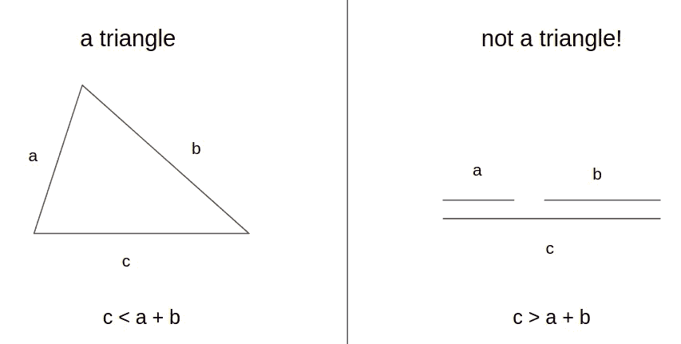

# 什么是公制？

> 原文：<https://towardsdatascience.com/what-is-metric-74b0bf6e862?source=collection_archive---------40----------------------->

## 了解数据科学家的衡量标准

作为一名数据科学家，您可能会遇到不同种类的距离度量。在 NLP 中，你可以使用余弦距离度量来得到相似的单词；在计算机视觉中，你可以使用 L2 距离度量来获得相似的图像；协同过滤也有内积度量。我们经常使用“公制”这个术语，但它是什么意思呢？

椅子的笛卡尔平面(照片由 [Unsplash](https://unsplash.com?utm_source=medium&utm_medium=referral) 上的[森林西蒙](https://unsplash.com/@forest_ms?utm_source=medium&utm_medium=referral)拍摄)

# 度量定义

在开始定义之前，让我们先弄清楚这些术语。通常，“公制”意味着*距离*，这个术语我们在日常生活中经常使用，例如:

*   雅加达和万隆的距离是多少？
*   开车时保持安全距离。

度量的正确定义最初来自数学。一开始学习它可能会令人生畏，但实际上这是很自然的，它反映了我们所知道的距离这个术语。毕竟，数学家不会凭空定义一些东西。

首先，让我们将 *d(x，y)* 定义为 *x* 和 *y* 之间的度量(或距离)。就当 *x* 和 *y* 是任意的点。作为一个指标，有 4 个条件需要满足。大家一个一个讨论吧。请注意，在本文中，我将互换使用术语度量和距离。

## 1.非否定性

在数学中，这个条件被定义为:

> 对于所有的 x 和 y，d(x，y) ≥ 0。

顾名思义，这个条件非常明显。度量不能为负。类似于距离，很容易理解为什么我们应该有这个度量条件，因为我们毕竟不能有负的距离。两个城市之间的距离从来都不是负数！

距离总是非负的(由[位云](https://unsplash.com/@bitcloudphotography?utm_source=medium&utm_medium=referral)在[去飞溅](https://unsplash.com?utm_source=medium&utm_medium=referral)上拍摄)

其实这个条件不是必须的。如果其他三个条件都满足，这个条件也满足。如果你想了解更多，你可以打开这个[维基](https://en.m.wikipedia.org/wiki/Metric_(mathematics))。

## 2.不可分辨事物的同一性

在数学中，这个条件被定义为:

> 如果 d(x，y) = 0，那么 x = y。

*不可分辨*的意思是‘无法分辨’。这也是很明显的。如果两个城市之间的距离是 0，那么他们一定是同一个城市，不是吗？除非有某种虫洞或者心灵传输。

## 3.对称

在数学中，这个条件被定义为:

> 对于所有的 x 和 y，d(x，y) = d(y，x)。

换句话说，x 和 y 之间的距离与 y 和 x 之间的距离相同。作为一个移动距离，这不一定是正确的。从城市 A 到 B 的距离可能不同于从城市 B 到 A 的距离，这取决于道路或城市布局。然而，如果我们用坐标测量，或者用直升机测量，它们是一样的。

## 4.三角形不等式

在数学中，这个条件被定义为:

> d(x，y) ≤ d(x，z) + d(y，z)，对于所有的 x，y，z。

最后一个条件不如前三个条件明显。先来讨论一下为什么叫三角不等式。每个三角形都有这个性质:

> 取三角形的任意两条边；另一边的长度小于这两边的总和。

如果 **c > a + b** ，你就不能做出三角形

在上面的等式中，我们有三个点( *x* 、 *y* 和 *z* )，这三个点构成一个三角形。所以才有关系。

接下来，三角形不等式在我们的度量定义中意味着什么？让我们用一个例子来说明。在一张纸上画两个点，分别叫做 *x* 和 *y* 。如果你需要测量这两点之间的距离，你会怎么做？你可以画一条从 x 到 y 的线段，然后测量线段的长度。听起来很明显，不是吗？但是，我们为什么不画另一个点(称为点 *z* )，然后画两条线段(从 *x* 到 *z* ，以及 *z* 到 *y* )并测量长度呢？原因很简单:

> 该距离应计算为两点之间的最短路径。

你不绕道算距离，明显更长。因此，三角形不等式条件意味着应该以最短的方式计算度量。

# 度量示例

让我们讨论一些距离示例，以及它是否满足“真实”度量的定义。

## 1.欧几里得距离

欧几里德距离(也称为 L2 距离)是你在日常生活中常用的距离定义，例如测量我上面讨论的距离点。它显然满足“真正的”度量定义。

## 2.余弦距离

余弦距离(或 *1 -* [*余弦相似度*](https://en.m.wikipedia.org/wiki/Cosine_similarity) )是你在处理向量时可能遇到的距离。不幸的是，余弦距离不是一个“真正的”度量。首先，它不满足不可分辨条件。*【1，1】**【2，2】*的余弦距离为 0，而*【1，1】≦【2，2】*。

而且，它不满足三角形不等式。假设 *d* 为余弦距离 *x = [1，0】，y = [0，1]，z = [1，1]* 。很容易看出 *d(x，y) = 1* 和 *d(x，z) = d(y，z) ~ 0.3* ，所以 *d(x，y) > d(x，z) + d(y，z)* 不满足三角形不等式。这就是为什么余弦距离实际上没有任何意义:如果你绕道(到 *z* 的距离更短，而不是直接从 *x* 到 *y* 。

## 3.内积度量

内积(或[点积](https://en.m.wikipedia.org/wiki/Dot_product#Inner_product))常用于[协同过滤](https://en.m.wikipedia.org/wiki/Collaborative_filtering)模型。这个概念类似于余弦相似度，但没有对向量进行归一化。事实上，它甚至不是一个“距离”,因为当它更远时，它在减少，相比之下，对距离的普遍理解是:当它更远时，它在增加。还有一种方法可以将距离定义为*负内积*，即简单地将内积乘以 *-1* 。它作为一个距离更有意义，但它只满足对称条件，所以它肯定不是一个度量。

# 欧几里德距离与余弦距离

建议选择欧几里德距离作为距离度量，因为它是“真正的”度量，而不是余弦距离。通常，余弦距离是优选的，因为它的范围从-1 到 1，相比之下，欧几里得距离是无限的，所以在余弦距离中设置阈值(比如 0.7)更容易。其实你可以通过探索数据中的距离范围，用欧氏距离找到阈值，类似余弦距离。

# 外卖食品

总之，距离度量是解决问题的工具。如果你需要用余弦距离和内积，那就随便用吧。毕竟，数据科学的目标是解决问题，你可以自由选择你的工具。我希望这篇文章能帮助你理解工具☺