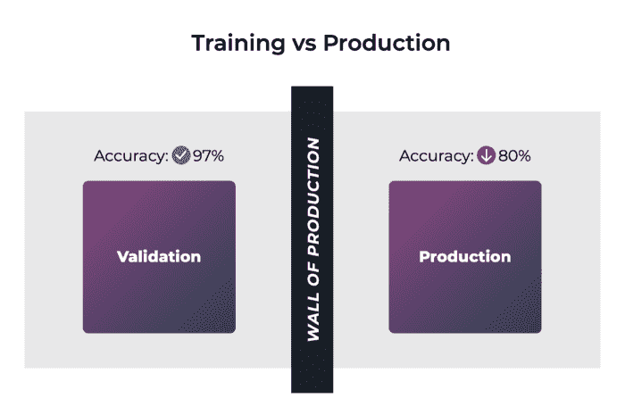
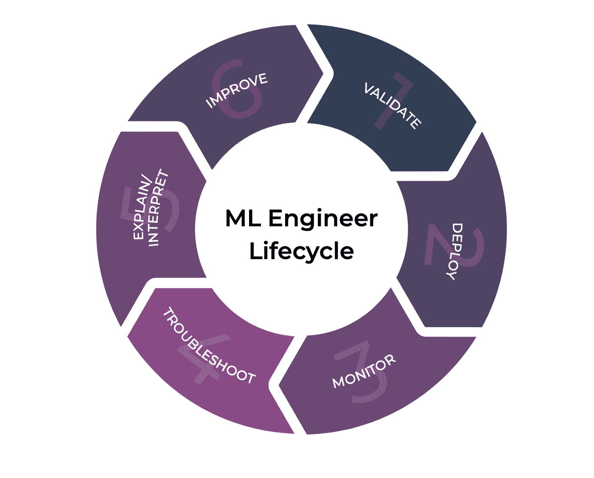
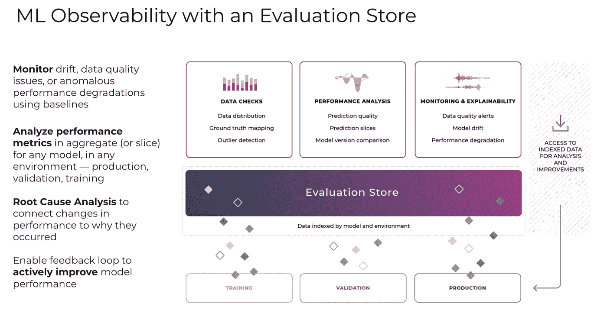

# 什么是 ML 可观测性？

> 原文：<https://towardsdatascience.com/what-is-ml-observability-29e85e701688?source=collection_archive---------10----------------------->

## [行业笔记](https://towardsdatascience.com/tagged/notes-from-industry)

## 在实验室中构建机器学习概念证明与在现实世界中制作模型截然不同。

随着越来越多的团队转向机器学习来简化他们的业务或将以前不切实际的技术变成现实，人们对能够帮助将模型从研究实验室带到客户手中的工具和人员的兴趣越来越大。谷歌建立了 TFX，脸书建立了 FBLearner，优步建立了米开朗基罗，Airbnb 建立了 Bighead，这些系统允许这些时候扩大他们的 MLOps。

在这些大型科技公司之外，事实是，在实验室中构建机器学习概念证明与在现实世界中制作模型截然不同。让我们先快速看一下在将模型应用于现实世界问题时可能会出错的一些事情。

# **还能出什么差错？**

1.  **训练发球偏斜**

在部署模型时，您的模型很有可能不如在离线验证时执行得好。这些生产移交并不总是进展顺利，这通常被称为培训/服务偏差。

一个潜在的罪魁祸首是你的模型被训练的数据在统计上不同于你在生产中看到的数据。另一种可能是您的培训环境和生产环境之间的特性转换代码不一致。这可能比人们想象的更常见。通常，包含特性转换代码的笔记本在没有太多版本控制的情况下被传递和更改，这可能会导致混淆到底哪种类型的转换被用来为模型创建特性。如果创建特征的方式在培训和生产环境之间不一致，那么模型的性能会在一开始就受到很大的影响。

训练发球偏斜。图片作者。

**2。改变数据分布**

除了训练数据、生产数据和要素转换之间的这种潜在差异之外，您的模型所暴露的数据分布也可能会随着时间的推移而发生变化，这通常称为数据漂移或要素漂移。这种漂移可能是渐进的，也可能在一夜之间发生，并导致模型性能下降。

改变分布。图片作者。

**3。杂乱的数据**

另一件需要注意的事情是数据源的保真度。事物不会像代码一样一成不变。你在处理数据。在研究实验室中，通常要花费数千个小时来创建高质量的数据集，以最少的噪音和准确的标签。在现实世界中，你通常没有这样的质量或新鲜度保证。如果您依赖外部数据源，您可能会受到其可靠性的影响。

查看这篇文章，了解 ML 车型的更多[故障模式](https://arize.com/the-models-shipped-what-could-possibly-go-wrong/)。

# **可观察性有什么帮助？**

ML 可观察性是在模型开发周期的所有阶段获得对模型性能的深入理解的实践:从构建模型开始，到部署模型，一直到产品化。

可观察性是部署模型后盲目飞行的团队和能够快速迭代和改进他们的模型的团队之间的关键区别。

1.  **检测时间**

ML 可观察性的第一个关键目标是及时地向你提出这些问题。你可以解决一个问题，直到你知道它，你不希望你的客户遭受几天或几周的痛苦，直到你意识到有事情发生。因此，一个好的 ML 可观测性解决方案有助于减少检测模型中的问题所需的时间。

这在不同的上下文中可能有不同的意思。如果您正在构建您的模型，一个好的可观察性工具可能帮助模型构建者更快地发现他们的模型的问题，促进一个更紧密的迭代循环；然而，在生产场景的上下文中，ML 可观察性工具可以监控关键的性能度量，这些度量可以在出现问题时通知模型所有者。

**2。解决问题的时间**

尽管检测问题是第一步，但这并不是 ML 可观察性的终点。一旦检测到问题，可观测性工具需要促进问题的解决。一个好的可观察性工具的关键标志是一个团队能多快找到解决问题的根本原因。

回到我们之前讨论过的，模型的性能有多种回归方式。一个好的 ML 可观测性解决方案需要引导模型所有者了解发生变化的输入数据分布、特征变换或模型预测预期，并提供解决方案。

例如，如果您发现模型的输入特征随着时间的推移而不断漂移，并导致模型错误预测一组特定的示例，ML 可观察性工具会通知您，推荐一种方法来增加训练集，并提示您重新训练模型。

ML 工程师生命周期。图片作者。

# **如何实现 ML 可观测性？**

评估商店。图片作者。

现在你可能认为 ML 可观察性听起来很棒，但是我的团队实际上是如何实现的呢？ML 可观测性可以通过应用评估库来实现。评估库的工作是帮助您验证模型，调试模型预测的问题，显示表现最差的数据，并为您提供有关如何以及何时重新训练模型的建议。

为了更深入地了解评估库的作用，让我们探索一下评估库如何适应 ML 模型生命周期的每一部分。

**启动前验证**

在模型构建的训练和验证阶段，评估存储在跟踪训练数据中每个定义部分的模型性能方面起着关键作用。当模型的性能对于某个特定部分发生显著变化时，或者从测试结果中可能出现新的感兴趣的数据部分时，评估存储的工作就是通知模型构建者。此外，在培训和验证期间，评估存储应该检测输入数据是否与生产数据有显著差异，以帮助避免我们之前提到的培训-生产偏差问题。

转到模型部署，评估库还可以帮助您选择最适合推广到生产的模型。通过跟踪模型在生产中对一组候选模型所做的预测，评估存储可以编译关于哪个模型在各种数据切片中表现最佳的结果。

**监控**

将模型部署到生产环境中时，评估存储会跟踪所有输入要素和输出预测，以便在这些分布发生显著变化时发出警报。最重要的是，评估商店需要跟踪生产中每个输入示例的预测和基本事实。

在一些模型应用程序中，在模型做出预测后，地面真相立即可用——想想搜索结果，用户点击最相关的链接，你现在就知道你放在顶部的链接是否真的与用户最相关。

然而，在其他情况下，地面真相可能被延迟或完全丢失。在这些更棘手的场景中，评估存储的工作是帮助团队跟踪与模型性能相关的代理指标，并在这些代理指标的分布发生显著变化时向模型所有者提供警报。

**根本原因**

在生产中检测到模型的问题后，评估存储可以显示输入数据、要素、基本事实/代理指标中的哪些关键分布导致了模型性能的变化。由于评估存储一直跟踪这个模型元数据，它可以检测每个分布随时间的漂移，并找出最大的影响因素。

检测模型回归并将其分类为故障模式的能力有助于为模型所有者应该如何修复问题提供指导。例如，假设您有一个模型，该模型试图预测向用户推荐哪个电视节目，以最大化用户观看该节目的可能性。在你不知情的情况下，已经有大量年轻用户开始使用你的产品，他们的喜好并没有很好的体现在训练数据中。

评估商店将能够检测和显示模型性能的显著变化，并指出输入数据和要素分布的变化。然后，您可以深入研究哪些特征发生了最大的变化，并看到“年龄”特征的分布在模型回归时已经向更年轻的一侧转移。

此时，您可以使用您的评估商店来查找这些新的年轻用户的示例，用这些示例增加您的训练集，并重新训练您的模型以更好地考虑这些新用户。

**改进型号**

随着数据集变得越来越大，以支持更大的模型，问题空间变宽，评估存储的一个关键作用是显示模型表现不佳的数据切片。了解到存在哪些机会来提高模型的性能后，模型构建者可以扩充他们的训练集，添加新功能，重新训练他们的模型，或者带着这些新知识回到绘图板。

# **结论**

总之，通过应用评估库实现的 ML 可观测性可以在验证、监控、故障排除和改进模型的整个过程中帮助您的团队。通过自省模型在一段时间内的表现，ML observability 可以帮助您的团队识别训练数据中的差距，找出模型表现不佳的示例，并排比较模型表现，验证模型，并识别生产中的问题。停止盲目飞行，让你的 ML 努力更上一层楼。

## 联系我们

如果这个博客引起了你的注意，并且你渴望了解更多关于[机器学习可观察性](https://arize.com/platform-overview/)和[模型监控](https://arize.com/model-monitoring/)，请查看我们其他的[博客](https://arize.com/blog/)和 [ML 监控](https://arize.com/ml-monitoring/)上的资源！如果您有兴趣加入一个有趣的 rockstar 工程团队，帮助模型成功生产，请随时[联系](https://arize.com/contact/)我们，并在此找到我们的空缺职位！