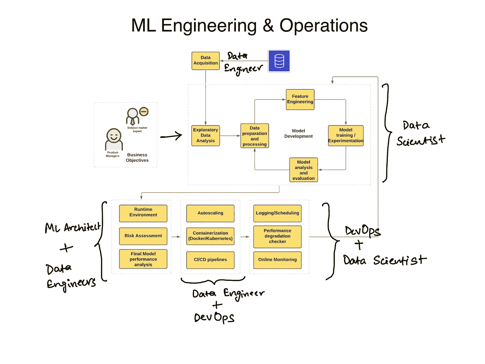
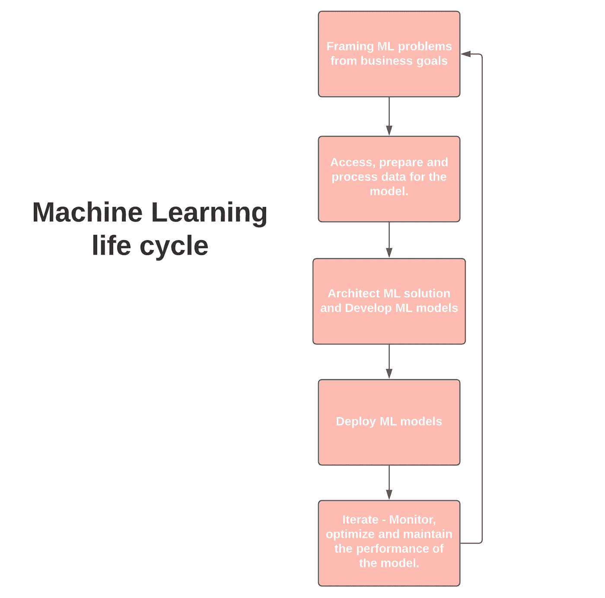
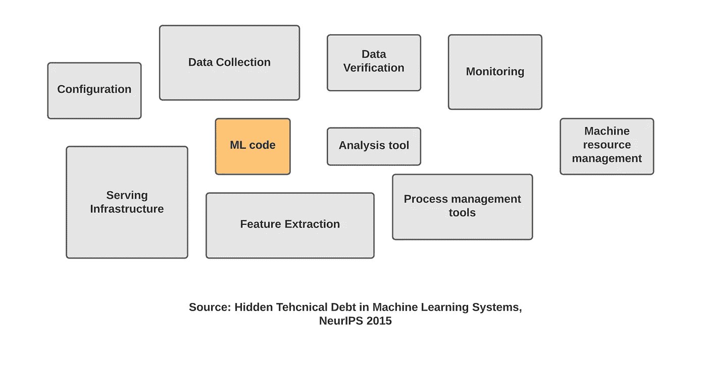

# 什么是 MLOps——入门必备的一切

> 原文：<https://towardsdatascience.com/what-is-mlops-everything-you-must-know-to-get-started-523f2d0b8bd8?source=collection_archive---------2----------------------->

## ML 系统开发生命周期和 MLOps 需求的完整演练

ML 系统工程及其利益相关者的操作—图片由作者生成

直到最近，我们都在学习软件开发生命周期(SDLC ),以及它是如何从需求获取→设计→开发→测试→部署→一直到维护的。我们过去和现在都在研究软件开发的瀑布模型、迭代模型和敏捷模型。

现在，我们正处于一个阶段，几乎所有其他组织都在试图将 AI/ML 融入他们的产品。构建 ML 系统的新需求增加/改革了 SDLC 的一些原则，从而产生了一个新的工程学科，称为 MLOps。

MLOps——一个新名词出现了，它引起了人们的热议，并催生了新的工作简介。MLOps 是机器学习操作的缩写，也称为 ModelOps。

## 在这里我们将讨论:

*   **什么是 MLOps，**
*   **它解决了哪些关键挑战，以及**
*   **它都由什么组成？**
*   一个人必须瞄准什么样的技能和个人资料组合，以及如何开始？

当我展开每一部分时，请继续阅读。

在 Google trends 上查找它会告诉你这是一个相对较新的学科，因为越来越多的组织正试图将 ML 系统集成到他们的产品和平台中。

作者生成的图像

# 定义

我是这样定义的:

它是一门工程学科，旨在统一 ML 系统开发(dev)和 ML 系统部署(ops ),以标准化和简化生产中高性能模型的持续交付。

# 为什么是 MLOps？

直到最近，我们还在处理可管理的数据量和小规模的极少数模型。现在形势发生了转变，我们正在将决策自动化嵌入到广泛的应用中，这产生了许多来自构建和部署基于 ML 的系统的技术挑战。

为了理解 MLOps，我们必须首先理解 ML 系统的生命周期。生命周期涉及数据驱动组织的几个不同团队。从开始到结束，以下团队插话:

*   **业务开发或产品团队** —用 KPI 定义业务目标
*   **数据工程** —数据采集和准备。
*   **数据科学** —构建 ML 解决方案和开发模型。
*   **IT 或 DevOps** —完成部署设置，与科学家一起监控。

这是 ML 生命周期的一个非常简单的表示。

由作者生成的图像

Google 的团队已经对构建基于 ML 的系统所带来的技术挑战进行了大量的研究。一篇关于 ML 系统中隐藏的技术债务的 NeurIPS 论文向你展示了开发模型只是整个过程中的一小部分。许多其他流程、配置和工具将集成到该系统中。

图片由作者生成—灵感来自[https://papers . nips . cc/paper/2015/file/86 df 7 dcfd 896 fcaf 2674 f 757 a 2463 EBA-paper . pdf](https://papers.nips.cc/paper/2015/file/86df7dcfd896fcaf2674f757a2463eba-Paper.pdf)

为了简化整个系统，我们有了新的机器学习工程文化。该系统涉及每个人，从具有最低技术技能的高层管理人员到数据科学家，再到开发人员和 ML 工程师。

# MLOps 应对的主要挑战

大规模管理这样的系统并不是一件容易的事情，许多瓶颈都需要解决。以下是团队提出的主要挑战:

*   擅长开发和部署可扩展 web 应用程序的数据科学家非常缺乏。最近市场上出现了一种新的 ML 工程师，旨在满足这种需求。这是数据科学和 DevOps 的交汇点。
*   **在模型中反映不断变化的业务目标**—存在许多依赖关系，数据不断变化，维护模型的性能标准，并确保 AI 治理。很难跟上持续的模型培训和不断发展的业务目标。
*   **技术和业务团队之间的沟通差距**，他们很难找到共同语言进行协作。最常见的是，这种差距成为大项目失败的原因。
*   **风险评估—** 围绕此类 ML/DL 系统的黑箱性质，有很多争论。模型往往会偏离它们最初的目标。评估此类故障的风险/成本是一个非常重要且细致的步骤。
    例如，与标记一个无辜的人进行欺诈、冻结其账户并拒绝其贷款申请相比，YouTube 上不准确的视频推荐的成本要低得多。

# 主要阶段—掌握 MLOps 需要什么

至此，我已经对系统的瓶颈以及 MLOps 如何解决这些问题给出了很多见解。你需要瞄准的技能可以从这些挑战中获得。

以下是你需要关注的关键技能:

## **1。从业务目标出发构建 ML 问题**

机器学习系统开发通常始于商业目标或目的。它可以是一个简单的目标，将欺诈交易的百分比降低到 0.5%以下，或者可以是建立一个系统来检测皮肤科医生标记的图像中的皮肤癌。

这些目标通常有特定的性能度量、技术需求、项目预算和 KPI(关键性能指标),它们驱动着对部署模型的监控过程。

## 2.架构 ML 和问题的数据解决方案

目标明确转化为 ML 问题后。下一步是开始搜索合适的输入数据以及针对该类数据尝试的模型类型。

搜索数据是最费力的任务之一。这是一个包含多项任务的过程:

*   你需要寻找任何可用的相关数据集，
*   检查数据及其来源的可信度。
*   数据源是否符合 GDPR 等法规？
*   如何使数据集可访问？
*   源的类型是什么—静态(文件)还是实时流(传感器)？
*   要使用多少个源？
*   一旦模型被部署到生产环境中，如何构建一个可以驱动训练和优化的数据管道？
*   所有的云服务都要使用什么？

## 3.数据准备和处理——数据工程的一部分。

数据准备包括特征工程、清理(格式化、检查异常值、插补、重新平衡等)等任务，然后选择有助于基本问题输出的特征集。

一个完整的管道将被设计，然后编码，以产生干净和兼容的数据，以提供给模型开发的下一个阶段。

部署这种管道的一个重要部分是选择云服务和架构的正确组合，这种组合是高性能和经济高效的。例如，如果您有大量的数据移动和大量的数据要存储，您可以使用 AWS S3 和 AWS Glue 构建数据湖。

您可能想练习构建一些不同种类的管道(批处理与流)，并尝试在云上部署这些管道。

## 4.模型训练和实验—数据科学

一旦你的数据准备好了，你就可以进入训练你的 ML 模型的下一步。现在，训练的初始阶段是用一堆不同类型的模型进行迭代。你将使用几个定量的方法来缩小到最佳的解决方案，比如准确性、精确度、召回率等，你也可以使用模型的定性分析来解释驱动模型的数学，或者简单地说就是模型的可解释性。

我有一个完整的任务列表，你可以在训练 ML 模型时阅读:

 [## 几乎每个机器学习项目的任务清单

### 构建端到端 ML 项目的任务清单

towardsdatascience.com](/task-cheatsheet-for-almost-every-machine-learning-project-d0946861c6d0) 

现在，您将使用不同类型的数据和参数运行大量实验。数据科学家在训练模型时面临的另一个挑战是**再现性**。这可以通过版本化您的模型和数据来解决。

您可以向 ML 系统的所有组件(主要是数据和模型)添加版本控制以及参数。

随着开源工具如****和**[**CML**](https://cml.dev/)**的发展，这现在很容易实现。********

****其他任务包括:****

*   ****通过为模型定型编写单元测试来测试模型。****
*   ****对照基线、更简单的模型以及不同的维度检查模型。****
*   ****使用分布式系统、硬件加速器和可扩展分析来扩展模型训练。****

## ****5.构建和自动化 ML 管道****

****建造 ML 管道时应牢记以下任务:****

*   ****确定系统需求—参数、计算需求、触发因素。****
*   ****选择合适的云架构—混合云或多云。****
*   ****构建培训和测试管道。****
*   ****跟踪和审核管道运行。****
*   ****执行数据验证。****

## ****6.将模型部署到生产系统****

****部署 ML 模型主要有两种方式:****

*   ****静态部署或嵌入式模型是将模型打包到可安装的应用程序软件中，然后进行部署。例如，提供请求批量评分的应用程序。****
*   ****动态部署——使用 FastAPI 或 Flask 等 web 框架部署模型，并作为响应用户请求的 API 端点提供。****

****在动态部署中，您可以使用不同的方法:****

*   ****在服务器(虚拟机)上部署****
*   ****在容器中部署****
*   ****无服务器部署****
*   ****模型流——与 REST APIs 不同，所有的模型和应用程序代码都在一个流处理引擎上注册，比如 Apache Spark、Apache Storm 和 Apache Flink。****

****以下是一些注意事项:****

*   ****确保符合适当的文件和测试分数。****
*   ****重新验证模型的准确性。****
*   ****执行可解释性检查。****
*   ****确保满足所有治理要求。****
*   ****检查任何数据工件的质量****
*   ****负载测试—计算资源使用情况。****

## ****7.监控、优化和维护模型****

****一个组织需要关注模型在生产中的表现，但是要确保良好和公平的治理。这里的治理意味着放置控制措施，以确保模型向受其影响的所有涉众、员工和用户交付它们的责任。****

****作为该阶段的一部分，我们需要数据科学家和 DevOps 工程师通过执行以下任务来维护整个生产系统:****

*   ****跟踪模型预测的性能下降和业务质量。****
*   ****设置日志记录策略并建立持续评估指标。****
*   ****排除系统故障和引入偏差。****
*   ****在生产中部署的培训和服务管道中调整模型性能。****

# ****进一步推荐阅读…****

****这一切都与 MLOps 有关，它不是一份工作简介，而是由几个利益相关方组成的生态系统。我相信，如果你是在 ML 和软件工程(DevOps)交叉领域工作的人，你会非常适合寻找能够端到端处理这种系统的人的初创公司和中型组织。****

****ML 工程师是服务于这个最佳位置的职位，也是有抱负的候选人应该瞄准的目标。以下是一些您可以参考的资源:****

*   ******【书】**:安德烈·布尔科夫关于[机器学习工程](http://www.mlebook.com/wiki/)的书。****
*   ******【书】:** [奥莱利传媒 MLOps 简介](https://learning.oreilly.com/library/view/introducing-mlops/9781492083283/)。****
*   ****您可以瞄准如下认证计划:****

**** [## 专业 ML 工程师认证|认证|谷歌云

### 专业的机器学习工程师设计、构建和生产 ML 模型来解决业务挑战…

cloud.google.com](https://cloud.google.com/certification/machine-learning-engineer)  [## AWS 认证机器学习-专业

### AWS 认证的机器学习-专业认证是为个人谁执行开发或…

aws.amazon.com](https://aws.amazon.com/certification/certified-machine-learning-specialty/?ch=sec&sec=rmg&d=1) 

你也可以观看这个博客的视频版本:

**更新**:我联系了德米特里·彼得罗夫，就这个话题进行了进一步的讨论，你可以在这里收听(或观看)我们的对话:

# 后续步骤

我计划开发一系列关于使用谷歌云或 AWS 构建端到端 ML 系统的教程和视频。[订阅我的简讯](https://dswharshit.substack.com/)了解更多更新。

# ✨公告—关于构建生产就绪型 ML Pipelines✨的群组课程

你好！我正在考虑推出一个为期 3 周的关于建立大规模生产流水线的队列课程。我将从测试组开始，这样我可以完善材料。测试版将是 800 美元，比最终价格有很大的折扣。

我(和我的团队)将现场授课，分享我们学到的关于使用谷歌的 TensorFlow Extended、Apache Airflow、Kubeflow 和 T2 的谷歌云平台等工具构建强大的 ML 管道的一切。这是一个技术栈，为诸如 [#Spotify](https://www.linkedin.com/feed/hashtag/?keywords=spotify&highlightedUpdateUrns=urn%3Ali%3Aactivity%3A6788545090139820032) 、 [#Airbnb](https://www.linkedin.com/feed/hashtag/?keywords=airbnb&highlightedUpdateUrns=urn%3Ali%3Aactivity%3A6788545090139820032) 和 [#twitter](https://www.linkedin.com/feed/hashtag/?keywords=twitter&highlightedUpdateUrns=urn%3Ali%3Aactivity%3A6788545090139820032) 等应用提供支持。

如果您有兴趣加入，请填写这张表格:

# 目标:

目标是加速你早期的 ML 工程生涯。

# 价值

学完这门课程，你会成为一名更自信、更有韧性的 ML 工程师。这是我希望在投身 ML 工程时就有的课程。

# 您将学到的内容:

我们将一起解开将笔记本电脑模型转移到生产环境所需的 ML 管道的每个单独组件(如信息图所示)。

你将通过做项目来学习。

# 材料和教学:

*   研讨会促进主动学习和动手操作，而不是被动的讲座。
*   与同龄人一起学习——Zoom 分组讨论小组、积极参与的 slack 社区和小组项目。
*   一门应用课程，提供学习指南、抽认卡和 ama。

# 谁应该报名

本课程是为那些已经在大规模训练 ML 模型，现在希望学习构建完整 ML 管道的人而设计的。对于转变为更具实践性的工程角色的数据科学家或新的 ML 工程师<2 years into their career.

# Hit me up!

My DMs are open for queries. Also, if you found this useful and would love to see more of it, connect with me on [Twitter](https://twitter.com/dswharshit) 或 [LinkedIn](https://www.linkedin.com/in/tyagiharshit/) 。此外，请订阅我的[频道](https://www.youtube.com/channel/UCH-xwLTKQaABNs2QmGxK2bQ)了解更多关于数据科学的内容。

您可以订阅我的每周数据科学简讯，我会将说明性教程、实用项目想法和实时培训课程直接发送到您的收件箱。****