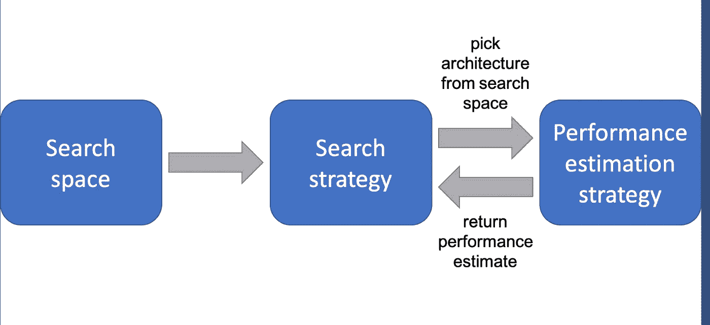

# 什么是神经架构搜索？你为什么要在乎？

> 原文：<https://towardsdatascience.com/what-is-neural-architecture-search-and-why-should-you-care-1e22393de461?source=collection_archive---------9----------------------->

## 由算法创建的神经网络

[疾控中心](https://unsplash.com/@cdc?utm_source=medium&utm_medium=referral)在 [Unsplash](https://unsplash.com?utm_source=medium&utm_medium=referral) 拍摄的照片

# 深度学习的民主化

**深度学习**模型的使用每天都变得越来越**民主**，在**很多行业**变得不可或缺。然而，有效的神经网络的实现通常需要建筑工程的背景和大量的时间来在迭代过程中探索我们知识的全部解决方案。神经网络的形式和结构将根据特定的需要而变化。因此，有必要根据给定的需求设计特定的架构。以试错的方式设计这些网络是一项乏味的任务，需要**架构工程技能和领域专业知识**。专家利用他们过去的经验或技术知识来创建和设计神经网络。这意味着潜在使用和评估的体系结构集合将减少到专家已知的那些。

# 迫切需要效率和优化

在一些行业中，神经网络的效率是至关重要的。为了使神经网络一般化并且不过度适应训练数据集，找到**优化的架构**是很重要的。然而，在生产力比质量更重要的时代，一些行业**忽视了他们的模式**的效率，并且满足于第一个实现他们目标的模式，而没有更进一步。寻找合适的架构是一项**耗时**且**易出错的任务**并且需要架构设计技能。由于缺乏时间或架构专业知识，这些行业没有通过“足够”的模型充分挖掘其数据的潜力。

本文旨在展示**神经架构搜索(NAS)** 的进展，它面临的困难和提出的解决方案，以及 **NAS** 现在的受欢迎程度和未来趋势。

# 如何理解神经架构搜索的复杂性

**神经架构搜索**旨在为满足特定需求的神经网络发现最佳架构。NAS 本质上是一个人手动调整神经网络并学习什么工作得好的过程，并自动完成这项任务以发现更复杂的体系结构。这个领域代表了一套工具和方法，这些工具和方法将**使用搜索策略测试和评估搜索空间中的大量架构，并通过最大化适应度函数**来选择最符合给定问题 **的目标的架构。**

[参考文献](https://medium.com/digital-catapult/neural-architecture-search-the-foundations-a6cc85f7562) —神经架构搜索概述

NAS 是 **AutoML** 的一个子领域，它封装了所有自动化机器学习问题的过程，因此也是深度学习问题。随着 [*Zoph 和 Le*](https://arxiv.org/abs/1611.01578) 或 [*Baker 和 al*](https://arxiv.org/abs/1611.02167) 的工作，2016 年标志着 NAS 的开始，他们利用强化学习算法实现了最先进的图像识别和语言建模架构。这项工作极大地推动了这一领域的发展。

## 著名项目

神经结构搜索是机器学习中发展最快的领域之一。在不同的行业和不同的问题中，大量的研究工作涉及对神经网络结构的搜索的自动化。如今，许多手动体系结构已经被 NAS 构建的体系结构取代:

*   目标检测—图像处理— [Zoph 和 al 2017](https://arxiv.org/pdf/1611.01578.pdf)
*   图像分类—图像处理— [Real 和 al，201](https://arxiv.org/pdf/1802.01548.pdf) 9
*   超参数优化— AutoML — [福雷尔和胡特，2019](https://www.automl.org/wp-content/uploads/2019/05/AutoML_Book_Chapter1.pdf)
*   元学习— AutoML — [Vanchoren，2018](https://arxiv.org/pdf/1810.03548.pdf)

最近在 NAS 方面的工作表明，该领域正在全面扩展并成为趋势。2019 年和 2020 年标志着正在进行的研究数量的加速。虽然早期的工作可以被认为是概念的证明，但当前的研究正在解决跨**几个行业**和**研究领域**的更具体需求。这一趋势显示了 NAS 所能带来的潜力，不仅体现在它的效率和**适应任何类型问题的能力**，还体现在工程师在非自动化任务上节省的时间。

## 神经架构搜索的好处要不要投资？局限性呢？

NAS 方法探索**许多具有可变复杂性的潜在解决方案**，因此**在计算上非常昂贵**。他们的搜索空间越大，需要测试、训练和评估的架构就越多。这些方法需要大量的资源和时间来找到一个足够好的模型。他们基于强化学习的 NAS 方法 Zoph 等人用了 800 个 NVIDIA K40 GPUs，用了 28 天。自从第一种方法以来，新的模型已经出现，搜索时间大大缩短。例如，[渐进式神经架构搜索](https://arxiv.org/pdf/1712.00559.pdf)展示了类似的最先进的结果，搜索速度提高了 5-8 倍。[高效的神经架构搜索](https://arxiv.org/pdf/1802.03268.pdf)大约需要 7 个小时才能找到该架构，与 NAS 相比，GPU 时数减少了 50，000 倍以上。

然而，这一领域受到其他几个限制。事实上，很难知道一个潜在的模型在真实数据上的表现如何。由于**架构是用训练数据**评估的，如果我们期望在真实数据上有一个执行模型，后者必须是高质量的。
仍有必要定义算法将如何找到并评估这些架构。这个任务还是手工完成，需要微调。然而，领域知识的缺乏不会降低架构的效率。这些知识有助于加速搜索过程，它将指导搜索，从而算法将更快地收敛到最优解。

最近的算法，如 PNAS 方法，试图**近似未来性能**，但这些预测器必须微调，仍然是近似值。此外，某些方法受到**鲁棒性问题**的困扰，很难训练。

一些实际的研究现在集中在使用 [**生物启发算法**](https://arxiv.org/abs/1905.07350) 作为 NAS 方法。这些算法对于**优化任务**非常有效，因此似乎是寻找神经网络最佳架构的理想候选。

带走:

*   NAS 从大量备选方案中找到理想的解决方案，并选择最符合给定问题目标的方案
*   优化算法
*   生物灵感
*   计算成本非常高
*   很难估计它在真实数据中的表现

# 结论

在一个**优化**和**性能**至关重要的时代，神经架构搜索是一个**快速扩展的领域**。这个非常新的领域仍然面临一些困难，以成为行业中深度学习项目设计的成熟步骤。然而，最近的工作表明，随着更快和更完整的体系结构评估方法的出现，这些困难将在未来几年消失。领域知识的贡献将不再是不可或缺的，而是提高研究方法效率的优势。因此，NAS 将为行业和公司带来更多的灵活性，这些工具能够适应多种特定需求。

🚀- [圣甲虫的消息](https://medium.com/u/52eb891e229c?source=post_page-----1e22393de461--------------------------------)

 [## 关于我——圣甲虫的新闻

### 欢迎页面

medium.com](https://medium.com/@tgey/about-me-thomas-gey-a8a42f6622cc)  [## 用我的推荐链接加入媒体-圣甲虫的新闻

### 作为一个媒体会员，你的会员费的一部分会给你阅读的作家，你可以完全接触到每一个故事…

medium.com](https://medium.com/@ScarabNews/membership)  [## 每当圣甲虫的新闻出版的时候得到一封电子邮件。

### 每当圣甲虫的新闻出版的时候得到一封电子邮件。通过注册，您将创建一个中型帐户，如果您还没有…

medium.com](https://medium.com/subscribe/@ScarabNews) 

*感谢阅读本文！如果你有任何问题，请在下面留言。*

*参考文献:*

*   [*带强化学习的神经架构搜索*](https://arxiv.org/pdf/1611.01578.pdf) *— Zoph 和 al，2017*
*   [*利用强化学习设计神经网络架构*](https://arxiv.org/pdf/1611.02167.pdf) *— Baker and al，2017*
*   [*元学习，一项调查*](https://arxiv.org/pdf/1810.03548.pdf)*—Joaquin vans choren，2018*
*   [*渐进式神经架构搜索*](https://arxiv.org/pdf/1712.00559.pdf) *—刘等，2018*
*   [*通过参数共享的高效神经架构搜索*](https://arxiv.org/pdf/1802.03268.pdf) *— Pham 和 al，2018*
*   [*图像分类器架构搜索的正则化进化*](https://arxiv.org/pdf/1802.01548.pdf) *—Real and al，2019*
*   [*超参数优化*](https://www.automl.org/wp-content/uploads/2019/05/AutoML_Book_Chapter1.pdf) *—马蒂亚斯·福雷尔和弗兰克·赫特，2019*
*   [*DeepSwarm:利用群体智能优化卷积神经网络*](https://arxiv.org/pdf/1905.07350.pdf) *— Byla and Pang，2019*