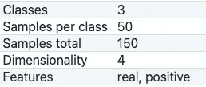
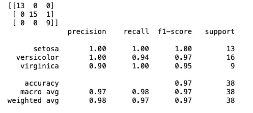

# 究竟什么是神经网络实现？

> 原文：<https://towardsdatascience.com/what-is-neural-network-implementation-anyway-a37e108d0143?source=collection_archive---------30----------------------->

## python3 和 scikit-learn 实现


由[乌列尔资深大律师](https://unsplash.com/@urielsc26?utm_source=unsplash&utm_medium=referral&utm_content=creditCopyText)在 [Unsplash](https://unsplash.com/s/photos/artifical-neural-networks?utm_source=unsplash&utm_medium=referral&utm_content=creditCopyText) 拍摄的照片

随着时间的推移，从事数据科学的人越来越多。特别是，深度学习领域是数据科学界最重要的话题。但是一切都可以归结为它的本质，在任何学术/研究环境中，都是了解你的基础知识。在过去，我已经分享了我关于以下主题的知识:数据集的[类型](/types-of-data-sets-in-data-science-data-mining-machine-learning-eb47c80af7a)，[数据预处理](/data-preprocessing-in-data-mining-machine-learning-79a9662e2eb)，[Python 中的数据预处理](/data-preprocessing-in-python-b52b652e37d5)，[线性回归](/simple-linear-regression-in-python-8cf596ac6a7c)，[决策树](https://medium.com/swlh/machine-learning-decision-tree-implementation-849df3ce36d2)和[朴素贝叶斯分类器](/understanding-naive-bayes-classifier-46385aca47ec)。

在这篇文章中，我将讨论一个非常简单的使用 scikit-learn 实现人工神经网络(ann)的方法。为了将高级深度学习(DL)应用于现实世界的问题，必须理解 ann。如今，我们几乎在所有可以想象的情况下都使用 DL。举几个例子:

1.  图像分类
2.  文本分类
3.  医学图像分割
4.  深度强化学习
5.  音频分析

以上这些例子可以进一步分解成具体的问题。

这个实现的代码是独立的。没有来自命令行的输入。代码分为 6 个部分。我会把每个部分的代码，并解释它的方式。在所有的部分都介绍完之后，我会放一个完整代码的链接。如果你只想看代码，可以直接跳到文章的末尾。所以，事不宜迟，让我们开始吧。

## 第 1 部分—导入所需的包

```
from sklearn import datasets
from sklearn.neural_network import MLPClassifier
from sklearn.model_selection import train_test_split
from sklearn.preprocessing import StandardScaler
from sklearn.metrics import confusion_matrix
from sklearn.metrics import classification_report
```

→第一行是从`scikit-learn`库本身导入数据集。我们将使用*虹膜数据集*来实现。

→第二行是导入`MLPClassifier`(多层[感知器](/machine-learning-perceptron-implementation-b867016269ec))，这是我们的神经网络。

→第 3 行是 [**数据预处理**](/data-preprocessing-in-python-b52b652e37d5) 的一部分，将整个数据集拆分为训练和测试。

→第 4 行是 [**数据预处理**](/data-preprocessing-in-python-b52b652e37d5) 的一部分，用于将特征缩放应用于数据集。

→第 5 行是得到 [**混淆 _ 矩阵**](/performance-measures-for-classification-models-a486c8976bf1) 的预测和真实类标签来检查模型的性能。

→第 6 行是获得完整的分类报告，包括准确度、f1 分数、精确度和召回率，作为[性能指标](/performance-measures-for-classification-models-a486c8976bf1)。

[](/data-preprocessing-in-python-b52b652e37d5) [## Python 中的数据预处理

### 对于机器学习与工作代码的例子…

towardsdatascience.com](/data-preprocessing-in-python-b52b652e37d5) [](/performance-measures-for-classification-models-a486c8976bf1) [## 分类模型的性能度量

### 和评估分类器性能的方法

towardsdatascience.com](/performance-measures-for-classification-models-a486c8976bf1) 

## 第 2 部分—加载数据集

```
iris = datasets.load_iris()X = iris.data
y = iris.target
print('total data: ', len(X))
```

> 输出:
> 
> 总数据:150

→第一行是从`scikit-learn`库中创建并提取数据集(虹膜数据集)。



Iris 数据集的属性|来源: [Scikit-learn](https://scikit-learn.org/stable/modules/generated/sklearn.datasets.load_iris.html#sklearn.datasets.load_iris)

→第二行是从数据集中获取独立属性。

→第三行是从数据集中获取从属属性。

## 第 3 部分—将数据集分为训练和测试

任何机器学习算法都需要进行准确性测试。为此，我们将数据集分为两部分:**训练集**和**测试集。**顾名思义，我们使用训练集使算法学习数据中存在的行为，并通过在测试集上测试来检查算法的正确性。我们的做法如下:

```
X_train, X_test, y_train, y_test = train_test_split(X, y, test_size = 0.25, random_state = 0)
print('train data: ', len(X_train))
print('test data: ', len(X_test))
```

> 输出:
> 
> 训练数据:112
> 
> 测试数据:38

这里，我们假设训练集是原始数据集的 75%，测试集是原始数据集的 25%。这通常是它们被分割的比例。但是，你有时会遇到 70-30%或 80-20%的比例分割。但是，你不想对半分。这会导致 ***模型过拟合。*** 这个话题太庞大，无法在同一个帖子里涵盖。我将在以后的文章中介绍它。目前，我们将按照 75-25%的比例进行分配。

## 第 4 部分—特征缩放

在下面的[帖子](/data-preprocessing-in-data-mining-machine-learning-79a9662e2eb)中，我将从概念上详细讨论变量转换(特性缩放)。

[](/data-preprocessing-in-data-mining-machine-learning-79a9662e2eb) [## 数据挖掘和机器学习中的数据预处理

### 有了详细的概念…

towardsdatascience.com](/data-preprocessing-in-data-mining-machine-learning-79a9662e2eb) 

我们使用特征缩放将不同的尺度转换为标准尺度，以使机器学习算法更容易。我们在 Python 中这样做，如下所示:

```
sc = StandardScaler()
X_train = sc.fit_transform(X_train)
X_test = sc.transform(X_test)
```

这些数据现在可以输入到机器学习算法中。

## 第 5 部分—定义和训练[MLP 分类器](https://scikit-learn.org/stable/modules/generated/sklearn.neural_network.MLPClassifier.html)

```
clf = MLPClassifier(hidden_layer_sizes=(10, 10, 10), random_state=1, max_iter=1000, activation='relu', solver='adam')clf.fit(X_train, y_train)
```

在这个实现中，

→网络中有 3 个隐藏层，每个层有 10 个神经元，用属性`hidden_layer_sizes`表示。这个网络是一个非常简单的网络。我鼓励你尝试不同数量的层和不同数量的神经元，看看结果的差异。

→ `random_state`无非是一个种子值，这样我们每次运行同一个网络，都不会得到不同的结果。

→ `max_iter`是最大迭代次数。求解器迭代，直到收敛或达到此迭代次数。

→ `activation`是隐藏层的激活功能。

→ `solver`是权重优化的求解器。

要了解有关 MLPClassifier 参数的更多信息，请访问:

[](https://scikit-learn.org/stable/modules/generated/sklearn.neural_network.MLPClassifier.html) [## sklearn.neural_network。MLP 分类器-sci kit-学习 0.24.1 文档

### 多层感知器分类器。该模型使用 LBFGS 或随机梯度优化对数损失函数

scikit-learn.org](https://scikit-learn.org/stable/modules/generated/sklearn.neural_network.MLPClassifier.html) 

→ `clf.fit`将训练数据传递给网络，以便网络从中学习。

要了解神经网络的基本概念，请访问:

[](/artifical-neural-networks-771562b83e31) [## 人工神经网络

### 简要的概念性概述

towardsdatascience.com](/artifical-neural-networks-771562b83e31) 

## 第 6 部分—预测测试结果和检查性能

```
y_pred = clf.predict(X_test)cm = confusion_matrix(y_test, y_pred)
print(cm)print(classification_report(y_test, y_pred, target_names=iris.target_names))
```

> 输出:



混淆矩阵和分类报告|作者图片

→我们收集第 1 行网络的预测。

→我们在下一行制作混淆矩阵，然后打印出来。

→我们在最后一行做分类报告，打印出来。

## 结论

这篇关于分类神经网络的基本实现的文章到此结束。如您所见，测试集的准确率为 97%。我尝试了 80-20%的训练测试分割，我能够实现 100%的测试准确性。精确度如此之高是因为数据集的大小非常小。通常，我们永远不会在更大的数据集中达到 100%的准确率。如果你有，回复这篇文章。我很想知道你是如何做到的？

这是完整的代码。

[我正在免费赠送一本关于一致性的电子书。在这里获得你的免费电子书。](https://colossal-hustler-1290.ck.page/c717067eb6)

如果你喜欢阅读这样的故事，并想支持我成为一名作家，可以考虑[注册成为一名媒体成员](https://tarun-gupta.medium.com/membership)。每月 5 美元，你可以无限制地阅读媒体上的故事。如果你注册使用我的链接，我会赚一小笔佣金，不需要你额外付费。

[](https://tarun-gupta.medium.com/membership) [## 加入我的推荐链接-塔伦古普塔

### 作为一个媒体会员，你的会员费的一部分会给你阅读的作家，你可以完全接触到每一个故事…

tarun-gupta.medium.com](https://tarun-gupta.medium.com/membership) 

我希望你喜欢阅读这篇文章，并开始学习一些基本的人工神经网络实现。感谢您的阅读。

这是我的故事索引:

 [## 标记故事列表的快速链接—感谢您的访问

### 我也有一份以快节奏出版为目标的出版物。读书成为作家。

tarun-gupta.medium.com](https://tarun-gupta.medium.com/thank-you-for-visiting-my-profile-9f708062c75e)