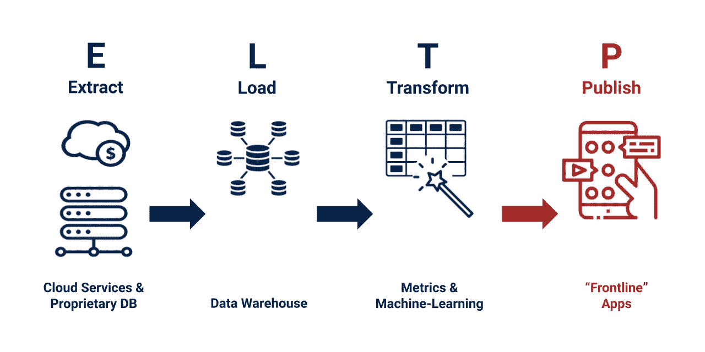
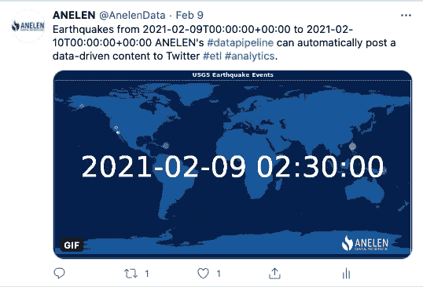
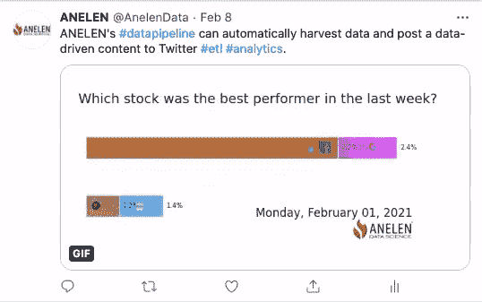

# “ELTP 过程”中的 P 是什么？

> 原文：<https://towardsdatascience.com/what-is-p-in-eltp-process-e56d995d7029?source=collection_archive---------26----------------------->

## *解决“数据最后一英里问题”,为您的企业释放全面的分析能力。*

*图片由大河望田中@ Anelen 有限责任公司授权的 iStock Photo 提供*

# 将 P 添加到 ELT

如果你和数据工程师一起工作过，你可能听说过 ETL 或者 ELT。

*   **E** **用于从源中提取**数据。
*   **T** **用于将**从原始数据转换为干净有用的信息。
*   **L**用于将加载到目的数据湖或数据仓库。

趋势是在将数据加载到强大的现代数据仓库(如 Google BigQuery、Snowflake、AWS Redshift 或 Microsoft Synapse)后对其进行转换。因此，人们越来越多地使用 ELT 而不是 ETL 来处理数据。

我要给 ELT 加一个 P，就是“Publishing”这是将转换后的数据发布到人们或另一个程序将使用它们的确切位置的过程。我们称之为“前线应用”。

# ELT 不能解决“数据最后一英里问题”

考虑这个业务场景:产品合格线索评分(PQL 评分)。

假设您的公司是一家软件即服务(SaaS)公司。基本功能都是免费的。你的潜在客户通过在线广告找到你的服务。注册是免费的，但用户必须输入他们的工作电子邮件和业务信息。

如果您正在使用 Marketo 或 Pardot 等在线营销自动化工具，您可以在此时获取潜在客户的产品发现渠道及其电子邮件。但营销过程通常与使用统计数据脱节。这是因为使用数据通常位于生产数据库中。

或者您可能更进一步，通过 ELT 过程将数据从生产数据库复制到数据仓库。你可能是一名数据科学家，他想出了一个公式或机器学习算法来计算 PQL 分数，以表明哪些免费层用户可能会转化为付费客户。

但是只要数据还在仓库里，它就不会被使用。PSQL 分数应该发布给 Marketo、Pardot 或 Salesforce，因为这是销售和营销人员的工作场所。他们太忙了，没有时间打开商业智能工具或运行查询来找出哪些潜在客户应该优先考虑。

作者图片

# 发布:将数据推出仓库

除了产品营销用例之外，向一线应用发布指标的重要性也非常重要。SaaS 企业的另一个令人信服的案例是客户成功。对于基于订阅的服务，跟踪每个订户帐户的健康状况至关重要。特别是对于复杂的业务应用程序，客户可能会在看到价值之前放弃产品。您的客户在注册后是否采取了正确的步骤来获得价值，或者他们在开始时遇到了困难？

企业 SaaS 公司通常有一个客户成功功能，以帮助新客户在入职过程中及以后。如果能在他们工作的地方(如 Zendesk)获得信息，产品使用统计数据和帐户的健康得分将是有益的。

ELTP 的 P 解决了信息传递的最后一英里问题，使商业运作变得聪明、高效和精益。

# ELTP 自动化

在过去的几年里，ELT 业务不断增长。有很多服务可以自动将数据从各种在线应用程序转移到数据仓库。但是很少有资源和服务可用于自动化数据发布，更不用说提供无代码解决方案了。

缺乏无代码解决方案并不一定会阻止企业利用强大的 ELTP 过程。对数据工程的一点点投资将为整个商业运作带来回报。

流行的开源 ELT 框架之一是 [singer.io](https://singer.io) 。singer.io 社区构建了名为“tap”的数据提取器和名为“target”的数据加载器。Singer.io 的规范帮助数据工程师混搭 tap 和 targets，为每个业务用例创建源-目的组合。在典型的 ELT 框架中，Salesforce 和 Marketo 等云应用程序是数据源(tap)，数据仓库是目的地(targets)。

当我们从事“ELTP”的 P 时，我们颠倒了名称:例如，我们为 BigQuery 开发了[tap 程序来提取产品使用度量，为 Pardot](https://github.com/anelendata/tap-bigquery) 开发了[目标程序。通过运行这种 tap-target 组合，我们自动完成了将产品使用数据从 BigQuery 发布到 Pardot 的过程，因此我们客户的营销和销售团队可以充分利用 PQL 指标，而无需手动移动数据。](https://github.com/anelendata/target-pardot)

# ELTP 的未来

数据发布不仅限于人类消费。计算出的指标可以复制回生产数据存储或缓存层，以使产品的用户体验更加优化和个性化。这些指标可以基于简单的统计数据，也可以基于机器学习的复杂计算结果。通过解决最后一英里的问题，并确保有价值的信号被正确地传递到重要的地方，我们可以释放看不见的潜力。

在不久的将来，将会有更多的新业务提供无代码解决方案和服务来结束这个循环。与此同时，我们将帮助企业定制 ELTP 解决方案，并在销售、营销和客户成功使用案例方面创造更多成功故事。

# 有趣的演示

这是一个解决“最后一英里问题”的有趣演示这些 GIF 动画是在指定的时间间隔自动创建并发布在 Twitter 上的。我们从来源([地质](https://twitter.com/AnelenData/status/1359405517915971586)和[金融](https://twitter.com/AnelenData/status/1358869327185924106))提取数据，转换数据(包括制作动画的部分)，并将其交付到重要的地方(社交媒体)。

图片作者。美国地质调查局的公共领域数据

作者图片

***关于作者***

大河望·田中是 ANELEN 有限责任公司的首席执行官兼数据科学家，该公司是一家专注于数据工程、分析和数据科学的精品咨询公司。ANELEN 的使命是帮助创新企业利用数据科学做出更明智的决策。

*原载于 2021 年 2 月 13 日 https://articles.anelen.co*<https://articles.anelen.co/What-is-P-in-ELTP-Process/>**。**