# p 值是多少？

> 原文：<https://towardsdatascience.com/what-is-p-value-370056b8244d?source=collection_archive---------6----------------------->

## p 值的详细解释

如果你用谷歌搜索“什么是 p 值”，页面上显示的第一个结果是维基百科的定义:

> p 值是在假设零假设正确的情况下，获得至少与实际观察到的结果一样极端的测试结果的概率。—维基百科

嗯…好消息是我们知道这个定义是正确的；糟糕的是，这个定义太正确了，难以理解。

所以…今天的游戏就是想分解这句话！

因为现在是假期！(万岁~)，让我们邀请姜饼人一起来玩吧！

姜饼人:你确定吗？p 值…好玩？？？(吉尔·威灵顿在[像素](https://www.pexels.com/zh-tw/photo/3309802/?utm_content=attributionCopyText&utm_medium=referral&utm_source=pexels)上拍照)

# 圣诞老人的饼干店

圣诞老人的饼干店正在出售他们的著名产品——姜饼饼干！圣诞老人为他的饼干感到非常自豪。他相信他的产品是世界上最好吃的。还有，**圣诞老人说每个产品(一袋姜饼)的平均重量(μ)是 500g** 。

现在是 21 世纪。圣诞老人已经有了自己的工厂和自动化机器来帮助他制作饼干。如你所知，没有完美的机器和生产过程，所以不同袋的饼干之间会有差异。假设我们知道**袋装饼干正态分布，标准差(σ)等于 30g。**

因此，如果萨特纳的说法是真的(一袋饼干的平均重量= 500 克)，我们可以预期一袋饼干的分布如下:

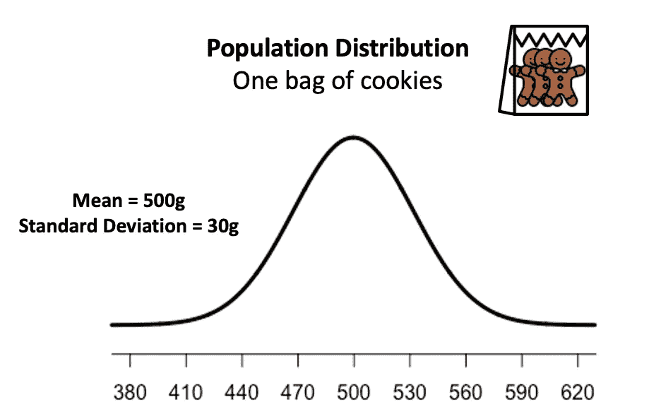

# 我们能相信圣诞老人的话吗？

但是，作为一个非常喜欢姜饼的好奇顾客，我想知道…一袋饼干的平均重量真的等于 500 克吗？如果圣诞老人欺骗顾客，给我们少于 500 克的饼干怎么办？我们如何验证圣诞老人的话？

这就是“假设检验”的用武之地。

为了实现假设检验，首先，让我们建立我们的零假设(H0)和替代假设(H1)。作为一个讲道理的人，我们不应该在没有任何证据的情况下怀疑别人。所以，我们假设圣诞老人对他的生意是诚实的(H0)。如果我们想检查他的饼干是否少于 500g，我们需要收集数据并有足够的证据来支持我们的猜测(H1)。所以…我们有如下的假设陈述:

> *H0:平均一袋饼干重量(μ)= 500 克
> H1:平均一袋饼干重量(μ)<500 克*

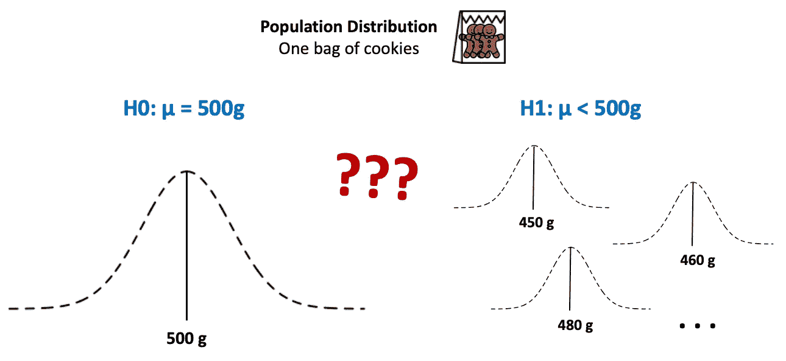

因为我们不确定我们的人口分布是什么样子，我用虚线来表示可能的分布。如果圣诞老人的说法是真的，我们可以预计一袋饼干的平均重量等于 500 克(左图)。然而，如果圣诞老人的说法是不真实的，饼干的平均重量小于 500 克，人口分布应该看起来不同(右图)。

酷！问题陈述已设定。那么现在，下一个问题是:如何检验我们的假设陈述？

也许称一下所有的饼干袋，这样我们就能知道确切的人口分布了？嗯……显然，我们不可能收集到所有圣诞老人的甜饼店生产的甜饼(人口)！！！那么…我们该怎么办？

在这里，“推断统计”派上了用场！

# 推断统计学的核心概念

在推断统计学中，我们感兴趣的是总体参数(总体的属性)。但是，要收集全部人群的所有数据来计算参数，几乎是不可能的。因此，我们从总体中抽样以获得样本数据。然后，我们从样本数据中计算统计量(样本的属性)作为我们的估计量，以帮助我们推断未知的总体参数。(如下图)

> 参数和统计示例:
> -参数:总体均值(μ)、总体标准差(σ) …
> -统计:样本均值(x̄)、样本标准差(s) …

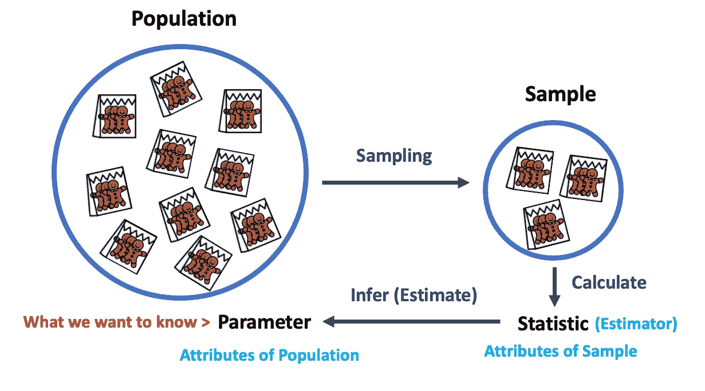

检验我们的假设陈述也是一项推断统计工作。流程同上。但是现在，我们对单个未知参数不感兴趣；相反，我们感兴趣的是“我们是否能拒绝零假设？”。

这个问题怎么回答？使用相同的方法—我们从样本数据中计算统计数据来推断这个问题的答案。这里使用的统计称为**检验统计。**

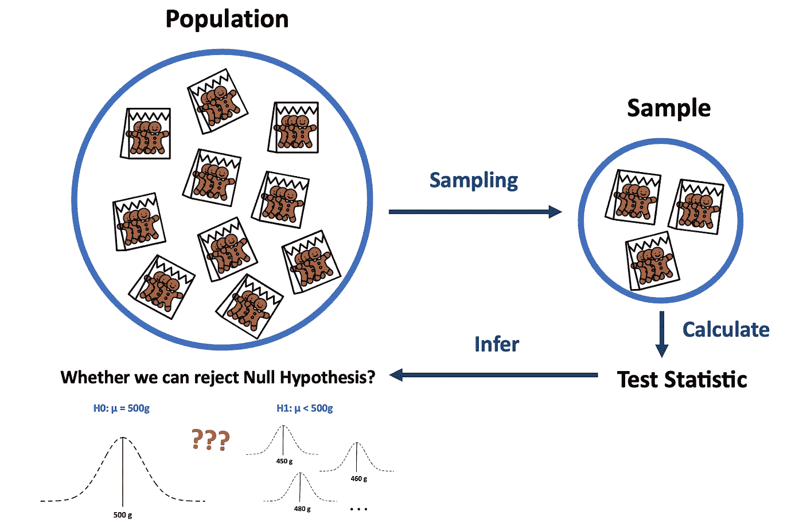

太好了！现在，我们知道应该收集样本数据并计算检验统计量，以检验假设陈述。

但是……让我们暂停一下。在进入测试部分之前，让我快速回顾一下**抽样分布**的概念，以确保我们在同一页上。

# 抽样分布审查

抽样分布是样本统计量的分布。

让我们以其中一个统计数据——样本均值(x̄)——为例。如果我们从总体中多次取样，我们可以得到许多样本数据集(样本 1 到样本 m)。然后，如果我们从每个样本数据集中计算样本平均值(x̄),我们可以得到样本平均值(x̄).)的 m 个数据点利用这些数据点，我们可以画出样本平均值分布图(x̄).由于这种分布来自于样本统计，我们称这种分布为**样本均值的抽样分布(x̄)** 。

同样的想法也适用于其他统计数据。例如，如果我们从每个样本数据集中计算检验统计量，我们可以得到检验统计量的抽样分布。

抽样分布与所有其他分布相似，它显示了如果我们从总体中多次抽样，统计值出现的可能性(概率)。

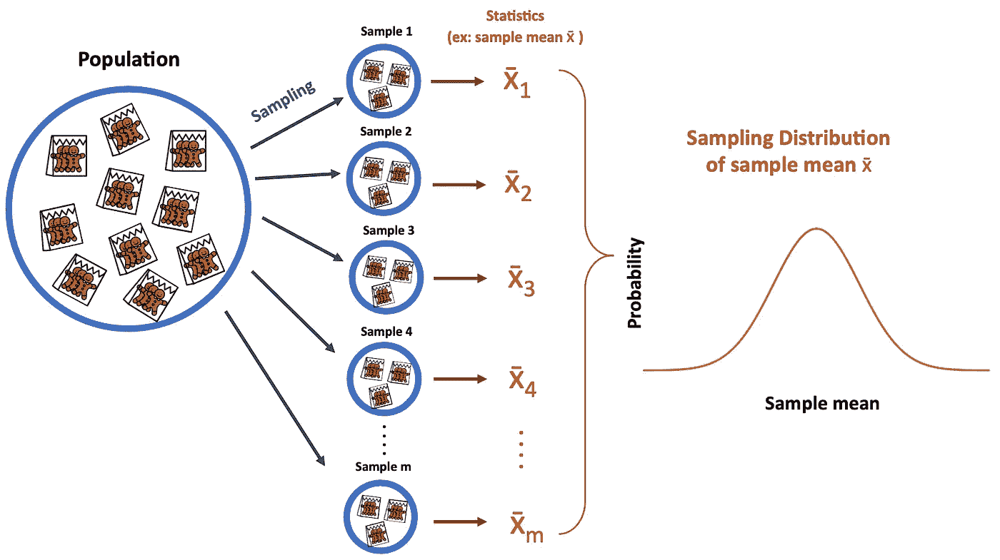

> 在下面的小节中，我将使用棕色来表示采样分布曲线。

不错！现在，是时候进入测试部分了！

# 测试假设陈述

我们需要做的第一件事是有一个样本数据集。所以，我去了圣诞老人的饼干店，随机挑选了 **25 袋饼干(n)作为我们的样本数据**。另外，我计算出该样品的平均重量(x̄)为 485 克。

测试的第一部分是将我们的样本统计量与零假设进行比较，这样我们就可以知道我们的样本统计量离期望值有多远。

为此，我们首先**假设零假设为真**。这是什么意思？这意味着，在我们的例子中，我们假设一袋饼干的人口分布实际上等于 500 克。如果这种说法是正确的，根据[中心极限定理](https://en.wikipedia.org/wiki/Central_limit_theorem)，如果我们多次从该总体中取样，我们可以得到样本平均值(x̄)的取样分布，如下图所示(样本平均值的平均值= 500g)。

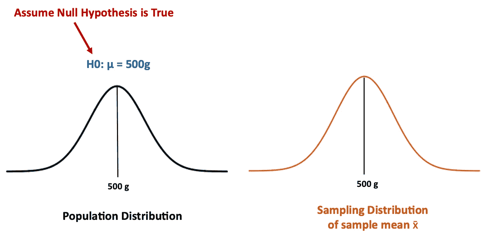

> p 值定义:
> “p 值是在假设零假设正确的情况下，获得至少与实际观察到的结果一样极端的检验结果的概率，**。**”—维基百科

所以现在，如果零假设为真，我们可以很容易地看到我们的样本均值比预期均值(500g)低 15g(485–500 =-15)。

嗯……但是“15g”只是一个数字，对我们解释意义帮助不是很大。还有，如果我们要计算曲线下的概率，一个一个的计算效率很低(想象有无数个分布，每个都有自己的均值和标准差……你真的不想计算很多很多次的概率……)

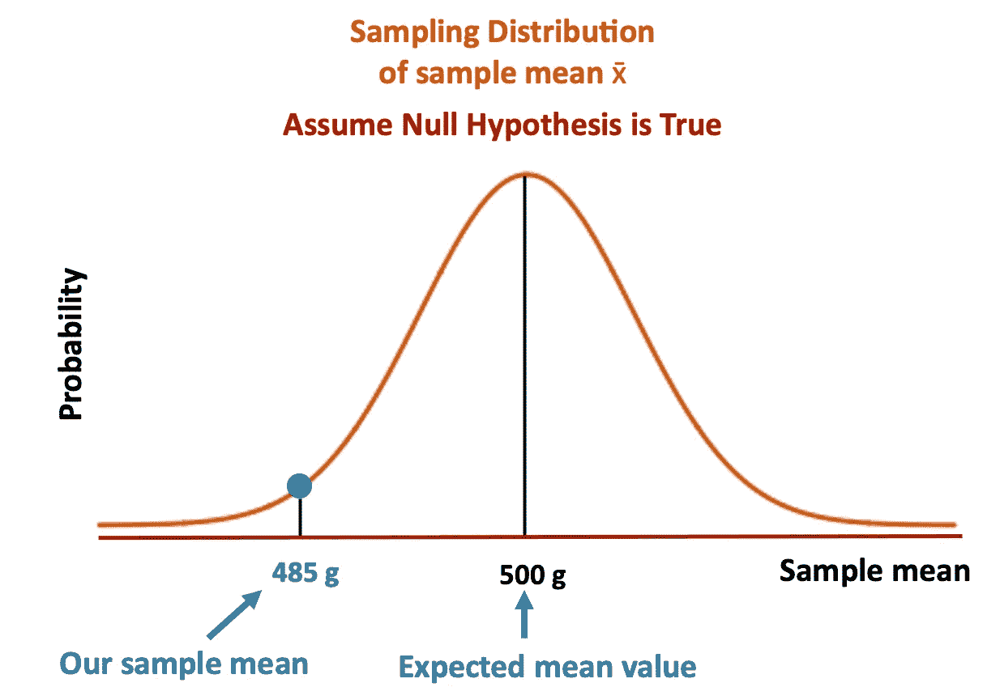

那么，我们该怎么办呢？我们**标准化**我们的值，使得分布的平均值总是等于零。标准化的好处是统计学家已经生成了一个包含每个标准化值下的面积的表格。所以我们不需要逐个计算面积。我们需要做的就是标准化我们的数据。

如何规范？在我们的例子中，我们使用 **z 分数**来转换我们的数据。在我们的例子**中，z-score 是**测试统计**。**

下图显示了检验统计量(z 得分)的抽样分布。我们可以看到，如果我们的样本数据正好等于零假设(总体均值=500g，样本均值= 500g)，我们应该有检验统计量等于 0。在我们的例子中，我们的样本平均值等于 485g，这使我们的测试统计量等于-2.5 (-2.5 是我们从样本数据中观察到的测试结果)。这表明我们的样本数据比预期值低 2.5 [个标准误差](https://en.wikipedia.org/wiki/Standard_error)。

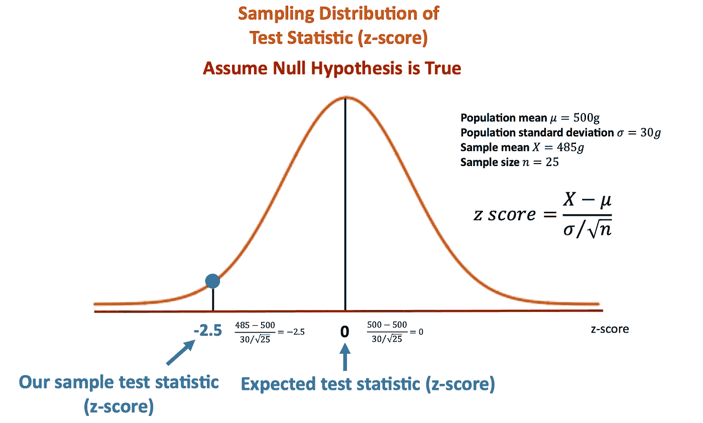

> p 值定义:
> “p 值是在假设零假设正确的情况下，**获得测试结果**至少与实际观察到的**结果**一样极端的概率。”—维基百科

这里我想提一下**检验统计量**是根据不同的情况来选择的。你可能会听到不同种类的统计检验，如 z 检验、t 检验、卡方检验……为什么我们需要不同种类的检验？

因为我们可能需要测试不同类型的数据(分类数据？定量？)，我们可能有不同的测试目的(均值测试？比例？)，我们拥有的数据可能具有不同的分布，我们可能只有有限的数据属性……因此，如何选择合适的测试方法是另一项至关重要的工作。

> 在这种情况下，由于我们对检验平均值感兴趣，我也假设我们的总体数据是正态分布的，具有已知的总体标准差(σ)。基于我们的条件，我们选择了 z 检验。
> **如果您对何时使用每种统计检验感兴趣，请参考不同种类的统计检验的假设。**

好了，现在我们有了测试统计数据。当零假设为真时，我们知道我们的检验统计量离期望值有多远。那么，我们真正想知道的是:如果零假设为真，我们得到这个样本数据的可能性(概率)有多大？

要回答这个问题，我们需要计算概率。如你所知，一个点到另一个点之间的概率就是我们在这两点之间的抽样分布曲线下的面积。

所以在这里，我们不计算特定点的概率；相反，我们计算从我们的测试统计点到无穷大的概率——表示远离我们的测试统计(也远离预期的测试统计)的所有点的累积概率。

这个累积概率就是我们的 **p 值**。

> 你可能想知道为什么我们不计算特定测试统计的概率(一分)。以下是我在[这篇文章](https://math.stackexchange.com/questions/616007/why-do-p-values-include-the-probability-of-obtaining-more-extreme-values-than-th)中发现的两种可能的解释:
> 
> (1)数学上，概率曲线上特定点的概率为零。为了计算概率，我们需要计算曲线下的面积。
> 
> (2)为了决定我们是否应该拒绝零假设，我们使用 p 值来比较显著性水平。由于显著性水平是累积概率，我们需要使用相同的格式来比较其中两个。因此，p 值也应该是一个累积概率。(我将在后面介绍 siginificant level)

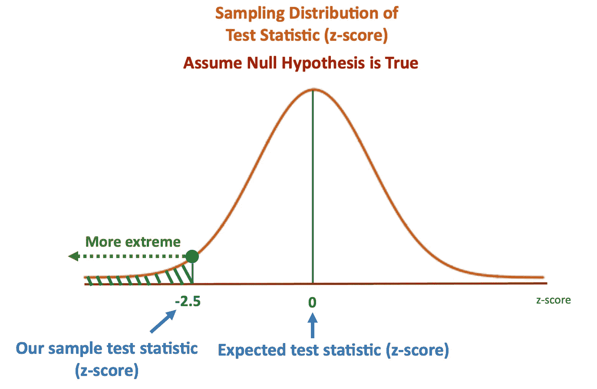

> p 值定义:
> “p 值是在假设零假设正确的情况下，获得至少与实际观察到的结果一样极端的测试结果**的概率**。”—维基百科****

精彩！我们刚刚解释了 p 值定义的所有部分！

让我们计算一下本例中的 p 值。正如我之前提到的，使用检验统计的最好方法是统计学家已经了解了抽样分布的属性。因此，我们可以只查找 z 表，或使用任何统计软件来帮助我们获得 p 值。

在我们的例子中，p 值等于 0.0062 (0.62%)。

> 请注意，在我们的案例中，我们正在进行单尾测试。也就是说，我们只考虑一个方向来计算分布中的“极端”概率。由于我们的替代假设(H1)被设定为“平均值小于 500 克”，我们只关心小于我们的检验统计量的值(左侧)。
> 
> 我们可以根据另一个假设来确定应该关注哪条尾巴。如果备选项假设包括:
> (1)感兴趣属性小于(<)期望值:关注左尾
> (2)感兴趣属性大于(>)期望值:关注右尾
> (3)感兴趣属性不等于(≦)期望值:关注双尾
> 
> 注意:
> 感兴趣的属性-平均值、比例…(在我们的例子中是平均值)
> 期望值-特定数字…(在我们的例子中是 500g)

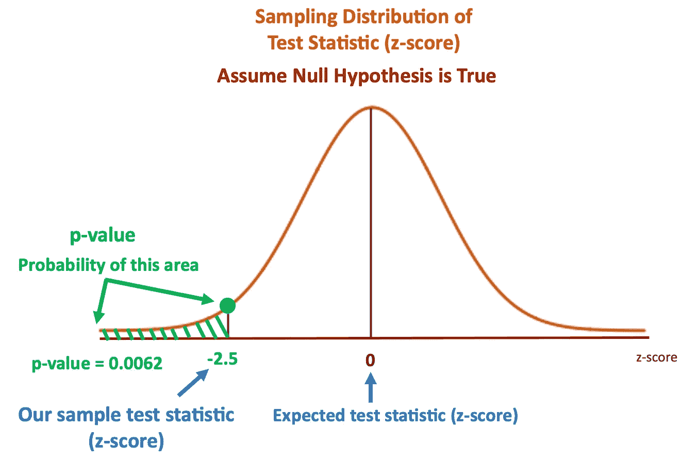

现在，我们有 p 值= 0.0062。嗯…这是一个小数字…但这意味着什么呢？

这意味着，在我们的零假设为真的条件下(总体均值真的等于 500g)，如果我们从这个总体分布中抽样 1000 次，我们将有 6.2 倍的机会得到这个样本数据(样本均值= 485g)或样本均值小于 485g 的其他样本。

换句话说，如果我们得到样本均值等于 485g 的样本数据，有两种可能的解释:

1.  人口平均数实际上等于 500 克(H0 是正确的)。而我们非常“幸运”的得到了这个难得的样本数据！(1000 次抽样中的 6.2 次)

或者…

2.“零假设为真”的假设是不正确的。该样本数据(样本平均值等于 485g)实际上来自更可能发生样本平均值= 485g 的其他人口分布。

酷！所以现在我们知道，如果我们的 p 值非常小，这意味着要么我们得到了非常罕见的样本数据，要么我们的假设(零假设为真)是不正确的。

那么，接下来的问题就是:我们现在只有 p 值，但是如何用它来判断什么时候拒绝零假设呢？换句话说，p 值有多小，我们就愿意说这个样本来自另一个人群？

这里先介绍一下判断标准— **显著水平(α)** 。显著水平是一个预定义的值，需要在实施假设检验之前**设置。你可以把显著性水平作为一个阈值，这给了我们一个何时拒绝零假设的标准。**

该标准设定如下:

> *如果 p 值≤显著水平(α)，我们拒绝零假设(H0)。
> 如果 p 值>显著水平(α)，我们无法拒绝零假设(H0)。*

比如说，我把我的显著性水平设为 0.05。

我们可以看到下图，红色区域是显著水平(在我们的例子中，它等于 0.05)。我们使用显著性水平作为我们的标准，如果 p 值在(小于或等于)红色区域内，我们拒绝 H0；如果 p 值超过(大于)红色区域，我们无法拒绝 H0。

这里我想提一下，显著性水平(α)也表示我们对 I 型错误可接受的最大风险(I 型错误是指当 H0 实际为真时我们拒绝 H0)。

通过下图很容易看出为什么——下面的分布曲线表明零假设(H0)是正确的。红色区域是当假设为真时，我们决定拒绝零假设的概率。如果 p 值等于显著性水平(我们的情况是 0.05)，那么当 H0 为真时，这将是我们错误拒绝 H0 的最大概率。

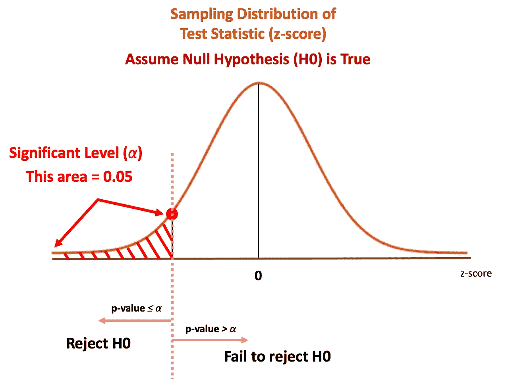

在我们的例子中，我们有 p 值= 0.0062，小于 0.05，因此，我们可以拒绝我们的零假设。换句话说，根据我们的测试，我们很遗憾地说，我们有足够的证据来支持我们的替代假设(一袋饼干的平均值小于 500 克)。这意味着…我们有足够的证据证明圣诞老人欺骗了我们…

嗯…如果我们把显著性水平改成 0.005 会怎么样？

结果会不一样。因为 0.0062 > 0.005，所以我们不能拒绝 H0。这是棘手的部分，因为显著水平是主观的，我们需要在测试前确定它。否则，我们很可能在知道 p 值后欺骗自己。

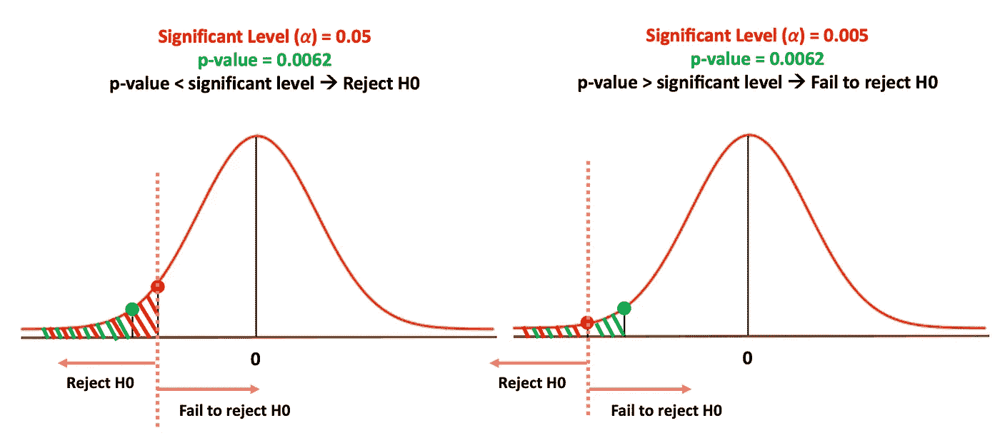

我们有足够的证据证明你欺骗了我们！！！(图片由[像素](https://www.pexels.com/zh-tw/photo/716658/?utm_content=attributionCopyText&utm_medium=referral&utm_source=pexels)上的[安德里亚·皮亚卡迪奥](https://www.pexels.com/zh-tw/@olly?utm_content=attributionCopyText&utm_medium=referral&utm_source=pexels)拍摄)

# 概述

谢谢你读到这一步。让我们快速回顾一下，结束今天的游戏！

## p 值是多少？

第 1 部分:为了检验我们的样本数据是否支持替代假设，我们首先假设零假设为真。这样我们就可以知道我们的样本数据离零假设给出的期望值有多远。

> p 值定义:
> “p 值是在假设零假设正确的情况下，**获得至少与实际观察到的结果一样极端的检验结果的概率**”—维基百科

第 2 部分:根据分布、数据类型、目的、数据的已知属性，选择一个合适的检验统计量。并计算样本数据的检验统计量。(测试统计显示我们的样本数据与期望值的差距)

> p 值定义:
> “p 值是在假设零假设正确的情况下，**获得测试结果**至少与实际观察到的**结果**一样极端的概率。”—维基百科

第三部分:计算在代表你的替代假设(左尾，右尾，双尾)的方向上，从检验统计点到无穷大(表示更极端)的概率(抽样分布曲线下的面积)。

> p 值定义:
> “p 值是在假设零假设正确的情况下，获得测试结果**至少与实际观察到的结果**一样极端的**概率**。”—维基百科

这个累积概率就是 p 值。

## **小 p 值是什么意思？**

如果我们有一个非常小的 p 值，这可能表明两种可能的意义:
(1)我们是如此“幸运”地得到这个非常罕见的样本数据！
(2)这个样本数据不是来自我们的零假设分布；取而代之的是来自其他人群的分布。(以便我们考虑拒绝零假设)

## p 值怎么用？

为了确定我们是否可以拒绝零假设，我们将 p 值与预定义的显著性水平(阈值)进行比较。

> *如果 p 值≤显著水平(α)，我们拒绝零假设(H0)。
> 如果 p 值达到>显著水平(α)，我们就无法拒绝零假设(H0)。*

***感谢您的阅读！欢迎任何反馈、建议和评论。如果你能让我知道你的想法和我文章中可能的错误，我将不胜感激。***

# 图标属性

来自 [Flaticon](https://www.flaticon.com/) 的 [iconixar](https://www.flaticon.com/free-icon/gingerbread-man_3753378) 制作的姜饼人图标

由 [catkuro](https://www.flaticon.com/free-icon/paper-bag_1115897) 从 [Flaticon](https://www.flaticon.com/) 制作的纸袋图标

# 参考

[1] [Everything you Should Know about p-value from Scratch for Data Science](https://www.analyticsvidhya.com/blog/2019/09/everything-know-about-p-value-from-scratch-data-science/)
[2] [(video) What is a Hypothesis Test and a P-Value? | Puppet Master of Statistics](https://www.youtube.com/watch?v=vwWEa8wU_6U&list=PLqzoL9-eJTND5VuIjTDtcKilOrxRWc-i5&index=8&ab_channel=MarinStatsLectures-RProgramming%26Statistics)
[3] [(video) Hypothesis Testing: Test Statistic (one-sample t-test) I Statistics 101 #3 | MarinStatsLectures](https://www.youtube.com/watch?v=fTYewURFLR0&ab_channel=MarinStatsLectures-RProgramming%26Statistics)
[4] [(video) What is a p-value? (Updated and extended version)](https://www.youtube.com/watch?v=UsU-O2Z1rAs&ab_channel=jbstatistics)
[5] [How t-Tests Work: t-Values, t-Distributions, and Probabilities](https://statisticsbyjim.com/hypothesis-testing/t-tests-t-values-t-distributions-probabilities/)
[6] [Interpreting P values](https://statisticsbyjim.com/hypothesis-testing/interpreting-p-values/)
[7] [P-values Explained By Data Scientist](https://www.kdnuggets.com/2019/07/p-values-explained-data-scientist.html)
[8] [Test statistics explained](https://www.scribbr.com/statistics/test-statistic/)
[9] [What is a test statistic?](https://support.minitab.com/en-us/minitab-express/1/help-and-how-to/basic-statistics/inference/supporting-topics/basics/what-is-a-test-statistic/)
[10] [Test Statistic: What is it? Types of Test Statistic](https://www.statisticshowto.com/test-statistic/)
[11] [Why do p-values include the probability of obtaining more extreme values than the test statistic?](https://math.stackexchange.com/questions/616007/why-do-p-values-include-the-probability-of-obta)
[12] [Wikipedia - p-value](https://en.wikipedia.org/wiki/P-value)
[13] Bluman, A. G. (2018). Elementary statistics: A step by step approach. New York, NY: McGraw-Hill Higher Education.
[14] 沈明來. (2016). 生物統計學入門第六版, 九州圖書文物有限公司