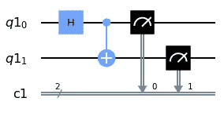
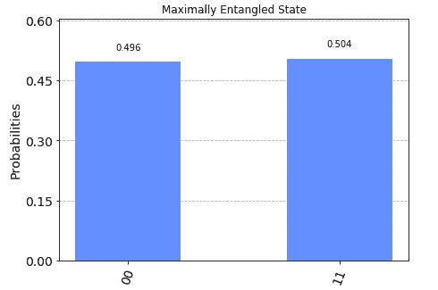

# 使用 Python 的量子计算简介

> 原文：<https://towardsdatascience.com/what-is-quantum-entanglement-anyway-4ea97df4bb0e?source=collection_archive---------10----------------------->

## 利用 Python 技巧学习量子计算！

迈克尔·泽兹奇在 [Unsplash](https://unsplash.com/s/photos/computing?utm_source=unsplash&utm_medium=referral&utm_content=creditCopyText) 上的照片

量子计算的世界是新的和令人兴奋的，因为它是压倒性的和困难的。然而，这并不是必须的！你不需要一个物理学博士或一个超导量子位实验室来自己做实验，也不需要涉足这样一个新兴的领域。在这篇文章中，我将向你展示如何简单地开始，如何运行你自己的量子模拟，你所需要的只是一台笔记本电脑，一些耐心和一杯咖啡(所有喝茶的人都可以选择)。

首先，我将使用 [Python](https://www.python.org/) 和 IBM 包 [Qiskit](https://qiskit.org/) 。一旦 Python 启动并运行，您就可以使用命令行并使用以下命令来安装 Qiskit。如果您在安装 Qiskit 时遇到问题，请查看此处的[以获取更多信息。](https://qiskit.org/documentation/install.html)

作为参考，这些将是我使用的 Python 和 Qiskit 的版本。顶部的导入语句用于访问版本信息，我们将使用类似的语句从 Qiskit 获得其他功能。

在上面的代码和任何从包中获得能力的代码的顶部，我们将需要 import 语句。具体来说，我们将需要以下进口。

Aer 是我们所有量子模拟器的后端所在，这就是 M 模拟器的意义所在，把它放在顶部也是一个很好的做法，因为就像我们的 import 语句一样，我们不会在编写其余代码时更改它们。

现在，在我们编写代码之前，让我们讨论一下量子计算。量子计算机与经典计算机的区别在于它的位数。一些读者会熟悉经典位，它们由 0 和 1 表示，这些位的组合形成二进制字符串，类似于 0010110。经典位只能取 0 和 1 的值。Bits 可以存储信息，比如数字、字母、特殊字符、这篇文章以及我将来要写的所有文章。在我们的量子电路中，我们将使用经典位元来储存测量值，因为它们擅长这样做。

量子位不一样，可以同时取 0 和 1 的值！如果你对量子力学不熟悉，想想这个有点奇怪，让我们现在就开始，改天再说。当一个量子比特(量子比特)处于两个状态之间时，我们称之为叠加态，这可以表示为在每个状态下发现量子比特的概率。举个简单的例子，我们可以设置一个量子位，使其处于 0 和 1 的完美叠加状态。这意味着在测量量子位之前，它处于两种状态，当我们测量它时，它将是 0 和 1 的一半时间。

在你抓耳挠腮之前，想一个更简单的例子。我抛一枚硬币，接住它，盖上盖子，这样就没人能看见了。如果你要猜硬币是什么，你会说正面或反面，但硬币还不是正面或反面，直到我揭开我的手给你看。你会说，在你看它之前，如果你猜对了，你有一半的可能性是正确的，如果你猜对了，你有一半的可能性是正确的。这是一个需要记住的好例子，硬币比量子位更为我们所熟悉。

量子位的这种怪异性质使得它们如此特别和有趣，这是它们最擅长的，以叠加态存在。这就是我们今天要编码的，我们将取两个都处于 0 状态的量子位，将它们放入 0 和 1 的相等叠加中。这个叠加是特殊的，我们将会得到 4 个最大纠缠态之一，也称为贝尔态！这些在量子计算的许多方面都非常重要，所以这是一个实用的起点。

既然我们知道我们将需要经典位和量子位，我们可以用

qreg 和 creg 是电路获取所需比特的地方。从量子寄存器 qreg，我们的电路将找到量子位。creg 也一样。我们用这些填满我们的电路

现在我们有了名为缠绕者的量子电路。三行代码已经让我们走了很远，但是我们还没有完成。我们如何用量子位做事情？我能听到你在问自己。这是通过量子门实现的。量子门是以某种方式转换一个或多个量子位的操作。在这个例子中，我们将看到两个这样的门，哈达玛门和 CNOT 门。

阿达玛门是一个被覆盖的硬币翻转，它把一个量子位从 0 态变成 0 和 1 相等叠加的状态。CNOT 门更复杂，需要两个量子位来发挥它的魔力。本质上，CNOT 门改变“目标”量子位，取决于它看到“控制”量子位时看到的东西。这就是 CNOT 门的作用。

在这篇文章中，我们不会手动计算量子位的状态，但是你可以随意去做，或者自己尝试不同的门和量子位，看看它们会做什么。

我们将在第一个量子位上应用哈达玛门，在两个量子位上应用 CNOT 门，将第一个量子位作为控制，将第二个量子位作为目标。在我们应用这些门之后，剩下要做的就是检查我们的答案，看看我们得到了什么，这是通过测量每个量子位并将每个结果留在一个经典位中来完成的。

注意潜在的混淆，Python 和许多编程语言一样，从数字 0 开始计数，而不是 1。这意味着 0 量子位是第一个，1 量子位是第二个。你可以看到门是量子电路对象的方法，门以量子位为参数。测量也只是量子电路的一种方法，它把要测量的量子位作为第一个参数，把测量留下的经典位作为第二个参数。第一个和第二个经典位也分别编号为 0 和 1。

我是一个视觉爱好者，所以我会告诉你如何看到你刚才编码的量子电路图，并绘制我们的测量结果。我们可以用**画出量子电路。draw()** 方法。

这就产生了这张图。

作者的量子电路

我们沿着量子电路从左到右，看到了表示阿达玛门的**“H”**，有蓝点和加号的位是 CNOT 门，加号告诉我们哪个量子位是目标。以及两个看起来像迷你速度计的物体，代表每个量子位元的测量值。

现在我们已经看到了我们的量子电路，我们需要看到我们的结果。这是通过对我们的电路进行测量模拟来实现的。 **execute()** 函数将待测电路作为其第一个参数，将您想要用来进行仿真的仿真器作为第二个参数。

模拟器进行许多测量，并记录它发现的每个 0 和 1。然后 **hist** 变量获取这些记录，我们最后使用 **plot_histogram()** 给出我们结果的直方图。

按作者划分的 Phi+状态直方图

这里我们看到，当我们观察这个系统时，我们粗略地测量到两个量子位有一半时间处于 0 状态，而发现两个量子位有一半时间处于 1 状态。这是一个最大纠缠贝尔态。我们取了两个未纠缠的量子比特，并把它们混合得如此之多，以至于它们总是被发现处于相同的状态。纠缠是系统的冯·诺依曼熵的一种表示，在我们的贝尔态中，我们会说熵是最大的。熵是我们系统中无序或随机的量度，因为当我们测量我们的系统时，我们对每个可能的结果都只有一个同样可能的结果，它被认为是最大随机的。纠缠是一种可以被某些量子协议“用尽”的资源。我们可以在以后的文章中发现更多这样的内容！

我希望你现在对量子计算有一个更好的了解，以及如何在自己家里舒适地玩这些东西。感谢您阅读这篇文章，不久肯定会有更多文章。

你可以在 [Linkedin](https://www.linkedin.com/in/abdulah-amer/) 和 [Github](https://gist.github.com/AbdulahAmer) 找到我。如有任何疑问或意见，请给我发邮件。