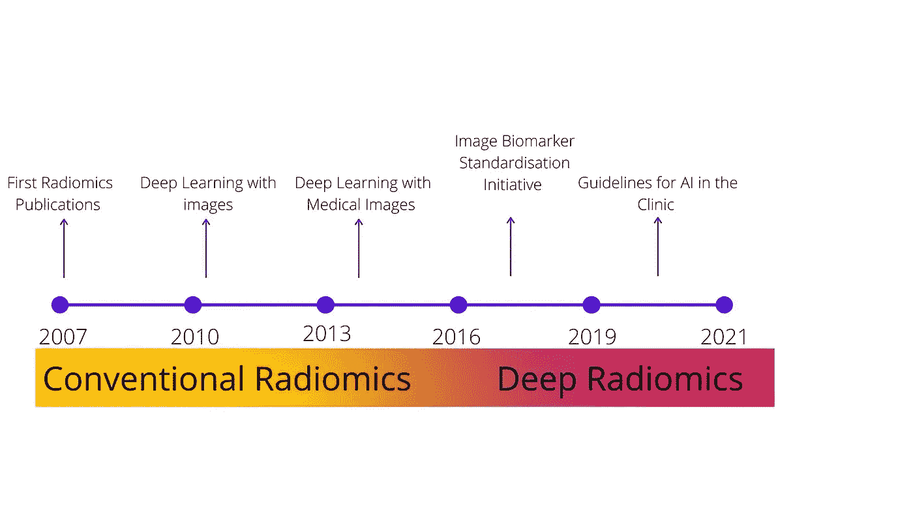

# 什么是无线电信息学？

> 原文：<https://towardsdatascience.com/what-is-radiomics-d9fb790a58c7?source=collection_archive---------29----------------------->

放射组学广义地定义了一个涉及从放射图像中提取高通量定量特征的过程。

放射组学源于几十年的医学成像和计算机辅助诊断。在该领域，医学图像被转换成高通量的定量特征(Lambin 等人，2012)。这些特征显示了增强诊断和预后预测的潜力(Rao 等人，2012)。尽管源自医学图像的量化特征可以追溯到几十年前(Haralick。，1973)，‘组学’后缀表达了这些数据的维度、生物学重要性，并将这些特征与精确医学联系起来。

放射组学研究包括五个主要阶段:参与者选择、临床医生成像、放射组学特征提取、探索性分析和建模。Lambin 及其同事提出了一个 radiomics 质量分数，这是一个 36 分的系统，用于提高整个 radiomics 管道的稳健性(Lambin 等人，2017 年)。

虽然放射组学是从医学图像中高通量特征提取的新颖定义，但是存在两种类型的放射组学特征提取方法；“常规无线电组学”和“深度无线电组学”。

图 1:收音机学的发展。(*图片作者*)

**深度射电天文学**

深度学习工作流可用于从图像中学习特征，并执行分类/回归，而无需详细的 ROI 描绘。

这种方法的基础是，深度学习模型不仅应该用于数据挖掘和预测，还应该用于数据生成。使用深度学习提取的特征数量是手工特征的几倍。深度放射组学有几个优点，包括能够生成大量特征，并能够在同一管道内进行分类。

虽然 deep radiomics 提供了潜在的无限多的功能，但有三个主要挑战。第一个挑战是特性的可解释性。尽管我们可以将深层放射组学特征与生物学特征(基因组学、转录组学等)联系起来。)准确理解每个 radiomcs 功能的含义是一项挑战，尤其是与手工制作的 radiomics 功能相比。然而，随着可解释的深度学习的现代进步，通过使用激活映射等技术，深度放射组学有机会减少这种缺乏可解释性的情况。

第二个挑战是过度合身。当模型非常适合训练数据集但不适合测试/验证数据集时，过拟合是一个问题。这通常是由于每个相对较少数量的样本具有大量特征(数千至数十万)的结果。

而迁移学习等技术有助于在小数据集上使用深度学习。第三个问题是基于迁移学习在深度放射组学中的应用。迁移学习的总体思想是使用一个预先训练的模型，该模型一直在对数十万到数百万张图像进行训练，以识别重要的特征。如果没有迁移学习，在一个小群体上的训练将不会学习这些重要的特征。然而，大多数预训练模型是在二维图像上训练的，并不适用于原始 3D 医学图像。

**常规放射组学特征**

常规放射组学是描绘感兴趣区域(ROI)和提取“手工”特征的方法。这些特征试图通过捕获描述 ROI 形态、形状和纹理的参数来描述 ROI(Wang 等人，2014)。这些特征然后与结果变量相关联，例如存活时间。

形状特征顾名思义，它们描述了所描绘的 ROI 的形状，以及包括其体积、最大直径、最大表面积、肿瘤紧密度和球形度在内的属性。

一阶统计特征本质上是体素值的汇总统计。这包括平均值、中间值、最小值、最大值、偏斜度、峰度、均匀性和熵。

二阶特征，也称为纹理特征，是从体素到相邻体素的关系中获得的。纹理特征提供了关于体素强度和几何形状的信息。一组常见的纹理特征是从灰度级共生矩阵中导出的，灰度级共生矩阵量化了给定范围内具有相同强度的体素的数量。另一个例子是从灰度级游程矩阵(GLRLM)导出的纹理特征，该矩阵计算具有相同强度的连续体素的数量。GLCM \& GLRLM 之间的关键区别是连续体素强度的计数。

高阶统计特征通常是一阶或二阶特征，从经过数学变换或滤波的图像中获得。这个想法是他们将抑制不必要的变化/噪音或揭示重要的细节/模式。用于计算这些特征的技术包括分形分析、闵可夫斯基泛函的泛函分析、小波变换和高斯拉普拉斯变换。

随着基于常规放射组学特征的技术、软件及其复杂性的增加，图像生物标记标准化倡议(IBSI)概述了一系列特征提取指南和特征命名法(Zwanenburg 等人，2016)。

**放射基因组学**

“放射基因组学”一词最初用于描述放射治疗对肿瘤基因谱的毒性作用(Kang et al .，2018)。然而，最近放射基因组学已被用于描述放射组学特征及其与基因组学及其他的关联，如蛋白质组学和代谢组学/代谢组学(Peeken 等人，2018)。尽管使用术语放射基因组学来描述放射组学与代谢组学/代谢组学的关系可能会由于基因组学后缀而增加不必要的混淆。

**放射组学和放射基因组学的挑战**

虽然放射组学和放射基因组学领域有潜力，但在它进入临床之前，必须解决几个挑战。(谢赫。, 2017).

从参与者选择到无线电组学建模，无线电组学流程中的每一步都容易出错。这可能导致错误的传播。例如 ROI 描绘，具有一定程度的观察者间可变性。这很难控制，特别是如果 ROI 没有被多位放射科医生描绘和计算相似性得分，这可能会影响下游的放射组学特征(Leijenaar 等人，2013)。

Leijenaar 及其同事的一项研究显示，在非小细胞肺癌队列的 PET-CT 扫描中，由 5 名观察者描绘的独立 ROI 之间的类间相关系数(ICC)大于 0.9。有趣的是，在 Leijinaar 的研究中，重测队列的大多数放射组特征的 ICC 较低(平均 0.71)。然而，这一队列只有 11 名患者，而观察者间队列有近 23 名患者。

IBSI 和定量成像生物标记联盟等团体开始为整个放射组学管道(从患者扫描到建模)制定标准指南，以提高可重复性。来解决无线电通讯管道中的问题。Lambin 和他的同事提出了一个 radiomics 质量评分系统，这是一个 36 分的系统，用于提高整个 radiomics 管道的稳定性。这个积分系统的基础是 16 个关键要素。这些问题包括，如果不同的临床医生进行了多次分割，是否收集了幻像，以及作品是否是开源的。

**总结**

放射组学是一种从医学图像中提取更多信息的廉价、高效和非侵入性的方法。传统的放射组学和深层放射组学都面临一些挑战。然而，当这些策略在临床上变得可行时，有可能引发一场巨大的医学革命。