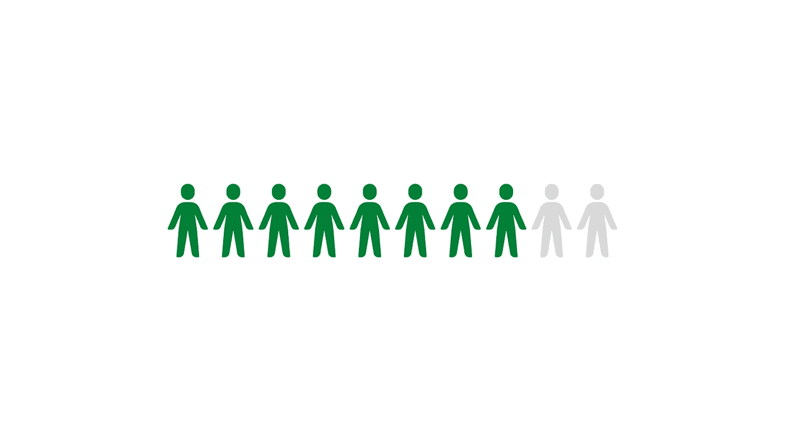
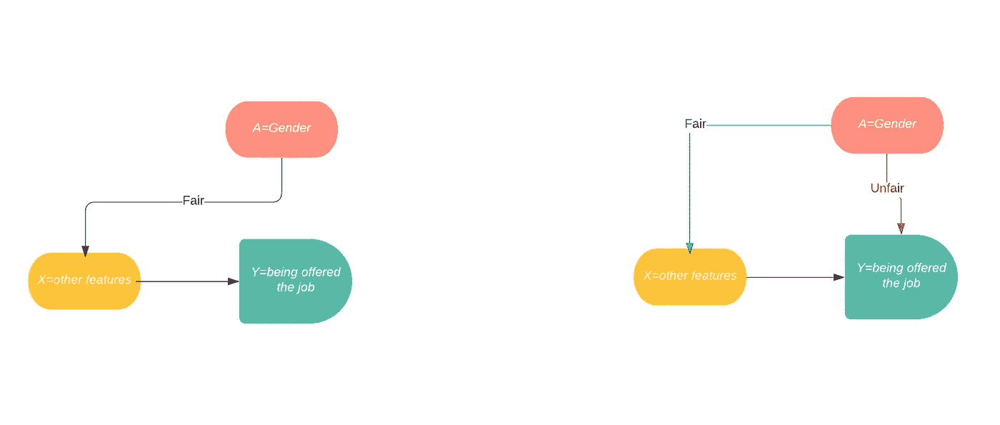

# 机器学习中真正“公平”的是什么？

> 原文：<https://towardsdatascience.com/what-is-really-fair-in-machine-learning-1fcdb6f35313?source=collection_archive---------25----------------------->

## 寻找衡量和想象公平的方法

[来源](https://unsplash.com/photos/FO7bKvgETgQ)

# 机器学习中的平等

答随着机器学习领域的扩大，人工智能的力量被用于做出关键决策，我们开始怀疑机器学习算法是否真的“公平”机器学习算法正在影响存在歧视和偏见的决策；我们的目标是衡量这种决策的结果，并确保我们的预测是平等的。尽管机器学习模型可能有助于人类决策，同时节省时间，但 ML 算法产生的结果也可能显示出有利于特定群体的偏差。随着衡量和维护公平的需求变得越来越重要，机器学习中的平等是研究人员不断探索的新领域。

没有数据，机器学习算法就无法运行。数据是机器学习中决策的关键；因此，训练数据中出现了许多偏差。数据中的偏差主要是由*人类收集方法*和*对少数群体的错误信息或极少信息*造成的。虽然有些人可能认为改变数据收集方法会降低一个群体对另一个群体的偏好，但事实是，在大多数情况下，无法确保数据收集过程中的平等。相反，我们需要让模型产生不受种族或性别等潜在偏见因素影响的输出。仅仅知道数据可能不公平是远远不够的，**我们需要能够通过我们预测的这些敏感属性来衡量和表示关系。**这些关系可以通过工具和指标计算甚至可视化，从而更好地帮助我们理解模型和数据中的不平等。

作者使用 Canva 创建的图像

# 定义问题

如前所述，对某些群体的不公平是由“**敏感属性**造成的，这些属性可能会将一个类别与另一个类别区分开来，如种族或性别。在一个完美的场景中，一个模型将基于对任何群体都一视同仁地提供的特征来预测一些目标。最简单的解决方案是删除这些“敏感属性”。然而，简单地取消这些功能并没有多大作用。由于大多数敏感属性在人与人之间是非常*独特的*，该模型仍然能够根据提供的其他信息推断出被移除的特征。预测或数据必须满足某些测量或统计特性，才能被认为是“公平的”。

想象一下这样一种情况，很多人都在申请一份有着不同经历的工作。我们的目标是根据一个人的特征来预测他是否会被录用。这里，*将代表敏感或受保护的特征， ***X*** 将是告诉我们关于申请人的任何其他信息， ***Y*** 是基本事实，***ŷ***是我们的预测。*

*我们可以通过估计给定特征 ***X*** 和 ***A.*** 的概率分布来表述这个问题*

*当地面真值为 1 关于特征 ***X*** 和被保护属性 ***A*** 时。*

# *评估方法和指标*

*测量模型预测最广泛使用的标准之一是**人口统计均等**。*

*人口均等*

*为了满足这个性质，*必须在统计上独立于*。简单来说， ***A*** 无论如何都无法与 ***Y*** 的预测联系起来，无论地面真值如何。***

**人口均等可以进一步扩展为**强人口均等**。在前面的人口统计均等的情况下，我们声明**二元**模型输出必须独立于敏感属性。二元结果由模型连续输出的阈值决定，如果预测值大于阈值，我们将其视为 1。可以对某个阈值实施人口统计均等，但不能确保它适用于所有情况。另一方面，强人口统计奇偶校验在*和模型的连续输出之间强加了统计独立性，进一步确保无偏性。在我们的场景中，没有任何其他特征，每个人都应该有相同的机会获得工作，不管他们的敏感属性如何。***

***类似于人口均等，还有机会均等。机会平等只会限制优势群体的平等。在我们的情况下，它被提供了工作。机会均等允许预测依赖于*而*只能通过地面真相*。请注意，该方法允许使用与结果直接相关的特征，但不允许使用*来表示结果。*****

***机会均等***

***对于优势结果中的*的所有值，真实阳性率应保持相同。它没有人口统计的奇偶校验严格，这确保了我们的预测成为某一类的概率在 A 的所有值中保持不变，而不管地面是否真实。简而言之，对于一群具有相同资历的人来说，无论他们的“敏感属性”如何，他们都有同等的****机会**被录用。这具有更广泛的应用，因为大多数人只关心“积极群体”中的不歧视。******

*****最后，还有预测奇偶校验。预测奇偶性，或者有时称为结果测试，更侧重于 ***Y*** 的地面真相。它要求给定我们的预测 y-hat，地面真理不能依赖于*与机会均等相对的是我们的预测**。********

*****给定 Y-hat，a 在统计上独立于 Y*****

*****这表明我们的模型的精度，或者说*为正并且它确实属于正类的概率，应该在 ***A* 的所有值上保持相同。********

# ****对 CBNs 的温和介绍****

****既然我们已经建立了如何通过我们的预测来衡量和评估公平性的意识，我们将手转向可视化。因果贝叶斯网络可以表示场景，并通过箭头和图表来说明公平性。回到我们的情况:****

*   ****对每个人来说，我们有 x 个特征，这些特征在某些方面告诉我们这个人的情况。****
*   ****我们还有 ***一个*** ，受保护的属性，在我们的例子中，它将是性别。****
*   ****我们的预测***ŷ***将产生一个介于 0 和 1 之间的概率，代表这个人是否会被提供一份工作。****

****这种情况可以使用一个带有节点和边的有向无环图来表示，称为因果贝叶斯网络(CBN)。在贝叶斯网络中，节点代表与问题相关的随机变量或特征，而它们之间的边显示它们的统计依赖性。****

****如下右图所示， ***A*** 被认为是直接影响 ***Y*** 如果路径直接指向 ***Y.*** 这被认为是一条随意的路径。另一方面(左图)，如果 **A** 不直接指向 ***Y*** ，则表明对于 ***A*** 要潜在地影响 ***Y*** ，必须经过 ***X*** 。当敏感属性的影响通过其他特征 ***X*** 表示时，被认为是公平的。****

********

****CBNs，图片由作者使用 LucidChart 提供****

****在这个特定的图中，从 ***A*** 到 ***X*** 的路径代表基于*A***p(X | A)***X 的概率。从 ***X*** 再到 ***Y*** 的路径，就是基于 X，***p(Y | X)***Y 为真的几率。在从 A 到 X 没有偶然路径的情况下，3 个变量的**联合分布**为*****

*******A*** 可能会影响 ***Y*** ，但不会直接影响。****

****当在 A 和 Y 之间建立任何偶然路径时，上面提到的度量不能被满足。CBNs 还有很多功能，甚至可以用它来量化不公平，但是，它的基本功能就像上面描述的一样简单。****

# ****结论****

****在这篇文章中，我们讨论了各种方法来衡量公平，甚至可视化与它相关的关系。数据中的不公平可能很难甚至不可能消除，因此我们需要能够发现这种不平等，并能够解释它对我们的模型预测的影响。****