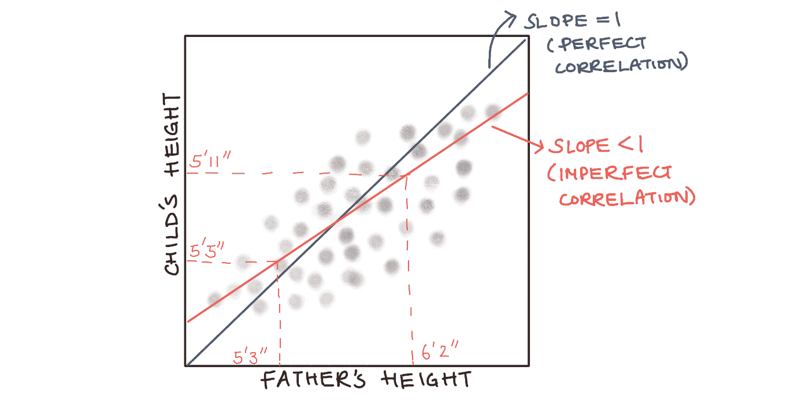
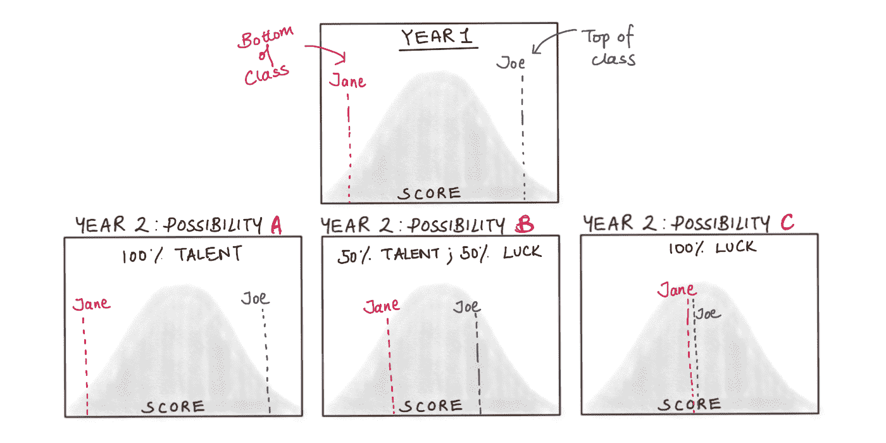

# 什么是回归均值？

> 原文：<https://towardsdatascience.com/what-is-regression-to-the-mean-f86f655d9c42?source=collection_archive---------3----------------------->

## [入门](https://towardsdatascience.com/tagged/getting-started)

## 一个容易理解但容易忘记的统计学概念

由[艾萨克·史密斯](https://unsplash.com/@isaacmsmith?utm_source=medium&utm_medium=referral)在 [Unsplash](https://unsplash.com?utm_source=medium&utm_medium=referral) 上拍摄的照片

以下是我过去读过、听过或说过的一些事情。你能找出这些陈述中的错误吗？

*   一位老师感叹道:*“当我表扬我的学生做得好的时候，下一次他们尝试的时候，他们往往做得不太好。当我惩罚学生的糟糕表现时，下一次他们会做得更好。因此，惩罚有效，奖励无效。”*
*   一个有抱负的运动员惊叹道:*“哇，昨天我的脚真的很痛，我把它泡在一碗泡了大蒜的热水里，现在感觉好多了。那种大蒜味的水里一定有某种治疗的功效！”*
*   一位影评人规定:*“获得奥斯卡奖，演艺圈最负盛名的奖项，会导致演员的职业生涯* [*走下坡路，而不是上升*](https://screenrant.com/oscar-curse-actors-whose-careers-went-downhill-after-winning-academy-awards/) *。”*

你的直觉可能是这些陈述有问题。毫无疑问，大蒜水治不了脚痛！这篇文章通过回归均值的概念解释了为什么这些陈述是有问题的，并建议了一些你可以采取的步骤来避免犯这种错误。

# 回归平均值

让我们来看看这些陈述中所谈到的事件模式。在所有这些陈述中，事件按如下方式展开:一个“极端”事件(无论是好的还是坏的方向)之后是一个更典型的事件。

作者插图

我们经常观察到事件以这种模式展开(极端、典型、典型、极端……)，因为有一种统计现象叫做*回归均值*或*回归平庸。*回归均值是指罕见或极端事件之后可能会出现更典型的事件。随着时间的推移，结果会“回归”到平均值。

这个术语是由弗朗西斯·高尔顿爵士创造的，他注意到高个子父母的孩子往往比他们矮，而矮个子父母的孩子往往比他们高。从图形上看，这意味着如果我们在 x 轴上绘制父母的身高，在 y 轴上绘制孩子的身高，并通过所有的数据点绘制一条线，我们会得到一条斜率小于 1 的线(或相当于小于 45 度的角)。

作者插图

这张图表显示，平均而言，比普通男性高的父亲会有一个比他略矮的儿子。平均来说，比普通人矮的父亲会有一个比他稍高的儿子。

这一概念不仅有助于研究父母和子女身高之间的关系。如果你反思自己的经历，你很可能会发现这种现象随处可见。例如，回归均值解释了为什么你第二次去你上次评价很高的餐馆时却没有达到你的期望。当然，不仅仅是你认为上次的奶油布丁更好吃！

解释这种现象的统计特征是，连续获得多个极端结果就像多次获得硬币正面——不寻常且难以重复。让餐厅体验最佳的各种因素——食物的质量、你去的时候餐厅有多忙、服务员的友好程度、你那天的心情——很难在第二次完全重复。

# 谬误

一般的统计规则是，只要两个变量之间的相关性不完美(即在上图中，斜率不是 1)，就会回归到均值。但是…那又怎样？

回归均值是一个关于世界的统计事实，既容易理解也容易忘记。因为事件的顺序是这样展开的(极端、典型、典型、极端……)，我们的大脑会自动在“极端”事件和“典型”事件之间画出某种关系。我们(错误地)推断极端事件导致了典型事件(例如，奥斯卡获奖导致了随后的平庸电影)，或者是这两个事件之间的某种东西导致了典型事件(例如，大蒜味的水让脚感觉“正常”)。

简而言之，当我们忘记回归均值的作用时，我们最终会将某些结果归因于特定的原因(人、之前的事件、干预)，而事实上这些结果最有可能是由于偶然。换句话说，即使我们去除了之前的“极端”结果,“正常”结果也会发生。

让我们回想一下本文中的前三个陈述。关于这些陈述的真实性，回归均值意味着什么？

**老师的错误:**

老师暗示奖励他/她的学生会让他们下次表现更差。但是从回归均值的框架来看，老师对她的奖惩制度过于推崇。

正如丹尼尔·卡内曼在[中笔记的*思维，快与慢*](https://en.wikipedia.org/wiki/Thinking,_Fast_and_Slow) ，*成功=天赋+运气*。这个等式的“运气”部分意味着一系列的成功(或失败)很难重复，即使一个人有很多天赋(或没有天赋)。

这个等式的“运气”部分意味着一系列的成功(或失败)很难重复，即使一个人有很多天赋(或没有天赋)。

考虑两个学生简和乔。在第一年，简做得很糟糕，但乔是杰出的。简排在最底层的 1%，而乔排在最顶层的 99%。如果他们的结果完全是因为天赋，就不会有回归——简在第二年应该一样差，乔在第二年应该一样好(下图中的可能性 A)。如果他们的结果是运气和天赋各占一半，我们会期望有一半的回归:Jane 应该上升到 25%左右，Joe 应该下降到 75%左右(可能性 B)。如果他们的结果完全是由运气造成的(例如抛硬币)，那么在第 2 年，我们预计 Jane 和 Joe 都将回归到 50%(可能性 C)。

作者插图

*成功=天赋+运气*等式意味着最有可能的情况是某种程度的倒退。第一年表现很差的 Jane 可能在第二年表现稍好(不管她是否受到惩罚)，而第一年表现非常好的 Joe 可能在第二年表现稍差(不管他是否受到奖励)。老师的奖惩制度可能没有她想的那么厉害。

**运动员的失误:**

运动员暗示大蒜水治愈了她疼痛的脚。假设有一天运动员的脚疼得很厉害。绝望中，她尝试了各种方法，包括睡前用大蒜浸泡的水。她醒来后发现她的脚感觉好多了。也许水确实有一些治疗作用。但是回归均值似乎是一个同样可信的故事。

因为身体疾病有一个自然的起伏，一个真正痛苦的一天之后可能会有一个不那么痛苦的一天。疼痛起伏的模式可能会让人们觉得大蒜水是一种有效的治疗方法。但更有可能的是，大蒜水什么也没做。由于生物的自然进程，疼痛无论如何都会消退。

这个例子显示了如何回归到平均值通常可以用来使无效的治疗看起来有效。一个庸医看到他们的病人处于最低谷时，可能会开出一种无效的药，打赌他们的病人第二天会好一些，并推断这种药起了作用。

**影评人的错误:**

影评人暗指奥斯卡诅咒，即一旦你赢得了奥斯卡，你的下一部电影和表演就不会那么好了(甚至可能是*坏*)。几个[对男女演员的采访](https://www.vogue.com/article/oscars-2016-oscar-curse-women-hollywood)表明，他们也相信这个诅咒，说赢得这样一个声望很高的奖项带来的压力和期望最终会伤害他们的职业生涯。

虽然压力和期望可能解释了他们下一部电影的成功(或失败)，但“诅咒”也可能在很大程度上归因于回归均值。演员有时真的有很好的表演——结合了好的剧本、好的导演、与其他演员的良好化学反应，以及对角色的合适。从统计学上来说，在他们的下一部电影中，所有这些因素以相同的剂量和相同的方式出现的几率很低。因此，期待他们的下一次表演比他们获得奥斯卡奖的表演更差似乎是很自然的。“诅咒”并不神秘。

# 外卖食品

*均值回归*描述了“极端”结果之后往往会出现更多“正常”结果的特征。这是一个既容易理解又容易忘记的统计学概念。当我们目睹“极端”事件，如不太可能的成功或失败时，我们会忘记这种事件是多么罕见。当这些事件之后是更多的“正常”事件时，我们试图解释为什么这些“正常”事件会发生——我们忘记了这些“正常”事件是……正常的，我们应该预料到它们会发生。这常常导致我们将因果力量归因于那些可能在导致“正常”事件中没有起到任何作用的人、事件和干预。

为了避免犯这种错误，当我们试图解释一些(积极的或消极的)事件或结果时，我们应该首先抓住自己。然后，我们应该问自己以下问题:

1.  从统计学上来说，这个结果有什么“不正常”吗？或者这是我应该预料到的吗？
2.  这一事件之前是否有一些“极端”的结果，使得“正常”的事件相比之下显得“奇怪”？
3.  即使我们删除了之前的事件,“正常”事件还会发生吗？“例如，即使运动员的脚没有泡在大蒜水里，她会感觉更好吗？

问题 1 迫使我们考虑正常事件发生的可能性。问题 2 鼓励我们思考彼此相关的结果，而不是孤立的观察。问题 3 促使我们进行反事实思维，想象一个我们认为导致“正常”事件的实体已经被移除的世界。通过问自己这三个问题，我们就不太可能把不必要的权力归于事件、人、系统和干预。