# 什么是拒绝抽样？

> 原文：<https://towardsdatascience.com/what-is-rejection-sampling-1f6aff92330d?source=collection_archive---------3----------------------->

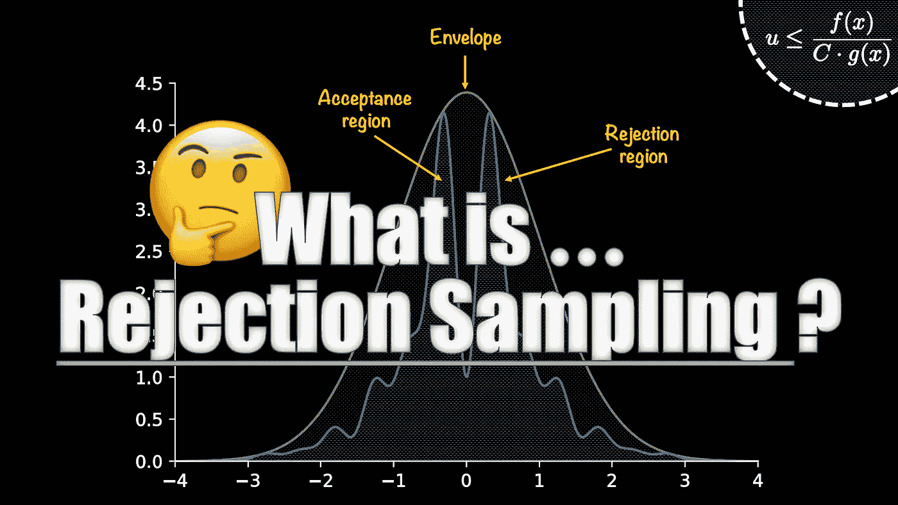

来源:作者

**拒绝抽样**是一种 [**蒙特卡洛**](https://en.wikipedia.org/wiki/Monte_Carlo_method) 算法，在代理分布的帮助下，从复杂的(“难以抽样的”)分布中抽取数据。

> *什么是* [*蒙特卡洛*](https://en.wikipedia.org/wiki/Monte_Carlo_method) *？*如果一种方法/算法使用随机数来解决一个问题，它被归类为蒙特卡罗方法。在拒绝采样的情况下，蒙特卡罗(又名随机性)有助于实现算法中的标准。

**注意——我也有一个 YouTube 视频解释这个算法(如果你更喜欢看&听)——**

YouTube——什么是拒绝抽样？

## **术语&符号**

*   *目标(分布)函数***f(x)**——“难抽样”分布。我们的利益分配！
*   *建议(分配)函数***【x】***—***代理分配我们可以从中取样。**

## **伟大的想法**

**关于抽样，几乎所有蒙特卡罗方法的中心思想是，如果你不能从你的目标分布函数中抽样，那么使用另一个分布函数(因此称为建议函数)。**

**然而，取样程序必须“**遵循目标分布**”。遵循“目标分布”意味着我们应该根据出现的可能性得到几个样本。简而言之，应该有更多来自高概率区域的样本。**

**这也意味着，当我们使用建议函数时，我们必须引入必要的修正，以确保我们的采样过程遵循目标分布函数！这个“校正”方面然后采取**验收标准**的形式。**

## **它是如何工作的？**

**我将借助一个例子来解释这个算法。考虑一个我们不能从中取样的目标分布函数。该图及其函数形式如下所示。**

**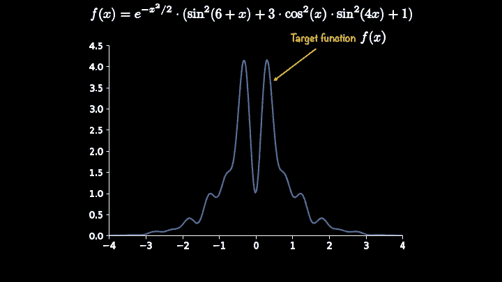**

**来源:作者**

**这是一个一维目标函数，我们的任务是获取介于-3 和 3 之间的样本。建议函数的一个选择是均匀分布函数。下面是它的函数形式，即 g(x)。**

**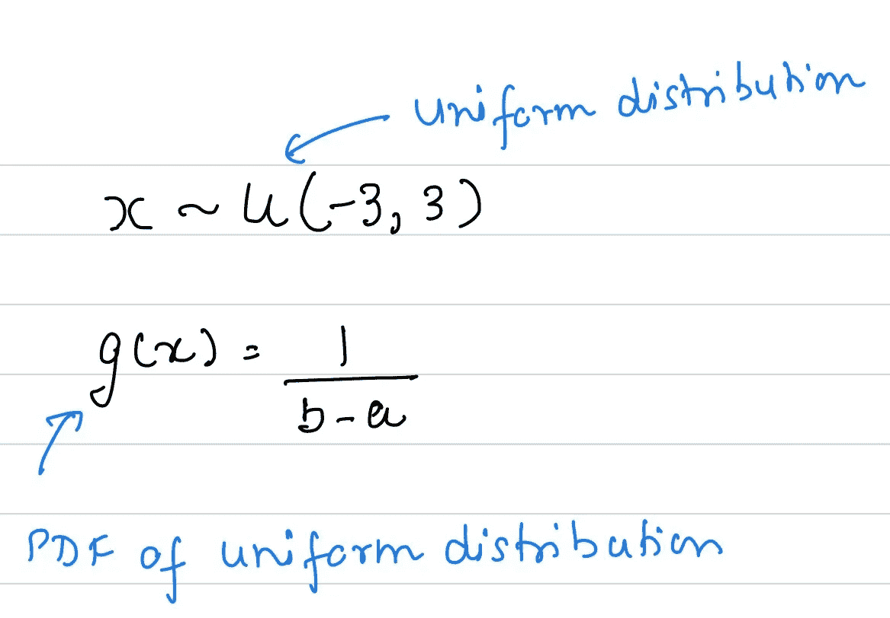**

**来源:作者**

**如果我把这个建议函数和我们的目标函数一起画出来，它看起来会像这样:**

**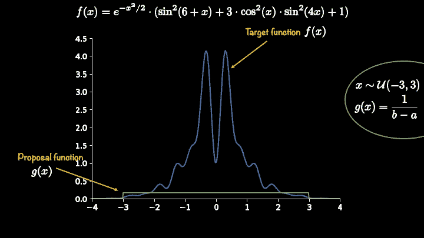**

**来源:作者**

**正如您所看到的，目前我们的建议功能并没有完全封装我们的目标功能。一旦我们制定了纠正措施(或验收标准)，这种封装的重要性就会变得清晰。**

**一个简单的补救方法是缩放建议函数，但是然后 ***缩放常数应该是多少？***……这是拒绝采样的一个挑战，但对于更简单的一维目标函数，可以通过最大化来实现。这个比例常数用符号 **C** 或 **M.** 表示。在本教程中，我将使用 **C.****

**缩放后，我们的绘图将如下所示。在本例中， **C** 的值为 25。**

**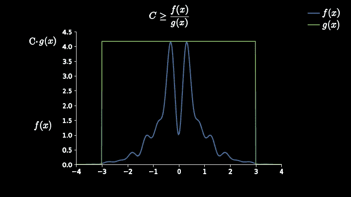**

**来源:作者**

**现在，我们准备使用我们的建议函数进行采样。然后，我们将评估样本的这两个函数。我在这里用一张图片来展示它，这样你就可以把它形象化。**

**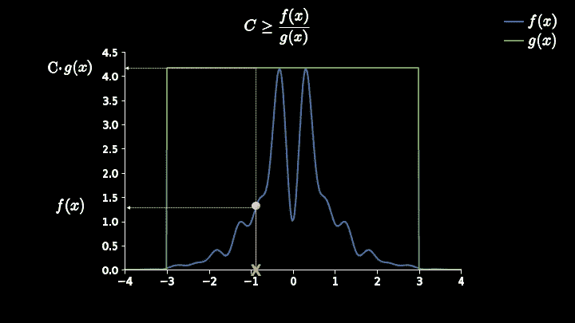**

**来源:作者**

**样品用橙色 x 标记。粉红色点表示其 f(x)值。您还可以看到它将在哪里为建议函数 g(x)求值。因此，由于我们使用了均匀分布作为建议函数，所有样本的可能性相等，它们都将评估为 **C g(x)** 。**

**现在我们需要一个标准来帮助确保我们最终遵循目标分布函数。上面的情节应该可以帮助我们对这个准则形成一个初步的直觉。我将把你们看到的粉色点和橙色 X 所在的垂直线称为评估线。**

**你应该朝这个方向思考——“如果我能在这条评估线上得到一个数字，如果这个数字低于粉红色点，那么我会接受样本 X，否则我会拒绝它”。**

> **但是这个所谓的数字会从哪里来，又怎么保证会落在这个所谓的评价线上呢？**

**这就是我们利用随机性(又名蒙特卡洛概念)的地方。但在此之前，让我给你看一下这个图的旋转版本，它呈现了一个更好的视觉效果(并有望带来更好的直觉)。**

**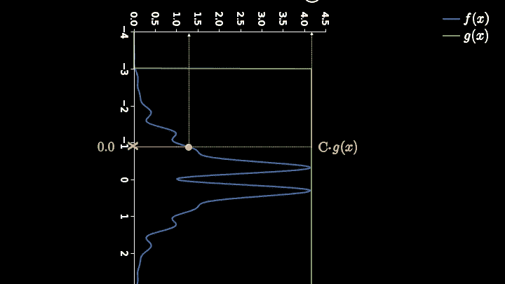**

**来源:作者**

**在这个旋转版本中，我们可以看到我们有一个范围为(0，Cg(x))的轴，我们接受 X 的标准是使用介于 0 和 Cg(x)之间的另一个数。如果这个数字在粉红色点的左边，我们接受我们的样品，否则我们拒绝它。**

**这里的主要思想是，粉色标记左右两边的线条部分不相等，并且(在某处)反映了样本出现的几率。但问题是谁会给我们这个落在这条评估线上的数字呢？**

**为了得到这个数，我们将使用另一个从 0 到 Cg(x)的均匀分布。尽管所有来自均匀分布的随机数的概率相等，但我们可以看到，随着评估线的尺寸变大，会有更多的数字落在评估线的右侧。这种随机性的使用使得这种算法被归类为蒙特卡罗算法。这是两个显示接受和拒绝事件的图。**

**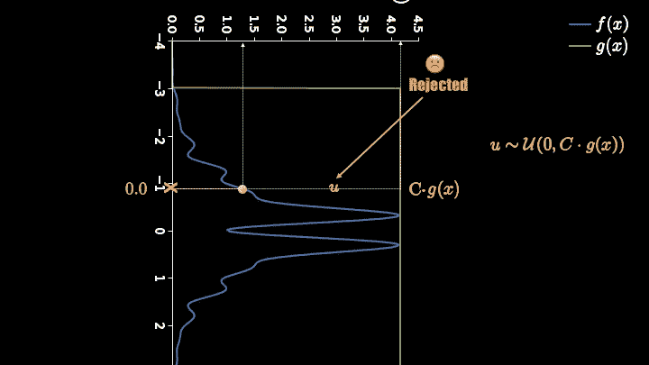****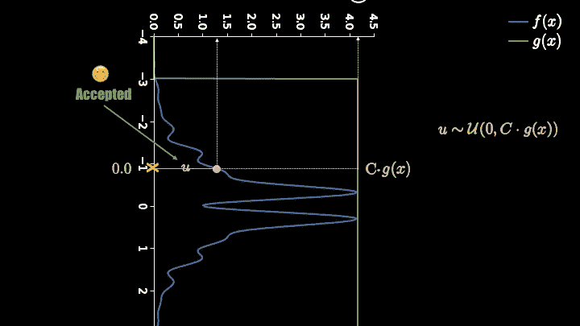**

**来源:作者**

**基于上述解释，您可以看到我们对 X 的接受标准可以用数学方法表示为:**

**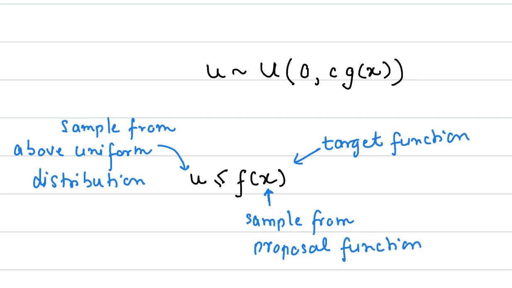**

**来源:作者**

**这就等于说，如果“u”低于粉色点，那么我们接受！…查看下图的原始形式:**

**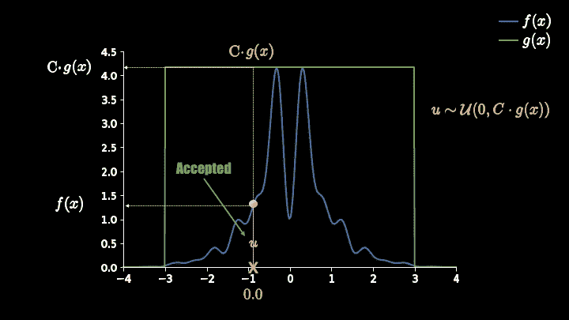**

**来源:作者**

**值得注意的是，当样品被剔除时，我们会将其丢弃并重复该过程，即**

*   **从建议功能中获取另一个样本**
*   **从均匀分布函数中获得一个介于 0 和 Cg(x)之间的随机数(u)**
*   **检查 u≤f(x)；如果是真的，接受它，否则拒绝它**
*   **重复**

**我还想让你们熟悉这个验收标准的另一种表述。在这个公式中，我们将从均匀分布中得到“u ”,该均匀分布给出了从 0 到 1 的样本，即标准均匀分布。如果您使用它，那么验收标准将如下所示:**

**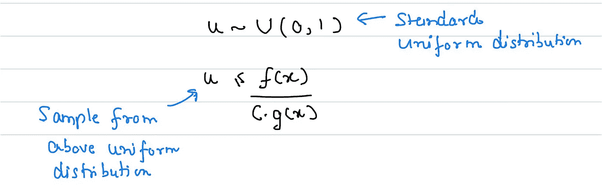**

**来源:作者**

**如果我们多次重复这个算法，我们最终会得到一个类似这样的图:**

**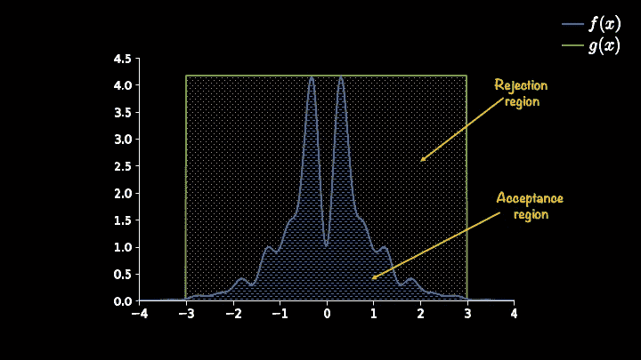**

**来源:作者**

**显而易见，许多样品将被拒绝😩**

**一种补救方法是通过选择另一个建议分布函数来减少拒绝区域。请记住，您将选择建议分布函数，您可以从中采样，也可以封装目标函数(当然是在缩放之后！).下面我将向你展示高斯分布作为建议函数的用法。**

**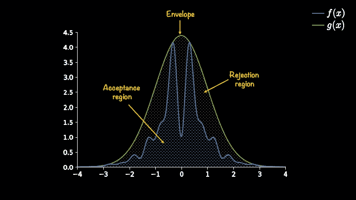**

**来源:作者**

**拒绝区域现已显著减少。在这种情况下，比例常数 C 为 11。**

## **一个简单的 python 实现**

**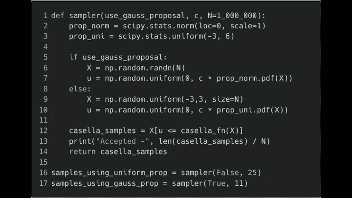**

**来源:作者**

**使用上述简单的 python 实现，我尝试了我们的两种建议分布函数(即均匀分布和高斯分布)，结果如下:**

**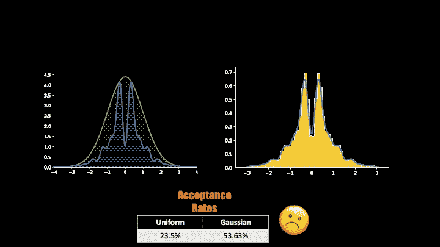**

**来源:作者**

**正如所料，选择高斯分布作为建议函数要好得多(53.63%的接受率)但仍然相当低效！**

## **剔除取样的局限性和挑战**

*   **选择合适的建议函数并找出其比例常数**
*   **要求目标函数的 PDF 已知**
*   **通常效率低下，尤其是在高维空间**

**如果你有问题，需要更多的澄清，请写在评论中，我会很乐意尝试回答他们，如果需要的话，更新文章。**