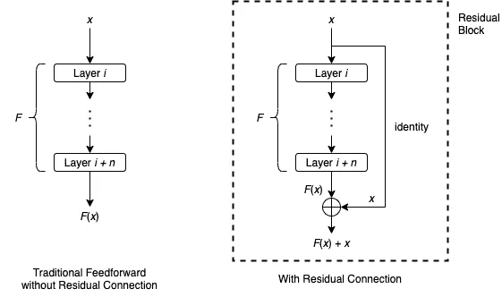
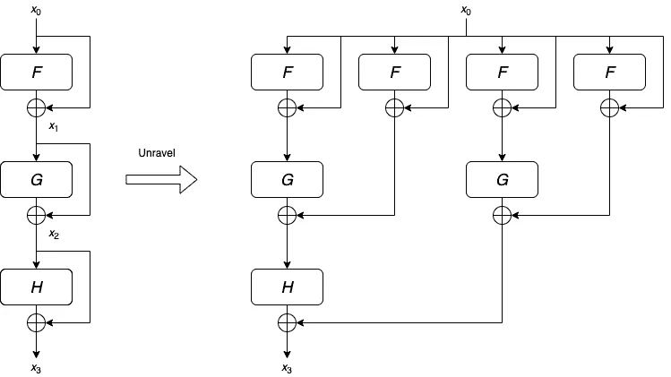

# 什么是剩余连接？

> 原文：<https://towardsdatascience.com/what-is-residual-connection-efb07cab0d55?source=collection_archive---------0----------------------->

## 一种训练深度神经网络的技术


照片由[丁](https://unsplash.com/@yiranding?utm_source=medium&utm_medium=referral)在 [Unsplash](https://unsplash.com?utm_source=medium&utm_medium=referral)

训练神经网络的一个困境是，我们通常希望更深的神经网络具有更好的准确性和性能。但是，网络越深，训练越难收敛。在本文中，我们将讨论剩余连接(也称为跳过连接)，这是一种简单但非常有效的技术，可以使训练深度神经网络更加容易。它被不同的模型广泛采用，从计算机视觉中首次引入的 ResNet，自然语言处理中的 Transformer，一直到强化学习中的 AlphaZero 和蛋白质结构预测的 AlphaFold。

## 公式

在传统的前馈神经网络中，数据按顺序流经每一层:一层的输出是下一层的输入。

剩余连接通过跳过一些层为数据到达神经网络的后面部分提供了另一条路径。考虑一个层序列，层 *i* 到层 *i + n* ，设 *F* 为这些层所代表的函数。用 *x* 表示层 *i* 的输入。在传统的前馈设定中， *x* 会简单的一个一个的经过这些层，层 *i + n* 的结果是 *F* ( *x* )。绕过这些层的剩余连接通常如下工作:



图一。残留块。由作者创作。

剩余连接首先对 *x* 应用身份映射，然后执行元素加法*F*(*x*)+*x*。在文献中，取一个输入 *x* 并产生输出*F*(*x*)+*x*的整个架构通常被称为剩余块或积木块。通常，残差块还会包括一个激活函数，例如应用于*F*(*x*)+*x*的 ReLU。

强调上图中看似多余的身份映射的主要原因是，如果需要，它可以作为更复杂函数的占位符。例如，只有当 *F* ( *x* )和 *x* 具有相同的维度时，元素相加 *F* ( *x* ) + *x* 才有意义。如果它们的维数不同，我们可以用线性变换(即乘以矩阵 *W* )代替恒等式映射，改为执行*F*(*x*)+*Wx*。

通常，在整个神经网络中使用多个残差块，这些残差块可以具有相同或不同的架构。

## 它如何帮助训练深度神经网络

对于前馈神经网络，由于诸如爆炸梯度和消失梯度的问题，训练深度网络通常是非常困难的。另一方面，经验表明，具有剩余连接的神经网络的训练过程更容易收敛，即使网络有几百层。像深度学习中的许多技术一样，我们仍然没有完全理解关于剩余连接的所有细节。然而，我们确实有一些有趣的理论，这些理论得到了强有力的实验结果的支持。

## 表现得像浅层神经网络的集合

对于前馈神经网络，正如我们上面提到的，输入将依次通过网络的每一层。更专业地说，输入通过一个长度等于层数的单一路径。另一方面，具有剩余连接的网络由许多不同长度的路径组成。



图二。剩余连接的未解视图。由作者创作。

作为例子，考虑具有 3 个剩余块的网络。我们可以尝试逐步扩展这个网络的公式:

```
*x*₃ = *H*(*x*₂) + *x*₂
   = *H*(*G*(*x*₁) + *x*₁) + *G*(*x*₁) + *x*₁
   = *H*(*G*(*F*(*x*₀) + *x*₀) + *F*(*x*₀) + *x*₀) + *G*(*F*(*x*₀) + *x*₀) + *F*(*x*₀) + *x*₀
```

有 2 = 8 项输入 *x* ₀对输出 *x* ₃.有贡献因此，我们也可以将此网络视为长度为 0、1、2 和 3 的 8 条路径的集合，如上图所示。

根据这种“未阐明的观点”，[6]表明，具有剩余连接的网络的行为类似于不强烈相互依赖的网络的集合体。而且梯度下降训练时的梯度大部分来自于短路径。换句话说，剩余连接不能解决爆炸或消失梯度问题。相反，它通过在“系综”中使用浅层网络来避免这些问题。

## 解决破碎渐变问题

虽然剩余连接不能解决爆炸或消失梯度问题，但它可以解决另一个与梯度相关的问题。

[1]表明，对于深度前馈神经网络，梯度类似于白噪声。这不利于训练，这个问题被称为破碎梯度问题。残差连接通过向梯度引入一些空间结构来解决这个问题，从而帮助训练过程。

## 实现示例

*   TensorFlow:一个 [ResNet 块示例](https://www.tensorflow.org/tutorials/customization/custom_layers#models_composing_layers)
*   PyTorch: [ResNet 源代码](https://github.com/pytorch/vision/blob/main/torchvision/models/resnet.py#L100)

## 进一步阅读

1.  残差连接的命名来源于以下:有些函数 *H* ( *x* )对于一个层的序列来说是非常难学的，但是学习相应的残差函数*H*(*x*)-*x*就容易多了。例如，恒等函数*H*(*x*)=*id*(*x*)很难拟合，但它的残差函数只是零函数，通过将所有层中的所有权重都设为 0，可以很容易地学习到零函数。
    有了残差连接，我们的层只需要学习*F*(*x*)=*H*(*x*)-*x*，残差块的最终输出就是
    *F*(*x*)+*x = H*(*x*)-*x 关于这个动机的更多细节，我们可以参考 ResNet 的原始论文[3]。*
2.  [5]示出了残差块能够执行迭代特征细化，这意味着每个块略微改善了前一层的表示。这部分解释了为什么具有残差块的非常深的神经网络具有更好的准确性:残差块越多，表示越精细。
3.  [2]表明 ResNet 模型架构，通过改进的训练和扩展策略，能够匹配最近的最新性能。这展示了剩余连接的有用性和相关性。
4.  剩余连接的关键特征是它提供了从早期层到后期层的短路径。[4]通过将所有层直接相互连接，进一步发展了这一思想:每一层从所有前面的层获得输入，并将其输出传递给所有后面的层。这表明在设计神经网络体系结构方面有很大的创造性空间。

## 参考

1.  D.Balduzzi，M. Frean，L. Leary，J.P. Lewis，k . w-d . Ma 和 B. McWilliams。破碎的渐变问题:如果结果是答案，那么问题是什么？ (2017)，ICML 2017。
2.  I .贝洛、w .费杜斯、x .杜、E.D .库布克、a .斯里尼瓦斯、t-y .林、j .施伦斯和 b .佐夫。[重温 ResNets:改进的培训和扩展策略](https://arxiv.org/abs/2103.07579) (2021)，NIPS 2021。
3.  K.何，张，任，孙军。[用于图像识别的深度残差学习](https://arxiv.org/abs/1512.03385) (2016)，CVPR 2016。
4.  G.黄，刘，范德马腾，温伯格。[密集连接的卷积网络](https://arxiv.org/abs/1608.06993) (2017)，CVPR 2017。
5.  南亚斯特日布斯基、达皮特、巴拉斯、维尔马、切和本吉奥。[剩余连接鼓励迭代推理](https://arxiv.org/abs/1710.04773) (2018)，ICLR 2018。
6.  A.韦特、m .威尔伯和 s .贝隆吉。[残差网络的行为类似于相对较浅网络的集合](https://arxiv.org/abs/1605.06431) (2016)，NIPS 2016。