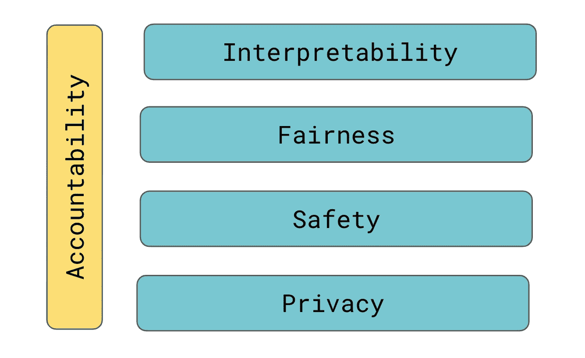
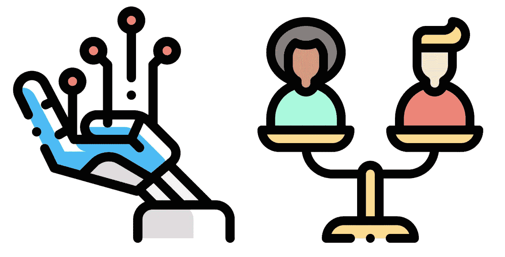
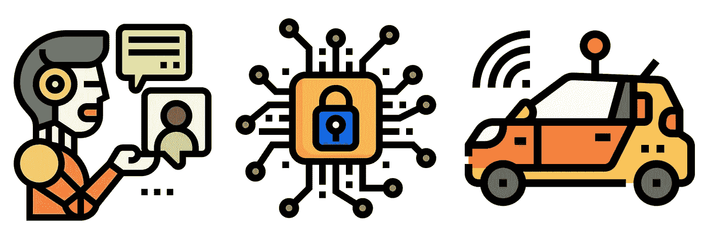
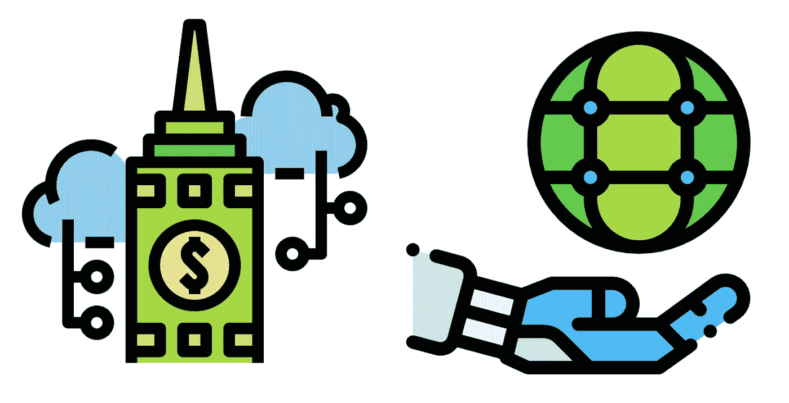

# 什么是负责任的 AI？

> 原文：<https://towardsdatascience.com/what-is-responsible-ai-548743369729?source=collection_archive---------8----------------------->

## 能力越大，责任越大

对一些人来说，人工智能这个词可以激发进步和生产力的想法。对其他人来说，前景不太乐观。许多担忧，如不公平的决策、工人被取代、缺乏隐私和安全，都是有根据的。更糟糕的是，这些问题很多都是 AI 特有的。这意味着现有的指导方针和法律不适合解决这些问题。这就是负责任的人工智能发挥作用的地方。它旨在解决这些问题，并为人工智能系统建立问责制。

来源: [flaticon](https://www.flaticon.com/free-icon/ai_653829)

# 为什么我们需要负责任的人工智能

当我们谈论人工智能时，我们通常指的是在系统内用于自动化某事的机器学习模型。例如，自动驾驶汽车可以从传感器中获取图像。机器学习模型可以使用这些图像来进行预测(例如，我们面前的物体是一棵树)。汽车使用这些预测来做出决策(例如，左转以避开树)。我们把这整个系统称为人工智能。

这只是一个例子。人工智能可以用于从保险承保到检测癌症的任何事情。决定性的特征是系统做出的决策很少有人参与。这可能会导致许多潜在的问题，公司需要定义一种使用人工智能的明确方法。负责任的人工智能是一个治理框架，旨在做到这一点。

责任 AI 的主要目标(来源:作者)

该框架可以包括关于可以收集和使用哪些数据、应该如何评估模型以及如何最好地部署和监控模型的细节。该框架还可以定义谁对人工智能的任何负面结果负责。不同的公司有不同的框架。一些将确定具体的方法，其他的将有更多的解释。他们都寻求实现同样的目标。那就是创造可解释的、公平的、安全的、尊重用户隐私的人工智能系统。

# 责任人工智能的目标

首先提到的领域是[可解释性](/interpretability-in-machine-learning-ab0cf2e66e1)。当我们解释一个模型时，我们得到了它如何做出预测的解释。人工智能系统可能会拒绝你的抵押贷款申请，或者诊断你患有癌症。即使这些决定是正确的，用户也可能会要求解释。有些模型比其他模型更容易解释，因此更容易得到解释。负责任的人工智能可以定义我们如何构建可解释的模型，或者何时可以使用不太可解释的模型。

与可解释性相关的是模型[公平性](/what-is-algorithm-fairness-3182e161cf9f)。人工智能系统有可能做出歧视某些人群的决定。这种偏差来自用于训练模型的数据中的偏差。一般来说，一个模型的可解释性越强，就越容易确保公平和纠正任何偏见。我们仍然需要一个负责任的人工智能框架来定义我们如何评估公平性，以及当发现一个模型做出不公平的预测时该怎么办。这在使用不易解释的模型时尤其重要。

安全和安保是另一个问题。这些对于软件开发来说并不陌生，可以通过加密和软件测试等技术来解决。不同的是，与一般的计算机系统不同，AI 系统不是确定性的。当面对新的情况时，他们会做出意想不到的决定。这些系统甚至可以被操纵做出错误的决定。当我们与机器人打交道时，这尤其令人担忧。如果他们犯了错误，像自动驾驶汽车这样的事情可能会造成伤害或死亡。

最后一个方面是隐私和数据治理。所用数据的质量很重要。如果人工智能使用的数据有错误，那么系统可能会做出错误的决定。一般来说，AI 也不应该被允许使用敏感数据(例如，病史、工会会员)。在欧洲，这些问题大多由 T2 的 GDPR 解决。在欧洲以外，它们将需要由公司自己负责的人工智能框架来解决。

归根结底，这一切都归结为信任。如果用户不信任 AI，他们就不会使用你的服务。我们不会信任使用我们不愿意分享的信息的系统，或者我们认为它会做出有偏见的决定。如果我们认为它会对我们造成身体伤害，我们当然不会信任它。对决策的解释和对这些决策的问责对建立这种信任大有帮助。这种对信任的需求是推动使用人工智能的公司进行自我监管的原因。

# 负责任人工智能的未来

目前，当涉及到人工智能时，公司被期待自我监管。这意味着他们必须创建和实现自己负责任的人工智能准则。像谷歌、微软和 IBM 这样的公司都有自己的指导方针。这方面的一个问题是，负责任的人工智能的原则在各个行业的应用可能不一致。较小的公司可能甚至没有资源来创建自己的公司。

一个潜在的解决方案是所有公司都采用相同的指导方针。例如，欧盟委员会最近发布了可信人工智能的道德准则。这详细说明了人工智能被认为是可信的 7 个关键要求。使用这些准则将有助于公司确保他们的人工智能系统符合相同的标准。真正的问题是——我们能相信公司会自我监管吗？

*2020 年人工智能和机器学习状态*报告包括了来自 374 家从事数据/人工智能工作的组织的回复。75%的组织表示，人工智能是其业务的重要组成部分。然而，只有 25%的人认为公平的人工智能很重要。这表明答案是否定的；不，我们不能相信他们。为了使共同准则有效，它们也必须得到执行。换句话说，指导方针必须成为法律/法规，公司必须面对不遵守它们的惩罚。

> “毫无疑问，人工智能需要监管。问题是如何最好地实现这一点，”—桑德尔·皮帅(谷歌首席执行官)

这似乎是我们前进的方向。在欧洲，最近已经提出了新的法规。它们基于上述道德准则，并将影响许多行业。在这一点上，美国没有这样的法规。尽管如此，谷歌、脸书、微软和苹果等科技公司的高管都呼吁围绕数据和人工智能进行更多监管。所以看起来这只是时间问题。

我们提到了算法公平性。这是负责任人工智能的重要组成部分，很可能成为许多人工智能监管的焦点。这本身就是一个非常有趣的话题，我们将在下面的文章中进行更深入的探讨。

 [## 什么是算法公平？

### 对旨在理解和防止机器学习模型中的偏差的领域的介绍

towardsdatascience.com](/what-is-algorithm-fairness-3182e161cf9f) 

## 图像来源

所有图片均为本人或从 www.flaticon.com[获得。在后者的情况下，我拥有他们的](http://www.flaticon.com/)[高级计划](https://support.flaticon.com/hc/en-us/articles/202798201-What-are-Flaticon-Premium-licenses-)中定义的“完全许可”。

## **负责任的人工智能框架示例**

[谷歌](https://ai.google/responsibilities/responsible-ai-practices/) | [微软](https://www.microsoft.com/en-us/ai/responsible-ai?activetab=pivot1:primaryr6) | [IBM](https://www.ibm.com/artificial-intelligence/ethics) | [欧盟委员会](https://digital-strategy.ec.europa.eu/en/library/ethics-guidelines-trustworthy-ai)

## 其他参考文献

D.佩萨奇和 e .施慕利，*算法公平性* (2020)，[https://arxiv.org/abs/2001.09784](https://arxiv.org/abs/2001.09784)

A.吉利斯，*责任 AI* (2021)，[https://search enterprise AI . techtarget . com/definition/responsible-AI](https://searchenterpriseai.techtarget.com/definition/responsible-AI)

埃森哲，*负责任的人工智能:在你的人工智能解决方案中建立信任的框架* (2018)，[https://www . Accenture . com/_ ACN media/PDF-92/Accenture-AFS-Responsible-AI . PDF](https://www.accenture.com/_acnmedia/PDF-92/Accenture-AFS-Responsible-AI.pdf)

阿彭，*《2020 年人工智能和机器学习状况报告》* (2020 年)，[https://appen . com/whites/The-State-of-AI-and-Machine-Learning-Report/](https://appen.com/whitepapers/the-state-of-ai-and-machine-learning-report/)

K.瓦尔希， *AI 法律来了* (2020)，[https://www . Forbes . com/sites/cognitive world/2020/02/20/AI-Laws-Are-Coming/？sh=5b526ef7a2b4](https://www.forbes.com/sites/cognitiveworld/2020/02/20/ai-laws-are-coming/?sh=5b526ef7a2b4)

南 Schechner & V. Pop，*谷歌推如何监管人工智能的‘明智’想法* (2020)，[https://www . wsj . com/articles/Google-pusses-Sensible-Ideas-for-How-Regulate-AI-11579521003？mod=article_inline](https://www.wsj.com/articles/google-pushes-sensible-ideas-for-how-to-regulate-ai-11579521003?mod=article_inline)

A.Satariano，*欧洲提出人工智能严格规则* (2021)，[https://www . nytimes . com/2021/04/16/business/Artificial-Intelligence-regulation . html？sm typ = cur&smid = tw-nytimes](https://www.nytimes.com/2021/04/16/business/artificial-intelligence-regulation.html?smtyp=cur&smid=tw-nytimes)