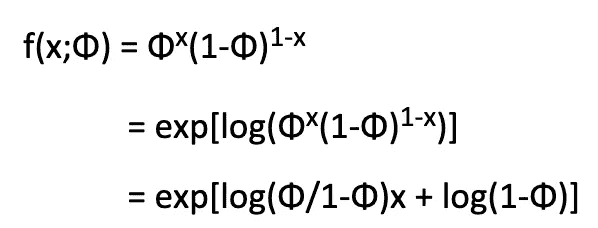
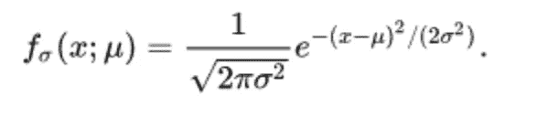
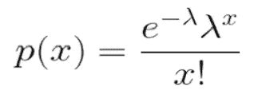
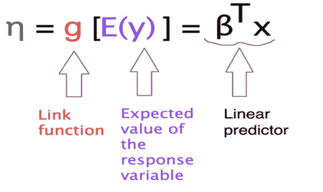
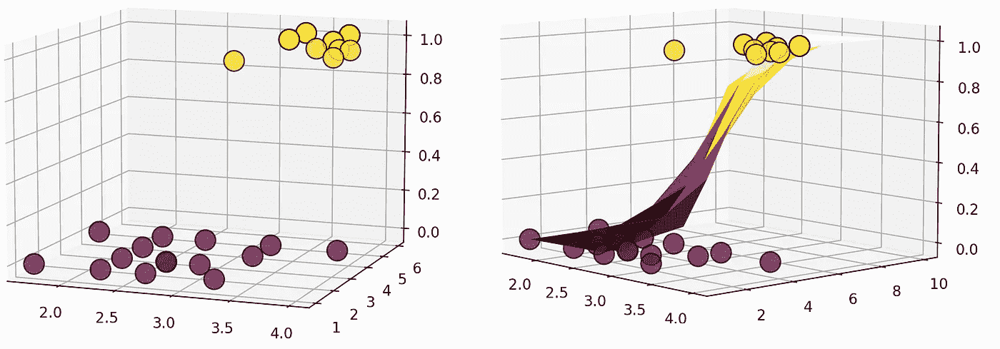
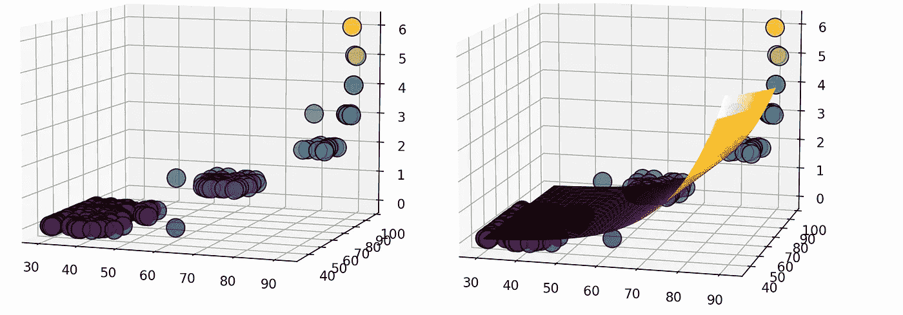

# 广义线性模型有什么好概括的？

> 原文：<https://towardsdatascience.com/what-is-so-general-about-generalized-linear-model-15dde9be2640?source=collection_archive---------21----------------------->

## 线性和非线性数据回归模型的一般形式

照片由来自[佩克斯](https://www.pexels.com/photo/white-castle-on-brown-mountain-9297955/?utm_content=attributionCopyText&utm_medium=referral&utm_source=pexels)的[艾萨克·加西亚](https://www.pexels.com/@basiciggy?utm_content=attributionCopyText&utm_medium=referral&utm_source=pexels)拍摄

我们在许多用例中使用线性回归来模拟标量响应变量和一个或多个解释变量之间的线性关系。线性回归做出一些关键假设，如响应变量的正态性和恒定方差。那么，如果响应变量不遵循“通常的”假设，如正态性和恒定方差，会发生什么？广义线性模型(GLM)是解决这一问题的常用数据转换方法之一。但问题是 GLM 由许多术语、符号和组件组成。所以，有时候理解这个概念有点混乱。不过不用担心，我是来帮你把所有概念都理解清楚的。

GLM 的三个基本统计程序是:

1.  回归
2.  方差分析，又名 ANOVA
3.  协方差分析，也称为 ANCOVA

在本文中，我将主要关注 GLM 的回归部分，并讨论指数族以及当响应变量遵循属于指数族的任何一种分布时如何转换响应变量。

# **指数家族**

给定单个参数θ，我们将指数族定义为一组概率分布，其概率密度函数(或离散分布的概率质量函数)可表示为

P(x| θ) = B(x) exp[η(θ) T(x) — A(θ)]

a 和η是将θ映射到ℝ.的函数

通过将η(θ)作为参数，我们可以用标准形式表示上述方程。

P(x| η ) = B(x) exp[η T(x) — A(η)]

在哪里，

η:自然参数

T(x):充分统计量

B(x):基本度量

A(η):日志分区

现在，我们来看看 [**伯努利分布**](/bernoulli-and-binomial-distributions-explained-98d86ac7820) 如何属于指数族。让我们考虑一个参数为φ(φ是事件的概率)的伯努利分布。所以 x 的 p.m.f 的形式是

作者图片

所以，与我们能得到的标准形式相比，

B(x)=1

η= log(φ/1-φ)= >φ= 1/1+指数(- η)

T(x)=x

a(η)=-log(1-φ)

或者，A(η)=-log(1-1/1+exp(-η))[替换φ的值]

或者，A(η)= log(1+exp(η))

同样，对于均值未知、方差已知的正态分布**，p.d.f 如下**

****

**作者图片**

**所以，η = / σ => = η σ**

**A(η)= / 2σ = η /2**

**类似地，对于参数为λ的 [**泊松分布**](https://en.wikipedia.org/wiki/Poisson_distribution) ，p.m.f 为**

****

**作者图片**

**因此，η = log λ => λ =exp(η)**

**并且 A(η) = λ = exp(η)**

**属于指数族的一些其他概率分布是二项式分布、伽玛分布、指数分布、贝塔分布、卡方分布等。**

***指数族有一些性质:***

1.  **指数族的极大似然估计 w.r.t η是凹的。**
2.  **e[x；∂A(η)/ ∂η**
3.  **var[x；∂ A(η)/∂η**

**现在让我们看看一些常用的回归方法是如何利用指数族的概念从 GLM 族设计出来的。**

# ****广义线性模型****

**GLM 的基本思想是为响应变量的期望值拟合一个“适当的”函数的线性模型。**

****

**作者图片—图 1**

**因此，GLM 主要由三部分组成:**

1.  **响应变量的概率分布**
2.  **线性预报值**
3.  **链接功能**

**响应变量遵循某个参数的概率分布。**

**线性预测因子是模型参数β和解释变量 x 的线性组合。**

**链接函数 g 是将线性预测值和与响应变量 y 的概率分布参数链接起来的函数。**

**让我们看看如何使用 GLM 的概念来拟合一些常用的回归模型。**

****线性回归****

**响应变量 Y 遵循方差不变的正态分布。由于正态分布属于指数族，对于方差已知的正态分布 A(η) = η /2。所以，响应变量的期望值**

**E(Y) = ∂A(η)/ ∂η = η**

**已知σ =1，**

**我们可以写，Identity( ) = Identity(η) = η = βᵗ x**

**所以，响应变量 Y 服从带参数的正态分布，连接函数 g 应该是 [**恒等函数**](https://en.wikipedia.org/wiki/Identity_function) 。**

****逻辑回归****

**在这种情况下，响应变量只有两种可能的结果(二分法)，通常称为“成功”和“失败”。因此，响应变量不遵循方差不变的正态分布。在这种情况下，我们可以说响应变量 Y 是一个伯努利随机变量。**

**所以，响应变量的期望值**

**E(Y) = ∂A(η)/ ∂η = 1/[1+exp(- η)]**

**我们可以写，logit(φ)= logit(1/[1+exp(-η)])=η= βᵗx**

**所以，响应变量 Y 遵循参数φ= 1/[1+exp(-η)]的伯努利分布，链接函数 g 应该是[**Logit function**](https://en.wikipedia.org/wiki/Logit)。**

****泊松回归****

**现在让我们考虑另一种情况，其中响应变量不是正态分布的，它表示某个事件的计数。因此，响应变量可以遵循泊松分布或负二项分布。让我们看看如果响应变量 Y 遵循泊松分布会发生什么。**

**所以，响应变量的期望值**

**E(Y) = ∂A(η)/ ∂η =经验(η)**

**我们可以很容易地书写，**

**log(λ) = log[exp(η)] = η = βᵗx**

**所以，响应变量 Y 服从参数为λ =exp(η)的泊松分布，连接函数 g 应为 [**对数函数**](https://en.wikipedia.org/wiki/Logarithm) 。**

***好吧！好吧！理论到此为止。让我们来关注一下 GLM 在 Python 中的实现。***

**图片来源: [giphy](https://media.giphy.com/media/CkqpoOOS0BCQU/giphy.gif)**

**让我们先看看如何在 python 中使用 GLM 的概念来拟合线性回归模型。**

**我使用 python 中的 [statsmodels](https://www.statsmodels.org/stable/glm.html) 库拟合的所有回归模型。**

**我用于线性回归的数据散点图有 2 个解释变量(汽车的马力和加速度)和 1 个响应变量(汽车的 mpg)(出现在图 2 的左侧面板中)。可以看出，解释变量和响应变量之间存在线性关系，响应变量的方差几乎是常数。因此，为该数据集拟合线性模型是一个下降的想法。**

****

**作者图片-图 2:线性回归图**

**拟合线性回归的代码非常简单。我将解释变量定义为 x，响应变量定义为 y，并在解释变量中添加了常数项。**

**不需要传递任何链接函数，因为高斯族的默认链接是标识函数。**

**现在，让我们关注一些非线性数据，因为在现实生活中，拟合线性模型并不总是可行的。**

**例如，我们需要根据候选人的 gpa 和多年工作经验来预测他/她是否会被某门课程录取。现在，这里的响应变量有两个结果“是”或“否”。**

**从图 3 左侧面板中的数据可以看出，x 和 y 变量之间不存在任何线性关系。事实上，最关键的一点是线性回归是无界的。所以，我们需要的不是线性回归，而是可以输出 0 到 1 之间的任何值的东西。**

****

**作者图片—图 3:逻辑回归图**

**逻辑回归的代码也非常简单，除了概率分布和链接函数之外，几乎与线性回归相同。用于逻辑回归的分布是二项式/伯努利分布，使用的关联函数是 logit，这是二项式家族的默认值。**

**事实上，我们也可以使用 [probit](https://en.wikipedia.org/wiki/Probit) 函数作为链接函数。我们的主要座右铭是输出介于 0 和 1 之间。logit 和 probit 函数给出了几乎相似的推论。但是，由于可解释性，通常使用 logit 函数。**

**图 3 的右侧面板示出了直曲面被 S 形曲面代替，并且该值被限制在 0 和 1 之间。它还允许在 x 变量的低端和高端有不同的变化率，从而正确处理[异方差](/heteroscedasticity-in-regression-model-21d9f5a93e59)。**

**最后，让我们看看，如果我们需要使用学生的数学和科学分数来预测他们获得的奖励数量，我们可以做些什么。散点图看起来像图 4 左侧面板中的图。**

**我们无法对此数据进行线性回归拟合，因为响应变量的方差相对于解释变量而言不是常数。此外，响应变量的值是正整数，它是离散的，但用于线性回归的正态分布采用连续变量，它也可以是负的。**

****

**作者图片—图 4:泊松回归图**

**我们使用泊松分布进行泊松回归，以对数作为连接函数。**

**我们可以从图 4 的右侧面板看到，预测的表面是指数型的。**

**如需了解更多细节，如回归模型总结以及我如何在 python 中拟合 3d 图，请访问我的 [GitHub](https://github.com/kunduayan/Generalized_Linear_Model) 个人资料。**

# ****结论****

**总的来说，我们已经看到 GLM 可以用来拟合线性和非线性数据。事实上，我们可以使用其他几种非规范的链接函数来计算概率分布，从而以最有效的方式拟合数据。比如我们可以用 probit 函数进行逻辑回归；正态分布的对数函数。**

**因此，最终我们可以说广义线性模型是用任何类型的数据拟合回归模型的“通用”方法。**

*****就是这样的乡亲。感谢阅读，快乐学习！！*****