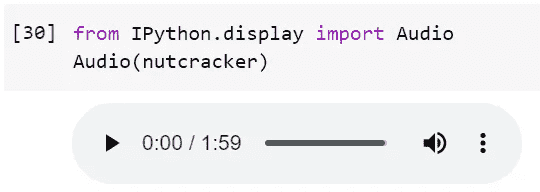
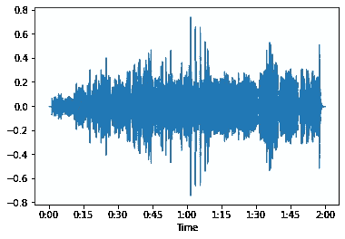
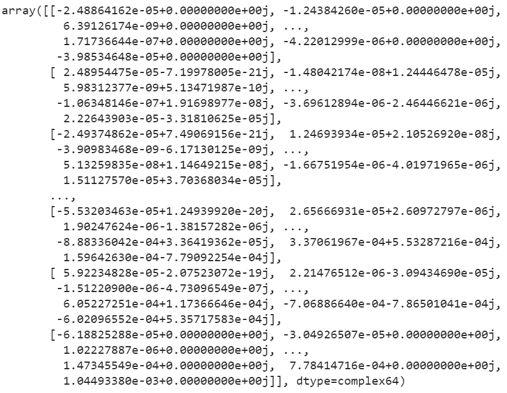
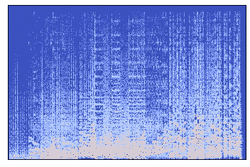

# 什么是声音？

> 原文：<https://towardsdatascience.com/what-is-sound-691988d780bb?source=collection_archive---------4----------------------->

## 数字声音和音频数据介绍。用一个 Python 例子来研究音频文件、声波和频谱图。

什么是声音？在 [Unsplash](https://unsplash.com/s/photos/music-audio-color?utm_source=unsplash&utm_medium=referral&utm_content=creditCopyText) 上 [FPVmat A](https://unsplash.com/@fpvmat?utm_source=unsplash&utm_medium=referral&utm_content=creditCopyText) 拍摄的照片

**声音的机器学习和数据分析**是一个不断增长的领域，具有数据科学用例的巨大潜力。在这篇文章中，你将学习什么是声音，以及如何在计算机上表现声音。

你还将学习什么是傅立叶变换，以及它是如何工作的。然后，您将看到如何使用傅立叶变换为机器学习或数据分析准备音频数据，并使用 Python 编写了一个完整的示例。

# 什么是音频数据？

您可能熟悉**表格数据**:在**行和**列中存储数据的标准形式。这是存储数据的传统方式，非常适合机器学习问题。

下一步的难度是**图像数据**。图像数据更难处理，因为它不能用作表格数据。然而，计算机能够通过给图像中的每个小方块(**像素**)赋值来显示图像。通过给每个像素一个红、蓝、绿的值，计算机可以显示图像。

现在为了在图像上进行**机器学习，我们复制这个逻辑，并且我们使用三维向量中的像素值(红色、蓝色和绿色)(维度是图像高度、图像宽度和三种颜色)。如果你想了解更多关于图像的机器学习，可以查阅以下关于[物体检测](/yolo-v5-object-detection-tutorial-2e607b9013ef)和[图像分割](/what-is-the-difference-between-object-detection-and-image-segmentation-ee746a935cc1)的资源。**

下一个难点是声音(或音频)数据。作为一个非常基本的描述，假设音频数据是一种存储声音的数值方式。

## 声音是气压

音频数据难以处理的原因是，与表格数据和图像数据不同，它不遵循非常清晰和有组织的结构。

声音，以其最原始的(非数字)形式，是人耳可以察觉的气压变化。

## 从模拟声音到数字音频:麦克风

声音的数字形式是音频。为了在计算机中存储声音，我们需要将它转换成数字形式:计算机可以存储的东西。

将声音转换成数字有两个步骤:

*   **麦克风将气压变化转化为电压**。您可能从未意识到这一点，但这实际上是麦克风的全部功能。
*   模数转换器接收电压(将其视为不同的电流强度)，然后**将这些电压转换成数字**:这些数字是波的数字值:与气压不同，这些数字可以存储在计算机中。

## 音频数据是振幅和频率

你现在对如何将声音转换成数字有了初步的了解，但是下一个真正要问的问题是:那些代表声音的数字是什么？

原来有两种重要的数字:振幅和频率。

*   声波的**振幅**显示其**音量**。
*   声波的**频率**代表其**音高**。

你现在明白了，一个声波有两个基本值:振幅和音高。它们一起可以发出从大声到安静，从低音到高音的音调。

# 现实生活中的声音是“复合”波

既然你已经理解了什么是声波，让我们进入一个更复杂、更现实的情况。实际上，在一个音频文件中经常同时有许多声音。比如在音乐中，你一般会同时听到多个音调。在自然录音中，你通常还会同时听到各种动物、风声等等。

同时只有一个频率的音频文件非常罕见。因此，如果我们想要将一个音频文件总结为数据，我们将需要描述不止一个波。

完整的**声音是波的混合，因此是不同振幅的频率的混合**。简单来说:*声音是不同音量的高低音调的混合*。

为了处理如此复杂的波，必须将它分解成每个频率每个时间的振幅。这通常是声谱图所能显示的。

# 频谱图显示了声音中的所有波

频谱图是一种图表，可以让你描绘一段时间内的声音。该图在 x 轴上显示时间，在 y 轴上显示频率。颜色表示特定频率在特定时间点的振幅。

## 频谱图是使用傅立叶变换从数字“复杂”声音创建的

傅立叶变换是一种先进的数学方法，它允许您将“复杂”的声音分解成声谱图，该声谱图显示每个频率在整个时间内的音量(振幅)。

我不想在这里讲太多细节，但我鼓励你们阅读一些傅立叶变换，例如这里的或这里的。

# 使用 librosa 在 Python 中表示声音

现在让我们通过用 Python 对一个真实的音乐文件进行一些操作来实现这一点。我们将使用 [librosa 包](https://librosa.org/doc/latest/index.html)，这是一个在 Python 中处理声音的很好的包。

要在 Python 中安装 librosa，只需在 Jupyter 笔记本中运行`!pip install librosa`即可。这也是一个很好的使用案例，可以试用一个 [Google Colab 笔记本](/importing-data-to-google-colab-the-clean-way-5ceef9e9e3c8)。

请注意，在处理声音数据时，您通常会使用`.WAV`文件，因为这是声音的未压缩格式。其他熟悉的声音格式，如`.FLAC`或`.MP3`压缩声音。这可能会对数字表示产生负面影响，尽管这并非不可能。

Librosa 附带了一个示例音乐文件。您可以按如下方式导入示例声音文件:

什么是声音？将音乐文件加载到 Python 中。

导入音乐后，您可以使用 Jupyter 笔记本功能来聆听声音。您可以使用以下代码来实现这一点:

什么是声音？在 Jupyter 笔记本中播放声音文件

您将在笔记本中看到以下条形音箱(与此图不同，您实际上可以听到音乐):

什么是声音？在 Jupyter 笔记本中播放 wav 文件

下一步，让我们将音乐显示为波，从而使声音“肉眼可见”。当然，如前所述，真实的声音非常复杂，它们看起来一点也不像简单的波。

你可以使用下面的代码来打印一个 wave:

什么是声音？显示了波形图。

你将获得以下情节:

什么是声音？印刷胡桃夹子的波。

下一步，让我们来看看声音数据最有用的可视化，也就是声谱图。通过对波形数据`y`进行傅里叶变换，可以获得谱图输入数据。

如前所述，傅立叶变换是相对高级的数学。幸运的是，我们可以使用 librosa 中的一个函数来完成繁重的工作，如下面的代码所示:

什么是声音？使用傅立叶变换生成频谱图数据。

您将获得如下所示的数组:

什么是声音？原始谱图数据(振幅)

在创建最终的声谱图之前，还有最后一步，那就是将声谱图数据转换成分贝。原因是声谱图功能不适用于当前(振幅)格式。

您可以按如下方式转换数据:

什么是声音？将振幅谱图数据转换成分贝谱图数据。

现在，我们终于可以用声谱图函数给我们展示声谱图了。这是按如下方式完成的:

什么是声音？打印声谱图。

你会得到下面的图表，这是胡桃夹子的光谱图。我们已经成功地导入了一个音乐文件，并将其转换成一种可视的数据格式。声谱图包含了胡桃夹子每个频率的音量的完整概览，因此它是音乐的完美视觉表现。

胡桃夹子的声谱图。

# 结论

在本文中，您已经学习了使用数字格式的**声音和音频** **的基本知识。您已经将**音频数据**从只能听到的 wav 格式转换成了作为声谱图**的**视觉表示。**

现在，您已经掌握了音频数据的导入和准备，您可以继续使用更高级的用例，如使用**机器学习进行音乐流派分类**或**声音检测**。

希望这篇文章对你有用。感谢您的阅读，请不要犹豫，继续关注更多的统计、数学和数据内容！