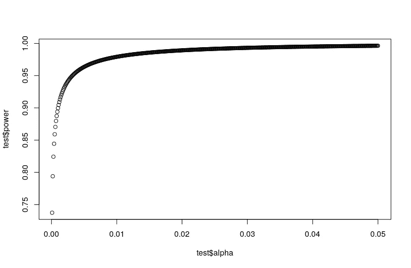
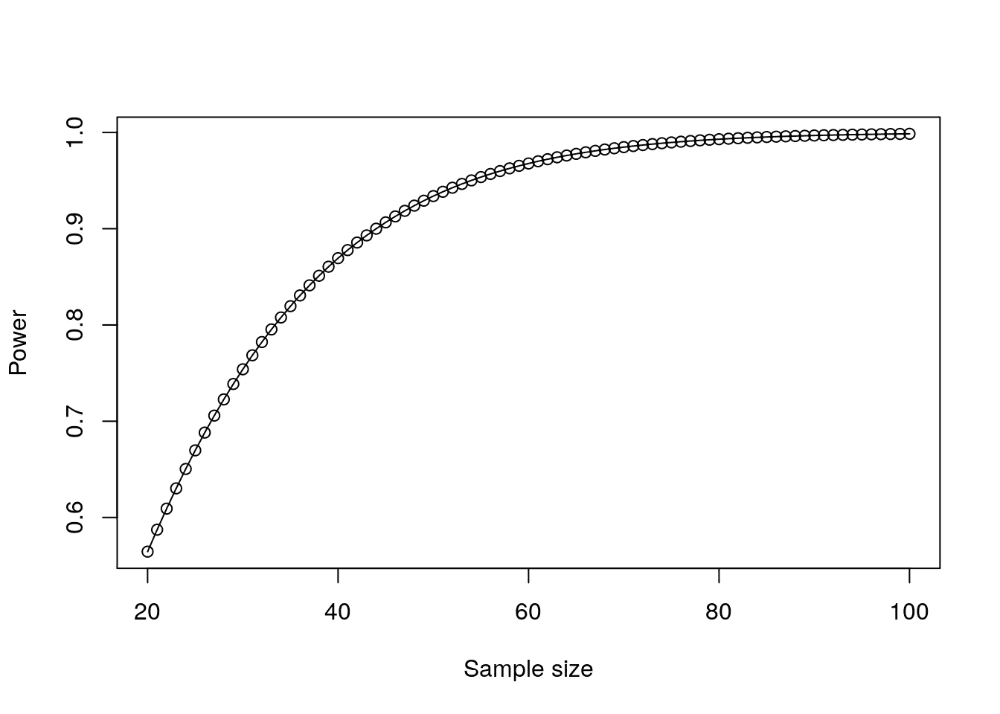

# 什么是统计能力？

> 原文：<https://towardsdatascience.com/what-is-statistical-power-8f934c9bbcca?source=collection_archive---------27----------------------->

## 有多少使用这个术语的人真正理解它的意思？

如果你的经历和我一样，你可能已经听过很多人在工作中谈论“统计能力”。我很确定，在大多数情况下，这些人是基于某种模糊的概念，即较大的 n 总是好的，来推动更大的样本量。

但这些人中有多少人能真正定义什么是统计能力？在这篇文章中，我想看看统计能力的概念和定义，并确定它作为一种度量方法在哪里有用。

## 假设检验

术语“统计功效”只有在涉及假设检验时才有意义。您可能还记得，假设检验涉及使用数据样本的统计特性来确定关于样本所来自的总体的陈述的确定性水平。我们举个例子。来自`peopleanalyticsdata` R 包的`salespeople`数据集包含一家技术公司销售人员样本的数据，包括他们以千美元为单位的年销售额以及他们最近的绩效评级，从 1 到 4 依次递增。让我们看看前几排。

```
library(peopleanalyticsdata)salespeople <- salespeople[complete.cases(salespeople), ]
head(salespeople)Output:
promoted sales customer_rate performance
1        0   594          3.94           2
2        0   446          4.06           3
3        1   674          3.83           4
4        0   525          3.62           2
5        1   657          4.40           3
6        1   918          4.54           2
```

现在让我们来看看这个陈述:*在总体人口中，表现最佳的销售人员的平均销售额与表现最差的销售人员的平均销售额不同*。我们首先假设这不是真的——也就是说，表现最好的人和表现最差的人的平均销售额是一样的——我们称之为*零假设。*然后，我们执行一个测试，以确定如果总体中的零假设确实为真，我们的样本看起来像它们的样子的最大概率——称为测试的 *p 值*。在这种情况下，我们进行韦尔奇的 t 检验，以比较两个样本的不等方差。

```
# sales of top performers
sales4 <- salespeople$sales[salespeople$performance == 4]# sales of bottom performers
sales1 <- salespeople$sales[salespeople$performance == 1]# p-value of null hypothesis that their means are the same
t.test(sales4, sales1)$p.valueOutput:
1.093244e-05
```

这表明，如果我们的零假设在总体中是正确的，那么我们的样本看起来不太可能是它们的样子。我们定义了一个可能性水平，在这个水平以下，我们同意拒绝零假设，这就是所谓的 *alpha* 。alpha 通常为 0.05，但有时可能会低得多。如果我们在这里将α取为 0.05，我们可以轻松地拒绝零假设，并得出另一个假设，即总体中低绩效者和高绩效者的平均销售额存在差异。

## 定义统计功效

我们可以看到，假设检验是关于确定性的水平，在这个水平上，我们可以放心地宣布总体中的差异，承认我们只能观察总体中的一个样本。对于未观察到的人群，没有什么是 100%确定的，因此可能会出现四种情况:

1.  零假设不会因为样本而被拒绝，事实上它对总体来说是正确的
2.  基于样本，零假设被拒绝，但事实上它在总体中是真实的(一个*I 型误差*)
3.  基于样本，零假设没有被拒绝，但事实上它在总体中是错误的(一个*类型 II 错误)*
4.  基于样本的零假设被拒绝，事实上它在总体中是错误的

统计功效被定义为数字 4 出现的概率。本能地，你可以想象这取决于你的样本的大小，总体中的实际(未观察到的)差异(适当的标准化)，以及你拒绝零假设(alpha)的确定性的标准。例如，如果实际人口差异较大，您可能会在较小的样本中看到它。如果α更小，您可能需要更大的总体差异或更高的 n 来满足您的确定性标准。

这个房间里的大象当然是我们永远不会知道我们人口的差异——我们只知道我们样本的差异。因此，我们通常通过使用样本中观察到的差异来满足自己的*观察到的*统计功效。对于我们这里的`salespeople`示例，因为它是 t-检验，所以我们使用 Cohen 的效应大小 *d* 作为我们的归一化观察差异*。*结合我们的样本量和 0.05 的 alpha，我们可以计算出假设检验的统计功效为 0.996。我们可以相当肯定地说，零假设将被准确地拒绝。

```
library(effectsize)
library(WebPower)# sample sizes
n4 <- length(sales4)
n1 <- length(sales1)# cohen's effect size d
d <- cohens_d(sales4, sales1)$Cohens_d# statistical power
wp.t(n4, n1, d = d, type = "two.sample.2n")Output:Unbalanced two-sample t-test

    n1 n2         d alpha    power
    55 60 0.8741483  0.05 0.996347
```

## 统计能力什么时候有用？

坦白说，并不经常。在你已经有了样本和数据，并且已经进行了假设检验的情况下，统计能力实际上只是一个衡量你如何清除阿尔法障碍的指标。你的阿尔法越不严格，权力就越大。看一看。

```
# statistical power
test <- WebPower::wp.t(n4, n1, d = d, type = "two.sample.2n", alpha = seq(0.05, 0.0001, by = -0.0001))# plot power against alpha
plot(test$alpha, test$power)
```



如果您还没有获得样本数据或进行任何假设检验，并且如果您正在计划一项可能涉及大量工作的实验或研究，那么统计能力作为一种衡量标准可能会有所帮助。因为样本量起着一定的作用，所以理论上你可以计算出一个最小样本量来达到某个 alpha 标准。

但实际上，我发现整个过程是高度推测性的，因为你需要知道你观察到的效应大小，当然你不知道，因为你还没有进行实验。因此，来自统计功效计算的大多数样本大小估计往往是以灵敏度范围的形式。

实验可能很难组织和获得资源，统计能力在确定所需规模时可能会有些用处。它还可以帮助说明 n 的收益何时递减。例如，如果我们使用中等效应大小和 alpha 为 0.05 的配对 t-test 测试一系列样本大小，我们会发现存在一个点，在这个点上，额外的 n 不会对功效产生太大影响。

```
# test a range of sample sizes
sample_sizes <- 20:100
power <- [wp.t](https://rdrr.io/pkg/WebPower/man/wp.t.html)(n1 = sample_sizes, d = 0.5, type = "paired")plot(power)
```



总的来说，统计能力是一种钝器。在某些方面，你可以把它看作是假设检验的一个“附加部分”,它只在与实验设计相关的某些情况下有用。

*如果您有兴趣进一步探索统计功效的数学和理论，并了解在假设检验和回归模型的功效分析中使用的不同统计数据，您可以参见《人物分析》* *中的* [*回归建模手册的第 11 章。*](http://peopleanalytics-regression-book.org)

最初我是一名纯粹的数学家，后来我成为了一名心理计量学家和数据科学家。我热衷于将所有这些学科的严谨性应用到复杂的人的问题上。我也是一个编码极客和日本 RPG 的超级粉丝。在[*LinkedIn*](https://www.linkedin.com/in/keith-mcnulty/)*或*[*Twitter*](https://twitter.com/dr_keithmcnulty)*上找我。也可以看看我在【drkeithmcnulty.com】<http://drkeithmcnulty.com/>**上的博客。***

**

*unsplash.com 的好意*