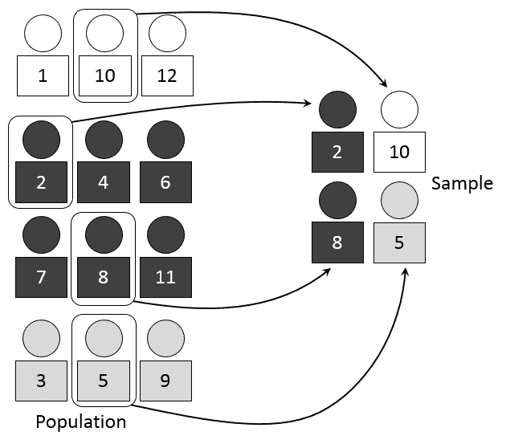
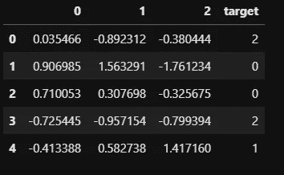
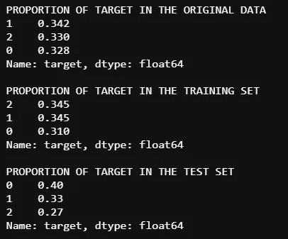
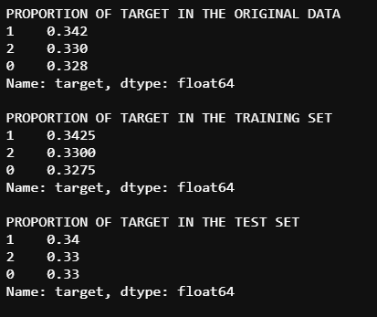
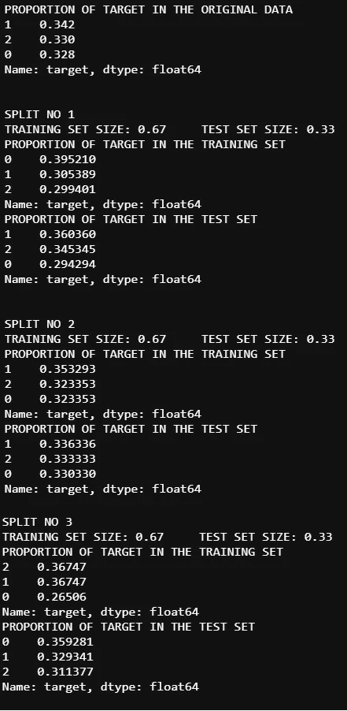
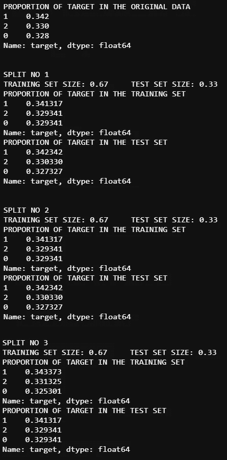

# 什么是机器学习中的分层交叉验证？

> 原文：<https://towardsdatascience.com/what-is-stratified-cross-validation-in-machine-learning-8844f3e7ae8e?source=collection_archive---------3----------------------->

## 本文使用 Scikit-Learn 解释了分层交叉验证及其在 Python 中的实现。本文假设读者具备机器学习中交叉验证的工作知识。

图片由[克里斯里德](https://unsplash.com/@cdr6934?utm_source=medium&utm_medium=referral)在 [Unsplash](https://unsplash.com/?utm_source=medium&utm_medium=referral) 上拍摄

## 什么是分层抽样？

在深入研究分层交叉验证之前，了解分层抽样是很重要的。分层抽样是一种抽样技术，在这种抽样技术中，样本的选取比例与它们在总体中出现的比例相同(根据特征将总体分成称为“阶层”的组)。例如，如果感兴趣的人群中有 30%的男性和 70%的女性受试者，那么我们将人群分为两组(“男性”和“女性”)，并从“男性”组中选择 30%的样本，从“女性”组中选择“70%”的样本。

分层抽样(图片来自 [Mathprofdk(丹·克恩勒)](https://commons.wikimedia.org/wiki/File:Stratified_sampling.PNG)上[维基百科](https://en.wikipedia.org/wiki/Stratified_sampling)

## 分层抽样与交叉验证有什么关系？

在交叉验证中实施分层采样的概念可确保训练集和测试集具有与原始数据集中相同的感兴趣特征比例。对目标变量这样做可以确保交叉验证结果非常接近泛化误差。

在继续下一步之前，我们将生成一个包含 500 条记录、三个要素和三个类的合成分类数据集。数据集是使用 Scikit-Learn 的“make_classification”方法生成的。

*作者图片*

## 在没有分层抽样的情况下实施保留交叉验证

使用 Scikit-Learn 的“train_test_split”方法实现保留交叉验证。实现如下所示。该方法返回训练集和测试集。

*作者图片*

由于我们没有使用分层抽样，我们可以看到目标变量的比例在原始数据集、训练集和测试集中变化很大。

## 用分层抽样实现保留交叉验证

我们将使用分层抽样实现保留交叉验证，以便训练集和测试集具有相同比例的目标变量。这可以通过将“train_test_split”的“分层”参数设置为感兴趣的特征(在本例中为目标变量)来实现。它不一定是目标变量，甚至可以是您希望在训练集和测试集中具有相同比例的输入变量。

*作者图片*

使用分层抽样，目标变量的比例在原始数据、训练集和测试集中几乎是相同的。

## 在没有分层抽样的情况下实现 k-fold 交叉验证

k 倍交叉验证将数据分成“k”份。在“k”次迭代的每一次中，一部分被用作测试集，而其余部分被用于训练。使用 Scikit-Learn 的“KFold”类，我们将在没有分层抽样的情况下实现三重交叉验证。

*作者图片*

我们可以看到，目标变量的比例在原始数据、训练数据和跨分裂的测试数据中不一致。

## 用分层抽样实现 k 重交叉验证

分层抽样可以使用 Scikit-Learn 的“StratifiedKFold”类通过 k-fold 交叉验证来实现。实现如下所示。

*作者图片*

在上面的结果中，我们可以看到，在所有三个分割中，目标变量的比例在原始数据、训练集和测试集中非常一致。

使用分层采样实现的交叉验证确保感兴趣特征的比例在原始数据、训练集和测试集中是相同的。这确保了在训练和测试集中没有值被过度/不足地表示，这给出了对性能/误差的更准确的估计。