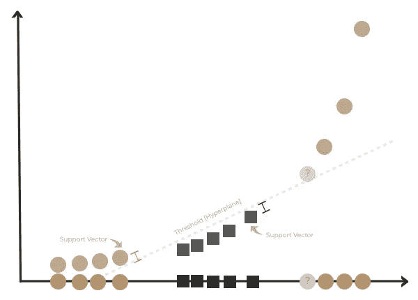

# 什么是支持向量机？

> 原文：<https://towardsdatascience.com/what-is-support-vector-machine-870a0171e690?source=collection_archive---------21----------------------->

## 支持向量机指南

## 第 1 部分:定义模型

> ***算法是什么？***

**支持向量机(SVM)** 是一种**监督机器学习**算法。SVM 的目的是依靠标记的输入数据来预测查询样本的分类，这些输入数据通过使用**裕度**被分成两个组类。具体来说，将数据转换到更高的维度，并使用支持向量分类器作为阈值(或超平面)，以最小的误差分离两个类别。

> ***算法是如何工作的？***

步骤 1:将训练数据从低维转换到高维。

第二步:找到一个支持向量分类器[也称为软间隔分类器]来分离这两个类[内核技巧]。

第三步:返回类标签→查询样本的预测！

> ***算法的例子***

*让我们从基础开始……*

*最大间隔分类器—* 是将阈值分配给每个类簇边缘上的观察值的中点；阈值给出两个类之间的最大距离，以给出最大的余量长度。

最大间隔分类器—正确分类示例*【作者图片】*

*   **例:**由于查询样本落在阈值右侧，因此将查询样本归为 B 类，这是有意的！存在偏差/方差权衡，因为存在高偏差(所选阈值对异常值不敏感)和低方差(对新查询样本表现良好)。
*   **问题:**如果存在异常值，会发生什么情况？

最大间隔分类器—错误分类示例*【作者图片】*

*   **举例:**由于查询样本落在阈值左侧，查询样本被归类为 A 类，这是**而不是**想要的！直观上，这没有意义，因为与 A 类聚类相比，查询样本更接近 B 类聚类。存在偏差/方差权衡，因为存在低偏差(所选阈值对异常值敏感)和高方差(对新查询样本表现不佳)。
*   **解决方案:**由于最大间隔分类器对训练数据中的离群点非常敏感，因此需要选择一个对离群点不敏感且允许误分类的阈值→软间隔分类器。

*软边界分类器—* 是当阈值被允许产生可接受的误分类量，同时允许新数据点仍然被正确分类时；交叉验证用于确定在软边界内允许多少错误分类和观察，以获得最佳分类。**【支持向量分类器是参照软间隔分类器的另一种方式】**。

软边缘分类器—正确的分类示例*【作者图片】*

*   **例:**由于查询样本落在阈值右侧，因此将查询样本归类为 B 类，这是有意的！为了找到最佳阈值，出现了 1 次错误分类。
*   **问题:**如果两个类之间有明显的重叠，会发生什么情况？

软边距分类器—错误分类示例*【作者图片】*

*   **举例:**如果只考虑阈值 1，查询样本落在阈值右边；然而，由于类别 A 和类别 B 的部分聚类都落在右边，查询样本将被不准确地分类。如果只考虑阈值 2，则查询样本落在阈值的右边；尽管只表示了类别 B，并且查询样本被分类为类别 B，这是所期望的，但是类别 B 的部分聚类落在阈值的左侧，这表示潜在的误分类。因此，不存在可以应用而不会导致大量错误分类的最佳阈值。
*   **解决方案:**由于软间隔分类器对训练数据中的大量重叠非常敏感，因此需要选择一个对异常值和重叠分类都不敏感的阈值→支持向量机。

*让我们添加一个 y 轴(将数据转换到更高维度)…*

*支持向量机—* 是将数据变换到一个更高维度，用一个支持向量分类器(也叫软间隔分类器)作为阈值，将两类分开。当数据是 1D 时，支持向量分类器是一个点；当数据为 2D 时，支持向量分类器为直线(或超平面)；当数据是 3D 时，支持向量分类器是平面(或超平面)，当数据是 4D 时，支持向量分类器是超平面。

支持向量机算法*【图片作者】*

A 级

B 类

查询样本

*   **例:**由于查询样本落在阈值左侧，因此将查询样本归为 B 类，这是有意的！这里，数据在 2D，因此支持向量分类器是一条线(或超平面)。支持向量是边缘上和软边界内的观察值。

注意:为了在将数据转换到更高维度时使数学可行，SVM 使用核函数(线性、径向基函数(RBF)、多项式或 sigmoid)来系统地寻找支持向量分类器。当使用核函数时，该算法计算每一对数据点之间的关系，而无需在更高维度中进行任何转换→也称为核技巧！

总之，支持向量机是一种强大的机器学习算法，并已用于机器学习和数据科学应用！

*接下来——*[如何实现支持向量机？第 2 节:用 Python 构建模型](https://kopaljain95.medium.com/how-to-implement-support-vector-machine-61574063af8a) *…*