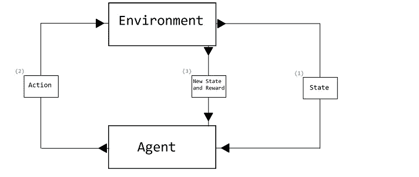
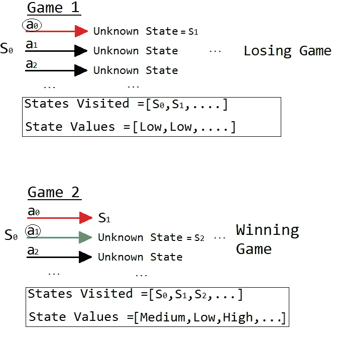
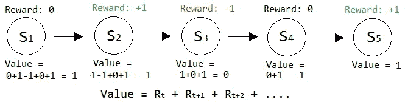
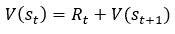
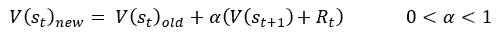
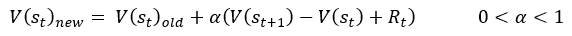

# 什么是列表强化学习？

> 原文：<https://towardsdatascience.com/what-is-tabulated-reinforcement-learning-81eb8636f478?source=collection_archive---------30----------------------->

## 学习如何让你的人工智能自学的第一步

如果你想掌握让你的人工智能在一个不断发展和变化的环境中自学的艺术，列表强化学习是你应该学习的第一个算法。

一般来说，强化学习背后的主要思想是，你有一个代理、环境、状态、动作和奖励。

*   **智能体:**智能体是生活在环境中，接受输入，并执行特定动作的东西。
*   **环境:**环境就是智能体所处的世界。
*   **状态:**状态基本上是代理在特定时刻接收到的所有输入。
*   **动作:**动作是代理可以与其环境交互的所有方式。
*   **奖励/惩罚:**执行一个动作后，奖励给代理。它们只是数字，所以如果代理做了坏事，我们可能会给它-1 的惩罚。如果它做了好事，我们会给它+1 的奖励。

在环境中，我们有一个代理。这个代理从环境中接受某种类型的输入，这个输入就是代理的状态。基于它的状态，代理采取一些行动。此操作将代理带入一个新的状态。根据这种新状态是好是坏，代理人会收到奖励/惩罚。下图有助于形象化这一过程:

注意用蓝色书写的事件顺序。环境向代理提供一种状态，代理基于这种状态采取行动，这种行动改变环境并提供奖励/惩罚。****图片作者****

为了进一步说明这一点，如果你认为自己是一个代理人，那么整个宇宙就是你的环境。你有 5 种感觉或 5 种方式接收输入。在任何特定的时间，你当前的状态就是你所看到的、听到的、闻到的、感觉到的和品尝到的。您根据当前状态执行操作。这些行为最终会导致奖励(也许是升职)或惩罚(被解雇)。这个想法是你将从这些惩罚和奖励中学习，这样你未来的行动将会带来更好的奖励。

用一些行话来说，一集*是代理与环境互动的一个完整周期。例如，如果环境是一个井字游戏，一集将是一个井字游戏。*

## 代理内存/值表

当代理与环境交互时，我们可以存储代理所处的所有状态，并为每个状态赋值。一个状态的价值是一个衡量代理人在接下来的一集里可以期望得到多少奖励的指标(目前，理解这在数量上意味着什么并不重要)。一会儿我会解释如何分配正确的值，但是现在，只要知道这是可能的。

例如，假设我们的代理刚刚开始它的第一个游戏井字游戏。环境是游戏井字游戏，它的当前状态是空的游戏棋盘。代理将在它的存储器中存储这个唯一的状态，比如 s0。假设我们的代理采取了一个随机行动，称之为 a0。回想一下，采取一个行动会带来一个新的状态，姑且称之为 s1。现在假设我们的代理人继续和他的对手玩游戏，最后输掉了游戏(此时它会受到某种惩罚)。

既然代理人输了，我们可以说这一集代理人所处的每个状态都有低值。现在假设我们的代理开始了他的第二场比赛并回到 s0。现在，它可以查看它的内存，看看如果采取 a0 动作会发生什么。它将看到动作 a0 将导致状态 s1，该状态 S1 具有较低值，因为它最后一次处于该状态而失败。

由于代理试图获胜，它将只选择将导致具有高值的状态的动作。为了开始游戏 2，代理人避免动作 a0，因为它的值很低，并随机选择另一个动作，比如 a2。再次，代理继续玩；但这次他最终赢了。既然代理赢了，我们可以说第二集时代理所处的每个状态都有很高的值。希望下图有助于可视化这一过程。

注意这些值实际上是数字，接下来我们将开始寻找每个状态的正确数值。****图片作者****

你可能会发现我们目前的问题。如果行动 a0 真的是最好的行动，并且是在 a0 之后采取的另一个行动导致我们输掉了那场游戏，那会怎么样？现在，如果我们的代理总是回避 a0，它将永远看不到这是最好的行动。为了解决这个问题，我们总是让我们的代理有机会采取一个*随机*行动。如果我们的代理采取随机行动，它有机会采取 0，并给那个行动另一次机会。我们称之为*探索状态空间*。我们通常一开始让代理采取完全随机的行动，然后随着时间的推移，我们慢慢减少代理采取随机行动的机会。本页底部链接的井字游戏项目中讨论了一种算法。

代理将继续这个过程，直到它知道在它可能处于的每个状态下应该采取的最佳行动。总而言之，*我们实际上只是告诉代理人去尝试每件事*，记录发生的每件事，并找出哪些行动导致最佳状态(导致最大回报的状态)。

## 寻找每个状态的值

为了找到每个状态的正确值，我们首先将每个状态的值设置为 0。

> ***一个状态的正确值等于该集的预期未来总报酬。***

请参见下图，以帮助理解这一点。

最好从最后一个状态开始。在 S5 中，我们收到了+1 的奖励。因此，S5 的值为 1。现在 S4 没有得到奖励，但它导致 S5 给出+1 的奖励。因此，S4 获得的奖励值+S5 的值，即 0+1=1。同样，V(S3) = R3 + V(S4) = -1+0+1 = 0。一般来说，我们可以说；

*一个状态的值=在该状态收到的奖励+下一个状态的值*

重要的是要认识到，我们是在许多集上采样，所以我们不是将值显式地设置为 Rt + V(St+1)，而是将它变成一个迭代过程，只是在 Rt + V(St+1)的方向上迈出一小步。这使我们想到:

但是我们对上面的函数有一个非常微妙的问题。假设我们用当前值 0 更新状态 V(S1 ), Rt = 0。假设 V(s2) = 1。如果我们对 V(s1)重复应用更新函数，那么它将膨胀到无穷大。

我们可以通过用状态的当前值来抵消我们的更新来解决这个问题(见下文)。这就把我们带到了我们的*值更新函数:*

*这应该看起来很像梯度下降。如果重复应用该函数，将使状态值收敛到正确值。*

为什么我们必须使用价值差异的另一个解释是这样的；我们必须朝着相对于状态的当前值的正确值*的方向迈出一小步。*

## 理论部分总结

总的来说，代理从播放几集开始。当它播放这些剧集时，有时它会采取随机的动作来探索状态空间，而其他时候代理会采取任何导致具有最高值的状态的动作。在每个情节之后，我们使用值更新功能更新该情节期间代理所处的每个状态的值，从最后一个状态开始，向后移动到第一个状态。最终，这将引导我们找到每个状态的正确值。如果代理人只采取会导致最高奖励状态的行动，它就已经掌握了游戏(希望如此)。

好了，无聊的事情说够了。如果这一切理论对你来说还是有点模糊，不要着急；真正的学习发生在我们应用这些东西的时候。所以，事不宜迟，让我们建立一个代理，踢屁股在[井字游戏！](https://doingengineering21.medium.com/how-to-create-an-ai-that-plays-tick-tac-toe-with-reinforcement-learning-d10e8fbbaa2c)

> 感谢您的阅读！如果这篇文章在某种程度上帮助了你，或者你有什么意见或问题，请在下面留下回复，让我知道！此外，如果你注意到我在某个地方犯了错误，或者我可以解释得更清楚一些，那么如果你能通过回复让我知道，我会很感激。