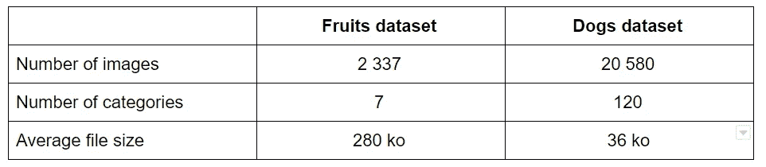
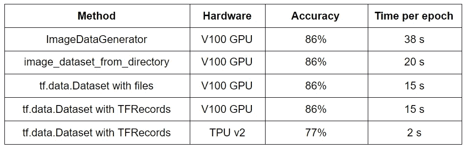
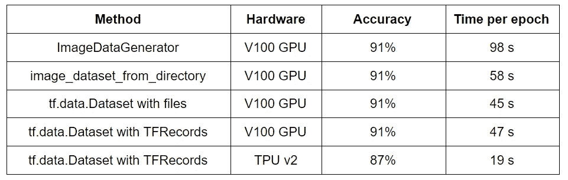
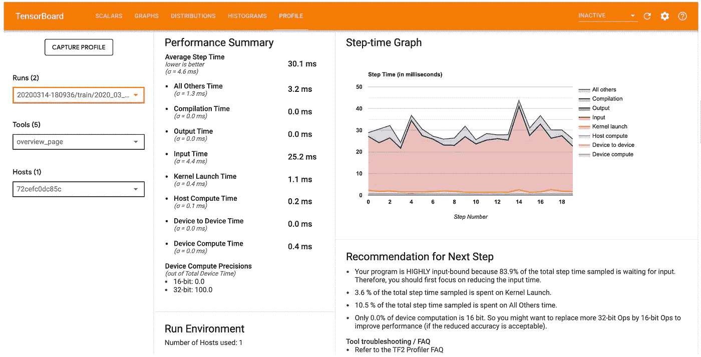

# 用 tf.keras 训练图像分类模型的最佳输入管道是什么？

> 原文：<https://towardsdatascience.com/what-is-the-best-input-pipeline-to-train-image-classification-models-with-tf-keras-eb3fe26d3cc5?source=collection_archive---------2----------------------->


图像取自[像素](https://www.pexels.com/fr-fr/photo/gros-plan-de-photos-imprimees-1226721/)

## Keras 的 ImageDataGenerator、TensorFlow 的 image_dataset_from_directory 和各种 tf.data.Dataset 管道之间的比较

当我们开始学习如何用 Keras 构建深度神经网络时，我们用来输入数据的第一个方法是简单地将数据加载到 NumPy 数组中。在某些情况下，尤其是在处理图像时，数据太大而无法容纳在内存中，因此我们需要数组的替代方案。根据我的经验，这个问题的最佳解决方案是使用 Keras 内置的工具，名为 *ImageDataGenerator* 。这创建了一个 Python 生成器，它将数据逐渐馈送到神经网络，而不将数据保存在内存中。此外，它包括数据扩充功能，使其成为一个非常有用的工具。

这可能是故事的结尾，但在研究图像分类一段时间后，我发现了创建图像输入管道的新方法，据称这些方法更有效。本文的目标是运行一些实验来找出最佳的方法。主要参赛者是:

*   `tf.keras.preprocessing.image.ImageDataGenerator`
*   `tf.keras.preprocessing.image_dataset_from_directory`
*   `tf.data.Dataset`用图像文件
*   `tf.data.Dataset`带 TFRecords

所有实验的代码都可以在这个 [Colab 笔记本](https://colab.research.google.com/drive/1AYAtGuAQaE23zVg5-nHcG-L6FPPUJAJG?usp=sharing)里找到。

# 实验装置

为了对管道进行公平的比较，它们将用于执行完全相同的任务:微调一个*efficient B3*模型，以对两个不同数据集中的图像进行分类。在描述数据集之前，这里是所使用的训练管道，受到本[教程](https://keras.io/examples/vision/image_classification_efficientnet_fine_tuning/)的强烈启发。

函数来创建迁移学习的高效 NetB3 模型

这段代码简单地采用了一个预先训练好的 *EfficientNetB3* ，并在其上添加了一个具有正确数量神经元的分类层。然后，用每种测试方法对该模型进行 5 个时期的训练，批次大小为 32。实验是在 Google Colab 上完成的，使用的硬件是 Colab Pro。TensorFlow 使用的版本是`2.4.1`。

用于测试管道的第一个数据集是仅包含水果图像的[开放图像数据集](https://storage.googleapis.com/openimages/web/index.html) [1]的子集。第二个是[斯坦福狗数据集](http://vision.stanford.edu/aditya86/ImageNetDogs/)[2–3]，里面有各种狗的图片。这是两个数据集的摘要:



测试中使用的两个数据集的描述

数据集差别很大，因为一个数据集有少量图像较大的类。colab 中提供了下载和准备这些数据集的代码。


斯坦福狗数据集中的狗图像示例


开放图像数据集中的水果图像示例

# 结论

由于本文的其余部分花了大量的时间来解释不同的输入管道，并且有些人可能只关心结论，所以这里是所有实验的总结:



使用水果数据集获得的结果



使用 dogs 数据集获得的结果

数字清楚地表明，就速度而言，首选解决方案*图像数据生成器*远非最优。继续使用它的唯一原因可能是因为这种方法的数据扩充非常简单。然而，使用其他方法并不困难，如果速度有很大的提高，这是值得的。

在我看来，*image _ dataset _ from _ directory*应该是**的新首选**，因为它并不比旧方法更复杂，而且速度明显更快。

使用 *tf.data.Dataset* 构建我们自己的输入管道可以提高一点速度，但也有点复杂，所以使用与否是个人的选择。

关于 TFRecords，似乎如果不使用 TPU，就没有必要使用它们，因为直接使用图像文件对性能没有影响。

**最佳解决方案**似乎是使用带有 TPU 的 TFRecords，考虑到速度的提高，额外的麻烦是值得的。准确性的下降只是因为不同的超参数组合对 TPU 有效，但测试使用的是 GPU。与其他方法相比，使用正确的超参数可以获得相似的精度。

# 图像数据生成器

现在让我们进入每种方法的细节，从对卫冕冠军的回顾开始，这非常简单。

函数使用 ImageDataGenerator 方法为神经网络定型

Keras 方法将数据存储在一个文件夹中，每个子文件夹对应一个单独的类。在本例中，它自动调整图像大小并创建批处理。标签是根据子文件夹名称生成的。“稀疏”格式用于具有形式为`0,1,2,3,...`的标签，因为稀疏度量用于模型构建。

这种方法的主要优点是极其简单，并且可以通过在参数中指定变换(旋转、翻转、缩放等)来简单地进行数据扩充。

# 图像数据集来源目录

下一个选项也很简单，也包含在 Keras 中。

使用 image_dataset_from_directory 方法训练神经网络的函数

数据的格式与第一种方法相同，图像再次被调整大小和批处理，并且标签被自动生成。然而，不存在动态进行数据扩充的选项。

这种方法的主要区别在于输出不是 python 生成器，而是一个`tf.data.Dataset`对象。这使得它能够很好地与下面讨论的其他流水线工具相适应。例如，这里进行的数据预取有助于加快计算速度。使用 TensorFlow 进行的任何形式的数据扩充都可以在这种数据集上进行。它不太简单，但是更加可定制。

# tf.data .数据集

TensorFlow 建议在使用库时使用 tf.data 以获得最佳性能。这是一组工具，用于创建由张量组成的数据集，对数据应用变换，并迭代数据集以训练神经网络。它适用于任何类型的数据，如表格、图像或文本。数据可以通过多种方式导入。最常见的有 NumPy 数组、python 生成器、CSV、TFRecords 和 strings。更多细节可以在 [Tensorflow 的网站](https://www.tensorflow.org/guide/data)上找到。

让我们首先展示用于图像分类这一特定情况的代码，然后解释它是如何工作的。

使用 tf.data.Dataset pileline 加载图像数据的函数

这里完成的第一步是在将数据馈送到 TensorFlow 之前正确格式化所需的数据。这里使用的格式是每个图像的一个**文件路径**和一个**整数标签**。这个过程在第 19–22 行完成。不要忘记打乱图像列表是非常重要的，因为这会极大地影响模型的性能。*相信我……*

**注意:**另一种方法是使用`tf.data.Dataset.list_files`直接获取文件列表。这样做的问题是，必须使用张量流运算来提取标签，这是非常低效的。这大大降低了流水线的速度，所以最好用纯 python 代码来获取标签。

标签部分很简单，因为标签列表使用方法`from_tensor_slices`转换为数据集，该方法转换任何类似张量的对象(numpy 数组、列表、字典)。文件名列表也使用相同的方法转换为数据集。

下一步是使用`map`方法将`parse_image`函数应用于文件名数据集，该方法将*张量流函数*应用于数据集的所有元素。这个特殊的函数**从文件中加载**图像，**如果需要的话将**转换为 RGB 格式，并且**调整**的大小。`num_parallel_calls`参数被设置为由 Tensorflow 自动修复，以尽可能提高速度。

一旦数据集的两个部分完成，就使用`zip`方法将它们**组合**，这类似于同名的 python 函数。

最后一步是确保数据集可以被正确迭代以训练神经网络。这是用`configure_for_performance`函数完成的，它直接应用于整个数据集，所以不需要使用`map`。该函数的第一部分执行**洗牌**。这一个的目标是获取接下来的 X 个图像，其中 X 是缓冲区大小，并在每次我们经过数据集时混合它们，这确保了在训练的每个时期数据被不同地混洗，但是由于为了性能的缘故，缓冲区大小必须很小，所以它不会取代整个数据集的原始混洗。然后数据被**分批分离**，然后**永远重复**。最后一步是**预取**一些数据，它预加载了将来要使用的数据，以帮助提高性能。

整个管道的输出是一个由张量组成的数据集。为了帮助可视化它，我们可以用下面的方法迭代它:

```
for image, label in ds.take(1):
    print(image.numpy())
    print(label.numpy())
```

数据是张量形式的，因此为了简单起见，必须将其转换成通常的数组。重要的是要理解，即使从数据集中取出一个元素，也有 32 个图像被加载，因为在这种情况下一个元素对应于一个**批次**。

这个数据集可以直接用于训练神经网络，就像其他方法一样。

使用 tf.data.Dataset 输入管道为神经网络定型的函数

唯一新的(也是非常重要的)东西是`steps_per_epoch`论点。由于数据集是无限重复的，TensorFlow 需要知道一个历元对应多少步。这基本上是图像总数除以批量大小，由于最后一批通常不完整，所以向上取整。

## 更进一步

如上所述，用`tf.data`做**数据扩充**并不难。唯一的额外步骤是对结果数据集应用一个新的张量流函数，比如`tf.image.flip_left_right`。这可以随意定制，这里[讨论](https://www.tensorflow.org/tutorials/images/data_augmentation)。

有了足够小的数据集，`cache`方法使得训练速度格外快，因为数据在第一个历元之后就保存在内存中。对于较大的数据集，可以将数据缓存到一个文件中，或者使用一种叫做快照的东西，但是我没有探究其中的任何一种。

# TFRecords

输入管道链中的最后一个复杂性跳跃涉及到将图像保存为 TensorFlow 记录格式。这是一种特别适合 TensorFlow 的文件格式，因为它以二进制格式存储对象，所以训练模型的速度更快，特别是对于大型数据集。本节将描述图像分类的细节，但是 [TensorFlow 页面](https://www.tensorflow.org/tutorials/load_data/tfrecord)清楚地说明了 TFRecords 通常是如何工作的。

## 写入 TFRecords

下面是用于将图像数据集转换为 TFRecords 的代码。

将图像数据保存为 TFRecords 格式的函数

`make_tfrecords`功能的大部分与之前使用的数据准备步骤非常相似。由文件路径和**整数标签**组成的随机化数据是使用简单的 python 代码找到的。唯一不同的是**完整图像**被加载并保存在 TFRecords 中。`TFRecordWriter`方法用于写入文件。

创建 TFRecords 所需的唯一主要附加功能是在`serialize_example`函数中。每个数据点都必须转换成**特征**，存储在字典中(第 7-10 行)，然后转换成**示例**(第 12 行)，最后写入**字符串**(第 13 行)。这是 TFRecord 文件包含的内容。这个过程初看起来很复杂，但实际上对于所有可能的情况都是一样的。

这种工作方式有许多优点。所有这些处理只需**执行一次**，并且数据为将来的任何训练做好准备。它也更容易共享，文件越小越少。**像调整大小这样的变换**可以在之前完成，并保存下来供以后训练使用，这样可以提高速度。对于较大的数据集，TFRecords 可以分割成多个较小的文件，称为**碎片**，以使训练更快。

## 正在读取 TFRecords

一旦理解了上面的`tf.data.Dataset`部分，阅读 TFRecords 就很容易理解了。事实上，过程几乎完全相同。数据是从 TFRecords 文件而不是从图像文件加载的，但后续处理是相同的。

函数加载保存在 TFRecords 文件中的数据

数据集首先在`read_dataset`中通过方法`TFRecordDataset`读取 TFRecords 文件进行初始化。然后应用`_parse_image_funtion`将 TFRecords 的内容转换回图像和标签。这是在第 2–7 行中完成的，其中用于创建 TFRecords 的字典用于告诉 TensorFlow 内容应该对应于什么。其余步骤与之前的处理完全相同。

这里介绍一个小细节，因为它对于下一节出现在**配料**步骤中是必要的。额外的参数`drop_remainder`用于丢弃未满的最后一批。这意味着为了完成一个时期，通常少了一个步骤，这必须在训练部分的`steps_per_epoch`参数中改变。

使用 TFRecords 训练神经网络的函数

# 如何使用 TPU

在我看来，值得熟悉 TFRecords 的主要原因是能够使用 Colab 的**免费 TPUs** 。这些比 GPU 快得多，但使用起来更复杂。这不像切换运行时那么简单，所以我在这里描述如何做。不必使用 TFRecords，但强烈建议使用。

第一个障碍是在 TPU 上运行时，TensorFlow 2 无法读取本地文件。这个问题通过将数据保存在**谷歌云存储**中得以解决。每个谷歌账户都可以免费存储大量数据，所以这不是什么大问题。使用 Colab 和 TensorFlow 时，在 GCS 上保存数据也非常简单。唯一需要的特殊步骤是验证你的谷歌账户。

将您的 Google 帐户连接到 colab 的代码

如果您的帐户通过了身份验证，使用与之前完全相同的函数来创建 TFRecords，但是使用了一个 **GCS bucket link** (形式为 *gs://bucket-name/path* )来完成这个任务。TensorFlow 足够聪明，能够识别路径来自 GCS，并知道如何读取和保存那里的数据。需要注意的是，由于需要本地文件，因此无法在 TPU 上保存数据。保存数据必须用 CPU/GPU 完成，然后是时候切换到 TPU 进行训练了。

除了数据存储之外，使用 TPU 进行训练的唯一主要区别是需要向管道中添加少量代码(第 10-15 行)。

使用 TPU 训练神经网络的函数

出于某种原因，批次必须满才能使用 TPU，这就是为什么上面使用了`drop_remainder`参数。同样值得注意的是，使用自动 TPU 时，建议使用更大的**批量**。这些大批量数据会导致 GPU 崩溃，但实际上会提高 TPU 的性能。对于其他超参数也可以说是类似的事情。TPU 是不同的动物，所以超参数与 CPU/GPU 使用的超参数的不同组合通常是最佳的。

# 最终意见

实验的结论已经在上面讨论过了，所以在结束之前，我想强调一下我在整个过程中学到的一些东西。第一个是现在属于 Tensorboard 的 [**剖析器**](https://blog.tensorflow.org/2020/04/introducing-new-tensorflow-profiler.html) 。这是一个非常有趣的工具，有助于找到培训管道中的瓶颈。当我试图使用 TensorFlow 函数转换图像标签时，我就是这样发现自己做错了。数据管道中的这一特定步骤占用了总训练时间的 73%,这是难以置信的高，所以我找到了一种方法来修复它。对于 dogs 数据集，训练时间从每历元 200 秒以上下降到仅 45 秒。如果没有分析器，我根本不知道问题出在哪里。



错误输入管道的示例，如探查器所示

另一个看起来很重要的细节，尤其是在使用 TPU 时，是将**和`map`方法**并行化。与其他可能的改进相比，这是迄今为止最有效的一个。

接下来，如上所述，**洗牌**数据极其重要。这更多地与神经网络训练背后的数学有关，而不是与数据管道有关，但是我看到仅仅通过正确地混合数据就增加了 10 个精度点。

最后，本文中没有提到的一个细节是关于数据的标准化。事实上，当训练时，将图像的像素除以 255 以仅具有 0 和 1 之间的值是常见的。然而，在这种情况下，标准化步骤似乎包含在 EfficientNetB3 模型本身中，因此输入必须是原始像素。正如我在意识到这一点之前所看到的，这个小细节在性能上产生了巨大的差异！

# 参考

[1] Kuznetsova，a .，Rom，h .，Alldrin，N. *等*开放图像数据集 V4。*Int J compute Vis***128**，**1956–1981(2020)。[https://doi.org/10.1007/s11263-020-01316-z](https://doi.org/10.1007/s11263-020-01316-z)**

**[2] Aditya Khosla、Nityananda Jayadevaprakash、姚邦鹏和李菲菲。**用于细粒度图像分类的新型数据集。***2011 年 IEEE 计算机视觉与模式识别会议(CVPR)* 第一届细粒度视觉分类研讨会。**

**[3]邓，董，索彻，李，李和，ImageNet:一个大规模分层图像数据库。IEEE 计算机视觉和模式识别(CVPR)，2009 年。**