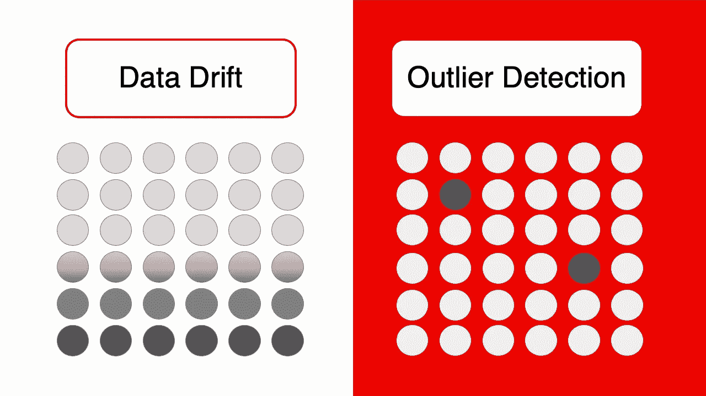
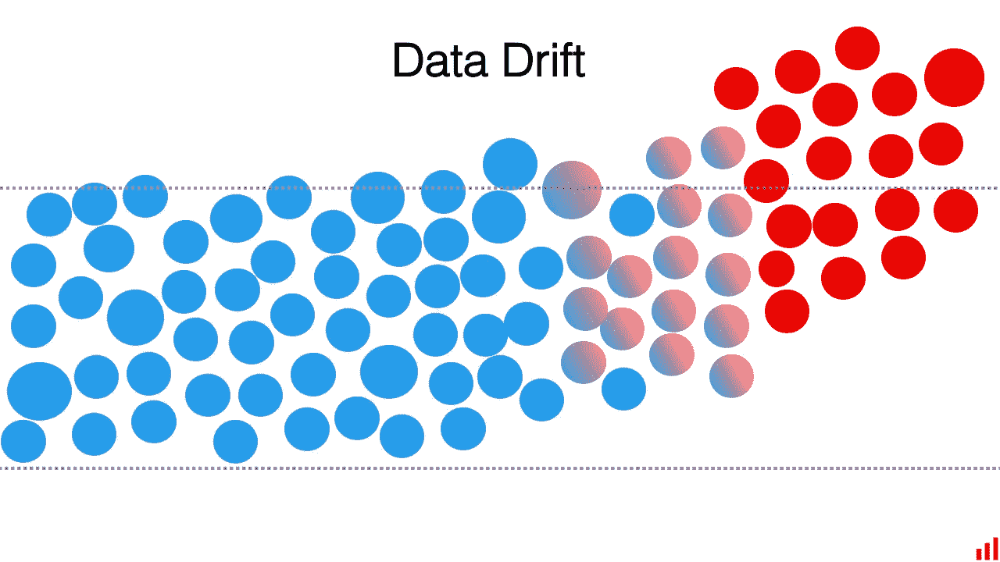
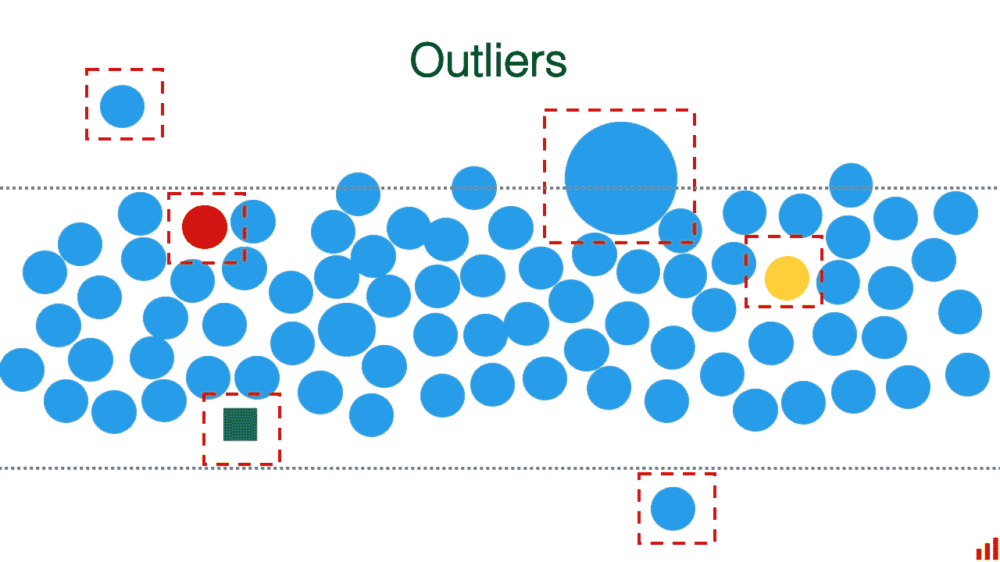
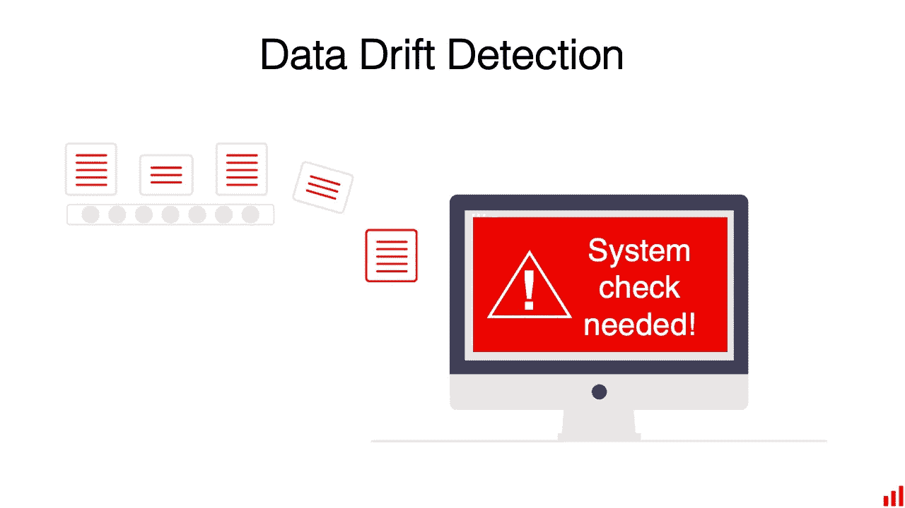
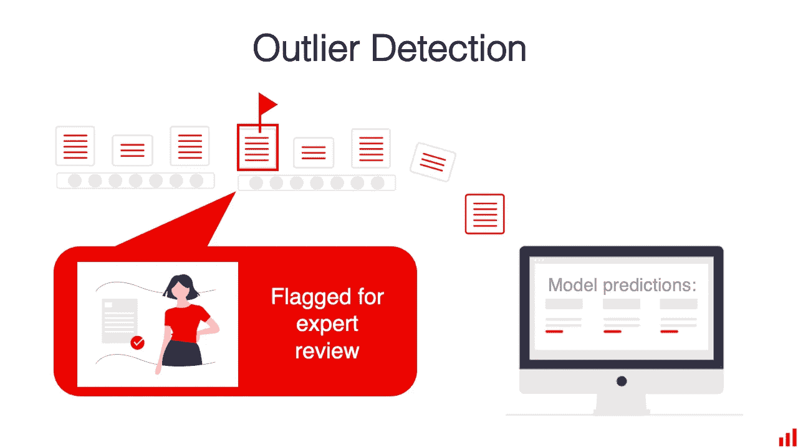
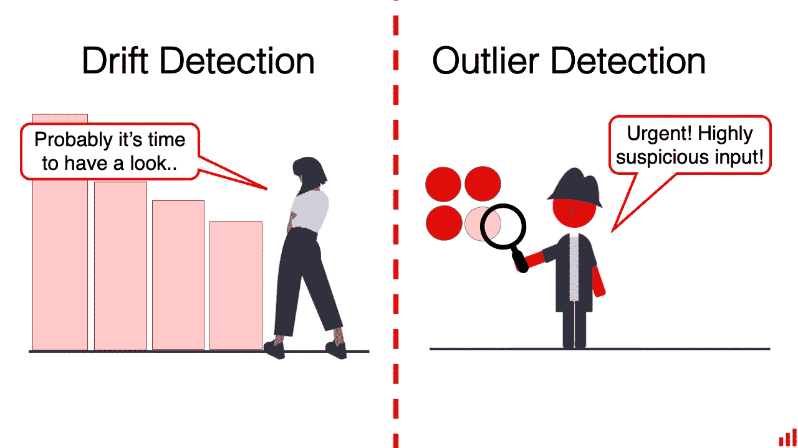

# 离群点检测和数据漂移检测有什么区别？

> 原文：<https://towardsdatascience.com/what-is-the-difference-between-outlier-detection-and-data-drift-detection-534b903056d4?source=collection_archive---------26----------------------->

## 简单解释了一下

作者图片

当我们构建[显然是](https://github.com/evidentlyai/evidently)，一个监控 ML 模型的开源工具时，我们花了很多时间来回答关于生产、监控和系统设计中 ML 的问题。有些问题反反复复！

我们决定以机器学习问答的形式写下一些东西。期待可视化的解释者，无论是高层次的还是深层次的。

如果你想问你的问题，欢迎来到我们的[社区服务器](https://discord.com/invite/xZjKRaNp8b)！

这是第一个。

# 离群点和数据漂移检测有什么区别？

在生产中监控 ML 模型时，我们可以应用不同的技术。

[数据漂移](https://evidentlyai.com/blog/machine-learning-monitoring-data-and-concept-drift)和离群点检测就是其中之一。当我们还没有地面真相标签时，两者都是有用的。数据是唯一需要关注的东西。

有各种统计方法来检测这两种情况(这本身就是一个有趣的讨论！)，而且还是一个原则上的区别。

# 焦点:整个数据集与单个对象

当我们谈论漂移检测时，我们关注整个数据集中的“**全局**”数据分布。我们想知道与过去的时期或模型训练相比，他们是否有显著的变化。

我们执行漂移分析来测试这是否成立。

图片作者。

数据漂移可能看起来像是对象属性的逐渐变化。在这个简化的例子中，我们将观察到特征“颜色”和“位置”的分布变化，而“形状”和“大小”保持一致。

假设所有特性都非常重要，这听起来像是我们必须做出的反应！例如，通过重新训练模型，使其学习新的模式。

当我们搜索异常值时，我们希望在输入数据中找到单个的"**不寻常的**或"**不同的**"对象。这些对象可能会不时出现在培训和生产数据中。我们称之为异常或异常值——暗示这是我们很少预料到的事情。

图片作者。

在这个例子中，一些对象会很突出，因为它们的“形状”、“位置”、“大小”或“颜色”与其余的非常不同。

例如，我们可能想要检测它们并将其发送给人工审查。

数据漂移和异常值可以独立存在。**整个数据集可能会在没有异常值的情况下漂移。在没有数据漂移的情况下，单个异常值可能很容易出现。**

说到监控，我们可能希望同时关注这两个方面。我们对他们每个人都有不同的期望和工作流程。

# 决策:我能相信模型还是我能相信预测？

当我们监控漂移时，我们的目标是决定我们是否可以信任**模型仍然如预期的那样运行**。假设是，如果数据分布与模型被训练的数据分布相似，那么它应该总体表现良好。

如果分布已经改变，整个系统可能需要更新。

图片作者。

如果我们怀疑漂移，我们在模型层面上采取行动:使用新数据重新训练它，完全重建它，或者对所有模型输出应用一些业务逻辑。

当我们监控异常值时，我们的目标是决定我们是否可以**信任模型在特定输入**上表现良好。假设是，如果特定对象离模型知道的一切“太远”，那么这次它很可能不会做出非常好的预测。

图片作者。

如果我们发现异常值，我们在单个对象的层次上采取行动:请人类专家而不是模型来做决定，或者为这个特定的输出应用一些业务逻辑。

这些差异也会影响我们设计每种情况下的检查方式。

# 测试设计:稳健性与敏感性

图片作者。

**我们希望漂移检测器对异常值具有鲁棒性。**

例如，如果有一个中断的输入，它不应该发出警报。只有当我们看到“足够多”的变化时，它才会做出反应。

这通常可以通过选择正确的统计检验来比较单个特征的数据分布来实现:例如 Kolmogorov-Smirnov、Anderson-Darling 或卡方检验。对于何时选择哪种测试，仍然存在许多细微差别。我们正在为[选择合理的默认值，显然](https://github.com/evidentlyai/evidently)开源库可以解决这个问题。

**另一方面，我们希望异常值检测器足够灵敏。**

当单个对象看起来“奇怪”时，甚至在变化累积并达到临界质量之前，它就应该发出警报。我们可能会选择不同的测试，如隔离森林算法或一类 SVM。

当单个模型错误的成本很高时，异常值检测通常很重要。我们可能会容忍一些假阳性警报来执行额外的抽查。

# 测试应用程序:一个、两个或都不

我们总是需要两种测试吗？不完全是。

**有时我们可能只关注数据漂移。**例如，我们将使用测试来决定何时开始标记新数据以更新模型。

否则，如果单个模型误差的成本不是太高，我们可能会很好，如果我们的预测偶尔由于离群值而偏离。

**有时我们只会检查异常值。**例如，我们将使用异常值检测来决定何时依赖基于规则的响应，而不是模型预测。

然而，我们可能并不总是需要漂移检测。我们通常将它作为模型质量的代理来检查。例如，如果我们必须等待地面真相标签。但是如果标签很快到达，我们可以计算真实的模型质量，比如准确性或平均误差。漂移检查是额外的。

# 总结

漂移和异常值检测都有助于监控机器学习模型的生产性能。

我们并不总是需要它们，但可能会选择运行一项或两项检查。各有各的特点。

**数据漂移检测**有助于定义输入数据的总体分布何时发生变化。我们设计的这个测试对异常值是稳健的，因此它只对有意义的变化发出警报。我们通常会通过重新训练或更新模型来应对漂移。

**异常值检测**有助于检测个别异常数据输入。我们设计这种测试足够灵敏，可以捕捉到单一的偏差输入。我们通常会通过应用一些业务逻辑或手动处理这个单独的对象来做出决定，从而对异常值做出反应。

**有关于生产机器学习的问题吗？**加入我们的 [Discord 社区](https://discord.com/invite/xZjKRaNp8b)，在 *#ds-ml-questions* 频道提问。

*本博客最初发表于*[*https://evidentlyai.com*](https://evidentlyai.com/blog/ml-monitoring-drift-detection-vs-outlier-detection)*。感谢我的共同创始人*[*Emeli Dral*](https://twitter.com/emelidral)*共同撰写了这篇文章。*

在 appeally AI，我们创建了开源工具来分析和监控机器学习模型。在 GitHub *上查看我们的* [*项目，喜欢就给它一颗星！*](https://github.com/evidentlyai/evidently)

想留在圈子里吗？

*   [*报名*](https://evidentlyai.com/blog/ml-monitoring-drift-detection-vs-outlier-detection#signup) *参加我们的时事通讯。*
*   *关注* [*推特*](https://twitter.com/EvidentlyAI) *和*[*Linkedin*](https://www.linkedin.com/company/evidently-ai/)*。*
*   *加入我们的* [*不和谐社区*](https://discord.gg/xZjKRaNp8b) *聊天联系。*