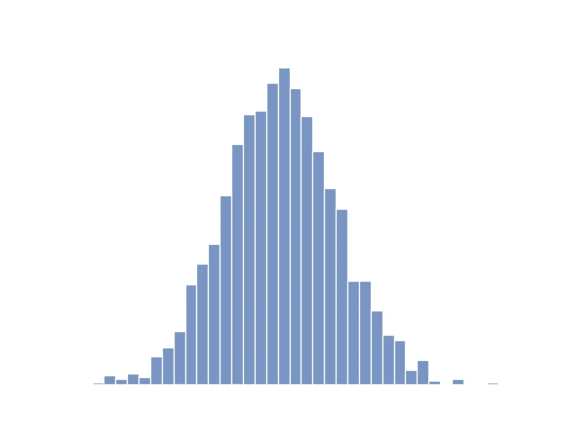

# 统计分析的目标是什么？

> 原文：<https://towardsdatascience.com/what-is-the-goal-of-a-statistical-analysis-e9b794a4d860?source=collection_archive---------15----------------------->

## 管理层找到你，让你对他们的数据进行统计分析。你是做什么的？

查尔斯·德鲁维奥在 [Unsplash](https://unsplash.com?utm_source=medium&utm_medium=referral) 上拍摄的照片

“嗯，”你可能会对自己说，“多么精确的问题描述啊！至少我不必先清理数据…那是什么？”

照片由[马特·赫恩](https://unsplash.com/@matthearne?utm_source=medium&utm_medium=referral)在 [Unsplash](https://unsplash.com?utm_source=medium&utm_medium=referral) 拍摄

在花了大量时间查看、修改，并与沾沾自喜的人交谈之后，你终于有了一个似乎准备好进行适当的统计分析的数据集，这些人祝贺自己没有成为处理这一棘手问题的人。

但是什么是统计分析呢？你应该分类，回归，估计，测试，或集群的东西吗？还是完全不同的东西？

# 统计分析的目标

查尔斯·德鲁维奥在 [Unsplash](https://unsplash.com?utm_source=medium&utm_medium=referral) 上拍摄的照片

抓耳挠腮之余，你翻开自己信任的统计书籍，发现了以下说法  :

> "统计分析的目标是找出数据背后的分布."

“你说我数据背后的分布是什么意思？”

您的数据分布描述了您的数据特征相对于[感兴趣人群](https://hackernoon.com/populations-youre-doing-it-wrong-820ae76beb95)的范围和频率。

> *数据的分布取决于感兴趣的人群。*

在最简单的情况下，您感兴趣的人群只是您可用的数据。这意味着您的数据已经完美地描述了分布。

# 管理插曲

“也许管理层只对数据集中的观察结果感兴趣……”

那样的话，恭喜你，你的统计分析完成了。您可以直接从数据集中回答任何后续问题。不需要任何统计估计或统计检验。

很高兴你回到管理层，告诉他们你完成了统计分析。印象深刻的管理层直接邀请你展示你的发现。

[产品学院](https://unsplash.com/@productschool?utm_source=medium&utm_medium=referral)在 [Unsplash](https://unsplash.com?utm_source=medium&utm_medium=referral) 上的照片

你告诉他们，数据已经准备好回答他们关于观察的任何问题，因为他们只对数据中的观察感兴趣。

管理层面无表情地告诉你，他们不仅对数据中的观察感兴趣。他们希望了解更多的观察结果，所有现有和未来的客户，而不仅仅是您数据中的几个调查客户…

照片由 [Charles Deluvio](https://unsplash.com/@charlesdeluvio?utm_source=medium&utm_medium=referral) 在 [Unsplash](https://unsplash.com?utm_source=medium&utm_medium=referral) 上拍摄

气馁的你回到你的办公桌。“多么不公平！我怎么知道感兴趣的人群是什么……好吧，现在我该如何进行统计分析？”

# 典型的统计分析

随着感兴趣人群的增加，数据集仅包含其中的一个子集，您现在面临的问题是，您的数据只能让您大致了解数据背后的真实分布。

您的数据包含太多要素，无法同时进行分析。你决定暂时将注意力集中在一个单一的特征上。作为第一步，你从直方图开始。

**数据驱动的分销决策？**

作者图片

“这看起来不像正态分布吗？也许这就是这个特性的底层发行版？”

你现在面临一个决定。是否要继续假设特征确实遵循正态分布？

Gabriel Sollmann 在 [Unsplash](https://unsplash.com?utm_source=medium&utm_medium=referral) 上拍摄的照片

“我当然知道。如果它看起来像正态分布，嘎嘎叫起来像正态分布，那么它就是正态分布。”

罗斯·索科洛夫斯基在 [Unsplash](https://unsplash.com?utm_source=medium&utm_medium=referral) 上的照片

虽然[鸭子打字](https://en.wikipedia.org/wiki/Duck_typing)肯定是你的事情，但可悲的是，你违反了数据驱动的决策。

“嗯？怎么会？为什么？”

您查看了直方图，并提出了特征遵循正态分布的假设。然后你又看了一遍直方图，得出的结论是直方图证实了你的假设。你不觉得这有点绕口吗？

“嗯…如果你这么说的话…听起来真的不对…”

如果你想阅读更多关于用数据正确决策的文章，Cassie Kozyrkov 是最适合你的人。

“所以我们暂且称正态分布为一种假设。现在怎么办？”

**统计建模**

因为我们假设基础分布是正态的，所以我们只是决定了特征的统计模型。

[景大陈](https://unsplash.com/@jingdachen?utm_source=medium&utm_medium=referral)在 [Unsplash](https://unsplash.com?utm_source=medium&utm_medium=referral) 上拍照

“我们做到了吗？我的意思是，当然，我们做到了。但出于好奇，你会如何定义一个统计模型？”

当然，随机特征的[统计模型](https://en.wikipedia.org/wiki/Statistical_model)(随机是因为我们不知道你下一次观察的特征是什么)是一组参数化的概率分布，其中一个正确地描述了该特征。

> X { P(T):T in T }的一个统计模型，其中 X～P(s)为 T 中的一个 s

“啊，我明白了。所以 P(t)是正态分布，我说的对吗？”

是的，P(s)是描述我们特征的正确正态分布。t 称为参数空间。在我们的例子中，它被定义为

> T := {(μ，σ)其中μ为实数且σ > 0}

**统计模型的真实参数**

"我们现在需要在 T 中找到正确的对 s = (μ，σ). "

这是正确的。修复统计模型后，我们现在需要找到特征分布背后的真实参数。

> 在确定一个统计模型后，我们试图找到数据分布背后的真实参数。

“好，就这么办。我现在可以从我的数据中估计平均值和方差。”

确保使用样本方差得到一个无偏估计量。

“搞定了。那么这就是特征的真实正态分布 P(s)了？”

很遗憾没有。

[马太·亨利](https://unsplash.com/@matthewhenry?utm_source=medium&utm_medium=referral)在 [Unsplash](https://unsplash.com?utm_source=medium&utm_medium=referral) 上的照片

这是您对分布背后真实参数的估计。你可能离真实值很近，也可能很远。只有当你知道真正的价值时，你才会知道，所以很可能永远不会知道。然而，你现在能做的，是在你的估计值周围寻找区间，这些区间很有可能覆盖真实的参数。

"这听起来很像置信区间."

没错。你会看到，对于任何固定的概率，估计量周围的范围比不包含估计量的范围导致更小的区间。即使您的估计可能是错误的，这也使它们成为真实值的良好候选。

> 您对分布背后的参数的估计可能是错误的，但它们仍然是有用的。

**从单个分布到组合分布**

“好了，现在我只需要对其他特征重复这一过程，统计分析就完成了？”

你还记得我们通过单独观察特征来简化我们的生活吗？不幸的是，当将您的发现概化为多个要素时，要素之间的任何相互依赖都会严重破坏您从孤立视图获得的结果。但这是您确定数据背后的真实分布的良好开端。

请记住[卡西·科济尔科夫](https://hackernoon.com/data-inspired-5c78db3999b2)。完成分析后，你需要确认帮助你得出结果的假设和前提。大多数情况下，这将需要您获取新数据。或者，你可以让[在检查数据集](/the-most-powerful-idea-in-data-science-78b9cd451e72)之前将其拆分。

# 结论

“我想我现在明白什么是统计分析了。我有最后一个问题。为什么统计分析总是关注支配我的数据的真实概率分布？”

任何统计、估计、分类或回归模型都是依赖于数据的函数。这意味着它们都依赖于管理数据的真实分布。

“有意思。下次我会记住的。在我再次向管理层提交我的分析之前，我还需要做什么吗？”

你还有最后一件事要做。这是最重要的事情，也是在你展示你的发现之前绝对需要的。

布兰登·摩根在 [Unsplash](https://unsplash.com?utm_source=medium&utm_medium=referral) 上的照片

在下面张贴任何进一步的问题。