# 进行有意义的线性回归所需的最小样本量是多少？

> 原文：<https://towardsdatascience.com/what-is-the-minimum-sample-size-required-to-perform-a-meaningful-linear-regression-945c0edf1d0?source=collection_archive---------20----------------------->

## [思想和理论](https://towardsdatascience.com/tagged/thoughts-and-theory)，[机器学习](https://medium.com/analytics-vidhya/machine-learning/home)

## 一种基于估计精度的定量方法

# 介绍

*进行可靠的线性回归所需的最小样本量是多少？更准确地说，估计的斜率只偏离“真实”一个百分点的概率是多少？*

在这篇文章中，我试图提供一个定量的答案。更准确地说，我推断在 Y=αX+β+ϵ的一般情况下，在高斯-马尔可夫假设下，对于“足够有代表性”的样本:

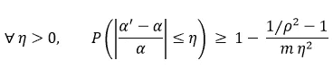

OLS 回归的简化公式

*其中*α’*是斜率估计值，η是相对误差，ρ是 X 和 Y 之间的相关性，m 是样本大小。*

*估算误差表示为“真实值”的一部分，而不是原始值，这一事实对于给出有用的实际答案至关重要，因为如果α=100，则像* α' *=α 1 这样的估算可能被认为是可接受的，如果α=0.1，则被认为是不可接受的。在我看来，使用与*α’*相关的置信区间，似乎与告知信任线性回归结果所需的最小样本量无关。*

# **频率主义者的方法**

在下面，如果α是随机变量 x 的一个矩，I 用α'表示α的任何无偏估计量(以及这个估计量对给定样本取的值)，用α̃表示样本矩。

## 一般结果的证明

考虑简单的线性回归:我们有 m 个观测值的 Y=αX+β+ϵ，并作出以下假设(高斯-马尔可夫假设):

*   严格的外来性:E[ϵ|X]=0
*   同质性:Var(ϵ|X)=σ
*   单独的误差项不相关

那么普通的最小二乘估计量α’是这样的:

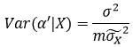

并且表示ρX 和 Y 之间的相关性:

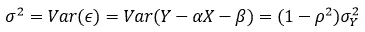

这意味着(使用 Bienaymé–Chebyshev 不等式):

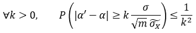

结果是:

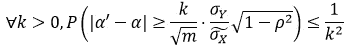

两边除以|α|:

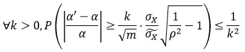

这种不平等就变成了:

最后:

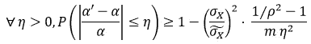

经典 OLS 回归的 PAC-贝叶斯公式

换句话说:

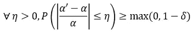

其中:

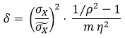

## 关于不等式的评论

*数据量*

误差的概率随着样本量的增加而降低。

*样本代表性*

误差低于η的概率受 X 的样本方差除以 X 的方差的限制(绝对值)。换句话说，X 的样本越能代表 X 可以取的值，误差的概率就越低。

*X 和 Y 的相关性*

当 X 和 Y 之间的相关性很高时，错误的概率就更低了。在ρ=1 的边界情况下，两个不同的点(x，y)足以完全知道α。

*误差幅度*

可接受的误差范围越小，误差超出该范围的可能性就越大。

## 数字示例

对于一个“足够有代表性”的样本，标准偏差之比等于 1，容许误差η= 10%，相关性ρ=0.8，至少需要 m=188 个数据，才能有(1-δ)=70%以上的机会估计系数α(在η之内)。

如果η=100%，则δ是α’和α符号相反的概率的上限。在这种情况下，对于其他参数使用与之前相同的值，m=6 个样本数据足以将该概率降低到δ <10%.

For a ratio of standard deviations equal to 1 (“representative sample”) and for an upper bound of the relative error η=10%, the graph below shows the evolution of the lower bound of the probability of the relative error with respect to the sample size m for different values of ρ, the correlation between X and Y.

Minimum sample size to perform an OLS regression (relative error η = 10%) — Image by author

## Normality assumption for the residuals

If we assume that: ϵ ~ N(0,σ² ) then:

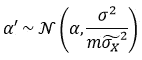

And we can use the following inequality:

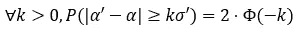

where Φ is the distribution function of N(0,1) and:

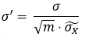

Therefore:

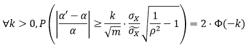

Consequently:

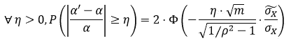

PAC-Bayesian formula for the OLS regression with normality assumption

Or alternatively:

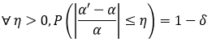

with:

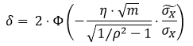

This framing establishes a somewhat peculiar confidence interval of width η⋅α (unknown) around α’, with a confidence level of (1-δ).

# **贝叶斯方法**

## 频率主义者和贝叶斯方法的区别

到目前为止，这些计算都是基于频率主义方法。在这个框架中，α'是一个随机变量，α是一个未知但固定的系数:研究一个人必须进行线性回归的最小样本量只对一般的方法考虑有效。一旦在实践中进行线性回归，人们就不再研究随机变量α’,而是研究它可以取的一个值:α’和α是两个数字，或多或少彼此接近，但与任何概率计算无关。这就是 frequentist 置信区间的问题:所寻求的值可能属于也可能不属于它，而不可能说出它的概率(区间的置信水平与这个特定区间包含该值的概率无关)。

也可以使用一种方法上非常不同的方法，贝叶斯分析。在这种情况下，它不再是一个关于一般情况的推理问题，想象一个人重复执行线性回归，而是同时包含所有特殊情况。那么α’是一个数，α是一个随机变量，就有可能知道对于每一个具体的线性回归，α接近α’的概率。可信区间是 frequentist 置信区间的贝叶斯框架中的镜像，但在这种情况下，相关的置信水平可以解释为α属于该区间的概率。

## 可信区间

这里考虑一个简单的贝叶斯线性回归的例子:Y=αX+β+ϵ

如果我们做如下假设:

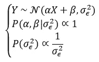

然后，α遵循学生的 t 分布，具有ν=(m-2)个自由度、位置参数α’和比例参数σ(关于此设置的更多细节，请参见 Merlise Clyde、Mine etinkaya-Rundel、Colin Rundel、、Christine Chai 和 Lizzy Huang 撰写的[贝叶斯思维简介](https://statswithr.github.io/book/introduction-to-bayesian-regression.html#bayesian-simple-linear-regression-using-the-reference-prior)):

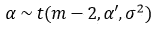

对于ν>2(因此 m>4)，该分布的平均值为α'，其方差为:

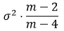

所以用我们正在研究的广义学生 t 分布的分布函数来表示 F:

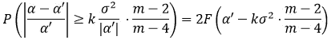

最后:

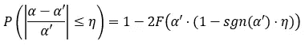

贝叶斯线性回归的可信区间

这是标准可信区间。必须注意，对 m 的依赖性并没有消失:它包含在函数 F 中，当 m 趋于无穷大时，函数 F 的方差趋近于 0。

# 结论

对于进行线性回归所需的最小样本量问题，给出一个详细的定量答案是可以想象的。实际上，使用高斯-马尔可夫假设，根据以下公式， *α* 上的相对误差低于某个阈值的概率取决于 X 和 Y 之间的实际相关性 *ρ* ，样本大小 m 和样本的代表性:

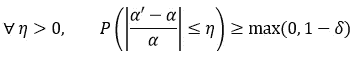

OLS 回归的 PAC-贝叶斯公式

其中:

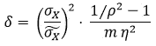