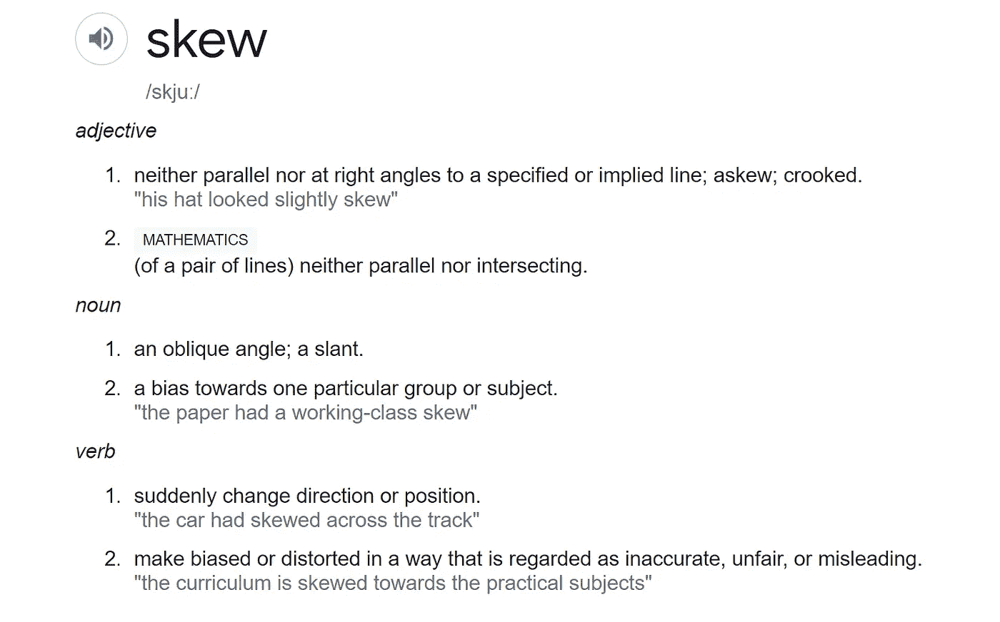
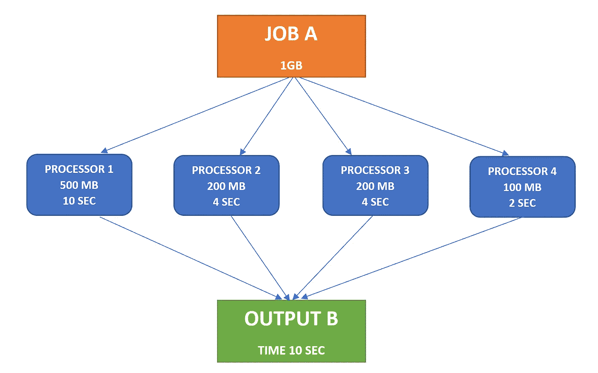
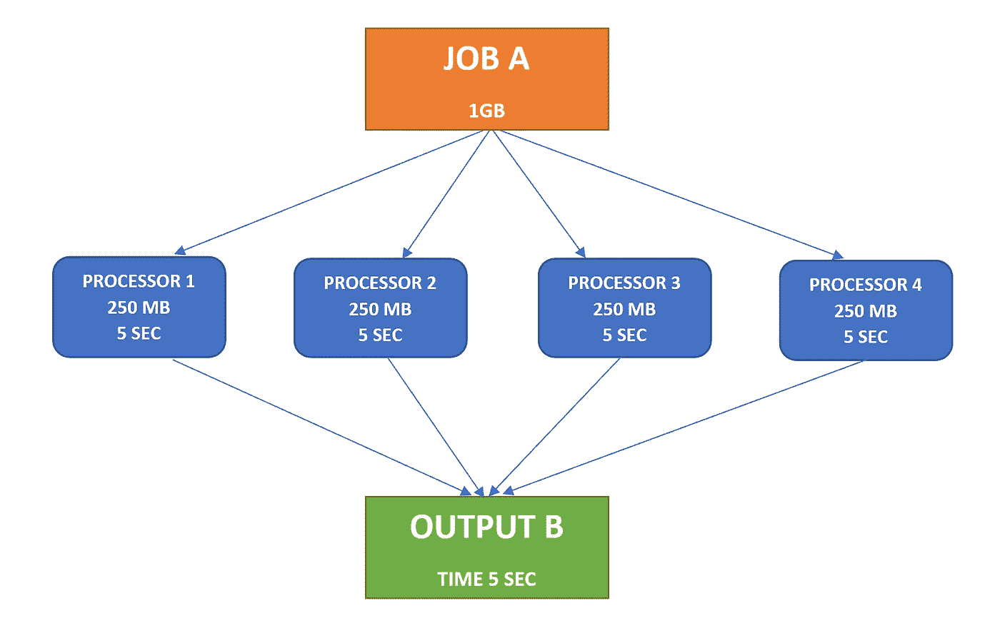
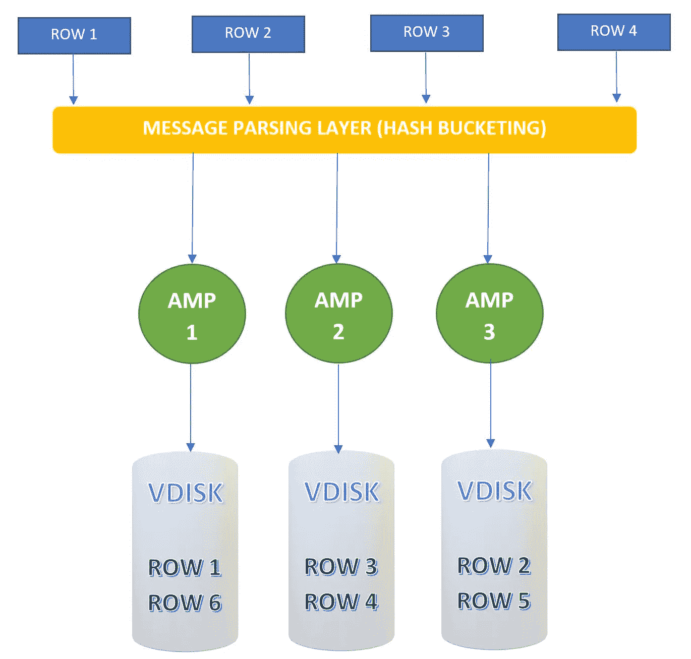
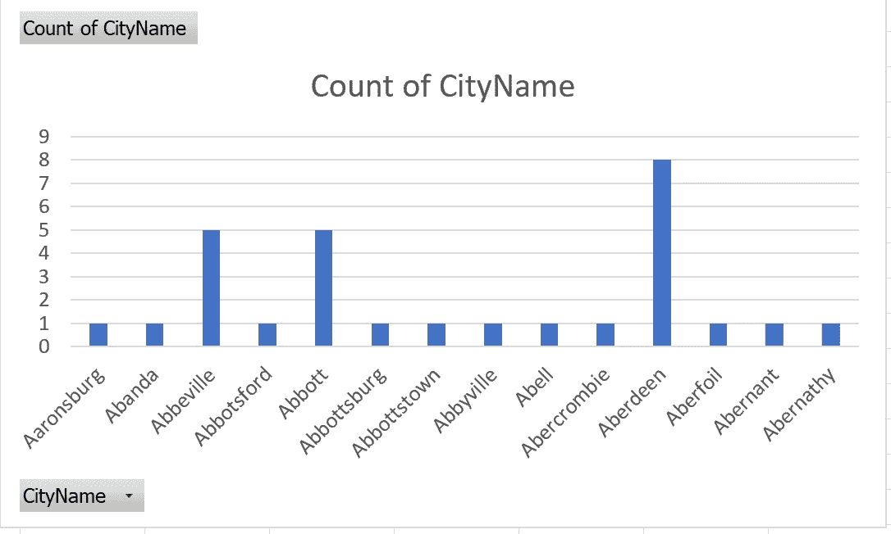

# 数据分析|数据倾斜|数据库中数据分布的重要性

> 原文：<https://towardsdatascience.com/what-is-the-significance-of-data-distribution-in-database-data-skew-4871147bed20?source=collection_archive---------17----------------------->

## 了解数据在数据库中是如何物理存储和检索的是非常有趣的

> 基于我以前作为数据分析师的经验，我将以 Teradata 为例解释关系数据库中的数据偏斜。

[Marcin Jozwiak](https://unsplash.com/@marcinjozwiak?utm_source=medium&utm_medium=referral) 在 [Unsplash](https://unsplash.com?utm_source=medium&utm_medium=referral) 上拍摄的照片

当我们简单地用谷歌搜索“SKEW”这个词时，它的意思会跳出来:

“歪斜”的字典含义|数据来源:谷歌字典

基本上，skew 的意思是有些事情不对劲！！

类似地，在一个数据集中，如果数据不是均匀分布的，那么它被称为**数据偏斜。**

在直接进入数据偏斜之前，了解关于处理的信息是很重要的。

# 顺序处理与并行处理

下图举例说明了两者的区别。

**顺序与并行处理|** 作者在 MS Word Stock images 中创建的图像

1.  **顺序处理**是指一次完成一项任务，所有任务由同一处理器按顺序运行。同样，如果这个处理器得到一个任务列表，每个任务一次完成，所有其他任务等到第一个任务完成。串行处理操作系统就是一个例子。这是一个运行在单一处理器上的操作系统。因此，在任何给定的时间，一个处理器完成一个任务，其他任务应该在队列中等待。
2.  **并行处理**是由不同的处理器一次完成多个任务。所以在并行处理中，涉及的处理器不止一个。如果有多个任务队列并且在任何给定时间由不同的处理器完成多个任务。运行在多核处理器上的任何操作系统都是并行处理的一个例子。*【1】*

先说基本问题！

> 为什么我们还要担心已经存储在[数据仓库](/data-warehouse-dimensional-modelling-use-case-study-ewallet-d9d16f559181)中的数据的一致性？这会影响查询性能吗？

如果您正在使用一台具有单处理器和单存储组件的机器，那么如果您运行一个查询，所有数据将由那个**单处理器**处理，并且您将得到一个输出。在这种情况下，即顺序处理中，数据不对称根本不会出现。

数据偏斜仅在发生**数据分布式处理**的**并行处理架构**中有效。数据分布式处理的重要性在于，如果一个作业被分成多个并行的较小的作业，由不同的处理器处理，而不是由单个处理器来完成，这样作业作为一个整体可以更快地完成。这减少了执行时间并提高了性能。

# 数据偏斜

让我们考虑一个具有 4 个相似处理器的并行处理系统。如果一个作业被分配给这个系统，它将在这 4 个处理器之间被划分，并且它们的输出被整合以提供最终的输出。

为了理解数据不对称的存在，让我们考虑两种情况:

**案例一:**

案例 1:非均匀数据分布(数据倾斜)|作者提供的图片

考虑情况 1，其中在多个处理器之间存在不均匀的数据分布。处理器 1 需要 10 秒来完成它的工作，但是处理器 4 只需要 2 秒来完成它的工作。即使处理器 4 很早就完成了它的任务，它也必须等待处理器 1 完成它的任务才能产生最终的输出。这种导致更多执行时间的数据非均匀分布的情况称为**数据偏斜。**

**案例二:**

案例 2:统一的数据分布(无数据偏差)|作者的图片

考虑情况 2，其中数据在多个处理器之间均匀分布。所有处理器需要 5 秒钟来完成任务。因此，最终输出可以在 5 秒钟后进行积分，因为所有子输出都已经可用。这种数据均匀分布的情况导致更少的执行时间，不会导致数据倾斜。

# Teradata 中的数据偏差

看看下面的“城市”表。

城市表示例数据集|按作者排序的表

让我们以 Teradata 架构为例，尝试理解数据倾斜。下图显示了 Teradata 并行处理架构中的数据分布情况。

Teradata 架构|作者图片

Teradata 中的 AMP 代表 ***访问模块处理器。*** AMP 是虚拟处理器(VPROC)，用于在 Teradata 数据库的多任务和可能的并行处理环境中管理数据库、处理文件任务和操纵磁盘子系统。每个放大器都有自己的微处理器、磁盘驱动器、文件系统、数据库软件(数据库管理器)、Teradata 操作系统(TOS)。*【2】*

Teradata 基于在创建表的过程中创建的主索引来分发数据。

下面的 [SQL 查询](/logical-flow-of-sql-query-sql-through-the-eye-of-database-e7d111c87516)可用于查看 Teradata AMPs 之间的数据分布。

数据分布 SQL 查询|作者代码

如果查看城市表数据，您可以看到 CityID 对于每一行都是唯一的，因此选择 CityID 作为主索引有助于跨 AMPs 统一数据分布。因此，不会有数据倾斜的问题。

但是如果主索引改为选择 CityName。该列中的值对于每一行并不唯一，而且这些值的分布也不均匀。可视化的最佳方式是绘制考虑中的列的直方图([数据分析](/data-analytics-data-profiling-use-case-study-investment-data-adf872152db6))。你可以看到阿伯丁市的更多记录。

> 偏斜的一个定义是“对一个特定群体或主题的偏见。”

城市名柱状图|作者图片

如果不同的值较少，并且每个值的计数差异较大，那么这对于主索引来说将是一个糟糕的候选。这将导致 amp 的数据分配差异很大，因此执行时间会更长。如果使用 CityName 而不是 CityID 作为主索引，数据偏差会更大。

以下查询用于查找表的偏斜系数:

倾斜因子 SQL 查询|作者代码

偏斜系数的最佳值是根据服务器配置确定的。通常，如果表中的总行数超过 5000，那么偏斜系数小于 20 就很好。

# 结论

总体数据分布在并行处理系统的性能中起着非常重要的作用。因此，将系统配置为均匀分布数据非常重要。

请务必查看以下文章，它们将有助于更好地理解这一主题:

</data-warehouse-dimensional-modelling-use-case-study-ewallet-d9d16f559181>  </logical-flow-of-sql-query-sql-through-the-eye-of-database-e7d111c87516>  </data-analytics-data-profiling-use-case-study-investment-data-adf872152db6>  

# 参考

1.  加工博士，拉赫曼，j。和拉赫曼，j。2021。*串行和并行加工的区别*。[在线] IT 发布。可在:<https://www . it release . com/2017/11/difference-serial-parallel-processing/>【2021 年 3 月 8 日访问】。
2.  【www.javatpoint.com】T4。 2021。 *Teradata 架构—Java point*。[在线]可在:<https://www.javatpoint.com/teradata-architecture>[2021 年 3 月 8 日访问]。
3.  Docs.teradata.com。2021. *Teradata 在线文档|快速访问技术手册*。[在线]可在 https://docs.teradata.com<>【2021 年 3 月 8 日访问】。