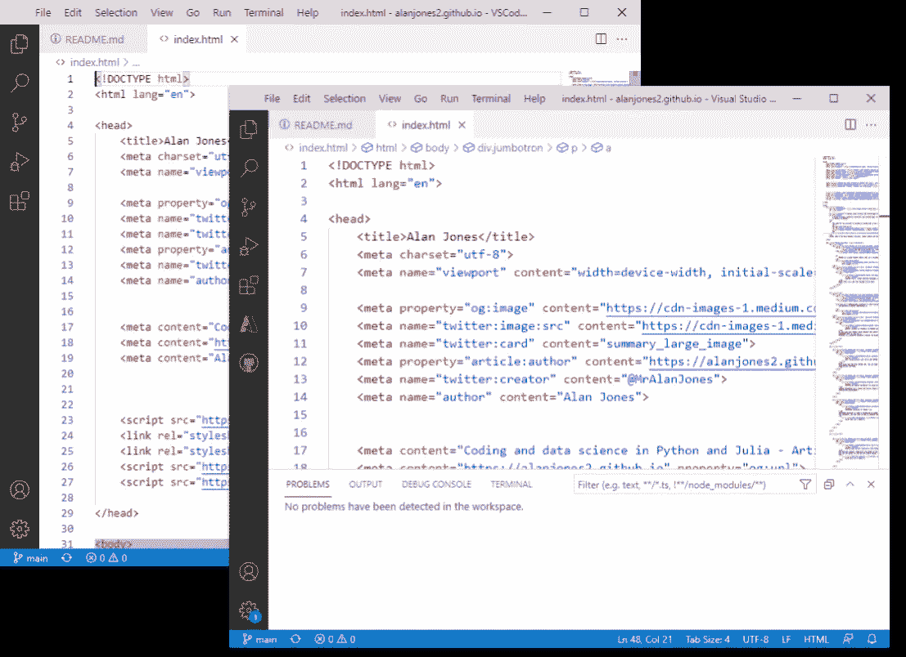
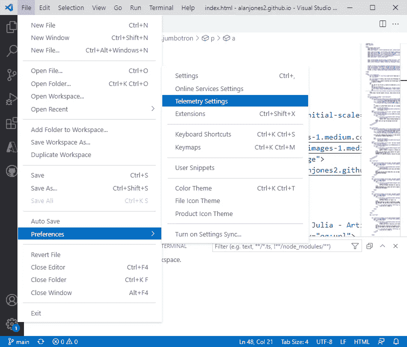
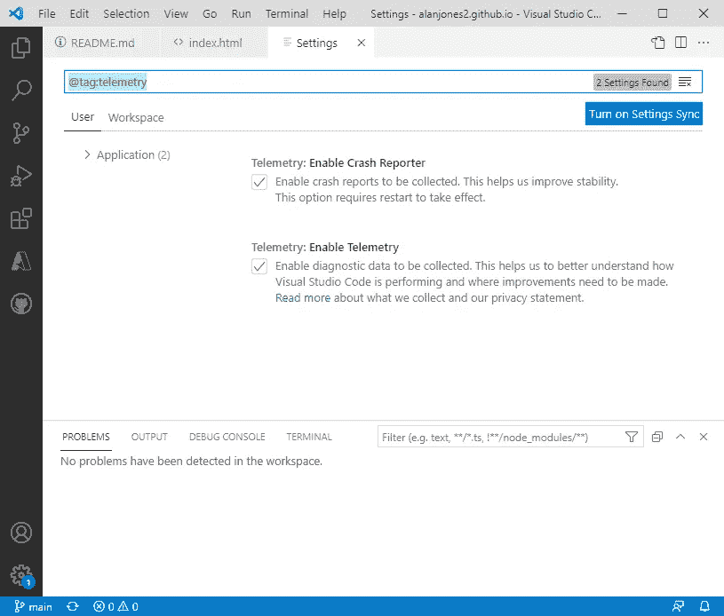

# 什么是 VSCodium，您应该使用它吗

> 原文：<https://towardsdatascience.com/what-is-vscodium-and-should-you-be-using-it-926e1369169a?source=collection_archive---------6----------------------->

## VSCodium 是 VSCode 的真正开源版本。它有什么优点吗？

VSCodium 和 VSCode，哪个是哪个？—作者图片

如果你喜欢 VSCode，那么你也会喜欢 VSCodium。我哪里知道？因为它们几乎完全相同。

看一下上面的图片，试着找出哪个是哪个(我已经去掉了标识，这样就不明显了)。事实上 VSCode 在右边，但是你不会真的知道(顺便说一下，你看到的代码是[我的 Github 页面](https://alanjones2.github.io/)的*index.html*)。

## 开放源码

VSCodium 是 VSCode 的完全开源版本——但是，等一下，VSCode 不是已经开源了吗？

不完全是。

VSCode 的源代码在麻省理工学院的许可下是可用的，所以*是*完全开源的，但是你从微软下载的二进制代码不是。

这是因为微软增加了额外代码来支持遥测技术(也许还有其他东西)。遥测代码监控你在做什么，并将信息发送回微软。这对开发人员来说是有用的反馈，因为他们可以了解他们的产品是如何使用的，并可以计划他们应该如何部署他们的工作，以添加新功能、修复 bug 和更新他们的 IDE。

VSCodium 是 VSCode 源代码的一个构建版本，它禁用任何遥测，并且不添加任何额外的代码。因此，它仍然是完全开源的，像源代码一样，是在 MIT 许可下发布的。

## 这有什么不同吗

不完全是。至少，在我的日常使用中没有。

使用 VSCodium 与使用 VSCode 是一样的。显然有一些扩展只适用于微软版本，但我还没有遇到过这些。我使用 Python 脚本和 Jupyter 笔记本的 Python 扩展，并使用 Git 连接我的 GitHub 存储库。这些在两种 ide 中的工作方式相同。

## 大哥在看你吗？

是的，在幕后，VSCode 正在向 Microsoft 发送数据，而 VSCodium 没有。但是你应该在乎吗？

我个人不这么认为。如果收集我的数据有助于微软改进 VSCode，那我没意见。但是我知道其他人可能会有不同的感受，这些人可能会更习惯使用 VSCodium。

或者，您可以关闭 VSCode 中的数据收集。转到*文件*菜单中的*首选项*并选择*遥测设置*。

在 VSCode- image by author 中选择遥测设置

您将在一个新的选项卡中获得设置页面，在这里您可以关闭遥测。

通过作者在 VSCode- image 中设置遥测设置

## 那是哪一个？

我的结论是，这其实并不重要。正如我前面说过的，它们几乎完全相同，安装它们都很简单。

你可以从[微软网站](https://code.visualstudio.com/)下载 VSCode，从[网站](https://vscodium.com/)或 [Github 库](https://github.com/vscodium/vscodium)下载 VSCodium。

或者，如果你喜欢冒险，你可以从 [VSCode Githup](https://github.com/microsoft/vscode) 库获得源代码并自己构建！

一如既往，感谢阅读。如果你想知道我什么时候发表新文章，请考虑在这里注册一个电子邮件提醒。

如果你不是一个媒体订阅者，那就注册吧，这样你就可以每月花 5 美元阅读尽可能多的文章。在这里注册我会赚一点佣金。