# 你的模型隐藏了什么？评估 ML 模型的教程

> 原文：<https://towardsdatascience.com/what-is-your-model-hiding-a-tutorial-on-evaluating-ml-models-71c894efcf36?source=collection_archive---------20----------------------->

## [实践教程](https://towardsdatascience.com/tagged/hands-on-tutorials)

## *如何在生产使用前探索分类模型的性能。*


图片作者。

假设你训练了一个机器学习模型。也许，有几个候选人可供选择。

您在测试集上运行它们，并得到一些质量评估。模型不会过度拟合。特色才有意义。总的来说，在手头数据有限的情况下，他们尽可能表现良好。

**现在，是时候决定它们中是否有足够好的产品了。**如何在标准性能检查之外评估和比较您的车型？

在本教程中，我们将通过一个例子来更详细地评估您的模型。

# 例证:预测员工流失

我们将使用一个来自 [Kaggle 竞赛](https://www.kaggle.com/pavansubhasht/ibm-hr-analytics-attrition-dataset)的虚拟数据集。目标是确定哪些员工可能会很快离开公司。

这个想法听起来很简单:通过提前警告，你可以阻止这个人离开。一个有价值的专家会留在公司——不需要寻找新的雇员，等到他们学会比喻。

让我们试着提前预测那些处于危险中的人！


图片作者。

**首先，我们检查训练数据。这是为我们方便收集的。经验丰富的数据科学家会怀疑！**

让我们想当然地跳过构建数据集的艰难部分。

我们有 1470 名员工的数据。

**共有 35 个特征描述类似于:**

*   员工背景(教育、婚姻状况等。)
*   工作的详细信息(部门、工作级别、出差需求等。)
*   工作经历(在公司的工作年限，最近一次晋升日期等。)
*   薪酬(工资、股票意见等。)

以及其他一些特征。

还有二进制标签，看谁离职了。正是我们需要的！

**我们把这个问题框定为一个概率分类任务。**模型应该估计每个员工属于目标“流失”类别的可能性。

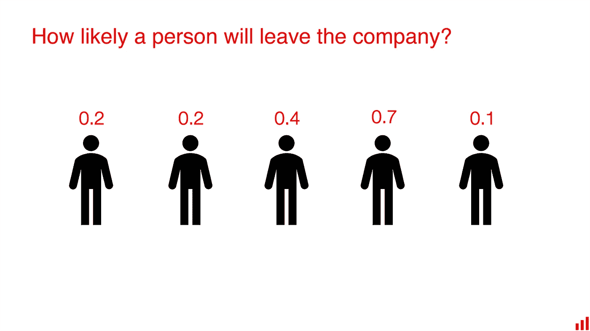

图片作者。

在处理模型时，我们通常分为训练数据集和测试数据集。我们使用第一个来训练模型。我们保留其余部分，以检查它在看不见的数据上的表现。

我们将不详述模型训练过程。这就是我们确信你知道的数据科学的魔力！

让我们假设我们进行了公平的实验。我们尝试了不同的模型，调整了超参数，在交叉验证中进行了区间评估。

**我们最终推出了两款技术上可靠、看起来同样出色的车型。**

接下来，我们在测试集上检查了它们的性能。以下是我们得到的信息:

*   ROC AUC 得分为 0.795 的随机森林模型
*   梯度增强模型的 ROC AUC 得分为 0.803

[ROC AUC](https://en.wikipedia.org/wiki/Receiver_operating_characteristic) 是在概率分类情况下优化的标准度量。如果你寻找这个 Kaggle 用例的众多解决方案，大多数人都会这么做。


图片作者。

我们的两个模型看起来都很好。比随机分割好得多，所以我们在数据中肯定有一些信号。

ROC AUC 评分接近。鉴于这只是单点估计，我们可以假设性能大致相同。

这两个我们该选哪个？

# 相同的品质，不同的品质

让我们更详细地看看这些模型。

我们将使用[显然](https://github.com/evidentlyai/evidently)开源库来比较模型并生成性能报告。

如果你想一步一步地跟随它，这里有一个[完整的 Jupyter 笔记本](https://github.com/evidentlyai/evidently/blob/main/evidently/tutorials/ibm_hr_attrition_model_validation.ipynb)。

**首先，我们训练了这两个模型，并在相同的测试数据集上评估了它们的性能**。

接下来，我们将两个模型的性能日志准备为两个熊猫数据帧。每个都包括输入要素、预测类和真实标注。

我们指定了列映射来定义目标、预测类以及分类和数字特征的位置。

**然后，我们调用*的*页签来生成** [**分类绩效报告**](https://evidentlyai.com/blog/evidently-018-classification-model-performance) **。**它在一个仪表盘中显示了两种型号的性能，以便我们进行比较。

```
comparison_report = Dashboard(rf_merged_test, cat_merged_test, column_mapping = column_mapping, tabs=[ProbClassificationPerformanceTab]) comparison_report.show()
```

**我们将更简单的随机森林模型作为基线。**对于工具，它成为“参考”第二梯度提升被表示为评估中的“当前”模型。

我们可以很快地在测试集上看到两个模型的性能指标的总结。

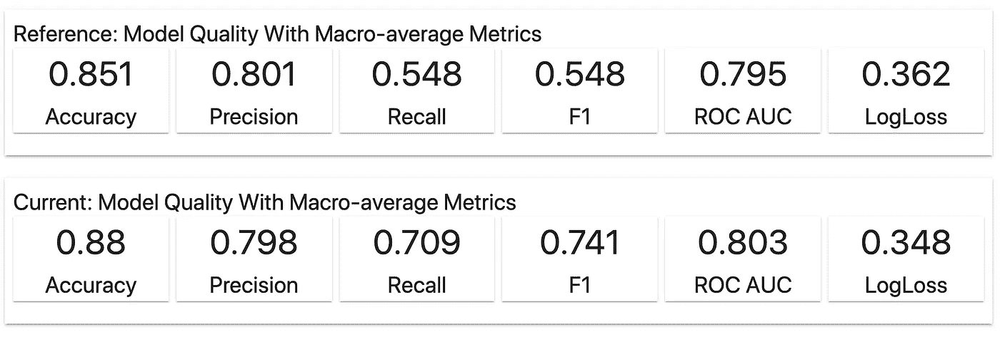

显然报道截图。

现实生活是不公平的，所以我们并不总是关注第二位数字。如果我们只看准确性和 ROC AUC，这两个模型的表现看起来非常接近。

我们甚至可能有理由支持更简单的随机森林模型。例如，因为它更易解释或具有更好的计算性能。

但是 F1 分数的差异暗示着事情可能不止如此。这些模型的内部运作各不相同。

# 关于不平衡班级问题的复习

精明的机器学习者知道诀窍。我们两个班级的规模相差甚远。在这种情况下，准确性度量没有多大用处。即使这些数字“在纸面上”看起来很好

**目标阶层往往是次要阶层。我们希望预测一些罕见但重要的事件:欺诈、流失、辞职。在我们的数据集中，只有 16%的员工离开了公司。**

如果我们做一个天真的模型，只是把所有员工归类为“可能留下来”，我们的准确率是全明星 84%！

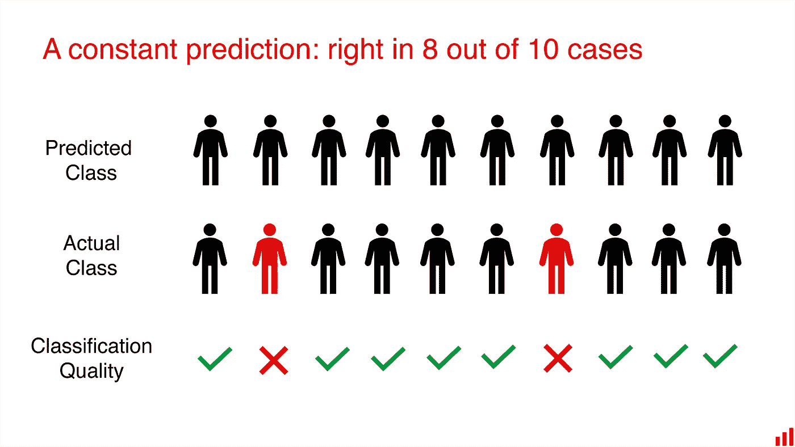

图片作者。

ROC AUC 并没有给我们一个完整的描述。相反，我们必须找到更适合预期模型使用的度量标准。

# 有一个“好”的模型意味着什么？

你知道答案:视情况而定。

如果一个模型能简单地指出那些即将辞职的人，而且总是正确的，那就太好了。那我们绝对可以做任何事！理想的模型适合任何用例——并且不会在现实中出现。

**相反，我们处理不完美的模型，使它们对我们的业务流程有用。**根据不同的应用，我们可能会选择不同的模型评估标准。

没有单一的衡量标准是理想的。但是模型并不存在于真空中——我们希望你从为什么开始！

让我们考虑不同的应用场景，并在此背景下评估该模型。

# 示例 1:标记每个员工

在实践中，我们可能会将该模型集成到一些现有的业务流程中。

假设我们的模型用于在内部人力资源系统的界面中显示一个标签。我们希望突出显示每个具有高流失风险的员工。当经理登录系统时，他们会看到部门中每个人的“高风险”或“低风险”标签。

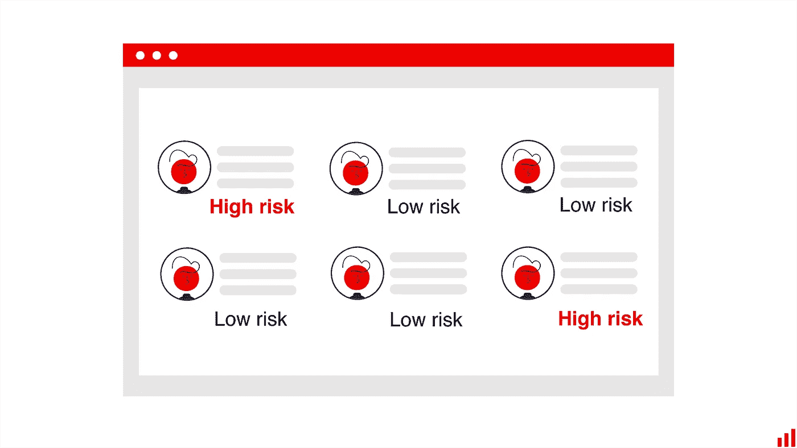

图片作者。

我们希望为所有员工显示该标签。我们需要我们的模型尽可能“正确”。但是我们已经知道准确性度量隐藏了所有重要的细节。我们将如何评估我们的模型呢？

## 超出准确度

让我们回到*显然是*的报告，更深入地分析两个模型的性能。

我们可以很快注意到两个模型的混淆矩阵看起来不同。

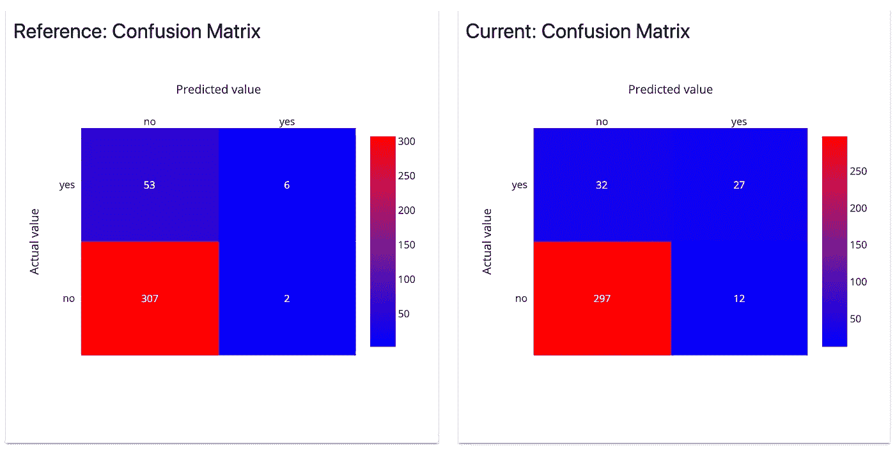

显然报道截图。

我们的第一个模型只有两个误报。听起来很棒？事实上，它并没有给我们太多关于潜在辞职的错误警告。

但是，另一方面，它正确地识别出只有 6 人辞职。另外 53 个被遗漏了。

第二个模型错误地将 12 名员工标为高风险。但是，它正确预测了 27 人辞职。它只漏了 32 个。

按类划分的质量度量图总结了这一点。让我们看看“是”类。

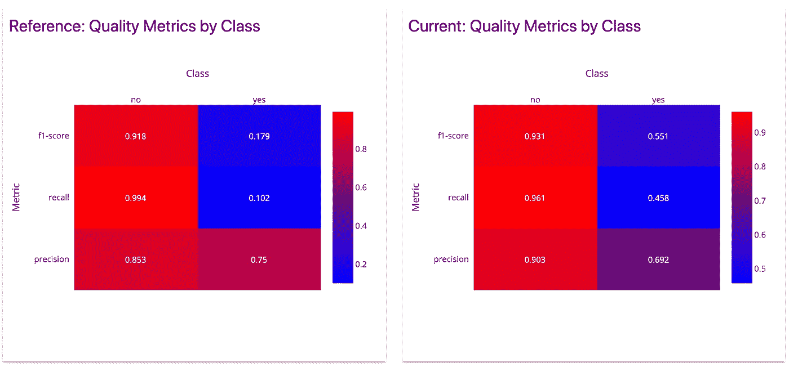

显然报道截图。

精确度大致相同:当模型预测辞职时，它在 69-75%的情况下是正确的。

但第二款车型在召回率上胜出！它发现 45%的人离开了公司，而第一种模式只有 10%。

**你会选哪个型号？**

最有可能的是，在目标“辞职”类中具有较高召回率的那个将会胜出。这有助于我们发现更多可能离开的人。

我们可以容忍一些假阳性，因为解释预测的是经理。人力资源系统中已经存在的数据也提供了额外的上下文。

更有可能的是，将可解释性添加到组合中是必要的。它可以帮助用户解释模型预测，并决定何时以及如何做出反应。

总而言之，我们会根据召回率来评估我们的模型。作为一个非 ML 标准，我们将增加由经理进行的功能可用性测试。具体来说，将可解释性视为接口的一部分。

# 示例 2:发送主动警报

让我们想象一下，我们期望在模型之上有一个特定的动作。

**它可能仍然会与相同的人力资源系统集成。**但现在，我们将根据预测发送主动通知。

也许，给经理发一封电子邮件，提示他安排与有风险的员工会面？或者可能的保留步骤的具体建议，例如额外的培训？


图片作者。

在这种情况下，我们可能会对这些误报有额外的考虑。

如果我们给经理发电子邮件太频繁，他们很可能会被忽视。不必要的干预也可能被视为负面结果。

**我们该怎么办？**

如果我们没有任何有价值的新特性可以添加，我们就只能使用现有的模型。我们不能追求更高的精确度。但是，我们可以限制我们行动的预测数量。

**目标是只关注那些预测风险高的员工。**

## 精确召回权衡

概率模型的输出是 0 到 1 之间的数字。为了使用预测，我们需要在这些预测的概率上分配标签。二元分类的“默认”方法是在 0.5 处切割。如果概率更高，标签就是“是”

相反，我们可以选择不同的阈值。也许，0，6 甚至 0，8？通过将其设置得更高，我们将限制误报的数量。

但这是以回忆为代价的:我们犯的错误越少，正确预测的数量也越少。

这个来自*报告的阶级分离图显然让这个想法非常直观。它在实际标签旁边显示了单个预测概率。*

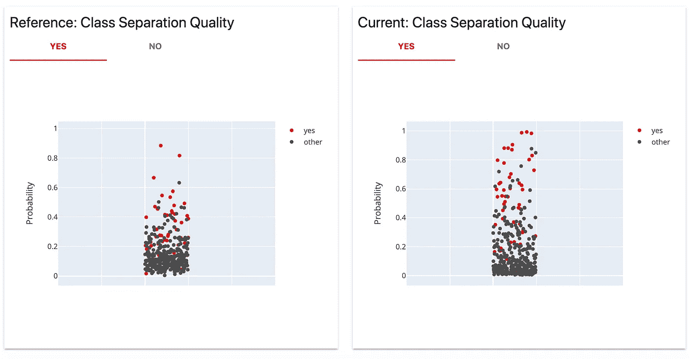

显然报道截图。

我们可以看到，第一个模型做出了一些非常有把握的预测。稍微“上调”或“下调”阈值不会对绝对数字产生很大影响。

然而，我们可能会欣赏一个模特挑选几个案例的能力。例如，如果我们认为误报的成本非常高。在 0.8 处进行截止将给出 100%的精度。我们只会做两个预测，但都是对的。

**如果那是我们喜欢的行为，我们可以从一开始就设计这样一个“果断”的模型。**它将强烈惩罚假阳性，并在概率范围的中间做出更少的预测。(老实说，这正是我们为这个演示所做的！).

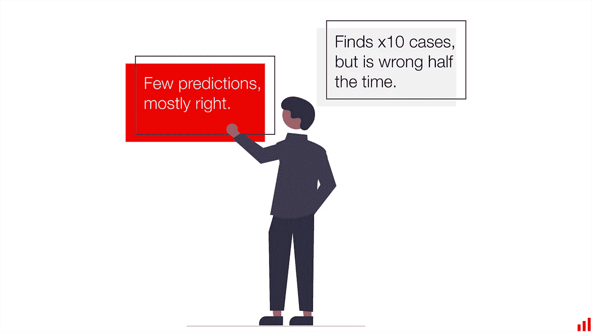

图片作者。

**第二个模型的预测概率更加分散。**改变阈值会产生不同的情况。我们只需看图像就能做出一个大概的估计。例如，如果我们将阈值设置为 0，8，那么只会给我们留下一些误报。

更具体地说，让我们看看精确召回表。旨在帮助类似情况下阈值的选择。它显示了 top-X 预测的不同方案。

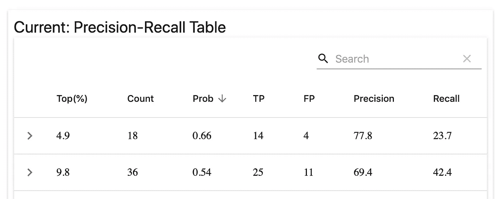

显然报道截图。

例如，我们可以只对第二个模型的前 5%的预测采取行动。在测试集上，它对应于 66%的概率阈值。所有预测概率较高的员工都被认为有可能离职。

在这种情况下，只剩下 18 个预测。但是其中 14 个会是正确的！召回率下降到只有 23.7%，但准确率现在是 77.8%。我们可能更喜欢它比原来的 69%的精度，以尽量减少假警报。

为了简化概念，我们可以想象在阶级分离图上画一条线。

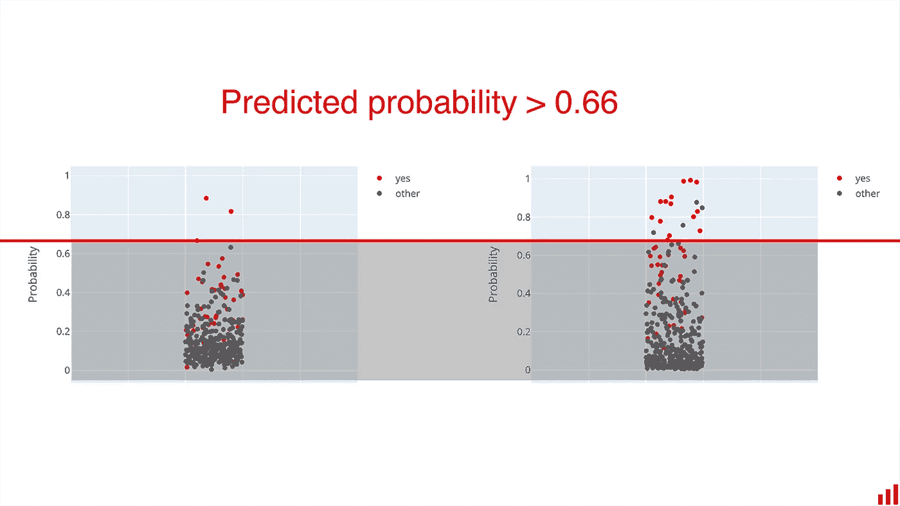

图片作者。

**在实践中，我们可能会以两种方式之一进行限制:**

*   通过只对 top-X 预测采取行动，或者
*   通过将概率大于 X 的所有预测分配给正类。

第一个选项适用于批量模型。如果我们一次为所有员工生成预测，我们可以对它们进行排序，并选择前 5%的员工。

如果我们根据要求进行单独的预测，选择一个定制的概率阈值是有意义的。

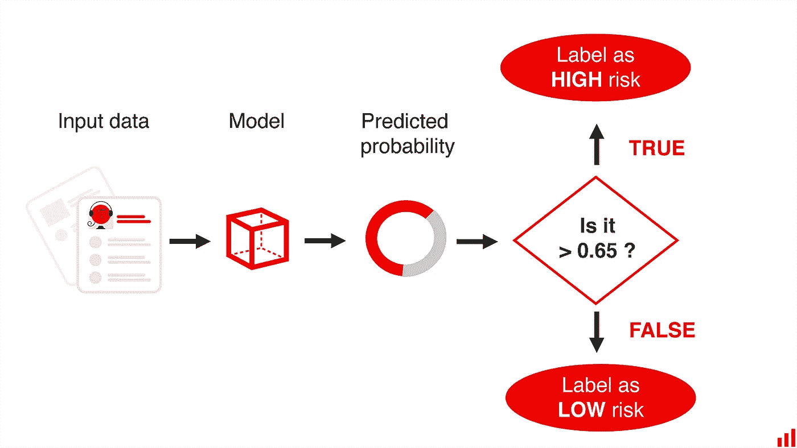

图片作者。

这两种方法都可以工作，这取决于用例。

我们也可能决定用不同的方式来可视化标签。例如，将每个员工标记为高、中或低流失风险。这将需要基于预测概率的多个阈值。

在这种情况下，我们将额外关注模型校准的质量，如类分离图上所示。

**综上所述，我们将考虑精确召回权衡来评估我们的模型并选择应用场景。**我们选择一个阈值，而不是为每个人显示一个预测。这有助于我们只关注流失风险最高的员工。

# 示例 3:有选择地应用模型

我们还可以采取第三种方法。

当看到两个模型的不同情节时，一个显而易见的问题出现了。图中点后面的具体员工是谁？这两个模型在预测不同角色、部门、经验水平的辞职者时有何不同？

这种分析可能有助于我们决定何时应用该模型，何时不应用。如果存在模型失效的明显部分，我们可以排除它们。或者反过来，我们只能在模型表现良好的地方应用它。

在界面中，我们可以显示类似“信息不足”的内容这可能比一贯错误要好！

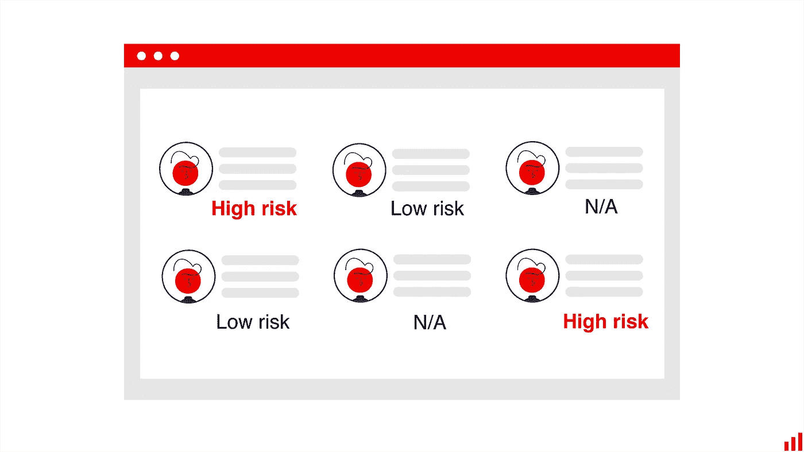

图片作者。

## 表现不佳的部分

为了更深入地了解表现不佳的细分市场，我们来分析一下分类质量表。对于每个特征，它将预测概率与特征值一起映射。

**这样，我们可以看到模型在哪里出错**，以及它们是否依赖于单个特性的值。

我们举个例子。

这里有一个职务级别特征，它是角色资历的一个特定属性。

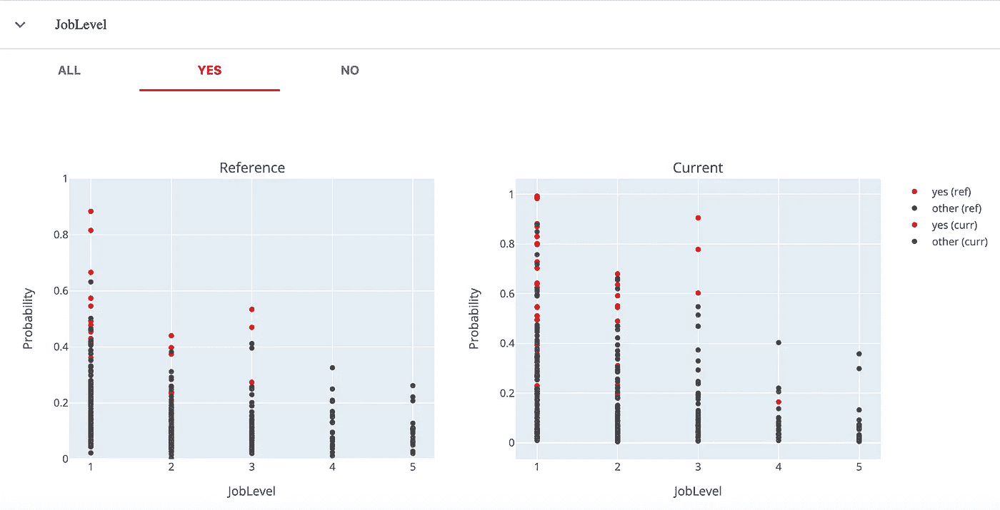

显然报道截图。

**如果我们对第一级**的员工最感兴趣，第一种模式可能是个不错的选择！它以很高的概率做出一些自信的预测。例如在 0，6 阈值处，在该组中只有一个假阳性。

如果我们想预测 3 级的辞职，第二个模型看起来要好得多。

**如果我们希望我们的模型适用于所有级别**，我们可能会再次选择第二种模型。平均而言，它在 1 级、2 级和 3 级都有可接受的性能。

**但有趣的是，这两种模型在第 4 级和第 5 级上的表现如何。**对于为这些群体中的员工所做的所有预测，概率明显低于 0.5。这两种模型总是分配一个“负面”标签。

如果我们看看真实标签的分布，我们可以看到，在这些工作级别中，辞职的绝对数量相当低。很可能在训练中也是如此，这个模型并没有为这个部分挑选出任何有用的模式。

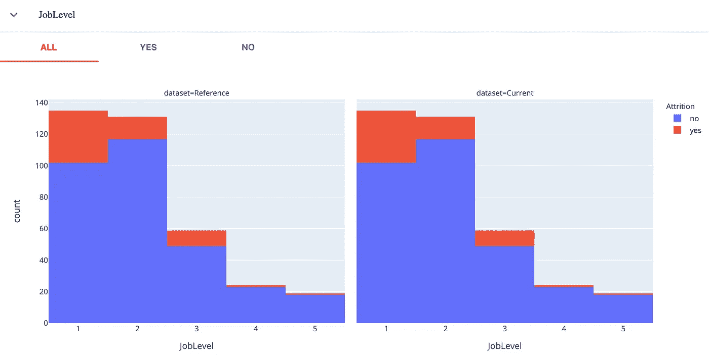

显然报道截图。分布是相同的，因为我们在相同的测试数据集上比较性能。

如果我们要在生产中部署一个模型，我们可以构建一个简单的业务规则，并从应用程序中排除这些部分。

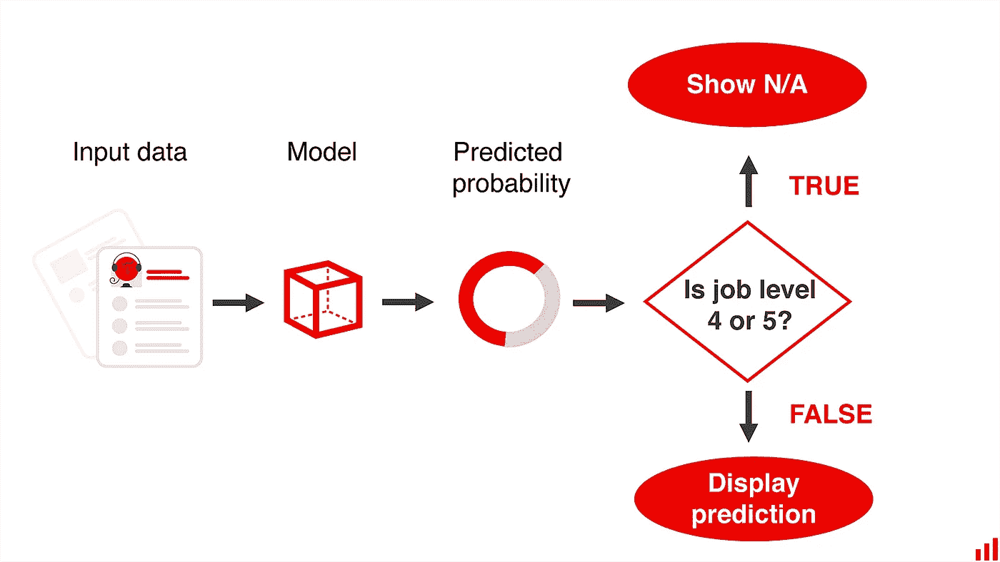

图片作者。

**我们还可以使用这个分析的结果来将我们的模型放在一个“性能改进计划”中**也许，我们可以添加更多的数据来帮助模型？

例如，我们可能有最初从训练中排除的“旧”数据。我们可以有选择地为表现不佳的细分市场增加我们的训练数据集。在这种情况下，我们将添加更多关于 4 级和 5 级员工辞职的旧数据。

总而言之，我们可以确定我们的模型失败的具体部分。我们仍然为尽可能多的员工展示预测。但是我们知道这个模型远非完美，所以我们只把它应用于那些表现最好的部分。

# 模型知道什么？

这个表还可以帮助我们更详细地理解模型的行为。我们可以探索错误、异常值，并对模型学到的东西有所了解。

例如，我们已经看到第一个模型自信地预测只有少数人辞职。第二个模型从我们的数据中“捕捉”更多有用的信号。它从哪里来？

如果我们看看我们的特征，我们可以得到一个提示。

**例如，第一个模型只成功预测了公司相对较新员工的辞职。**第二个模型可以发现拥有长达 10 年经验的潜在离职者。从这个图中我们可以看出:

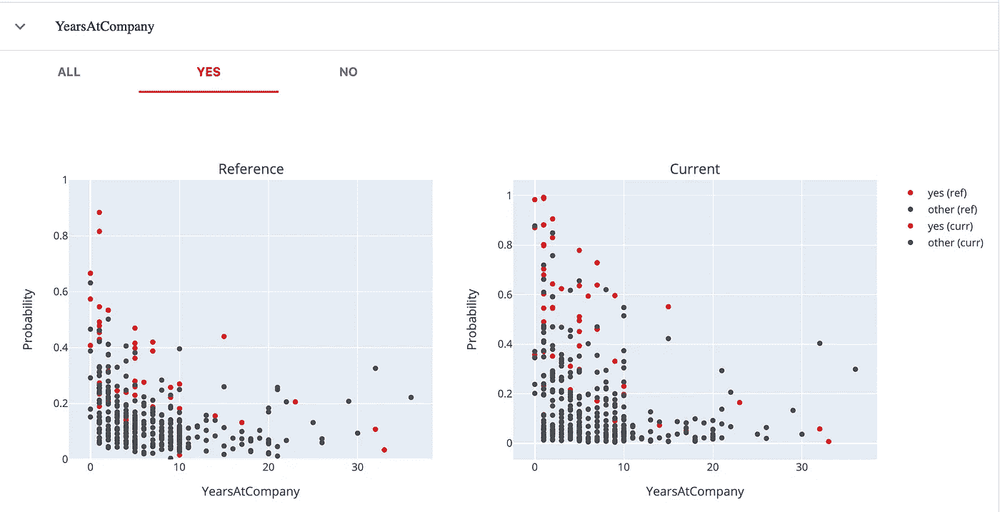

显然报道截图。

**我们可以在股票期权层面看到类似的事情。**

第一个模型只成功地预测了 0 级。即使我们有相当多的辞职者，至少在 1 级也是如此！第二个模型捕捉到了更多的高水平离开的人。

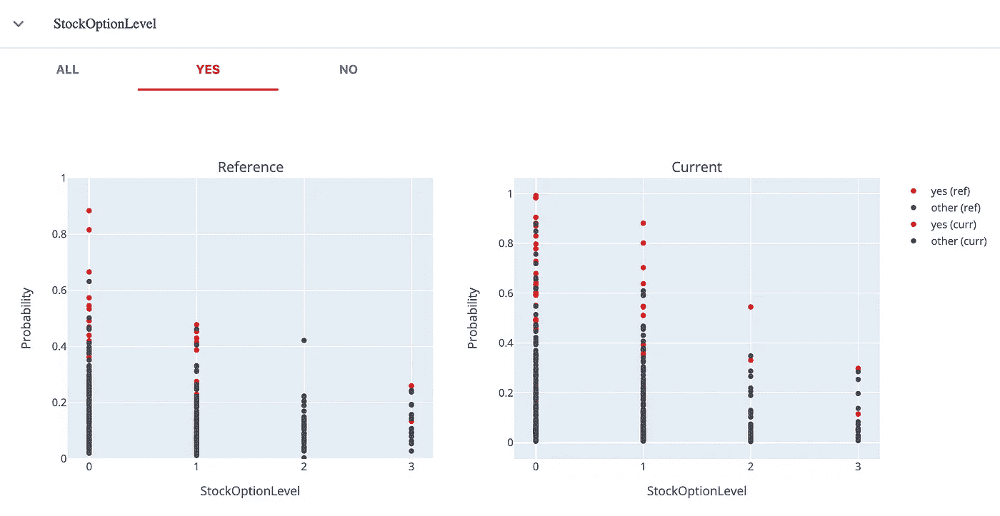

显然报道截图。

但是，如果我们观察工资增长(即最近的工资增长)，我们将不会注意到任何一个模型表现更好或更差的明确部分。

除了第一个模型的一般特征之外，没有任何特定的“偏斜”来做出更少的自信预测。

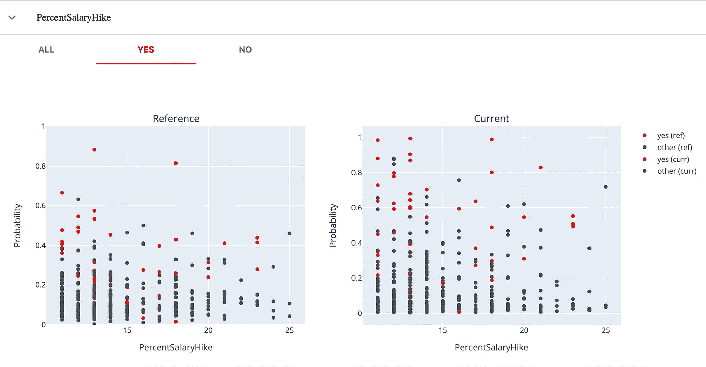

显然报道截图。

类似的分析可以帮助在模型之间进行选择，或者找到改进它们的方法。

就像上面的 JobLevel 的例子一样，我们可能有办法增加我们的数据集。我们可能会添加其他时期的数据或包含更多功能。在不平衡片段的情况下，我们可以尝试给特定的例子更多的权重。作为最后的手段，我们可以添加业务规则。

# 我们有赢家了！

回到我们的例子:第二个模型在大多数情况下都是赢家。


图片作者。

但是谁会只看 ROC AUC 就信以为真呢？

我们必须超越单一指标来深入评估模型。

它适用于许多其他用例。性能比准确性更重要。并且不总是可能为每种错误类型分配直接的“成本”来对其进行优化。像对待产品一样对待模型，分析必须更加细致入微。

重要的是不要忽略用例场景，并把我们的标准与它联系起来。可视化可能有助于与不以 ROC AUC 术语思考的业务利益相关者进行交流。

# 附属细则

一些免责声明。


图片来源: [Unsplash](https://unsplash.com/photos/cOWn-bYGmlc) 。

**本教程少讲辞职预测，多讲模型分析！**

如果你想解决一个类似的用例，让我们指出这个玩具数据集中的一些限制。

*   我们缺少一个关键的数据点:辞职的类型。人们可以自愿离职、被解雇、退休、搬到全国各地，等等。这些都是不同的事件，将它们组合在一起可能会产生模糊的标签。专注于“可预测”类型的辞职或解决多类别问题将是有意义的。
*   **没有足够的工作背景。**其他一些数据可能更好地表明了流失情况:绩效评估、具体项目、促销计划等。这个用例要求领域专家仔细构建训练数据集。
*   **没有关于时间和辞职日期的数据。我们无法解释事件的顺序，也无法联系到公司历史上的特定时期。**

**最后但同样重要的是，像这样的用例可能非常敏感。**

您可以使用类似的模型来预测一线人员的流动率。目标是预测招聘部门的工作量和相关的招聘需求。不正确的预测会导致一些金融风险，但这些很容易被考虑进去。

但是，如果这个模型被用来支持关于单个雇员的决策，其含义可能更为关键。例如，考虑分配培训机会时的偏见。我们应该评估用例的道德，并审核我们的数据和模型的偏见和公平性。

# 我能为我的模型做同样的事情吗？

**如果想走一遍教程示例**，这里的[就是 Jupyter 笔记本。它包括使用 Kaggle 的](https://github.com/evidentlyai/evidently/blob/main/evidently/tutorials/ibm_hr_attrition_model_validation.ipynb)[员工流失数据集](https://www.kaggle.com/pavansubhasht/ibm-hr-analytics-attrition-dataset)训练两个模型并生成*明显的*报告的所有步骤。

**如果您想对您的型号**执行类似的诊断检查，请转到 [GitHub](https://github.com/evidentlyai/evidently) ，pip install*apparent*，并选择合适的分类或回归仪表板选项卡。还有呢！

*最初发表于*[*https://evidentlyai.com*](https://evidentlyai.com/blog/tutorial-2-model-evaluation-hr-attrition)*并与* [*埃琳娜·萨穆伊洛娃*](https://www.linkedin.com/in/elenasamuylova/) *合著。*

如果你喜欢这个教程，看看上一个<https://evidentlyai.com/blog/tutorial-1-model-analytics-in-production>**！**

**在显然 AI，我们构建* [*开源工具*](https://github.com/evidentlyai/evidently) *来分析和监控机器学习模型。为了支持这个项目，给我们上一个⭐️*[*github*](https://github.com/evidentlyai/evidently)*！**

*想留在圈子里吗？*

*   **关注我们上*[*Twitter*](https://twitter.com/EvidentlyAI)*和*[*Linkedin*](https://www.linkedin.com/company/evidently-ai/)*；**
*   *[*报名*](https://evidentlyai.com/sign-up) *获取我们的更新和产品消息；**
*   **或者加入我们的* [*不和谐社区*](https://discord.gg/xZjKRaNp8b) *聊天连线！**