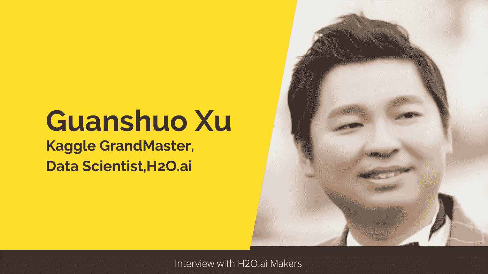
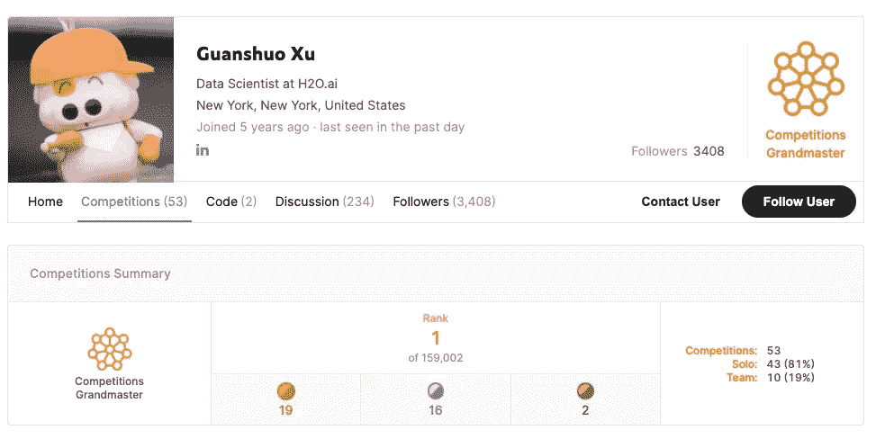
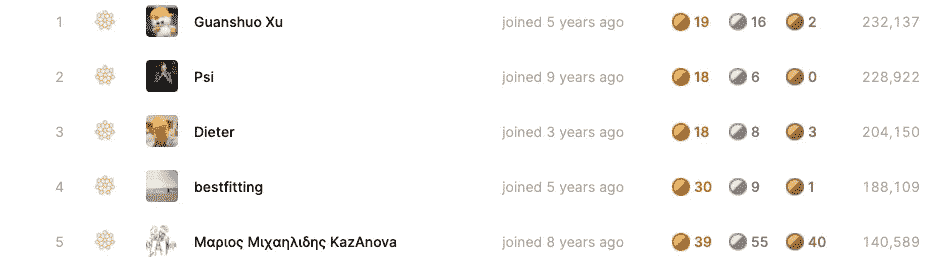
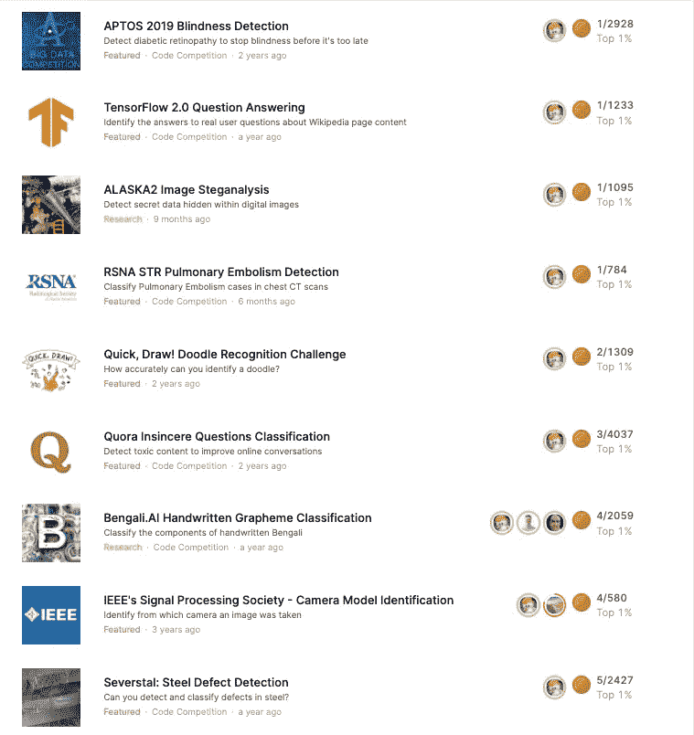
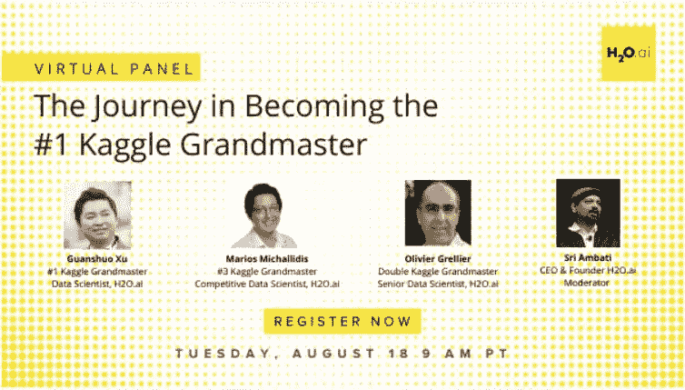

# 如何成为 Kaggle 上的世界第一

> 原文：<https://towardsdatascience.com/what-it-takes-to-become-a-world-no-1-on-kaggle-f149df44e98c?source=collection_archive---------17----------------------->

## [行业笔记](https://towardsdatascience.com/tagged/notes-from-industry)

## 与 Guanshuo Xu 对话:数据科学家，Kaggle 竞赛特级大师(排名 1)，电气工程博士。

作者图片

在这一系列采访中，我展示了 [H2O.ai](https://www.h2o.ai/) 的知名数据科学家和 Kaggle 大师的故事，他们分享了他们的旅程、灵感和成就。这些采访背后的意图是激励和鼓励那些想了解成为一名 Kaggle 特级大师需要什么的人。

在这篇文章中，我将分享我与**徐冠硕的互动。**他是 **Kaggle 竞赛特级大师**和 [**H2O.ai**](https://www.h2o.ai/) 的**数据科学家**。关硕在[新泽西理工学院](https://www.linkedin.com/school/njit/)获得了电气&电子工程博士学位，主要研究基于机器学习的图像取证和隐写分析。

关朔是一个多才多艺的人。他的真实世界图像篡改检测和定位方法在 [**首届 IEEE 图像取证挑战赛**](http://www.grip.unina.it/images/wifs2013/Ranking_Phase1.pdf) 中获得第二名。他的深度神经网络架构设计首次在图像隐写分析中胜过了传统的基于特征的方法。最近，关硕还在 Kaggle 上赢得了 [Alaska2 图像隐写分析](https://www.kaggle.com/c/alaska2-image-steganalysis)和 [RSNA STR 肺栓塞检测竞赛，在竞赛级别中获得世界排名第一。](https://www.kaggle.com/c/rsna-str-pulmonary-embolism-detection)

> *这里还有一个* [*链接*](https://www.youtube.com/watch?v=lkUhibNLMNk) *到关硕在****ctds . show****的采访，在那里他讨论了自己在 Kaggle 上的成就。*

在这次采访中，我们将更多地了解他的学术背景、对 Kaggle 的热情以及他通往冠军头衔的旅程。以下是我和关硕的对话节选:

你有电气工程博士的背景。这是否在某种程度上影响了你将机器学习作为职业的决定？

***关硕:*** 是的，我的博士研究使用机器学习技术解决了像图像篡改检测和隐藏数据检测这样的问题。例如，我的最后一个博士研究项目是将深度神经网络用于图像隐写分析。所以我的教育和研究都和机器学习直接相关。因此，机器学习对我来说是职业的自然选择。

你与 Kaggle 的幽会是如何开始的，是什么让你在你的大师之旅中一直保持动力？

[*关硕的卡格尔简介*](https://www.kaggle.com/wowfattie/competitions)

***关硕:*** 从发现 kaggle 开始，我就一直沉迷其中。在 Kaggle 上持续竞争的一些激励因素将是赢得比赛和奖金的综合满足感，学习新技术，拓宽和深化我对机器学习的理解，以及建立令人惊讶的有效模型。

在比赛中成为世界第一感觉如何？这在比赛中会带来额外的压力吗？

截止日期，比赛类别中的前 5 名卡格尔|来源:[卡格尔网站](https://www.kaggle.com/rankings)

***关硕:*** 老实说，保持排名第一的压力比实现它要大得多。这是因为它需要“更平滑”的性能。有时我不得不同时参加比以前更多的比赛。

你通常如何处理一个难题？

管硕竞赛简介一瞥。来源:[https://www.kaggle.com/wowfattie/competitions](https://www.kaggle.com/wowfattie/competitions)

***关硕:*** 我的做法根据题型和比赛目标的不同而不同。如今，我经常花几天甚至几周的时间去理解数据和问题，并思考解决方案，例如，猜测私有测试数据的分布、适当的验证方案、详细的建模步骤等。一旦我对整体方法有了大致的了解，我就开始编码和建模。这个过程帮助我获得更多的理解，并在必要时对整体方法进行修正或调整。

**你能让我们先睹为快看看你的工具包吗，比如你最喜欢的编程语言、IDE、算法等等**

***关硕:*** 就我的工具包来说，我大多用 gedit，Python，Pytorch 进行深度学习。

**数据科学领域正在快速发展。你是如何设法跟上所有最新发展的？**

我通过 Kaggle、我的同事，甚至仅仅通过谷歌搜索来了解大部分新东西和新技术。就机器学习的新发展而言，要看实际需求。我倾向于过滤掉任何没有即时帮助的东西，也许会关注潜在的令人兴奋的东西。然后我会在需要的时候回来。

**给刚刚开始或希望开始数据科学之旅的数据科学有志者一点建议？**

[一个虚拟的面板，关硕在那里，与各位 H2O.ai Kaggle 特级大师一起。](https://www.youtube.com/watch?v=pRHM6rywOIQ)

***关硕:*** 这基本上取决于每个人的背景和兴趣。然而，找到一个合适的平台来学习和发展技能通常会使事情变得容易得多。此外，参加 Kaggle 比赛可以证明是一个额外的有益资源。

取得世界第一的成绩绝非易事，关硕坚持不懈的态度和努力值得所有的荣誉。对他在 Kaggle 上的各种成功解决方案的一瞥展示了他的结构化方法，这是解决问题的一个必不可少的元素。

# 阅读本系列的其他采访:

*   [*Rohan Rao:数据科学家从数独到 Kaggle*](/a-data-scientists-journey-from-sudoku-to-kaggle-120876b7fa33) 的旅程
*   Shivam Bansal:数据科学家，负责 Kaggle 上的“数据科学为善”竞赛。
*   见见 Yauhen:第一位也是唯一一位来自白俄罗斯的 Kaggle 特级大师。
*   [*苏达莱·拉杰库马尔:对数字的热情是如何将这位机械工程师变成了一位围棋大师*](/how-a-passion-for-numbers-turned-this-mechanical-engineer-into-a-kaggle-grandmaster-8b1ae218afc)
*   [*加博·福多尔:卡格尔世界“白鲸”的励志之旅🐋*](/the-inspiring-journey-of-the-beluga-of-kaggle-world-5409e740a21b?sk=a500e2014feb175eae520931ff43b419)
*   [*在 Kaggle*](/meet-the-data-scientist-who-just-cannot-stop-winning-on-kaggle-dfc0e6fe88f8?sk=bd58ca871ab26ab13917b338020c4a0c) 上遇见无法停止胜利的数据科学家
*   [*师夷长技以制夷——论卡格尔所说的这位土耳其一代宗师*](/learning-from-others-is-imperative-to-success-on-kaggle-says-this-turkish-grandmaster-d8b5bf28ac87?sk=940c646515035c18aca050bab1469364)

*原载于* [*H2O.ai 博客*](https://www.h2o.ai/blog/what-it-takes-to-become-a-world-no-1-on-kaggle/)

*👉有兴趣看我写的其他文章。这个* [*回购*](https://github.com/parulnith/Data-Science-Articles/blob/main/README.md) *包含了我分类写的所有文章。*