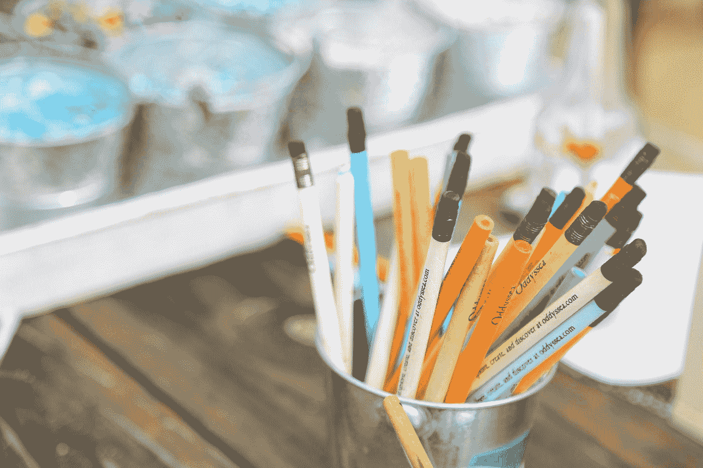

# 你是哪种数据科学学习者？

> 原文：<https://towardsdatascience.com/what-kind-of-data-science-learner-are-you-b7079d29b95b?source=collection_archive---------16----------------------->

## [变量](https://towardsdatascience.com/tagged/the-variable)

## 我们每周精选的必读编辑精选和原创特写

与 TDS 社区的成员聊天总是令人振奋的，但在一个特定的方面尤其如此:认识到人们的学习习惯和风格是多么广泛。这当然是有道理的。人们从不同的专业、学术和文化背景来研究数据科学，对一些人有用的东西对其他人可能不一定有用。

例如，在本周的《作者聚焦》中，多产撰稿人 [Khuyen Tran](https://medium.com/u/84a02493194a?source=post_page-----b7079d29b95b--------------------------------) 分享了她消化复杂话题的可靠方法:教授它们。只有当 Khuyen 将概念转化为其他人可以理解和使用的东西时，他们才会为她点赞。[阅读我们与 Khuyen](/to-learn-data-science-faster-teach-it-234dc833120f) 的 Q & A，它涵盖了很多领域——包括公开写作对吸引潜在雇主的好处以及她对人工智能伦理的想法。

由 [Alexander Gamanyuk](https://unsplash.com/@alexander_gamanyuk?utm_source=medium&utm_medium=referral) 在 [Unsplash](https://unsplash.com?utm_source=medium&utm_medium=referral) 上拍摄

对于每一个通过教学学习的数据科学家，至少有一个(可能更多？)他们喜欢在回到现实世界并找到理论的实际用途之前一头扎进理论的深处。如果这听起来像你，我们这个星期为你准备了相当多的款待。[从来自](/geometric-foundations-of-deep-learning-94cdd45b451d) [Michael Bronstein](https://medium.com/u/7b1129ddd572?source=post_page-----b7079d29b95b--------------------------------) 及其合著者的最新研究开始，该研究将几何深度学习作为一个具有双重目标的框架进行了介绍:

> 它有两个目的:第一，提供一个通用的数学框架来推导最成功的神经网络结构，第二，给出一个建设性的程序来以有原则的方式构建未来的结构。

还想读一本崇高的、思辨的书吗？ [Gadi Singer](https://medium.com/u/51de1f48d0b?source=post_page-----b7079d29b95b--------------------------------) 写了一篇引人入胜的分析文章，分析了[对认知人工智能](/the-rise-of-cognitive-ai-a29d2b724ccc)的承诺，以及“将人工智能与符号推理和深度知识相结合”将如何带来人工智能的下一个阶段。如果连*的那篇*还不够，你可以随时求助于[罗伯特·兰格](https://medium.com/u/638b9cae9933?source=post_page-----b7079d29b95b--------------------------------)，他又回来了，带来了另一轮[他备受期待的每月推荐研究论文精选](/four-deep-learning-papers-to-read-in-may-2021-706e02071473)。

如果你更像是一个混合型学习者——喜欢温和、全面地介绍一个主题，但也喜欢动手操作的元素——我们听你的。外面有很多你们这样的人！选择你的冒险:

*   跟随 [Carolina Bento](https://medium.com/u/e960c0367546?source=post_page-----b7079d29b95b--------------------------------) ，她[用一个最好的例子解释泊松分布(和泊松点过程)](/poisson-process-and-poisson-distribution-in-real-life-modeling-peak-times-at-an-ice-cream-shop-b61b74fb812):一家冰淇淋店。
*   [Lulu Ricketts](https://medium.com/u/8ecf02fa0607?source=post_page-----b7079d29b95b--------------------------------) 涵盖了[两种最常见的参数估计方法](/maximum-likelihood-vs-bayesian-estimation-dd2eb4dfda8a)之间的区别:最大似然估计(MLE)和贝叶斯估计。同样重要的是，她谈到了通常需要这种或那种方法的不同情况。
*   通过[艾玛·丁](https://medium.com/u/1b25d5393c4f?source=post_page-----b7079d29b95b--------------------------------)的[数据科学商业案例面试终极指南](/the-ultimate-guide-to-cracking-business-case-interviews-for-data-scientists-part-2-7bc38fbe635f)为你的下一轮面试做准备。
*   如果您想找到新的方法来利用您的数据专业知识为全球问题服务， [Thomas Olavson](https://medium.com/u/222159f64ef9?source=post_page-----b7079d29b95b--------------------------------) 展示了[数据团队如何采取具体措施来减少其数据中心的碳排放](/how-data-scientists-can-reduce-co2-6b3249e0eb61)。
*   [汤米·布兰查德](https://medium.com/u/49e281fe4666?source=post_page-----b7079d29b95b--------------------------------)解决了一个最关键也是最棘手的问题！—行业中的数据科学家可能会问自己的问题:[您正在构建的模型的商业价值是什么？](/calculating-the-business-value-of-a-data-science-project-3b282de9be3c)

如果您对学习数据科学有新的看法，或者在学习过程中积累了一些难忘的经历(好的*或*坏的，[请考虑与我们的社区分享这些经历](/questions-96667b06af5)。你会惊讶有多少人会觉得你的故事有帮助。(如果你刚刚迈出第一步，[试试我们自己的指南](https://mailchi.mp/towardsdatascience/guide)。它是免费的，基于电子邮件。)

一如既往地感谢所有阅读、贡献和参与我们发布的帖子的人，特别感谢所有最近与朋友和同事分享 TDS 故事的人。这对我们来说意义重大。

直到下一个变量，
TDS 编辑器

## 我们策划主题的最新内容:

## 入门指南

*   [相关性不意味着因果关系的 4 个理由](/4-reasons-why-correlation-does-not-imply-causation-f202f69fe979)作者 [Ines Lee](https://medium.com/u/b16c06cfc919?source=post_page-----b7079d29b95b--------------------------------)
*   [分析音乐品味](/analyzing-music-taste-64202f602bcd)作者[贾斯汀·斯皮泽](https://medium.com/u/2abf070d856c?source=post_page-----b7079d29b95b--------------------------------)
*   [Marc-Olivier arse nault](/pr-reviews-for-sql-code-115a662f48ef)[对 SQL 代码](https://medium.com/u/5339a388458d?source=post_page-----b7079d29b95b--------------------------------)的 PR 评审

## 实践教程

*   [如何在两周内构建基于云的 MLOps 框架](/how-2-build-a-cloud-based-ml-ops-framework-in-2-weeks-ae67e7a179fe)作者 [Lars Kjeldgaard](https://medium.com/u/6f4feb0e76dd?source=post_page-----b7079d29b95b--------------------------------)
*   [更快、更平滑、更小、更准确、更鲁棒的人脸对齐模型在 CPU 上](/faster-smoother-smaller-more-accurate-and-more-robust-face-alignment-models-d8cc867efc5)由[蒂诺·Á·阿尔瓦雷斯](https://medium.com/u/e02df8df7627?source=post_page-----b7079d29b95b--------------------------------)
*   [数据科学家的干净代码](/clean-code-for-data-scientists-6fc90872398f)作者 [Ella Bor](https://medium.com/u/650c842d62c8?source=post_page-----b7079d29b95b--------------------------------)

## 深潜

*   [民主在特征选择中的力量](/the-power-of-democracy-in-feature-selection-dfb75f970b6e)作者 [Ouaguenouni Mohamed](https://medium.com/u/6c5dbf6956c8?source=post_page-----b7079d29b95b--------------------------------)
*   [数据分析:你曾经想知道的关于 UFO 目击事件的一切](/data-analysis-everything-youve-ever-wanted-to-know-about-ufo-sightings-e16f2ed34151)作者[特拉维斯·格林](https://medium.com/u/317935d83aba?source=post_page-----b7079d29b95b--------------------------------)
*   [人工意识是不可能的](/artificial-consciousness-is-impossible-c1b2ab0bdc46)作者[邢大卫](https://medium.com/u/55469c7fbfb3?source=post_page-----b7079d29b95b--------------------------------)

## 思想和理论

*   [JPEG 丢失了什么？](/whats-lost-in-jpeg-e5e6e80b1f94)由[凯蒂何](https://medium.com/u/b9bf5d39a06c?source=post_page-----b7079d29b95b--------------------------------)
*   [如何让主题模型变得可解释:3 个新想法](/how-to-make-topic-models-interpretable-3-new-ideas-f594518c4b9c)作者 [Ramya Balakrishnan](https://medium.com/u/f6ff1b8b74e?source=post_page-----b7079d29b95b--------------------------------)
*   [shree pada Shiva Nanda](/deduplication-of-customer-data-using-fuzzy-scoring-3f77bd3bb4dc)[利用模糊评分](https://medium.com/u/71d3f0002a59?source=post_page-----b7079d29b95b--------------------------------)对客户数据进行重复删除