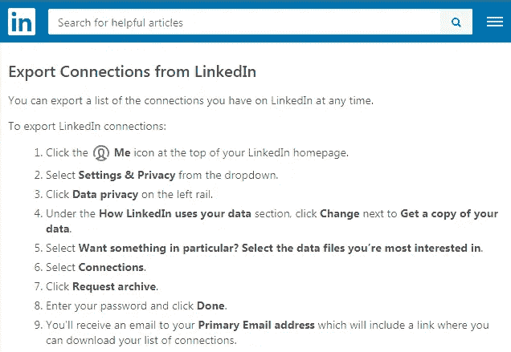
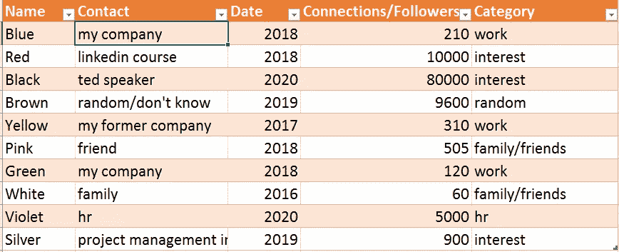
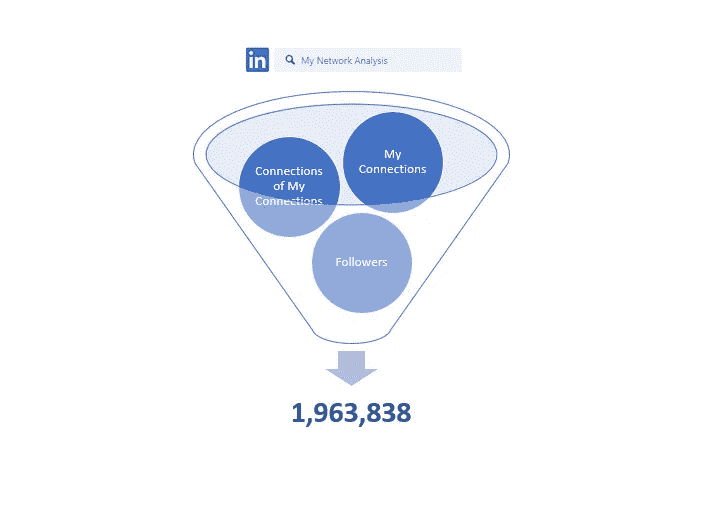
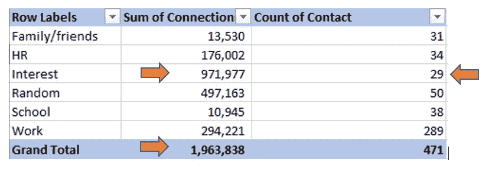
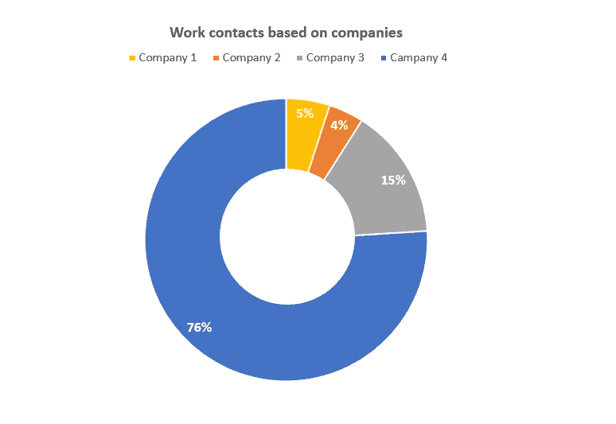
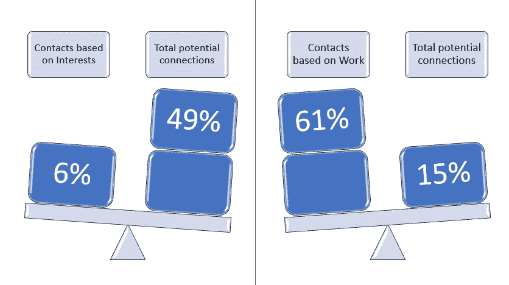
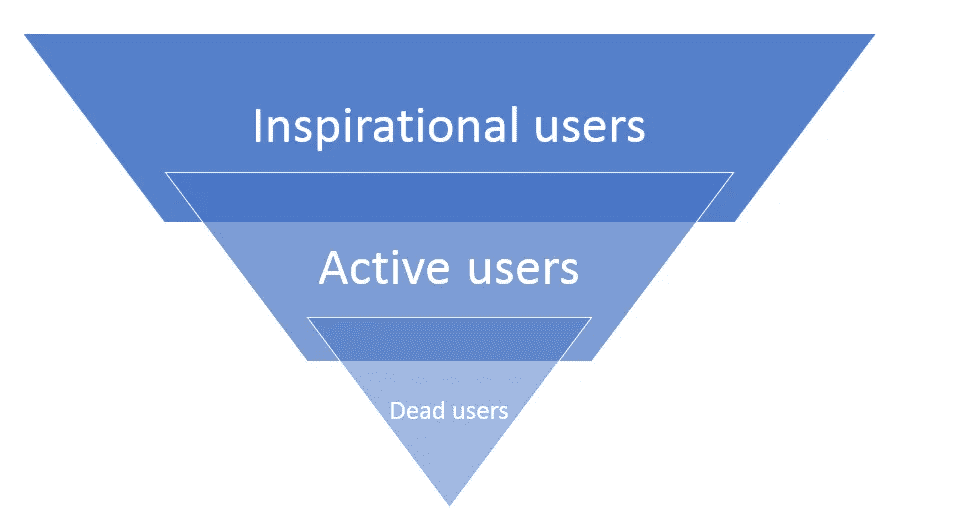

# 关于你的职业网络，LinkedIn 数据分析能教会你什么

> 原文：<https://towardsdatascience.com/what-linkedin-data-analysis-can-teach-you-about-your-professional-network-d22a775131a4?source=collection_archive---------65----------------------->

## 掌控你的职业关系

图片由 Jannis Klemm 在 Unsplash 上提供

今年年初，我对自己的社交网络活动进行了评估。我的清单很短——我用的是脸书、Instagram 和 LinkedIn。我有脸书做朋友。我用 Instagram 展示我的画，我有 LinkedIn，因为它看起来“很好”。我不是网络的活跃用户。当一些同事让我连接时，我就连接了。就这样。

我喜欢 LinkedIn 的是它的学习网站。我发现了一些神奇的课程，它们帮助我提高了管理技能，并激励我成长。在 LinkedIn 上也可以找到培训者和演讲者。我开始关注一些人，令我惊讶的是，我和他们进行了很好的讨论。他们让我的 LinkedIn 体验变得很有价值。我开始想知道我的关系网中有谁。因此，我跳上去分析它。

# 1.编码阶段

LinkedIn 允许你导出你的关系，这是分析的开始。手册在网站帮助上。

在 [LinkedIn](https://www.linkedin.com/help/linkedin/answer/66844/export-connections-from-linkedin?lang=en) 上导出连接

您可以在 excel 中处理该列表。我所做的是我对三件事感兴趣:

*我怎么认识这个人？我们为什么要联系？*

*我们什么时候联系上的？*

此人有多少关注者/联系人？

这有点像手工劳动。你的联系越少，你完成的越快。那时，我只有大约 400 个联系人。我花了不超过一个半小时来编码它们。糟糕的是要找出你网络中每个人的联系/追随者的数量。点击量很大。数据表开始看起来像这样:

Ivona Fikejzlova 提供

请注意，对您的连接进行分类非常重要。理想情况下，为了便于分析，您只有几个桶。但是，只要对你有意义，你就可以创造很多。我的是:

*   家人/朋友
*   人力资源(猎头)
*   兴趣
*   随意
*   学校
*   工作

# 2.分析

编码和数据清理是 LinkedIn 分析中最耗时的部分。现在，让我们享受数据带来的乐趣。对于基本的洞察，做一个数据透视表就够了。如果您喜欢仪表板，也可以很容易地创建一个带有干净数据集的仪表板。

Ivona Fikejzlova 提供

通过合并所有关于我的联系、我的联系的联系和关注者(与你没有联系，但关注你的内容的人)数量的数据，我震惊地看到，我的小小个人资料为我提供了 190 万人的网络。我怎么也猜不到！

然后，我对我的类别的表现感到好奇。如上所述，我有家人/朋友，人力资源，兴趣，随机，学校和工作。最终的表格如下所示:

Ivona Fikejzlova 提供

很明显，我的工作关系构成了我的大部分人脉。但有趣的是，他们并没有创造出我大部分的潜在联系。我的 289 个同事建立了 294221 个不错的连接。另一方面，我因为兴趣而联系的人，例如教练、TedTalkers 和 LinkedIn 培训师，产生了惊人的 971，977 个联系人和追随者。虽然我只和其中的 29 个成为朋友，但他们为我打开了一个全新的世界。

我还调查了哪份工作给了我最多的联系。在那里，我注意到了公司规模和时间的影响。

Ivona Fikejzlova 提供

前两家公司是中型企业。我在一个小团队中工作，与其他部门没有太多的互动。第三家公司足够大，但我只在那里工作了六个月，所以也没有太多的接触。第四家公司是国际公司。在那里工作了四年后，我被提升到了管理职位。由于这一点，我有机会与更多的人一起工作，这给我带来了更多的联系，特别是当我在 2017 年至 2018 年期间被任命为管理层时。

说到网络的规模。不要被连接数迷惑了。我很确定你可能有很多不活跃的 LinkedIn 用户。这些‘死用户’有一点网络，只有几个联系人。假设不到 100。通过快速浏览数据，我发现我的网络中有 10%是死用户。这很令人失望。我意识到我的关系网比我之前想象的要小。

你可以用你的基础数据回答很多问题。例如:

*你的人际网络何时增长最快？*

*你的网络中有多少活跃用户？你的内容和推广的潜在受众是什么？*

*你的社团成员身份会给你带来人脉吗？*

# 3.现在该怎么办

LinkedIn 就是其中一种。认识来自世界各地的人有很大的潜力。你可以在网站上寻找商机，也可以了解市场趋势。

Ivona Fikejzlova 提供

如果我可以说，不要对你的社交网络的规模过于兴奋，除非你真的有有意义的联系。

在上图中，你可以看到我的网络是什么样子。我的工作关系占了大多数，但它只占潜在关系网的 15%。而基于我职业兴趣的灵感联系最有潜力。当然，你可以辩称，如果你设法与商界的大人物建立联系，你的人际网络就会大幅提升。然而，这正是为什么分析你的网络组合很重要的原因。最终，在你的人际网络中拥有成功的商业人士可能比拥有不活跃的同事对你更有益。

你需要决定你为什么使用 LinkedIn。是因为你想:

*   与同事保持联系？
*   *建立自己的企业？还是建立你的信誉和个人品牌？*
*   *获得灵感？*
*   *与人力资源猎头保持联系？*

然后你的混合应该遵循你的目标。LinkedIn 网络有如此大的潜力，但是你不能坐以待毙。你可以有意识地建立你的人际网络，让它为你服务。

对我来说，这是灵感的巨大源泉。根据我的分析，我希望我的“兴趣”类别在 2021 年增长最多。这些人传递思想，挑战界限。他们拥有一个由其他鼓舞人心的人组成的独特网络，否则我就没有机会与他们见面。同时，通过张贴我自己的内容，我可以从其他人那里得到反馈，这不仅提高了我的帖子的可见性，还增加了我的知识。

我决定的第二件事是清理我的网络。降低我的网络是令人心碎的，但我想真实地生活。我的目标是摆脱“死亡”和莫名其妙的可疑联系人。你知道这些随机连接吗？有些人想联系，但是你们没有共同点，你们也从来没有一起工作过。你可能会接受任何方式，因为你受宠若惊，或者你不在乎。但最有可能的是，这种联系对你没有任何帮助。停止为了连接而连接。

综上所述，我的梦想领英网在下面。重点是励志用户，其次是活跃用户。最重要的是，我希望与“死亡用户”断开连接。这个网络是我的长期目标，但我打算在 2021 年直接开始工作。

Ivona Fikejzlova 提供

了解你当前的人际网络和你想要的是很重要的。这样，你可以继续你的事业、目标或自由职业。了解你的观众是一句口头禅。所以，让我们了解你的 LinkedIn 数据，建立有意义的网络。

# **4。保持更新**

如果你决定努力分析你的人际网络，只要你有了新的联系人或追随者，就要更新数据。你从中获得了有价值的见解。偶尔，你可以更新你的数据仪表板，看看你的目标是什么。简单又有用。

# 分析的最终清单

1.  LinkedIn 帐户
2.  下载您的网络数据
3.  创建类别
4.  代码数据
5.  分析数据/创建交互式仪表板
6.  制定目标
7.  保持数据更新