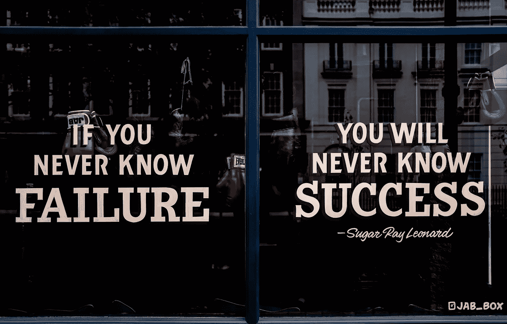
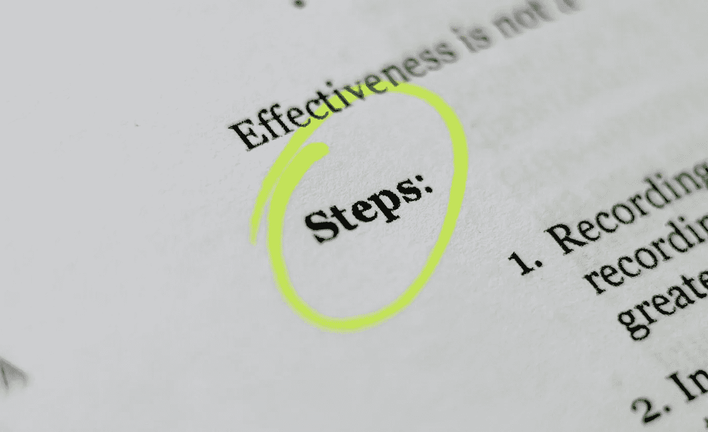

# 是什么让一个数据科学家变得优秀？

> 原文：<https://towardsdatascience.com/what-makes-a-data-scientist-excellent-57be04b3c0e3?source=collection_archive---------34----------------------->

## 意见

## 以下是你需要知道的 3 种品质和经历…


布鲁克·卡吉尔在[Unsplash](https://unsplash.com/s/photos/happy-business?utm_source=unsplash&utm_medium=referral&utm_content=creditCopyText)【1】上的照片。

# 目录

1.  介绍
2.  对失败的反应
3.  商业能力
4.  数据科学过程顺序
5.  摘要
6.  参考

# 介绍

看完文章，“ [*是什么让一个数据分析师变得优秀*](/what-makes-a-data-analyst-excellent-17ee4651c6db) *？Cassie Kozyrkov 的文章[2]启发我也讨论这个话题，但更确切地说，是为数据科学家。虽然有无数的品质可以造就一名优秀的数据科学家，但我将讨论更侧重于定性而不是定量、编程或技能的最佳品质。例如，了解 Python、R 和每一种机器学习算法当然是有益的，但很多人都可以满足这些要求，所以软技能——比如你如何反应和数据科学的过程——将使你脱颖而出，并最终让你成为一名优秀的数据科学家。更具体地说，在下文中，我将讨论失败的品质和经历、业务能力以及整体数据科学流程顺序，这些将有助于像您这样的数据科学家走向卓越。*

# 对失败的反应



照片由[放大](https://unsplash.com/@theblowup?utm_source=unsplash&utm_medium=referral&utm_content=creditCopyText)上的[去飞溅](https://unsplash.com/s/photos/failure?utm_source=unsplash&utm_medium=referral&utm_content=creditCopyText)【3】。

通常，在实践中，或者在学习数据科学的过程中，您拥有尚未成为业务一部分的安全网，同时，您拥有更容易的数据和应用程序，不容易出错。因此，你将真正学会如何失败，以及如何在专业环境中应对失败。也就是说，失败是任何工作不可思议的一部分，尤其是数据科学。通过失败，数据科学家将学习和加强他们最初错过或搞砸的东西，有点像其他东西——机器学习算法。失败对成功很重要，因为它让你成为一名数据科学家，可以尝试、测试、利用测试和错误，不受约束地投入到模型构建的世界中。值得注意的是，早期失败是更可取的，因为当将模型投入生产的时候，您已经失败了，犯了错误，并且已经在最终形式的模型中包含了测试和边缘案例。不要寻找失败，更重要的是，以积极有效的方式应对失败。举例来说，你对失败的反应可能会产生新的特征、算法、产品或过程。话虽如此，让我们来看看失败的好处。

> 失败的好处:

*   学习更快
*   发现边缘案例
*   发现测试用例
*   更少的约束
*   新功能的开发

> 行动项目:

*   ***当你犯了遗漏边缘和测试用例*** 的错误时，识别那些用例并创建一个使用模型和一些硬编码规则来解释所有数据的集成方法。
*   ***当你的精度在生产中没有那么高*** 时，确认测试的日期范围，仔细检查你的特征的数据类型——确保如果是数字，生产代码没有舍入数值。
*   ***如果您的库无法在生产中导入*** ，请确保找到更新的库版本，并在将其推向生产之前始终测试新版本。
*   ***如果假设正态分布*** ，使用不同的非参数算法，如随机森林，这意味着您的数据不需要满足某些假设。

如你所见，虽然不寻常，但失败和成功一样重要。更具体地说，你对失败的反应。所以读完这篇文章后，不要故意失败，而是跳进你的数据科学模型过程，研究数据，测试不同的算法，

> **…最终，尽早失败，这样模型就不会在最重要的时候失败。**

# 商业能力


[Adeolu Eletu](https://unsplash.com/@adeolueletu?utm_source=unsplash&utm_medium=referral&utm_content=creditCopyText) 在[Unsplash](https://unsplash.com/s/photos/business?utm_source=unsplash&utm_medium=referral&utm_content=creditCopyText)【4】上的照片。

虽然编码、编程、数学、高级统计和复杂的机器学习算法无疑可以使数据科学家在技术上更加成功，但必须强调的是 ***如果不能将所有这些技能转化为业务，数据科学将毫无用处*** 。数据科学的一些最重要的部分是如何沟通问题，解释模型的结果，以及它最终将如何影响业务(*例如，省钱、省时*)。在我看来，数据科学几乎可以被命名为商业科学。但是，数据当然重要，业务也重要。

例如，假设我们有一个问题，我们在理解产品评论背后的语义和情感方面有困难。作为一名数据科学家，我们希望立即执行复杂的自然语言处理( *NLP* )技术，比如删除停用词以隔离评论的主要方面。我们发现我们可以很快很容易地应用数据科学。但是接下来，我们遇到了一个问题，我们通常会从 Python 库中删除停用词，也许，我们可能会意外地删除对这个特定问题有意义的基本词。也许我们错误地删除了 20%对产品很重要的词。这个例子可能很小，但是您可以看到，在没有意识到模型背后的业务的情况下，立即做出假设，会导致误导性的结果和不太有用的结果。还有无数其他的例子，我们忘记了高精度是最成功的衡量标准，但是我们意识到边缘案例实际上是最重要的分类数据。我们知道我们可以准确地对数据或主题进行分类，但如果我们更仔细地观察，我们会发现我们实际上只能对 10%的边缘情况进行分类，而对 80%的大多数情况进行分类。

> 以下是商业能力的一些好处和考虑因素:

*   正确应用数据科学模型
*   正确利用错误和成功指标来推动业务决策
*   更好地与利益相关者沟通
*   向非技术人员解释复杂的结果

> 行动项目:

*   *****练习将你的复杂算法传达给利益相关者*** ，理解你的算法的主要思想以及你的模型的结果和影响。**
*   *****知道成功意味着什么*** ，与利益相关者一起确定什么是成功:是 90%的准确率，还是 99%的准确率——以及针对哪组数据？**

**强调数据科学中商业智能的重要性是非常有益的，所以请确保在您学习数据科学或在您当前的专业工作中使用数据科学时，您确保您允许自己以最佳方式探索您的模型在业务中的含义和应用，以及能够与他人进行熟练的交流，以便您的模型不是 ***静止和未使用的*** ，而是相当活跃的，每个人都可以解释其结果。**

# **数据科学过程顺序**

****

**克莱顿·罗宾斯在[Unsplash](https://unsplash.com/s/photos/process?utm_source=unsplash&utm_medium=referral&utm_content=creditCopyText)【5】上拍摄的照片。**

**掌握数据科学的流程是会让你变得优秀的事情。数据科学可能会让人不知所措，因此了解完成端到端数据科学流程和模型的最有效方式将使您变得更加出色。 ***还有更具体的用例*** ***流程*** 可以看作是更技术性的。或许，您可以使用一个笔记本，而不是 10 个具有不同超参数的 Jupyter 笔记本文件，该笔记本可以灵活地组织和排列网格搜索功能中的重要和最佳参数，例如。除去这种改进的技术方面，您本质上是通过更好地组织和隔离整个过程的重要部分来改进您的模型。**

**虽然公司、人员和代码可能不同，但我相信有一种通用的方法可以在任何地方执行数据科学。当然，您可以调整这个过程来迎合您的需要，也可以添加和删除一些部分来实现专门化。**

> **以下是通用数据科学流程的主要步骤:**

*   **隔离问题**
*   **隔离当前指标**
*   **查找和开发数据**
*   **探索性数据分析**
*   **特征工程**
*   **模型比较或测试各种机器学习算法**
*   **结果解释**
*   **度量比较**
*   **模型的效果**

> **行动项目:**

*   *****遵循上面的流程——***数据科学的目标是解决一个问题，让一个流程更加准确高效。**
*   *****流程的顺序很重要:*** 真正理解手头的问题，找到造成问题的原因的当前状态，并确定您想要改进的指标，获取数据集并理解它，创建功能，测试几种算法，选择最终的算法或算法集合，然后创建比较原始业务指标的指标，然后讨论您的模型的积极影响。**

**虽然简单，但这些步骤您可能已经在执行了，并且您可以将这些步骤应用到几乎任何业务中，因为我们本质上是在解释数据科学在业务中的作用。您希望探索问题、数据、应用实际模型，并将当前流程的结果与应用模型的新流程的结果进行比较，最后，分享模型的帮助。**

# **摘要**

**数据科学需要复杂的技能和工具知识，如 Python、R、SQL、机器学习算法等等。然而，经常被忽视的是软技能的重要性以及您在公司执行数据科学的方式。这就是我所讨论的，包括你对失败的反应，你所使用的商业智能，以及你执行数据科学的过程。除了提高编程之类的硬技能，提高这三个素质一定能让你成为一名优秀的数据科学家。当然，这种讨论都是主观的，但通过专注于在日常数据科学工作中提高这些素质来提升自己作为一名数据科学家不会有什么坏处。**

> **总而言之，以下是成就优秀数据科学家的三大品质:**

```
* Reaction to Failure* Business Aptitude* Data Science Process Order
```

**我希望你觉得我的文章既有趣又有用。如果为了让自己成为一名优秀的数据科学家，你已经关注了这些品质中的任何一个，请随时在下面发表评论。这对你现在的数据科学事业有帮助吗？你同意还是不同意，为什么？**

***请随时查看我的个人资料和其他文章，也可以通过 LinkedIn 联系我。***

**如果你对在学习数据科学之前先学习数据分析的重要性感兴趣，这里有那篇文章[6]:**

**</you-should-master-data-analytics-first-before-becoming-a-data-scientist-5dbceaea9d3d>  

# 参考

[1]Brooke Cagle 在 [Unsplash](https://unsplash.com/s/photos/happy-business?utm_source=unsplash&utm_medium=referral&utm_content=creditCopyText) 上拍摄的照片，(2018)

[2] [卡西·科济尔科夫](https://medium.com/u/2fccb851bb5e?source=post_page-----57be04b3c0e3--------------------------------)，是什么让一个数据分析师变得优秀？(2020)

链接:[https://towards data science . com/what-makes-a-data-analyst-excellent-17ee 4651 c 6 db #:~:text = An % 20 analyst 的%20excellence%20is%20speed。&text = Analysts % 20 look % 20 up % 20 facts % 20 还有，你的！)% 20 in % 20 进程](/what-makes-a-data-analyst-excellent-17ee4651c6db#:~:text=An%20analyst%27s%20excellence%20is%20speed.&text=Analysts%20look%20up%20facts%20and,yours!)%20in%20the%20process)。

[3]照片由[拍摄](https://unsplash.com/@theblowup?utm_source=unsplash&utm_medium=referral&utm_content=creditCopyText)[上的放大](https://unsplash.com/s/photos/failure?utm_source=unsplash&utm_medium=referral&utm_content=creditCopyText)去飞溅(2020)

[4]2015 年 [Adeolu Eletu](https://unsplash.com/@adeolueletu?utm_source=unsplash&utm_medium=referral&utm_content=creditCopyText) 在 [Unsplash](https://unsplash.com/s/photos/business?utm_source=unsplash&utm_medium=referral&utm_content=creditCopyText) 上拍摄的照片

[5]克莱顿·罗宾斯(Clayton Robbins)[在](https://unsplash.com/@claytonrobbins?utm_source=unsplash&utm_medium=referral&utm_content=creditCopyText) [Unsplash](https://unsplash.com/s/photos/process?utm_source=unsplash&utm_medium=referral&utm_content=creditCopyText) 上拍摄的照片，(2020)

[6] M.Przybyla，[在成为数据科学家之前，你应该首先掌握数据分析](/you-should-master-data-analytics-first-before-becoming-a-data-scientist-5dbceaea9d3d)，(2021)**