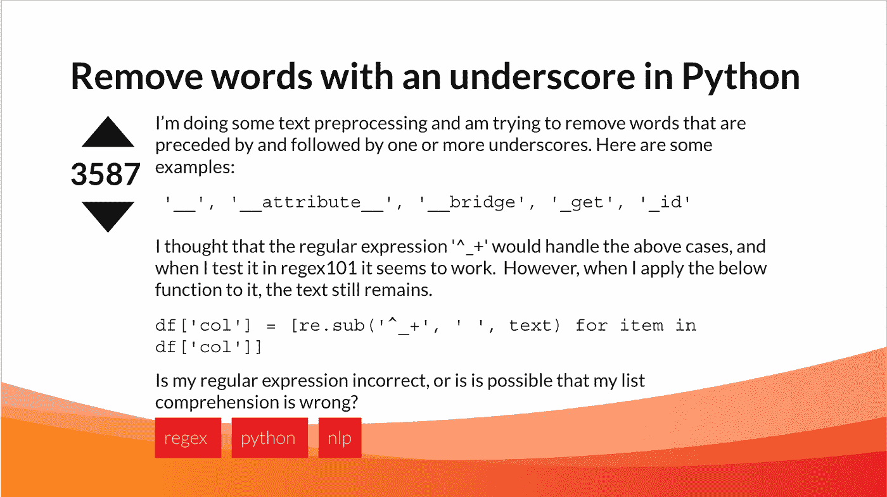
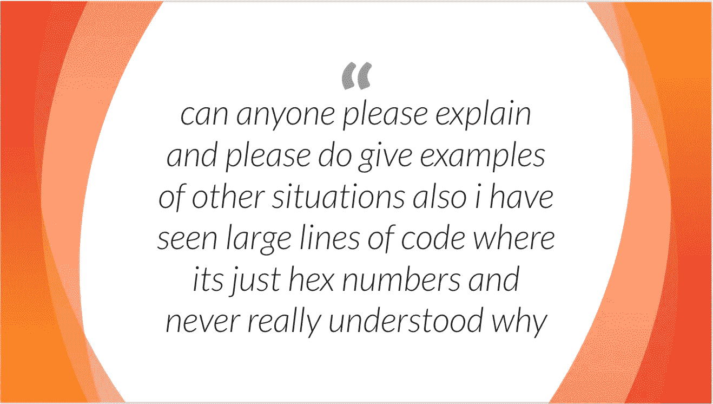
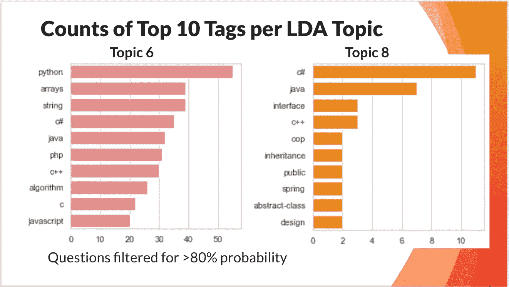
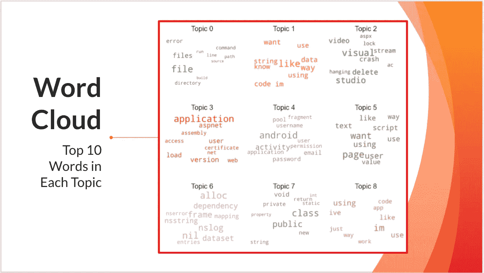

# 什么使一个问题有帮助？

> 原文：<https://towardsdatascience.com/what-makes-a-question-helpful-19e934c2d436?source=collection_archive---------22----------------------->

## 栈溢出文本的主题建模探索

社交媒体在我们的生活中扮演着越来越重要的角色，不讨论它的缺陷，它的一个积极方面是它让用户能够与广泛的受众沟通。这使得社交媒体成为任何想要了解某个主题或与其他人讨论以完善每个人的理解的人的强大工具。Stack Overflow 是一个致力于帮助人们提高他们的编程技能，分享他们的编程知识，并在社区环境中建立他们的职业生涯的网站。作为我目前参加的 [Metis](https://www.thisismetis.com/) 训练营为期 12 周的课程的一部分，我完成了一个数据科学项目，该项目使用自然语言处理工具来挖掘堆栈溢出的文本，以探索与网站上最有帮助的问题相关的术语和主题。

我在 Google Cloud Platform 的 BigQuery 上用一个简单的 SQL 查询开始了我的项目，使用了该网站上托管的公共堆栈溢出数据集，带来了 500，000 个堆栈溢出问题和其他相关功能，如与该帖子相关的分数、浏览量和相关标签等。在继续讨论完成项目的整个过程之前，我将分享一些关于一些特性的基本信息。

类似于堆栈溢出网站上的示例问题。图片作者，灵感来自栈溢出[帖子](https://stackoverflow.com/questions/123559/how-to-validate-phone-numbers-using-regex)。

帖子的顶部是问题的标题，下面是帖子的正文，或问题。您还会注意到问题主体左侧的数字以及围绕它的上下箭头。这是帖子的“分数”。它是一个帖子收到的支持和反对票数的总和，看这个分数的一个方法是它的有用性。网站上的答案以同样的方式工作，但是为了这个项目的目的，我坚持只看问题。你可能会问自己，“分数的范围是多少？有没有表示帖子好坏的数字？”第一次发布时，所有分数都从 0 开始。如果你只收到一张选票，取决于它是向上还是向下，这将表明查看该帖子并对其投票的人是否认为该帖子有帮助。因此，总得分不仅取决于帖子的有用程度，还取决于有多少人参与了该帖子。在文章的最底部是标签，它们被一个蓝色的正方形包围着。这些是标签，它们有助于对问题进行分类。如果您试图搜索与某个编程概念相关的帖子，这很有用。

为了详细介绍这个过程，我使用了前面讨论过的 SQL 查询来引入相关的特性。接下来，我通过过滤我的数据来选择最有帮助的问题，这些问题的分数在帖子的前百分之十。为了进一步增加有用性，我只选择了网站上最常用的 100 个标签。Stack Overflow 上有超过 54，000 个独特的标记，由于这些标记是用户生成的，有些可能只使用一次。通过以这种方式过滤，我们确保我们看到的帖子是最有帮助的，吸引了最多的注意力，并且可能与更有经验的用户相关联。

在最初的数据清理步骤之后，文本预处理通常是主题建模过程中的下一步。这是为了确保文本只包含有意义的单词，没有标点符号、HTML 或停用词(例如 like、at、which)。

在删除停用词之前，对主题 6 中的文本进行预处理。作者使用来自[知识共享](https://stackoverflow.com/legal/terms-of-service/public#licensing)许可下[栈溢出](https://stackoverflow.com/questions/243712/why-use-hex/243733)帖子的文本制作的图片。

数据科学中的预处理是一个迭代过程，通常需要大量的领域知识。例如，由于栈溢出的许多措辞都与代码有关，所以一些在英语中没有定义的词，如 *git* 或 *c++* 实际上是有意义的。在意识到显示的主题没有帮助或者遗漏了数据科学家知道应该包含的单词之后，可能必须在标记化步骤甚至建模步骤之后返回。在这个项目中，我无法在标记化步骤中移除所有这些术语之前捕捉到它们，但这无疑是未来改进我的模型的一个目标。

在预处理管道中清理完文本并使用 CountVectorizer 进行标记后，我使用潜在的 Dirichlet 分配(LDA)对数据集中的问题进行主题建模。此外，由于标签本身就是一种按主题对术语进行分类的方式，我使用熊猫将标签与我的 20 个主题中的每一个主题联系起来。

主题 6 和 8 中顶部标签的频率。图片作者。

主题建模步骤还需要一些领域知识，在这种情况下，就是了解与计算机编程中各种主题相关的术语。在为模型确定最佳主题数量时，这些领域知识会很有帮助。对于这个项目，我依靠我的领域知识，在发现每个主题中包含的术语有明显区别时，就选定了 20 个主题，但是有 GridSearch 等工具可以找到主题数量的最佳点。

LDA 模型中选择的 20 个主题中的 9 个主题的词云。图片作者。

在我的项目中，我还获得了一些有趣的见解，这些见解不仅仅与自然语言处理和主题建模有关。Stack Overflow 是一个巨大的网站，有一个很大的社区，里面有很多数据。例如，在我的数据集中，帖子的得分从-49 到 14，772 不等。帖子可能只有 0 次浏览，也可能有超过 200 万次浏览！在我的模型中，主题 19 与超过 4000 个关于堆栈溢出的问题相关联。它包括诸如*会话*、*服务器*、*客户端*、*连接*和*请求*之类的术语，并且可以说与一个与浏览器相关的问题相关联。

在未来，该模型可能会进一步完善，可能会进行更多的文本预处理，以及探索其他模型，如非负矩阵分解(NMF)，因为它们有利于处理较短长度的文档。确定有用主题的模型不仅有利于希望发布可能得到回答的问题的用户，或者希望提高他们在 Stack Overflow 上的声誉的用户，而且也有利于教育者。这些有帮助的问题是用户认为对学习有帮助的问题，正如我在开始时提到的，它们有较高的分数，这意味着很多人已经关注了这个问题。换句话说，这些问题通常对人们来说是最难的。它可以帮助教师、教授或导师确定他们可能希望在哪些主题上花更多的时间，以便他们的学生带着他们可以在家庭作业、项目和职业生涯中应用的知识离开。