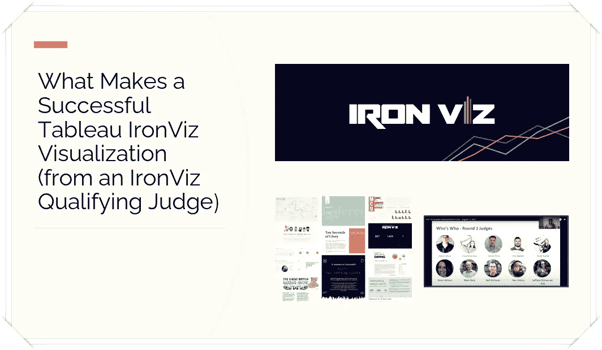
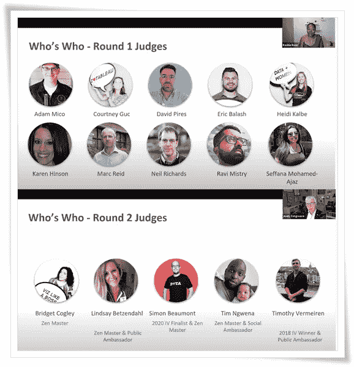
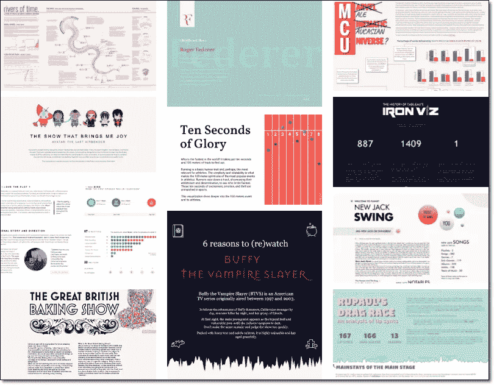

# 是什么成就了一个成功的画面

> 原文：<https://towardsdatascience.com/what-makes-a-successful-tableau-ironviz-visualization-from-an-ironviz-qualifying-judge-4e1025b3a3c2?source=collection_archive---------18----------------------->

2021 年对我个人和职业来说都是不可思议的一年。尽管如此，我还是非常兴奋被选为第一轮 IronViz 资格赛的评委，与我们社区所有这些超级天才和一流的成员一起。随着以 Data + Joy 为主题的 IronViz 资格赛前 10 名决赛选手的**宣布，我准备写下这次经历，并帮助您确定在未来的资格赛中应该考虑什么。**

****

**鸣谢:Tableau 和 Adam Mico**

**在我们开始这篇文章之前，这里有一些我不会在这里或私下分享的东西:**

*   **审查具体的可视化**
*   **分项得分细目**

**然而，我将根据我所审查的 64 个可视化中的高分数据可视化的趋势和十个决赛选手的趋势，介绍一个成功的 IronViz 可视化的特征。**

## **铁 Viz 资格评审背景**

**人们期望法官客观地看待可视化。Tableau 做了很大努力从可视化中删除个人身份信息，我们没有使用 Tableau Public 来查找和审查 vizzes。相反，提交的可视化托管在其他地方。为此付出的努力(特别是 Tableau 的 **AB Commendatore** 和**Andrew Grinaker**([Twitter](https://twitter.com/206andrew)))并不小，但它有助于保持评分的公平。为了避免看到 IronViz 合格的条目，我在 Twitter 上屏蔽了对 IronViz 的引用，避免公开 Tableau，并且如果有人在那段时间要求对任何 Tableau 可视化进行反馈，我也不会参与。这并不容易，因为我非常好奇，觉得我错过了很多令人兴奋的事情，但客观是必不可少的。当然，IronViz 评委不会提交参赛作品，因为这显然会造成利益冲突。此外，如果可视化不能客观地判断(例如，上面的潜在短裤)，我们可以选择不判断 vizzes。**

## **判断过程**

****

**信用:Tableau**

**第一轮的每位评委都收到了 60 多幅图像，分布在所有 320 幅参赛作品中。多名法官审查了每一个可视化。最高分的可视化与第二轮评委分享。每一次可视化都是基于…**

1.  **分析数据如何支持主题、其清洁度及其在研究中的应用，包括计算**
2.  **设计或数据如何协同工作，并以最终用户可以直观处理的方式提供服务。应该想到这些问题…这是图表的正确用例吗？我能快速阅读课文和图片吗？这些颜色有什么意义吗？视觉化考虑可及性了吗？**
3.  **讲故事或可视化在使用分析和设计来关注主题方面有多有效。当浏览主题和它的踪迹时，旁观者的头脑中是否有一个小电影在播放？它比数据和图表本身更能吸引人和启发人吗？**

## **一个充满类比的高质量 IronViz 条目的分解**

**我有点饿了，所以我想不出一个更好的时间来展示这个比喻。我不是厨师，但我在电视上目睹了他们中的许多人——或者至少足以拼凑出这个类比。**

**分析阶段是在脑海中寻找配料和食谱。接下来，最好考虑一下 8 道菜的大餐需要哪些食材、客人和菜肴。接下来，设计阶段考虑烹饪方法、菜肴、时机、场地和盘子。最后，对于讲故事来说，厨师会找到主题、交付顺序、中间的时间安排以及其他微妙的东西，为活动增添冒险感和连贯性。**

**IronViz 是数据可视化的高级餐厅。最成功的参赛者花费大量的时间和精力将所有这些东西放在一起。菜肴、地点和烹饪方法因作者而异。然而，它们都具有这些一般特征:**

*   **数据清晰和小心——作者花了大量时间收集可视化数据，验证计算，找出呈现设计想法所需的所有逻辑，并删除不必要的部分。鉴于这一主题，最好的数据是仔细收集或汇编的。**

> *****提示如果 Tableau 在未来恢复为合格条目提供数据集*****
> 
> **验证是否可以将您的数据或附加数据追加到数据集，以实现更加个性化的可视化。来自你的想象越多，就越不像是一项任务，而更像是一个充满激情的项目。激情项目通常会产生更好的结果，因为更多的关注被投入到可视化中，以吸引和推动你自己展示你的技能。**

*   **设计效率和掌握度——有了对数据的这种理解，他们已经知道仪表盘上会有什么。许多人通过线框化或预先设计可视化来做到这一点。这是一个最终可视化的粗略想法，并提供了一个课程。**
*   **讲故事的连贯性和参与性——作者退后一步，考虑他们所热衷的事情的大局。然后，带着那种活力，他们想让你相信，这也是你应该用最少的脚步感受到的东西。它的目的是给你一个哈哈的时刻，让你在停止看它之后再去想它。**
*   **规划、协调、时间和灵活性——在完成这项工作之前，他们会深入思考任何东西的位置以及如何进行微调。作者可能会在步骤之间花时间，花几天或几周的时间来查看它——寻求对设计的反馈，并验证另一个人看到了他们的愿景和想要传达的东西——足够灵活地重复并对所有步骤进行必要的调整，以呈现预期和强大的东西。**

## **10 大 IronViz 数据可视化的 3 大趋势**

****

**信用:Tableau**

**我看到许多得分较高的条目有以下相似之处(除了上面提到的项目)。2022 年，趋势可能会改变，所以你会想看看这个社区在做什么(特别是在**莎拉·巴特利特**的([推特](https://twitter.com/sarahlovesdata) | [网站](https://sarahlovesdata.co.uk/) ) [**#IronQuest**](https://sarahlovesdata.co.uk/tag/ironquest/) )。**

1.  ****长格式可视化很流行。****

**所有进入前 10 名的可视化都需要垂直滚动——最重要的是。只有**瑞安·苏亚雷斯**([Twitter](https://twitter.com/ryandsoares)|[Tableau Public](https://public.tableau.com/app/profile/ryansoares))的布局不需要从许多设备上滚动(1000 像素宽、700 像素长的 7 个仪表盘的配置)。**

****注意**:默认的桌面格式和商业仪表板的一般尺寸是大约 1，400 x 800，以便在大多数桌面上无需滚动即可访问。**

*****前三名决赛选手*Samuel Parson**([Twitter](https://twitter.com/SParsonsDataViz)|[Tableau Public](https://public.tableau.com/app/profile/sparsonsdataviz))是唯一一个拥有比更长更宽可视化效果(6000 像素宽 x 2,000 像素长)的决赛选手。**

**其余八个的中值尺寸分别为 1，400 像素宽和 5，650 像素长，平均值分别为 1，324 和 6008，大约是标准业务仪表板的 4 到 5 倍宽和 7 倍长。**

**以下是其他八位入围者的 Twitter 账户和 Tableau 公共账户(按姓氏字母顺序排列):**

*   ****迪努什基·德·利维拉** ( [推特](https://twitter.com/deeVizable) | [Tableau 公共](https://public.tableau.com/app/profile/dinushki.de.livera))**
*   **凯文·弗莱格 ( [推特](https://twitter.com/FlerlageKev) | [Tableau 公共](https://public.tableau.com/app/profile/kevin.flerlage))**
*   ****帕拉德普·库马尔克** ( [推特](https://twitter.com/pradeep_zen) | [Tableau 公开](https://public.tableau.com/app/profile/pradeepkumar.g) ) ***前三名入围*****
*   ****CJ Mayes**([Twitter](https://twitter.com/_CJMayes)|[Tableau Public](https://public.tableau.com/app/profile/cj.mayes))**
*   ****布莱恩·摩尔** ( [推特](https://twitter.com/bmoorewastaken) | [Tableau 公开](https://public.tableau.com/app/profile/brian.moore7221))**
*   ****Chimdi nwo su**([Twitter](https://twitter.com/menscuriosa)|[Tableau Public](https://public.tableau.com/app/profile/chimdi.nwosu))**
*   ****安妮-索菲·佩雷拉德·萨** ( [推特](https://twitter.com/wonderveilleuze) | [Tableau 公共](https://public.tableau.com/app/profile/anne.sophie5083))**
*   ****丽莎·特雷斯科特** ( [推特](https://twitter.com/LisaTrescott) | [Tableau 公开](https://public.tableau.com/app/profile/lisa.trescott) ) ***Top-3 入围*****

****2。经典 Tableau 交互式数据可视化的自助服务让位于数据故事****

**对于非常长的可视化效果，除了工具提示或滤镜/参数之外，交互性对于用户体验来说是不切实际的。文本和叙述通过更多的图表、文本框、注释或工具提示(在较小程度上)被广泛使用，以提供见解，而不是与交互一起使用的自助式见解。**

**作为一名前分析师，我喜欢通过复杂数据集上的交互性来选择他们的冒险，分享这一点让我很痛苦。尽管如此，填鸭式的数据故事方法更具包容性，而且*对更广泛的受众更有效。 ***可以*** 是如果作者应用了上面提到的一个高质量的 IronViz 条目的原则。***

*****3。对 Tableau 使用其他工具是可以的，即使是 Tableau 可视化竞赛*****

***前 10 名作者中的每一位都使用了 Tableau 中没有的独立工具或资源来强调 Tableau。最常见的是在 PowerPoint、Figma 或其他设备中创建的图像，以显示图标、增强背景或增加文本选项(很少有 websafe 和 Tableau 公共安全文本选项——这里有一篇由**Ken fler lage**([**Twitter**](https://twitter.com/flerlagekr)|**网站**撰写的 [**伟大文章**](https://www.flerlagetwins.com/2020/08/fonts.html) )。***

***前 10 名作者和许多没有通过资格审查的作者之间的区别是，这样做是为了有品位地增强可视化，而不是使其成为主要焦点。***

*****奖励**:这里的所有作者都活跃在 [**#DataFam**](https://twitter.com/search?q=%23datafam&src=typed_query) 社区中(或者是新加入的)，并使用社区提供的资源来提升技能。**Priyanka DOB Hal**([Twitter](https://twitter.com/priyankadobhal_)|[Tableau 公众](https://public.tableau.com/app/profile/priyanka.dobhal0993))刚刚分享了一篇[关于 Tableau 征途首发包](https://priyankadobhal.medium.com/tableau-data-journey-starter-pack-2e51a6666699)的新文章，你应该看看。虽然成为社区的一员并不能给评判加分，但是所提供的资源和访问的便利性使得提升技能变得更快(也更有趣)。***

## ***你很努力，但没有进入决赛或前 10 名。***

***竞争的水平反映了技能，创造力，对细节的关注，以及从不同的角度和不同的工具来扩展画面的自豪感。许多执行了他们开始分享的可视化的人可能不会放置或被认为是前 10 名完成者。尽管如此，他们最终还是通过提高技能、花时间练习技巧，以及参与这种变革性的体验来投身于一个充满激情的项目和技能展示而获得了胜利。***

***如果您继续使用 Tableau，关注 Tableau 社区或其他充满活力的数据可视化集体，您将会被您在短时间内通过额外的接触和探索可以爬多远而震惊。当然，你可能仍然达不到前 10 名或进入决赛，但你会通过到达的新高度和从加高的平台上看到的壮丽景色意识到旅程的影响。***

# ***亚当·米克***

***[推特](https://twitter.com/AdamMico1)|[LinkedIn](https://www.linkedin.com/in/adammico/)|[Tableau 公共](https://public.tableau.com/profile/adammico#!/)***