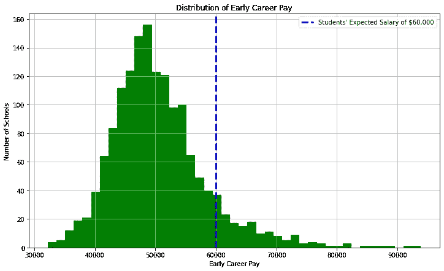
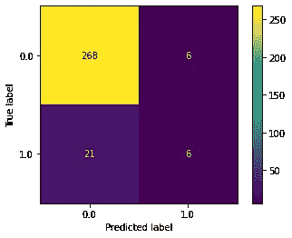
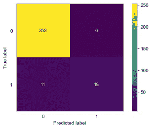
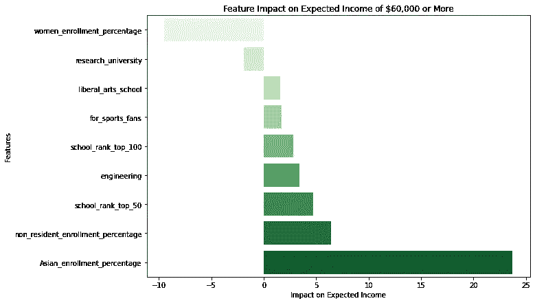

# 什么让大学值得？

> 原文：<https://towardsdatascience.com/what-makes-college-worth-it-cdbb272152cb?source=collection_archive---------36----------------------->

## [实践教程](https://towardsdatascience.com/tagged/hands-on-tutorials)

## 构建一个逻辑回归模型来预测哪些大学的早期职业薪金为 6 万美元或更高

Giphy.com 的 GIF

# 介绍

像大多数亚洲移民一样，我的父母强调学校的重要性，认为大学毕业是实现美国梦的途径。正因为如此，我从未质疑过*我是否应该上大学。这更多的是关于*和哪一个*的问题。*

当我做决定的时候，我没有做成本效益分析，就像我在后面谈到的模型中做的那样，尽管也许我应该做。相反，我想得更多的是两件事:

1.哪个学院感觉像霍格沃茨，更重要的是，
2。哪个学院可能会打动我的“chismosa”titas(chismosa 在他加禄语中是“八卦”的意思)。

没有想太多，我跟随我儿时最好的朋友去了加州大学圣地亚哥分校读本科，然后去了哥伦比亚大学读研究生。当我毕业的时候，我无知地认为大学本身会有回报。但是当我拿到我的第一份学生贷款账单和一份与之不符的工作薪水时，我惊呆了！我是谁，会认为我可以用她爸爸的信用卡为大学购物，就好像我是切尔·霍洛维茨一样？

事实证明，我并不孤单。根据 LendEDU 进行的一项调查，大学生毕业后期望的平均工资为 6 万美元。52%的大学生申请了学生贷款来上大学，其中 17%的人有支付困难。

Giphy.com 的 GIF

这让我产生疑问: ***是什么让大学值得上*** ？

## 方法学

我查看了 900 多所学校(数据清理后)和 8 所学校的特点，如下所示(来源于 [PayScale](https://www.payscale.com/college-salary-report/bachelors) 、[数据。世界](https://data.world/)，美国[新闻&报道](https://www.usnews.com/best-colleges/rankings/national-universities)。

1.  有意义的百分比(连续)——有多少毕业生觉得他们的工作有意义？
2.  STEM 百分比(连续)——授予的学位中有多少是与 STEM 相关的(科学、技术、工程、数学)
3.  学校类型(分类)—工程、私立、宗教、艺术、体育迷、党校、文科、州立、研究型大学、商业、sober、常春藤联盟
4.  州(分类)-学校所在的位置
5.  学费(连续)—包括州内、州外和食宿费用
6.  总注册人数(连续)—学校注册了多少名学生
7.  多元化注册(连续)-少数族裔群体(亚裔、黑人、西班牙裔、夏威夷原住民/太平洋岛民、美洲原住民/阿拉斯加原住民、女性和非居民)的注册
8.  学校排名(分类)——我将排名分为前 50 名、前 100 名、前 150 名、前 200 名、前 250 名和超过 250 名，以包括未列入前 250 名的学校。

你可以在下面找到最终数据帧的预览。

按作者的数据框架

我的基线模型使用了 75%的数据来建立一个逻辑回归模型，预测学校的预期收入是否达到或超过 6 万美元，然后使用剩余的 25%来测试我的模型的准确性。我的最终模型指出了哪些特征在预测薪水时最重要。

我们的 ***零假设*** 声称这些特性对预期收入没有任何影响。我们的 ***替代假设*** 声称，特征确实对预期收入有影响。

# 目标变量——期望与现实

我们的数据显示，大学毕业生早期职业生涯的平均工资为 5 万美元，中位数为 4.9 万美元。在我们调查的所有大学中，只有 10.2%的大学在职业生涯早期的薪资达到或超过 6 万美元。



作者直方图

因为我构建了一个逻辑回归模型，而不是线性回归模型，所以我从早期职业薪金列设计了目标变量 over_60000，将早期职业薪金 60000 美元标记为真，将低于 60000 美元的早期职业薪金标记为假。

# 带 Skikit-Learn 的基线模型

## 构建我的模型

```
# import necessary libraries
import statsmodels as sm 
import sklearn.preprocessing as preprocessing 
from sklearn.linear_model import LogisticRegression
from sklearn.model_selection import train_test_split 
from scipy import stats#Define dependent and independent variables
X = colleges_df.drop(columns=['over_60000'], axis=1)
X = pd.get_dummies(X, drop_first=True, dtype=float)y = colleges_df['over_60000'].astype(float)#Split data into training and testing 
X_train, X_test, y_train, y_test = train_test_split(X, y, test_size=0.25, random_state=42)# Fit model 
logreg = LogisticRegression(fit_intercept=False, C=1e12, solver='liblinear')
model_log = logreg.fit(X_train, y_train)
```

我使用 Scikit-learn 构建基线模型，将目标变量 over_60000 定义为 y，将数据帧中的所有其他列(我的特征)定义为 x。

一旦我将数据放入模型，我就检查结果。

## 测量我的模型

因为我预测了学校是否会给毕业生提供 6 万美元或更多的早期收入，所以我想把我的精确分数放在回忆之上。记住， ***精度*** 是从所有*预测*值计算出来的，而 ***回忆*** 是从所有*真实*值计算出来的([这篇博客](/accuracy-precision-recall-or-f1-331fb37c5cb9)很好地解释了其中的区别)。我不想告诉学生，他们就读的学校的预期早期收入为 6 万美元或更多，但事实并非如此。然而，如果我的模型告诉一名毕业生，他们的学校并不期待 6 万美元或更高的早期职业薪水，但他们实际上是这么想的，这也无妨。我得说，是令人愉快的惊喜和喜悦。



作者的基线混淆矩阵

左边的 ***混淆矩阵*** 展示了我的基线模型对测试数据的预测有多好。我的基线预测有 12 所学校的预期工资超过 6 万美元，但只有 6 所学校实际上符合标准，导致 50%的精确分数。不好了。

## 迭代我的模型

显然，我仍然有很多工作要做，以提高我的精度分数。你可以在我的 [GitHub](https://github.com/christianmoya/Expected_Income_After_College) 上找到这个迭代过程，但是为了不让你厌烦这些细节，这里有一个快速的总结:

*   我用 Scikit-Learn 的 train_test_split 测试了我的数据的训练规模，看看哪个训练规模给出了最好的结果
*   我根据 Statsmodel 上显示的统计显著性削减了特征
*   在拟合我的模型时，我使用 SMOTE 和指定类权重来处理类不平衡(尽管这两者实际上都没有提高我的精度分数——它实际下降到了 10%)。就像预测真假的逻辑回归模型怎么会得分那么低？)



作者的最终混淆矩阵

经过多次迭代，我的最终模型预测有 24 所学校达到了预期的薪资目标。在 24 所学校中，有 18 所为真，因此精度分数为 **75%** ，*比我的基线模型*提高了 25%。旁注:我的准确率也从 91%上升到了 94%。哈利路亚！

# 结果

我的最终模型使用了 70%的数据进行训练，保留了班级不平衡的情况，并且基本上只使用了 3 个特征:排名(前 50 名和前 100 名)、学校类型(工程、体育迷、文科和研究)以及少数群体的入学率(主要针对亚裔毕业生和女性)。结果可以在下面找到。



按作者列出的条形图

起初，我认为我的模型的发现进一步证明了我们在社会中发现的不平等，女性挣 81 美分，亚裔毕业生挣 95 美分，其他少数种族群体平均挣 77 美分，而白人男性挣 1 美元。但当我进一步观察整体结果时，这也表明职业仍然在薪资中发挥着很大作用，而不是学校本身。

所以我想知道，进入工程领域的亚洲毕业生比女性多吗？排名前 50 的学校主要是工科学校吗？学生是否大学毕业，收入差距是否存在？

## 结论

因为这个模型只考虑了大学的特点及其对早期职业薪水的影响，所以它几乎没有提供更大的背景。大学毕业在薪水中的作用如此之小，所以拓宽范围，包括你所在大学之外的额外特征会很有意思。或许通过不同的模式，我们可以找到消除性别和种族薪酬差距的方法。

如果你读这篇博客是为了根据我的模型的发现来决定你是否应该去哪所学校，我建议你跟随你的心，去你觉得对的地方。也许这是我性格中“感觉”多于“思考”的部分，是它首先让我陷入了学生贷款债务，但是我承认我不后悔。大学让我对自己有了更多的了解，也让我有了今天的成就，即使我的专业与我现在所做的并不匹配。一切都是为了体验。为此，我很乐意再次支付。

更多关于[代码](https://github.com/christianmoya/Expected_Income_After_College)、[非技术演示](https://github.com/christianmoya/Expected_Income_After_College/blob/main/Is%20College%20Worth%20It_.pdf)、 [me](https://www.linkedin.com/in/christian-moya/) 。

大学对你来说值得吗？为什么或为什么不？