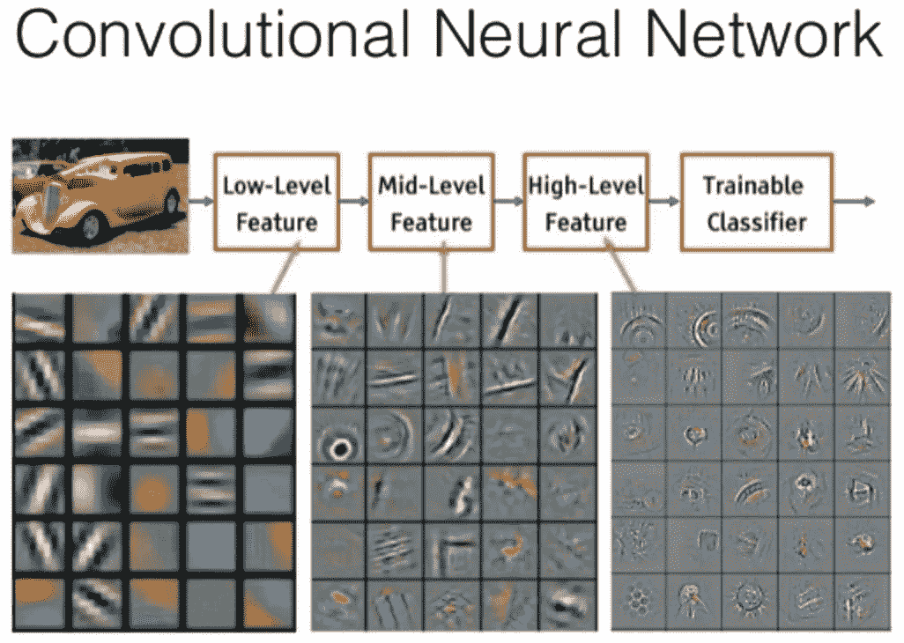
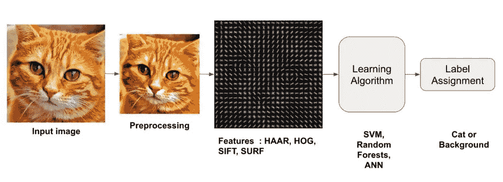
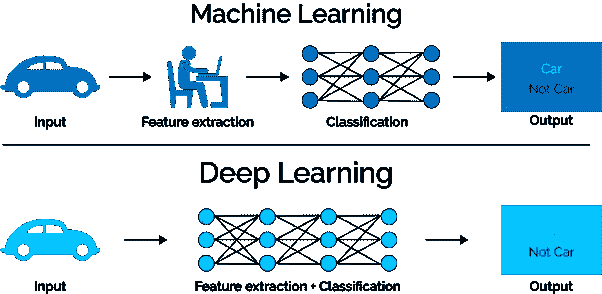

# 是什么让深度学习不同于传统的机器学习方法？

> 原文：<https://towardsdatascience.com/what-makes-deep-learning-different-from-traditional-machine-learning-methods-fc154db33939?source=collection_archive---------17----------------------->

莫里茨·金德勒在 [Unsplash](https://unsplash.com?utm_source=medium&utm_medium=referral) 上拍摄的照片

## 使深度神经网络与众不同的 3 个关键特征

> 所有表达的观点都是我自己的。本文的灵感主要来自于 Zsolt Kira 教授精彩的 CS7643 讲座。

所以你在一个聚会上，你 c̶a̶n̶'̶t̶̶s̶e̶e̶m̶̶t̶o̶̶s̶h̶u̶t̶̶u̶p̶̶热情地告诉每个人人工智能将如何改变世界，你知道这一点，因为你是一个人工智能爱好者或机器学习实践者*或任何你用来描述自己的好听的头衔。然后，某个时不时看报纸的人问你**“我真的不明白深度学习和传统机器学习的区别。深度学习和(经典)机器学习的区别***是什么？”。你给了一些关于神经网络中的神经元是如何基于人脑的手写解释等等等等…一个让人不服气并让你尴尬的答案。因此，下面是如何正确回答这个问题——深度学习有 3 个关键特征使其与众不同:

1.  [层次组合性](#289a)
2.  [分布式表示](#516f)
3.  [端到端学习](#591b)

# 层次组合性

特里·维里斯迪斯在 [Unsplash](https://unsplash.com?utm_source=medium&utm_medium=referral) 上拍摄的照片

深度学习模型架构往往基于这样一种想法，即周围的世界表现出层次结构。简单地说，世界上所有复杂的东西都是由简单的积木组成的，而这些简单的积木又是由更简单的积木组成的。这类似于在化学中，化合物是由分子组成的，而分子又是由原子组成的，或者在商业环境中，组织是由部门组成的，部门是由团队组成的，团队是由员工组成的。

同样，在图像中，像素形成边缘，边缘形成形状，形状形成文本(形状的复杂组合)，文本形成对象，对象形成完整的图像。在自然语言处理的情况下，字符形成单词，单词形成短语，短语形成句子，句子形成段落。通过在它们的架构中反映数据的这种分层性质，深度学习模型能够通过对数据中的分层关系进行建模来了解简单部分如何形成复杂的整体。

在 ImageNet 上训练的 Convnet 的特征可视化[泽勒和弗格斯 2013]

在传统的机器学习方法中，专家将参与手工挑选这些低级特征，然后手工设计这些低级特征的提取，然后可以将这些提取馈送到模型，例如 SVM 分类器。这一过程不仅繁琐，而且选择和定义特征还涉及某种程度的解释性决策，这种决策容易因数据的过度简化而产生偏差并丢失信息。深度学习则以原始数据为输入，通过训练过程自动学习层次元素及其关系。

# 分布式表示

照片由 [JJ 英](https://unsplash.com/@jjying?utm_source=medium&utm_medium=referral)在 [Unsplash](https://unsplash.com?utm_source=medium&utm_medium=referral)

在神经网络中，神经元一起工作来学习数据的表示。单个神经元本身既不能编码所有的东西，也不能真正编码一个特定的东西。正如在管弦乐队中没有一种乐器能够真正表达音乐作品的全部丰富性一样，在神经网络中，复杂的数据表示是通过整个神经元网络通过来回传递信息来学习的。

来源:[https://learnopencv . com/image-recognition-and-object-detection-part 1/](https://learnopencv.com/image-recognition-and-object-detection-part1/)

相反，在传统的机器学习方法中，为了对猫的图像进行分类，模型管道的部分将被配置成检测猫的特定特征。例如，可能有一个组件检测胡须，另一个组件检测尾巴等等。然而，在深度学习中，没有单个神经元被专门配置为*寻找*胡须或尾巴。

这种分布式表示的特点实际上在某些情况下使深度学习具有优势。一种这样的情况是[迁移学习](https://en.wikipedia.org/wiki/Transfer_learning#:~:text=Transfer%20learning%20(TL)%20is%20a,when%20trying%20to%20recognize%20trucks.)。例如，通过一些简单的微调，为分类猫品种而训练的深度学习模型可以很容易地用于狗品种分类。

# 端到端学习

由[安德鲁·莫卡](https://unsplash.com/@mocaandrew?utm_source=medium&utm_medium=referral)在 [Unsplash](https://unsplash.com?utm_source=medium&utm_medium=referral) 上拍摄

深度学习以端到端的方式应用学习过程的想法在前面提到的要点中有很大的暗示。然而，这种区别不是微不足道的，值得作为深度学习的独立区别特征重复。在深度学习中，学习过程应用于过程的每一步-模型将原始数据作为输入，通过学习特征表示来执行特征提取，并学习参数来执行必要的任务，如分类。事实上，这个过程是端到端的，以至于特征提取和参数优化之间的界限非常模糊。

来源:[https://blog.dataiku.com/hs-fs/](https://blog.dataiku.com/hs-fs/hubfs/machine%20learning%20vs%20deep%20learning.png?width=602&name=machine%20learning%20vs%20deep%20learning.png)

如前面提到的要点所暗示的，对于经典的机器学习方法，典型地，需要单独的特征提取过程/管道来馈入预测模型。这个管道可能涉及人工挑选和手工设计训练模型所必需的特征。这与深度学习方法形成鲜明对比，在深度学习方法中，模型直接作用于原始数据。

# 不同是否意味着更好？

现在我们知道了是什么让深度学习变得不同，那么不同就一定意味着更好吗？答案是否定的，经典机器学习技术在现实世界应用中的强大存在和流行就是证明。深度学习的上述 3 个定义特征也是使深度学习模型更难解释的原因。例如，在表现不佳的经典机器学习分类器的情况下，查看分类不佳的数据并确定故障是在特征提取还是在模型中是相当简单的。一旦发现了弱点，就可以朝着消除它的方向前进。然而，在深度学习的情况下，架构的层次化、分布式和端到端的性质使得查明糟糕性能的来源具有挑战性。人们不能指向某个特定的层或神经元，把表现不佳归咎于它。

因此，重要的是要知道是什么将深度学习与传统的机器学习区分开来，以及这些差异带来了什么负担。我们必须始终首先从数据开始，在选择模型、技术和体系结构时，要彻底了解背景。

# 见见作者

艾西瓦娅·普拉巴特

嗨！我是艾西。我名字的前两个字母是“AI”，AI 和机器学习是我热爱的。可以通过 [LinkedIn](https://www.linkedin.com/in/aishwaryaprabhat) 联系我。