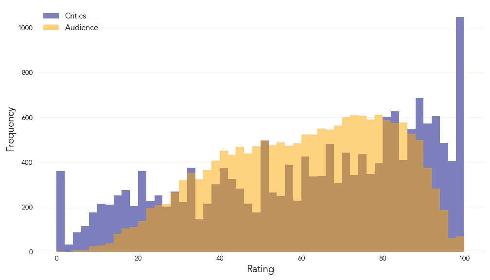
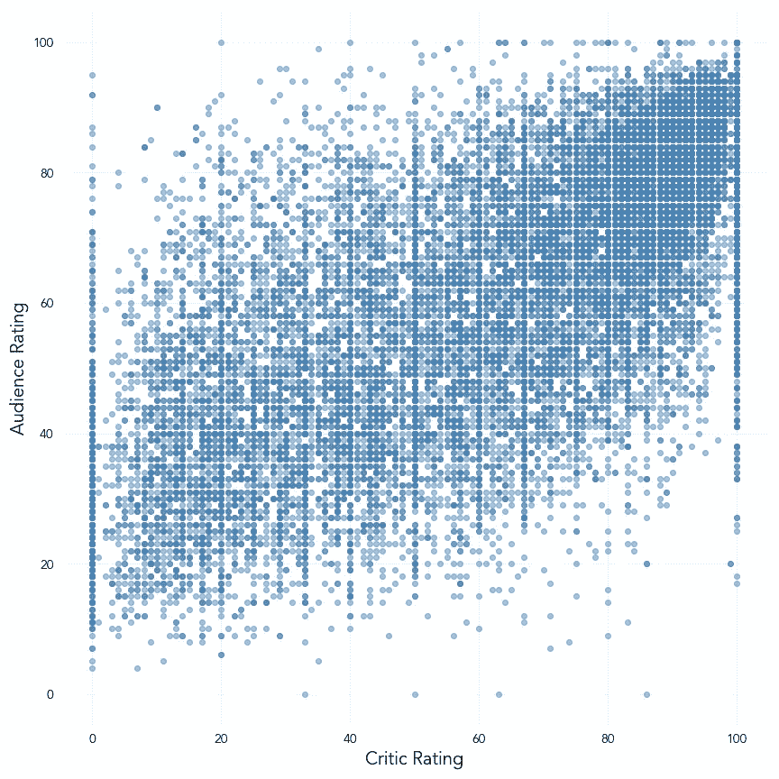
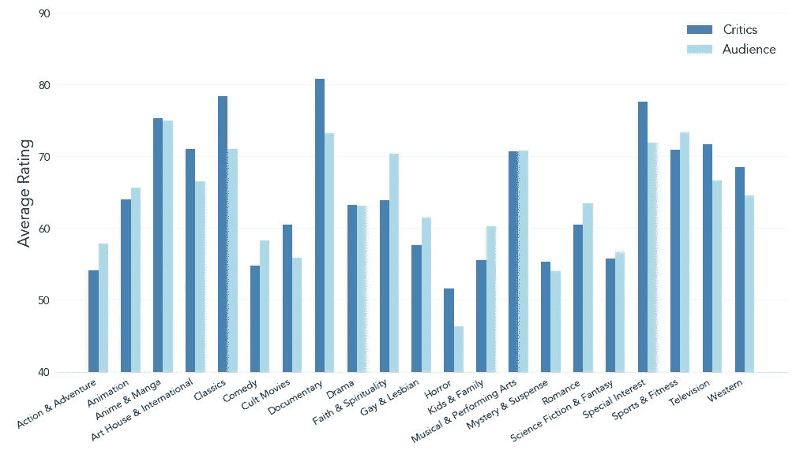
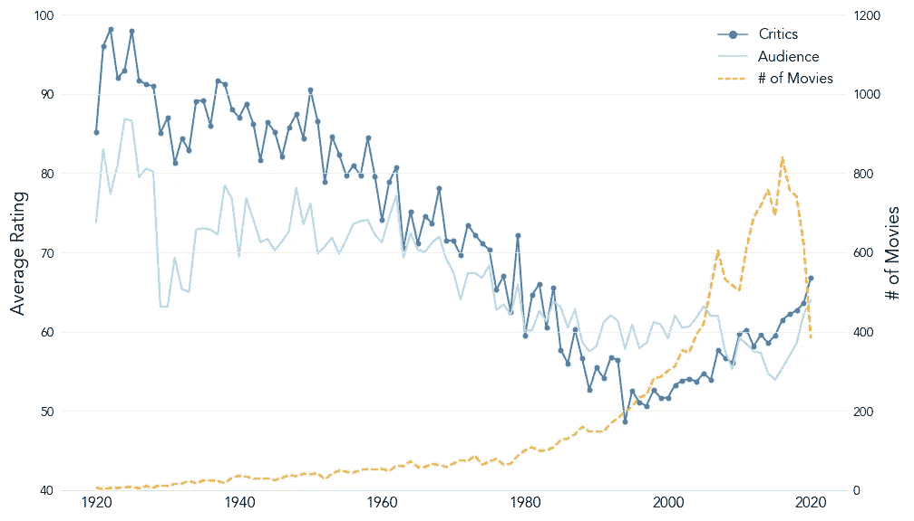
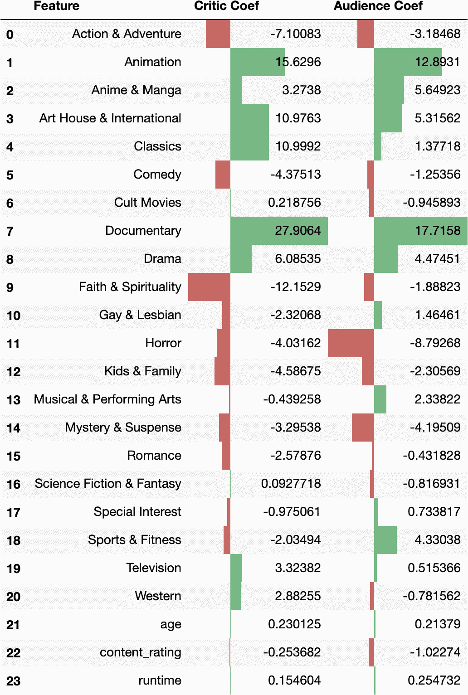

# 一部好电影的要素是什么？

> 原文：<https://towardsdatascience.com/what-makes-for-a-good-movie-8e10896e0f1b?source=collection_archive---------20----------------------->

## *使用烂番茄的数据比较观众和评论家的评分*

由[杰瑞米·叶](https://unsplash.com/@jeremyyappy?utm_source=medium&utm_medium=referral)在 [Unsplash](https://unsplash.com?utm_source=medium&utm_medium=referral) 上拍摄的照片

在过去的一个世纪左右，电影扮演了社会上最广泛消费的娱乐形式之一的角色，每年都有无数的电影出现，就像热锅里的爆米花一样充满活力。

不断增长的电影选择使晚间娱乐节目的选择过程变得更加扑朔迷离，许多观众在做出选择时会借助推荐。这样的推荐可能来自于用户生成的网站、评论家发表的评论，或者两者结合的平台。

但是这位受人尊敬的电影评论家的观点代表了普通电影观众的观点吗？我们能依靠评论家的声音来影响我们对娱乐的选择吗？

本文旨在使用自 1998 年以来提供电影和电视评论的网站 [*【烂番茄】*](https://www.rottentomatoes.com/) 的数据，分析影评人和观众的电影评级行为的异同。

该网站为每部电影显示了两个独立的平均评级(以百分比为单位)，描述了它收到的积极评论的份额:一个是基于一些评论家的评论，另一个是由网站的用户产生的。

使用由来自烂番茄的 17，000 多部电影的平均评论家评级、平均观众评级和各种属性组成的数据集，本文将采用多种分析方法来比较这两个群体的行为。

我们将首先对两组各自评级行为的差异程度进行广泛评估。然后，我们将深入分析上述差异的驱动因素。最后，我们将实现一个简单的线性模型，试图确定每个组的评级倾向的主要决定因素。

# 第一部分:评估差异

为了对观众和评论家各自的评级行为进行总体比较，我们先来看看各组的评级分布。

图 1:观众和评论家评分分布直方图

在上面的直方图中，我们可以发现两组评级的不同模式。

这两种分布都表现出左偏:这表明，在这两种情况下，我们的数据集中有更多的电影集中在评级范围的高端(因此更积极)。

然而，公平地说，这两种分布在形状上明显不同。

观众评分的分布更加平稳，没有明显的峰值，通常集中在中到高的评分范围内，很少会下降到较低的评分范围。

影评人的评分在整个范围内要广泛得多，这意味着几乎有同样多的电影走向低端，也有同样多的电影走向高端。该分布也在两个极端呈现峰值，尽管人们会假设这些是已经收到少量评论的电影的情况。

这表明，我们可以期待观众在他们的评级中更加慷慨，而另一方面，评论家，正如其名称所暗示的那样，更加挑剔。

接下来，让我们调查两组的评分之间是否有任何明显的相关性。每一点都是一部电影，我们可以画出观众和评论家的评分。

图 2:观众和评论家评分相关性散点图

上面的散点图表明，事实上有一些证据表明两组评分之间存在正相关，这表明观众对电影的高度评价也会得到评论家的积极评价。

然而，剧情中显示的相关性很难用强来形容，大量电影落在离中心线相当远的地方。

以上两个图表为我们提供了证据，证明两组评分之间有足够的对比，让我们可以更深入地研究数据。

记住这一点，让我们进一步分析，试图找出上述两组行为差异的原因。

# 第二部分:分析观众/评论家差异的驱动因素

考虑到上面的初步分析，让我们尝试采取一些措施，通过探索数据集的其他方面来确定观众和评论家不同行为的驱动因素。

当思考什么可能会影响观众对电影的欣赏时，一个浮现在脑海中的属性可能是电影的类型。让我们比较两组中每一组在我们的数据集中出现的每一个电影类型的平均评级。

图 3:比较不同流派的观众和评论家评分的条形图

上面的图表指出了一个事实，即评论家和观众对一些电影类型的反应通常是不同的。

影评人对纪录片和 T2 经典电影的反应更加积极，而观众对 T4 信仰、精神和儿童家庭类型表现出更大的偏好。

从理论上看，这是有道理的。有人可能会说，电影界的“经典”满足了被认为是高电影质量的必要标准，但对于更随便的电影观众来说可能不太容易获得。

另一方面,“家庭友好型”电影可以服务于娱乐观众的目的，这些观众寻求一部简单的电影来与他们的孩子一起观看，而不需要采用各种各样的电影技术来获得电影伟大的赞誉。

然而，这两个群体对一些类型有相似的反应。例如，看起来音乐剧和 T2 戏剧在观众和评论家中普遍受欢迎。

让我们对电影上映的年份进行类似的分析。随着时间的推移，这两个群体各自的评级会不会遵循一种相似的、甚至相反的变化模式？

图 4:按发行年份比较观众和评论家评分的线形图

上图表明，观众的平均评分随着时间的推移保持相当稳定，也许显示出略有下降的趋势。然而，这种下降趋势在更大程度上表现在批评家的行为中:他们的路线在所涵盖的 100 年中急剧下降。

这是否意味着，从评论家的角度来看，与上个世纪早期相比，如今广受好评的电影越来越少了？

嗯，不一定。值得注意的是图中的第三条线，它向我们展示了我们移动的时间越远，我们分析的电影数量就越多。

这可能是因为该数据集的创建者倾向于包含更多的新电影而不是旧电影，或者近年来数据的可用性更高。

然而，更有可能是因为现在每年制作的电影比 60 年前多得多。

随着独立影院等概念的出现以及电影流媒体平台的采用，可以说进入电影行业的门槛已经大大降低了。

这意味着随着时间的推移，电影院的分布可能会变得更加“稀释”:每年都会有更多的电影上映，以迎合更广泛的观众。

虽然这并不意味着高质量的电影已经消失，但越来越多的电影旨在安抚寻找简单娱乐方式的观众，而不是给评论家留下深刻印象，这不可避免地导致评论家平均评分的下降，而不会严重损害观众的普遍看法，因此可能解释了上述行为。

# 第三部分:确定评级行为的决定因素

让我们进入分析的最后一部分，通过实施一个简单的线性模型，我们将尝试确定每个群体评定行为的关键决定因素。

我们可以使用电影的年龄，播放时间，内容评级和类型作为解释变量，而评论家和观众的平均评级作为两个独立模型中的反应变量，然后我们可以进行比较。

图 5:为观众和评论家评级实现的线性模型的系数

对于不熟悉线性回归基础的读者来说，变量的系数描述了变量的增量变化对响应的估计影响。

在这种模式的背景下，这意味着，例如，我们可以预计一部电影作为一部纪录片会将评论家的平均评分提高 27.9 分。

根据对模型结果的解释，我们可以看到，在这两种情况下，电影类型对每个群体的评级行为的影响都比我们在模型中包括的其他变量大得多。

除了一些例外，许多类型在方向和程度上对两个群体的行为有类似的影响，其中*纪录片*和*动画*电影对两个群体的评级有最大的积极影响。

不同之处在于像恐怖片这样的类型，它对收视率的负面影响远远大于对评论家的负面影响。西部片虽然对两个群体的影响力都相当弱，但却表现出了各自相反的相关性:对评论家来说是正面的，对观众来说是负面的。

为了支持上一节分析中显示一段时间内平均评分的图表，年龄变量对两组都产生了正系数，对批评者的影响更大。然而，与流派变量相比，模型估计其影响极小，就像*运行时*的情况一样。

另一个值得注意的有趣差异是电影内容分级的影响。虽然对评论家的行为几乎没有影响，但这种影响在观众中更明显:更严厉的内容评级会导致平均分数下降。

这也符合之前在分析中讨论的理论。既然我们发现观众对儿童家庭电影的反应更积极，那么电影内容分级的严格程度(因此，通过推理，它包含的露骨内容的程度)与这个群体的享受程度负相关是有道理的。

# 结论

这篇文章使用了来自烂番茄的数据来比较电影评论家和网站普通用户的评分行为。在采用多种技术分析数据后，我们确定了以下关键要点:

1.  这两组人各自的行为模式有明显的不同，观众比批评家更有可能给出慷慨的评价
2.  这两组人对我们的数据中出现的不同类型有不同的反应
3.  随着电影发行年份的增加，影评人的平均评分显著下降，而观众的评分保持不变
4.  根据我们的模型，类型是两组中分级行为的主要决定因素，然而观众对电影的内容分级表现出更大的敏感性

当然，触及这种分析的局限性是值得的。电影本质上是一种艺术形式。

虽然我们可以测量某些方面来形成分析性的论点，但电影中总会有一些无法定量测量的元素:电影的特征会影响我们对它的感受，我们无法用数字来描述。

然而，我希望尝试使用以数据为中心的方法来探索对电影的兴趣仍然是一个有趣的阅读！

# 图表背后的代码

如果你有兴趣看看我用来分析数据集和构建本文可视化的 Python 代码，请随意查看我的 Github 上的[这个库](https://github.com/HarryR96/rotten_tomatoes)。数据集创建者的确认包含在存储库的自述文件中。