# 图卷积网络的工作原理是什么？

> 原文：<https://towardsdatascience.com/what-makes-graph-convolutional-networks-work-53badade0ce9?source=collection_archive---------18----------------------->

## GCNs 背后的数学直觉的分解。

*这是机器学习中* [*图*](https://medium.com/mlearning-ai/why-graph-theory-is-cooler-than-you-thought-4df73e2a4950)*[*图论*](https://medium.datadriveninvestor.com/graph-convolutional-networks-explained-d88566682b8f?source=your_stories_page-------------------------------------) *系列的第三部分。**

*到目前为止，如果您一直在阅读本系列文章，您可能已经了解了一些图论知识，为什么我们在数据科学中关注图结构数据，以及什么是“图卷积网络”。现在，我想向您简要介绍一下*这些东西是如何工作的。**

**对于本领域中可能对这个主题有所了解的朋友，我将谈论* [*Kipf & Welling 的*](http://arxiv.org/abs/1609.02907) *2017 年关于半监督学习的图卷积的论文(Thomas Kipf 在这里* *写了一个对这个概念更容易理解的解释* [*)背后的直觉，尽管自改进这种方法以来已经开发了其他方法。我的目标是介绍数学概念，而不是提供该主题的广泛概述。*](https://tkipf.github.io/graph-convolutional-networks/)*

*现在，如果你不是数学家、数据科学家，甚至不是计算机科学家，先不要离开。目标是将学术论文和概念分解，以便任何人都能理解。请在最后留下回复，让我知道我是否实现了这个目标！*

## *我们走吧！— GCNs，目标是什么？*

*在 Thomas N. Kipf 的博客文章中，他说图卷积网络的目标是:*

> *“……学习图 G =(v，e)上信号/特征的函数”*

*但这到底意味着什么呢？我们来分解一下。*

*对*图*或*节点进行*某种预测或分类*有不同的方法。*但我们关注的是图卷积网络，对于*分类关注的是* ***图*。*** 这意味着，为了提供一个具体的例子，对于类似于**蛋白质的东西，**其具有由整个图形表示的结构:*

*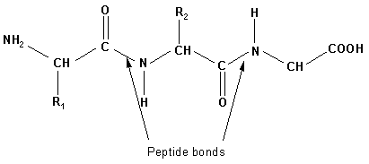*

*蛋白质的基本结构，其中多个氨基酸通过肽键连接，由[来源](https://swift.cmbi.umcn.nl/teach/alg/infopages/peptide_bond.gif)提供。*

*我们可能需要一种方法来嵌入这个图的**特征**，这样我们就可以**对我们正在查看的蛋白质进行分类*。****

*所以，让我们回到我们上面的引用。我们想学习图上特征的*函数*。换句话说，我们希望了解特征之间的关系——在蛋白质的例子中，这可能是某些原子之间的特定键表示，或者原子表示本身——给定我们图形的特定网络结构。换句话说: ***节点和键*** (边缘)的组合如何影响我们正在观察的 ***蛋白质(目标标签)？****

*免责声明:就像这篇文章中的许多事情一样，这有点过于简单化了。这样做的目的是分享 GCNs 背后的直觉，并让它变得容易理解。对于完整的解释和数学证明，我鼓励你更深入地研究底部引用的论文。*

***为什么不是普通的卷积神经网络？**我们已经在[之前的文章](https://medium.datadriveninvestor.com/graph-convolutional-networks-explained-d88566682b8f?source=your_stories_page-------------------------------------&gi=8ec29311e21f)中谈到了传统机器学习&深度学习模型在面对任意结构化(非欧几里德)数据时面临的困难。GCN 允许我们将图表结构嵌入到二维表示中，克服了如果我们试图使用传统 CNN 对该图表进行分类时会遇到的障碍。*

*你可以把嵌入想象成一个三维分子模型，像这样:*

*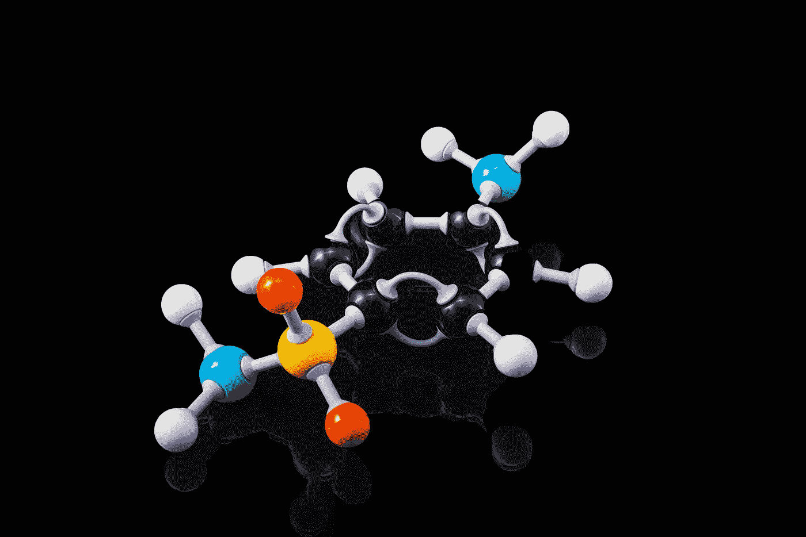*

*照片由 Unsplash 上的[特里·维利迪斯](https://unsplash.com/@vlisidis)提供*

*并把它画在一张纸上，以便我们随身携带和记忆。*

## *为了理解如何实现，让我们看一下正向传播。*

*我可能会把我的学习风格投射到我的读者身上，但是为了真正完全掌握 Kipf 提出的公式，我必须回到基础，回顾一下向前传播。让我们花一点时间来看看正向传播公式:*

*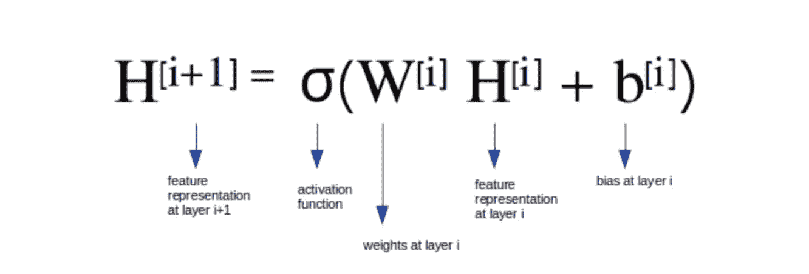*

*正则神经网络的前向传播方程。图片来自[来源](/understanding-graph-convolutional-networks-for-node-classification-a2bfdb7aba7b)*

*不要让这个公式吓到你。它只是说在下一层的*的特征表示等于在当前层*的权重上执行*某种激活函数*的结果乘以当前层的*特征表示加上当前层的偏差。**

*也许那仍然感觉是稠密的，如果是的话，那也没关系。你可以这样想:*这个公式表示的是我们为了得到一个输出而采取的一系列计算步骤，*将结果通过我们神经网络中的每一层，直到 *i* 是我们的最终(输出)层。(如果你知道编程的基础，你可以把它概念化为一个 for 循环:“对于我们神经网络的每一层，执行这个计算以返回一个最终值。”)*

*我们的*激活函数*(表示为 sigma) 可能是类似 ReLu 的东西，我们的*特征表示*可以被认为是以我们的蛋白质为例，其中我们分子中的每个原子都由它的原子序数表示(为了我们的简单例子)。然后，我们希望最后一层的最终输出是我们正在查看的蛋白质的*表示—* 我们的分类。现在不要太担心偏见，如果你不知道它是什么，我们不会在本文中进一步讨论它。*

> ****签到****
> 
> *如果你对这一切有点陌生，你的大脑现在可能正在受伤，这没关系。在我们继续之前，让我们花一点时间来回顾和消化我们所学的内容*
> 
> **1。GCN 的一个目标是将任意结构的图嵌入到网络的二维表示中。**
> 
> **2。此外，我们想了解图*上的特征的*功能——我们想知道*内容*如何影响其他*内容*(我们图中的特征如何影响我们的目标)。**
> 
> *3.*我们已经回顾了常规神经网络的*前向传播*，并且理解了这个等式告诉我们什么。**

## *正向传播——这与 GCNs 有什么关系？*

*与任何神经网络类似，图卷积网络需要一种方法来通过层向前传播值以实现其目标。然而，假设我们的数据不是欧几里得的，我们需要对上面讨论的常规正向传播方程做一些小的调整。*

*首先，我们需要一种计算方式来表示我们的图形。如果你一直记得我关于图论的第一篇文章，或者如果你记得你的数学(或者，对于房间里的计算机科学家来说，你的数据结构课程)，你会记得表示一个图的一种方式是用一个**邻接矩阵**。让我们看一个例子:*

*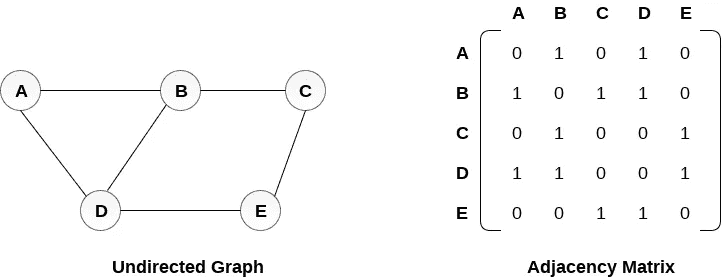*

*无向图的邻接矩阵，如左图所示。*

*我们的邻接矩阵实际上是一个*稀疏矩阵*，其中我们有代表**节点标签**的行和列，以及任何两个节点是否相互连接的二进制表示。0 对应“无连接”，其中 1 代表连接(一个**边沿**)。*

*所以，我们有了 GCN 难题中第一个缺失的部分:我们的**邻接矩阵**，我们称之为 **A.***

*现在，我们需要确保将 **A** 插入到我们的传播方程中。*由于我说过不要担心偏见(并且由于我引用的文章中的图像也省略了图像中的这个值，这样做很好)，您在下面的表示中看不到它。**

*让我们看看目前为止的等式:*

*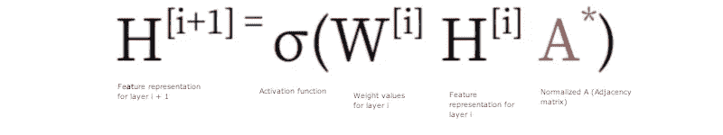*

*图卷积网络的前向传播方程。图片由[来源](/understanding-graph-convolutional-networks-for-node-classification-a2bfdb7aba7b)提供，添加了我自己的注释。*

*但是我们还没有完成。有两个问题:*

1.  *如果我们只查看 **A，**我们将查看给定节点的所有邻居，而不是该节点本身。我们一会儿会处理这个问题。*
2.  *什么是 A*？正如我们最初讨论的那样，一个没有被规范化。由于我们必须将我们的权重和特征表示乘以我们的稀疏邻接矩阵 **A，**我们可以预计，特征表示和权重的比例将随着 **A 的比例而显著变化。因此，A*是归一化的 A。**让我们来讨论这意味着什么:*

*Kipf & Welling 引入了一种方法来规范化处理第二个问题的。首先我们需要 [*对角节点度矩阵*](https://en.wikipedia.org/wiki/Degree_matrix) *，* ***D.*** 如果那句话感觉很混乱，可以看看链接的文章！归一化 **A** 的方法之一是乘以 **D，**但是基普夫&韦林向我们介绍了另一种叫做对称归一化的方法。这相当于:*

*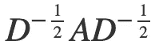*

*邻接矩阵(A)和度矩阵(D)的对称归一化表示，承蒙[来源](https://tkipf.github.io/graph-convolutional-networks/)。*

*当我们提供最终方程式时，您将看到这一点！现在，我们已经解决了我们的正常化问题，我们就快到了。我们还有一点要补充:自循环。*

*我们想要学习我们的图中所有节点的表示，这意味着我们需要改变我们的图。因为这已经是一篇很长的文章了，我将再次引用 Thomas Kipf 在他的[博客](https://tkipf.github.io/graph-convolutional-networks/)中的话来解释:*

> *“……与 A 相乘意味着，对于每个节点，我们对所有相邻节点的所有特征向量求和，而不是对节点本身求和(除非图中存在自循环)。我们可以通过在图中强制执行自循环来“解决”这个问题:我们只需将单位矩阵添加到 a 中。*

*这里，我们到了下一步:加强自我循环。这意味着我们需要我们的节点也连接回自己，看起来像这样:*

*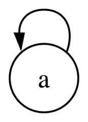*

*单个节点上的自循环，由[源](https://commons.wikimedia.org/wiki/File:Self-loop.png)提供。*

*如果你不能 100%确定 Kipf 在他关于*单位矩阵*的引用中所说的话，请记住单位矩阵是一个 *n* x *n* 矩阵*，1 的*在主对角线上(左上到右下),其他地方为零:*

*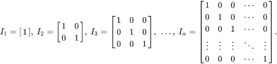*

*单位矩阵*n×n，承蒙* [*出处*](https://en.wikipedia.org/wiki/Identity_matrix) *。**

*其中 *n* 在我们的用例中是邻接矩阵 **A.** 的维数*

*现在，我们已经用 A 的度矩阵对 A 进行了归一化，并通过添加我们的单位矩阵来实施自循环，我们得到了图卷积网络中前向传播的最终方程:*

*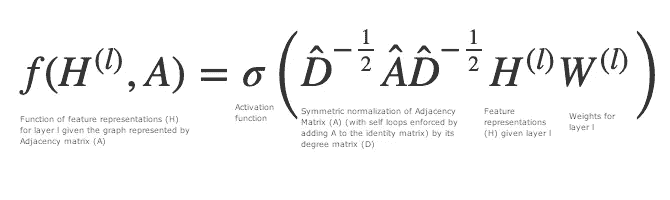*

*图卷积网络的前向传播方程——推导邻接矩阵(A)的层(l)特征表示函数的方程，由[来源](https://tkipf.github.io/graph-convolutional-networks/)提供，并添加了我自己的注释。*

*让我们分解这个新方程。*

*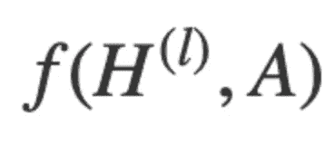*

*GCNs 前向传播方程的第一条款。*

*这一块写着:“给定邻接矩阵 **A** ，我们的特征对于层 *l* 的作用”。*这就是我们希望为*解决的问题。记住我们最初的目标之一，为一个图寻找特征的函数。*

*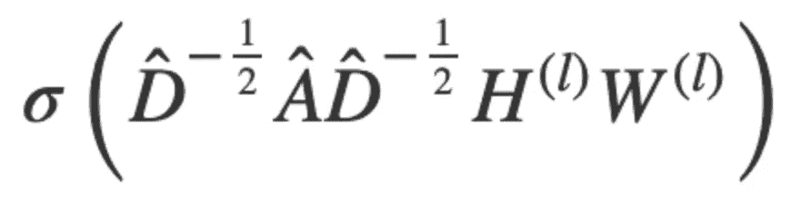*

*GCNs 前向传播方程的第二条款。*

*让我们分解第二部分。请记住，这是等号的右边-这是我们用来寻找我们的功能的功能。*

*记住 sigma (𝝈)代表一个激活函数(比如 ReLu)。所以这个子句表示的是β的对角度矩阵( *D̂* )* 上的激活函数的结果，这是我们添加到单位矩阵的邻接矩阵(a)，我们已经使用“对称归一化”对其进行了归一化。这些然后乘以我们的特征表示和我们当前层的权重， *l.**

*等等——让我们后退一步。*

*让我们谈谈拼图的最后一块。还记得我们如何谈论我们的蛋白质例子，以及我们的节点如何可能有一个*标签，*像一个原子的名称或缩写(即:碳，或 C)，以及一个*特征表示，*可能像它们的原子序数？*

*本例中的这些表示成为我们的**特征表示向量**，对于上面的等式，表示 *l.* 的 *H**

## *用几句话概括一下*

*你刚刚学习了如何找到给定图的特征的**函数，给定图的邻接矩阵 *A、*d、***

*您已经回顾了前向传播，并了解了它与图卷积网络的不同之处。您已经了解了在处理任意结构化数据时需要考虑的一些重要注意事项，比如拥有或创建自循环以及规范化邻接矩阵的重要性。*

*不错！你已经为下一步做好了充分的准备——这一步很快就会到来——这一步应该会有趣得多:用 gcn 对东西进行实际分类。*

*如果您想在下一次之前了解更多，请查阅所有在本文写作过程中非常有价值的论文和资料:*

1.  *[图卷积网络半监督分类，](https://arxiv.org/abs/1609.02907) Kipf & Welling (ICLR 2017)*
2.  *[图卷积网络](https://tkipf.github.io/graph-convolutional-networks/)，托马斯·基普夫*
3.  *[理解用于节点分类的图卷积网络](/understanding-graph-convolutional-networks-for-node-classification-a2bfdb7aba7b)，Inneke Mayachita*

*注意事项:*

1.  ***GCNs 也可以用于节点级分类，但是为了简化示例，我们在这里不关注这一点。**
2.  ***这代表‘D-hat’，Medium 的数学符号支持有点欠缺**