# 如何使用微软的 Graph API 从 OneDrive、Outlook 等中查询、创建和分析数据

> 原文：<https://towardsdatascience.com/what-microsoft-knows-about-you-and-how-you-can-use-it-to-generate-your-own-insights-1bd0aa0881ed?source=collection_archive---------10----------------------->

## 用来自 10 多个不同微软应用的数据构建你自己的 Django 仪表板

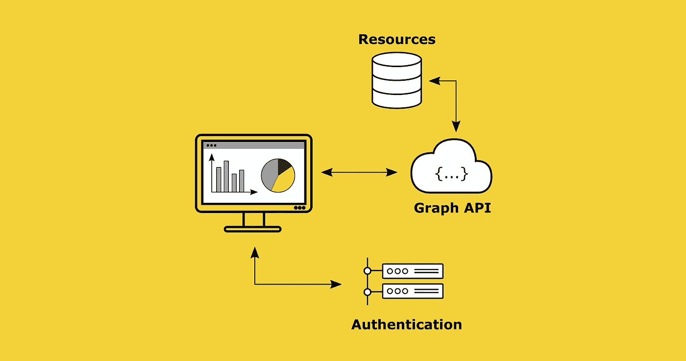

作者图片

从我的电子邮件、日历条目、云存储中的文件到团队中的工作组，我在电脑和手机上的很大一部分日常活动都是通过微软应用程序完成的。所有这些数据都存储在微软的云端，不管我喜不喜欢。好在微软提供了一个 API，允许它访问和控制大部分数据，所以为什么不用它来产生你自己的见解呢。

下面的截图应该让你知道我想用这篇文章传达什么。我想让你看看:

*   我对 API 本身的体验是什么，以及如何**构建访问数据所需的查询**
*   **认证过程**是如何工作的，它给你的应用程序必要的权限
*   你如何**处理和可视化**Django 中的数据

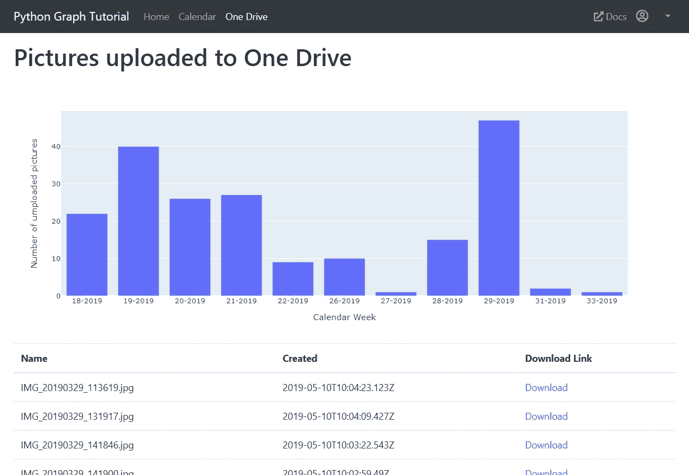

带有 Django 的简单仪表板应用程序—图片由作者提供

# 目录

*   [Graph Quick Start——快速使用微软的 Graph API](#6ce1)
*   [OAuth 2.0 —登录流程如何工作](#a7b2)
*   [使用图形 API 查询数据](#bf97)
*   [用 plottly](#c889)分析并可视化数据
*   [总结](#1ed7)

## Graph Quick Start —快速启动 Graph API 的方法

几年前，微软从 Live SDK 转到了 Microsoft Graph。Microsoft Graph 现在是访问 Microsoft 365 中所有数据和见解的 API。[1][2]

有几种方法可以开始使用 Microsoft Graph API。最快的方法是使用[图形快速启动](https://developer.microsoft.com/en-us/graph/quick-start)，它为认证过程创建一个新的应用 ID 和应用密码，并且已经为您提供了第一个示例项目。

(1)第一步，你需要定义你想要用来构建你的应用的语言。因为我更喜欢 Python，所以示例应用程序将是一个简单的 Django 应用程序。

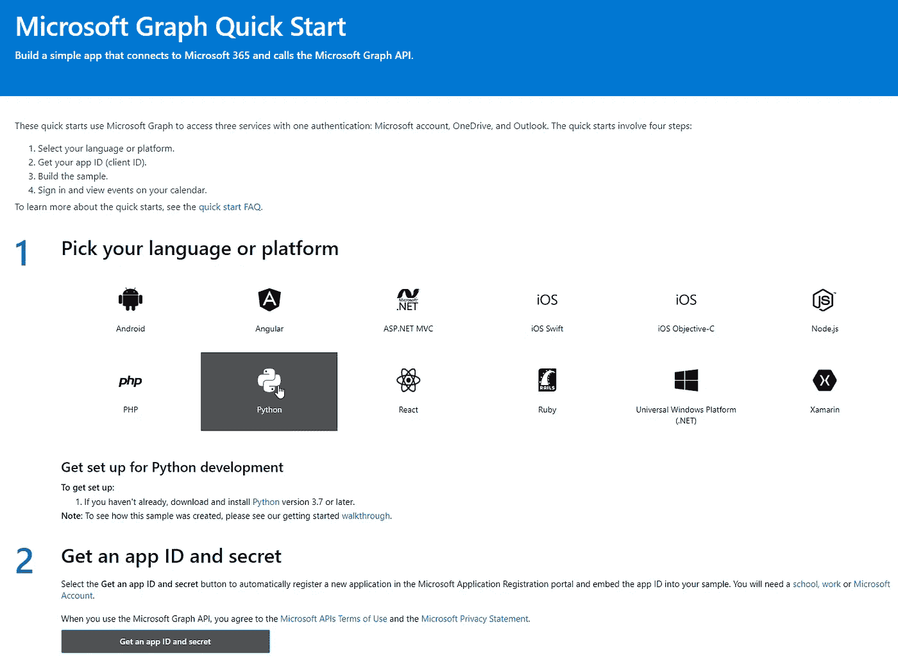

选择作者的语言-图像

如果你对 Django 不熟悉，可以看一下我之前的一篇文章，里面尽可能简单的解释了 Django 的原理，包括了最重要的几点。如果你喜欢从头开始构建自己的应用程序，你也可以在微软文档中找到一个[教程。](https://docs.microsoft.com/en-us/graph/tutorials/python)

[](/a-beginners-guide-to-using-djangos-impressive-data-management-abilities-9e94efe3bd6e) [## 使用 Django 令人印象深刻的数据管理能力的初学者指南

### 使用 Django ORM 完成数据管理任务。甚至不需要启动任何 web 服务器。

towardsdatascience.com](/a-beginners-guide-to-using-djangos-impressive-data-management-abilities-9e94efe3bd6e) 

(2)选择语言后，[快速启动](https://developer.microsoft.com/en-us/graph/quick-start)会让您选择直接创建一个带有 App Secret 的新 App ID，稍后您会在授权过程中用到它。

要获得已注册应用的概览，您可以在 Azure Active Directory 下的 [Azure 门户](https://portal.azure.com/)中完成。

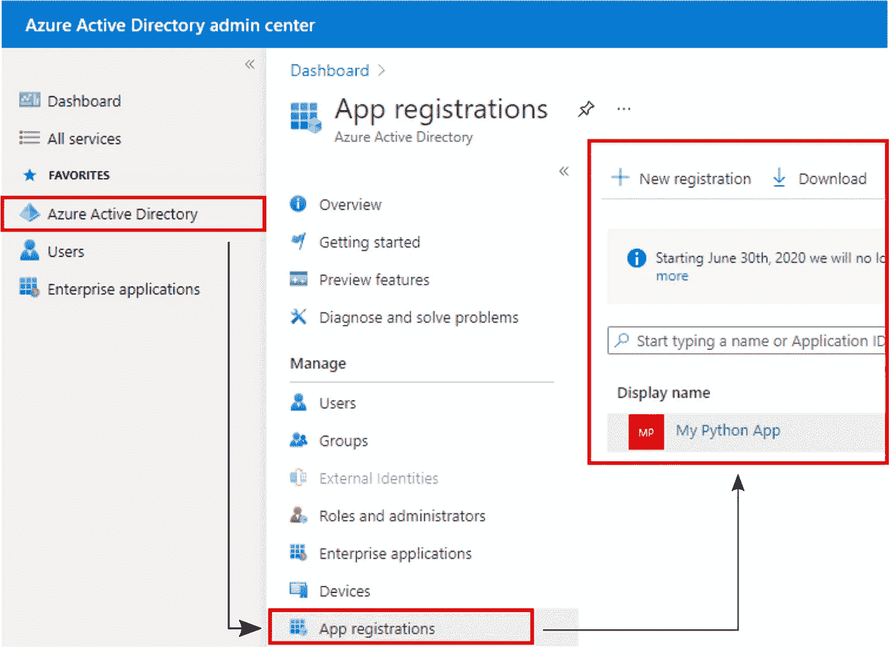

Azure 门户——作者图片

(3)快速入门为您提供了第一个示例应用程序，其中已经包含了基本结构和身份验证流程。下载代码示例并将其保存在项目字典中。

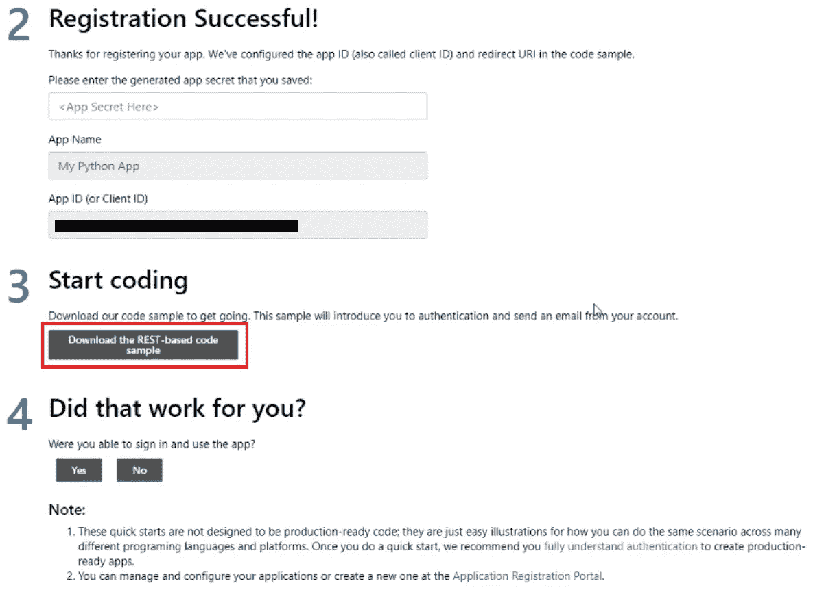

Django 代码示例—图片由作者提供

代码示例的结构看起来像任何普通的 Django 应用程序。此外，YAML 文件`oauth_settings.yml`包括用于认证的设置，例如所需的端点、应用 ID 和应用秘密。

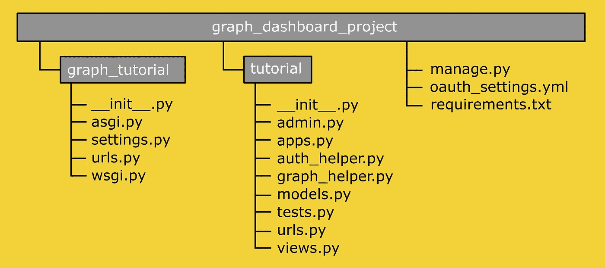

项目结构—作者图片

## 安装要求

(4)为了能够第一次启动应用程序，您必须安装必要的 Python 包。

`requirements.txt`提供了一种安装整个环境的简单方法。[3]由于应用程序有时需要特定版本的库，因此建立一个虚拟环境是有意义的。[4]为此，导航到您的项目目录并执行以下命令，这将创建虚拟环境`virtualenv_graph`。

```
python -m venv virtualenv_graph
```

您将在项目文件夹中找到一个新目录`virtualenv_graph`，其中包含 Python 解释器的副本。为了实际使用刚刚创建的环境`graph-tutorial`，您必须通过执行批处理文件`activate`来激活它，如下所示:

```
graph-tutorial\Scripts\activate.bat
```

激活后，您将在 CMD 输入行开头的括号中看到您的虚拟环境的名称。这表明您的环境当前已被激活。使用以下命令，您现在可以将所有必需的 Python 包安装到您的环境中:

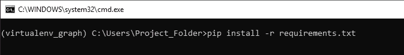

作者图片

## 迁移—将更改传播到数据库

(5)以下命令将应用程序中使用的模型结构映射到数据库:

```
python manage.py migrate
```

这将为使用的 Django 应用程序`django.contrib.auth`和`django.contrib.session`创建一些默认表。

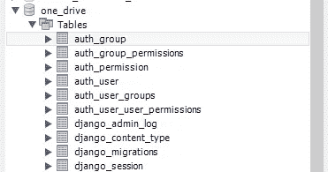

Django 默认表格-图片由作者提供

## 启动一个轻量级 web 服务器

(6)命令`python manage.py runserver`在我们的本地主机上启动一个轻量级 web 服务器。除非另有说明，否则本地 web 服务器运行在端口 8000 和地址 127.0.0.1 上。

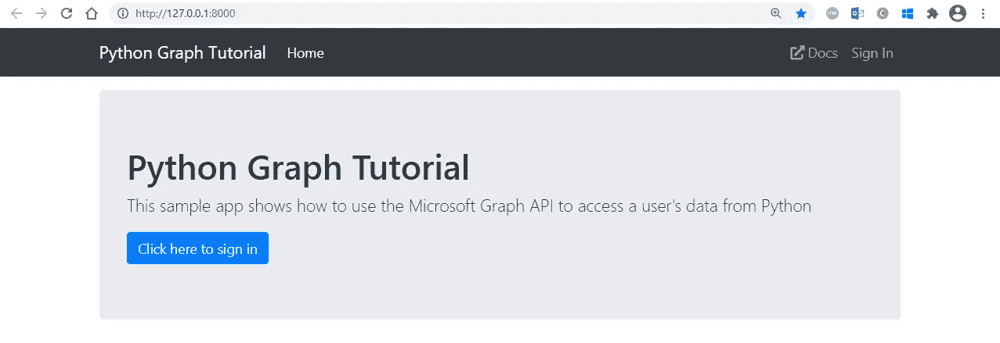

示例应用起始页—作者提供的图片

现在，您可以使用 Office365 帐户的登录数据登录。

# **OAuth 2.0—登录过程如何工作**

在下文中，我将简要概述 OAuth 2.0 的功能，解释给定示例代码的作用。

OAuth 2.0 是一种行业标准的身份验证协议，允许用户授予第三方应用程序对用户资源的访问权限，而无需向应用程序提供您的长期凭据。[5][6]

这是可能的，因为 OAuth 授权层将客户机的角色与资源所有者分开。为了更好地理解这一点，我将尝试简要地解释哪些角色是 OAuth 工作流的一部分，以及它们是如何相互关联的。[5]

*   **资源所有者:**授权访问资源的实体。在这种情况下，是你，最终用户，授权应用程序访问与你的 Microsoft 365 帐户相关的 Microsoft 云中的数据。
*   **资源服务器:**受保护资源所在的位置。
*   **客户端:**客户端是请求访问资源的应用程序，在这里是我们刚刚下载的 Django 应用程序。
*   **授权服务器:**该服务器为最终用户(资源所有者)提供了认证他/她自己的可能性。正确授权后，授权服务器向应用程序发布访问令牌。


用于 Web 服务器应用程序的 OAuth 2.0 图片由作者提供(灵感来自[7][8])

在下文中，我将向您展示如何使用模板应用程序通过 Python 启动授权工作流。

## 从 Microsoft Identity Platform 请求访问令牌

如前所述，应用程序首先需要向认证服务器发送请求。因此，我们正在使用 OAuth 2.0 的**微软身份平台**实现。[7]

单击 Sign-in 按钮调用`tutorial.views.py`中的 sign_in 函数，该函数又使用`get_sign_in_url`函数形成请求 URL。

在授权流程的第一步，客户端应用程序将用户指引到`/authorize`端点。**请求**包含了【7】:

*   `Application ID`，在注册时分配给你的应用
*   `Scope`，定义应用向用户请求的权限。
*   `Redirect URI`，可通过您的应用程序发送和接收认证响应。

授权过程中需要的所有参数都存储在 YAML 文件`oauth_settings.yml`中。

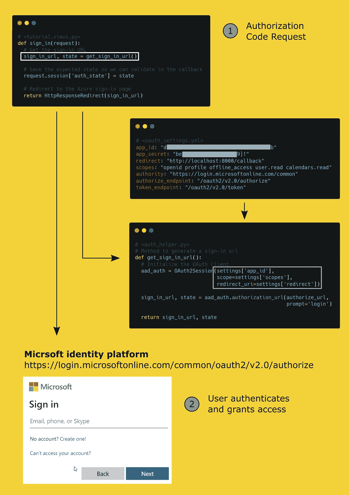

Django 中的 OAuth 2.0 工作流—图片由作者提供

(3)在用户对他/她自己进行身份验证并因此授予应用程序访问权限后，身份验证服务器将使用授权码进行响应，并将用户重定向到您指定的重定向 URI。(4)连同您的`App ID`和`App Secret`，您可以向授权服务器请求一个`Access Token`和`Refresh Token`。(5)然后访问令牌给你访问 API 的能力，至少在`scope`中定义了所需的权限。

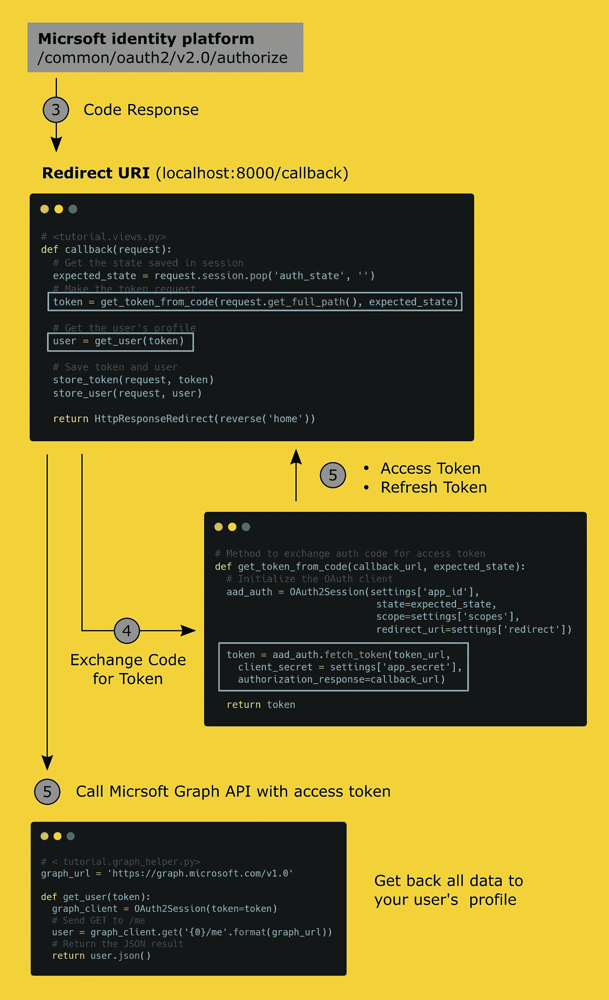

Django 中的 OAuth 2.0 工作流—图片由作者提供

让我们可以访问所请求的资源。在接下来的内容中，我将向您展示如何检索您正在寻找的数据。

# 使用图形 API 查询数据

为了找到正确的数据端点，我们可以使用[图形浏览器](https://developer.microsoft.com/en-us/graph/graph-explorer)。它已经给了你一些关于你的帐户和各种微软应用程序的请求。如果您正在寻找给定查询没有提供的信息，那么看一下文档是值得的。(例如用于 [OneDrive](https://docs.microsoft.com/en-us/onedrive/developer/rest-api/?view=odsp-graph-online)

我对我的单驱动器存储中的数据特别感兴趣。然而，这个概念对于 SharePoint、OneNote、Outlook、工作组等等是相同的。

您可能需要为`oauth_settings.yml`中的 scope 变量添加适当的权限。你会在文档中找到[权限的概述。为了在一个驱动器中读写文件，将`Files.ReadWrite.All`添加到`scope`中。例如，我想检索文件夹`/Bilder/Eigene Aufnahmen`中所有文件的信息。连同刚刚生成的访问令牌，我向`/drive/root:/<path>:/children`发送一个 GET 请求，将数据发送到指定路径中的所有文件。](https://docs.microsoft.com/en-us/graph/permissions-reference)

视图函数`one_drive`的最后一行是呈现 HTML `one_drive.html`，我现在创建它来打印我刚刚从 API 获得的数据。HTML `one_drive.html`类似于`calendar.html`，它已经是示例应用程序的一部分。

现在我们只需要给路由器`urls.py`添加查看功能`one_drive`。

```
# <tutorial.urls.py>from django.urls import path
from . import views

urlpatterns = [
  ...
  path('calendar', views.calendar, name='calendar'),
  path('one_drive', views.one_drive, name='one_drive'),
]
```

现在`http://localhost:8000/one_drive`向我展示了一个 HTML 表格，其中包含文件夹`/Bilder/Eigene Aufnahme`中的所有文件。

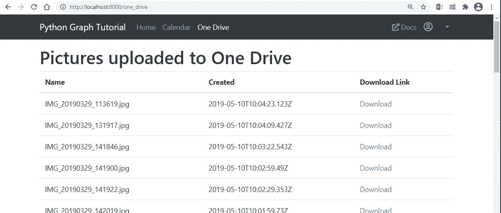

# 用 Plotly 分析和可视化数据

对于数据的可视化，我使用 Plotly。如果还没有这样做，用 pip 按如下方式安装[和](https://plotly.com/):

```
pip install plotly
```

下面我感兴趣的是照片拍摄的时间。
为了清晰起见，我按照拍摄的日历周总结了这些照片。

因此，我在字典`files['values']`中添加了一个新的键-值对，它被定义为创建日期的日历周。之后，我将字典的值转移到熊猫数据框中。Pandas 为我提供了许多操作数据框的方法，其中一种我将在下面使用。操作`groupby` 基于属性`CreationWeek`对所有条目进行分组，方法`.count()`对条目的出现次数进行计数。

想象成柱状图，整个事情看起来是这样的。这是一个简单的例子，展示了如何逐步构建自己的 dashboard 应用程序，向您展示您的 Microsoft 服务的最重要的关键数据。


作者用 plottly-Image 将数据可视化

# **总结**

在这篇文章中，我试图分享我使用 Microsoft Graph API 的经验:

1.  使用**微软身份平台**的认证流程
2.  通过**图形 API** 查询数据
3.  使用 **Plotly** 可视化数据

除了检索数据，图形界面还提供了广泛的 POST 选项。可以通过 HTTP 请求添加日历条目、上传文件或创建新的微软团队频道。这可以帮助你自动化你的过程。

# 参考

[1]微软图形概述，[https://docs.microsoft.com/en-us/graph/overview](https://docs.microsoft.com/en-us/graph/overview)

[2]从 Live SDK 迁移到 Microsoft Graph，[https://docs . Microsoft . com/en-us/one drive/developer/rest-API/concepts/Migrating-from-Live-SDK？view=odsp-graph-online](https://docs.microsoft.com/en-us/onedrive/developer/rest-api/concepts/migrating-from-live-sdk?view=odsp-graph-online)

[3]皮普安装，【https://pip.pypa.io/en/stable/reference/pip_install/】T21

[4]虚拟环境和包，[https://docs.python.org/3/tutorial/venv.html](https://docs.python.org/3/tutorial/venv.html)

[5] OAuth 2.0 授权框架，[https://auth0.com/docs/protocols/protocol-oauth2](https://auth0.com/docs/protocols/protocol-oauth2)

[6] OAuth 2.0 Workflow，[https://www . IBM . com/support/knowledge center/en/ss4j 57 _ 6 . 2 . 2 . 6/com . IBM . Tivoli . FIM . doc _ 6226/config/concept/OAuth 20 Workflow . html](https://www.ibm.com/support/knowledgecenter/en/SS4J57_6.2.2.6/com.ibm.tivoli.fim.doc_6226/config/concept/OAuth20Workflow.html)

[7]微软身份平台和 OAuth 2.0 授权代码流，[https://docs . Microsoft . com/en-us/azure/active-directory/developer/v2-OAuth 2-授权代码流](https://docs.microsoft.com/en-us/azure/active-directory/develop/v2-oauth2-auth-code-flow)

[8]从 web 服务器应用程序调用安全 API，[https://oauth . vlaanderen . be/authorization/Help/API/AuthorizationCodeGrant](https://oauth.vlaanderen.be/authorization/Help/Api/AuthorizationCodeGrant)