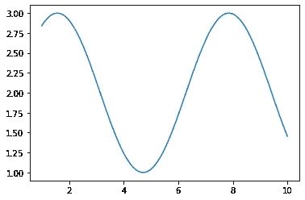
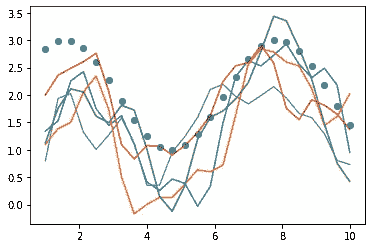
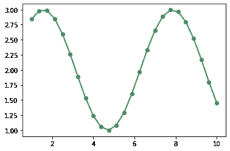
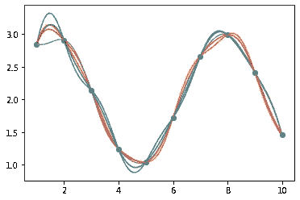
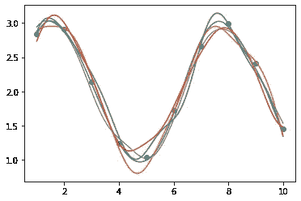

# 高斯过程到底是什么？

> 原文：<https://towardsdatascience.com/what-on-earth-is-a-gaussian-process-992a6fa2946b?source=collection_archive---------30----------------------->

## 对 Martin Krasser 的 GP 回归 Python 实现的直观、无假设的探索


信用:Pixabay

## **TL/DR**

高斯过程是非参数模型。相比之下，线性回归是一个参数模型。考虑一下`y = m*x + b`。在这个模型中，`m`和`b`是参数，分别表示，“*平均，缩放 x 乘 m，移位 b 得到 y.* ”学习到的参数大大*浓缩了*{ x:y }关系的本质。相比之下，非参数模型不提供对{x:y}关系的这种简单概括，它提供零参数(*或者可能是* ***)无限参数*** *)，基于您的观点！*)在高斯过程中，每个*训练*数据点都是它自己的维度(与来自同一维度的几个观察相反。)然而，如果我们说每个点都是它自己的平均值，方差为零，那么我们的函数将会过度波动(过度拟合),并且不能为测试数据点提供推断。使用了一个核函数，它很大程度上回答了问题“*任何给定的一对数据点应该相互通信多少？*“在径向基函数(RBF)核中，一个给定的数据点只与它的近邻进行明显的通信，而与远处的近邻的通信则可以忽略不计。这种设计允许高斯过程回答问题，“*对于任何测试 X，其测试 y 应该与其(训练)X 邻居有多相似？*“两个关键见解:(A) **预测的 Y 是训练 Y 的线性组合，用相应 X 的距离加权**。以及(B) **这些观察到的训练点*是*模型参数**——理论上可以是无限的(或者至少没有固定的上限！)利用了两种关系:{X_train，Y_train}关系和{X_train，X_test}关系。通过对给定{X_train，X_test，Y_train，Y_test}的联合分布建模(*使用条件高斯规则*)，我们能够推断出“函数”上的**分布，其描述了我们关于 Y_test 的信念。本质上，每个训练数据点都是一个参数。由于这个原因，训练数据不能被丢弃，因为它证明了描述我们关于 Y_test 的信念的(潜在无限的)参数。**

## 介绍

下面，我将从马丁·克拉瑟写的博客中探索代码，它从头实现了高斯过程。我发现代码像宣传的那样工作，但是对于不熟悉高斯过程的人来说，解释不够“通俗易懂”。这篇文章将有助于使高斯过程看起来非常直观；最后，上面的 TL/DR 将看起来非常清晰。

## 内核

下面是作者实现的 RBF 内核:

```
def kernel(X1, X2, l=1.0, sigma_f=1.0):
    sqdist = np.sum(X1**2, 1).reshape(-1, 1) + np.sum(X2**2, 1) -2 /    
    * np.dot(X1, X2.T)
    return sigma_f**2 * np.exp(-0.5 / l**2 * sqdist)
```

在英语中，函数的核心是:`x_1^2 + x_2^2 — 2*x_1*x_2`即`(x_1 — x_2)^2`。然后，该结果以与正态分布 PDF 的*接近*的方式进行缩放和指数运算。

## 实际例子

```
import numpy as np
import random
import matplotlib.pyplot as plt
dims = 25
x = np.linspace(1,10,dims)
y = np.sin(x) +2
plt.plot(x,y)
```



信用:我

## 训练点的线性组合

```
cov = kernel(x.reshape(-1,1),x.reshape(-1,1),l=0.5,sigma_f=0.5)
gp1 = np.dot(cov,y)
plt.scatter(x,y)for i in range(5):
    samples = multivariate_normal(mean=gp1,cov=cov)
    plt.plot(x,samples)
```



信用:我

在上面的图中，我们将真正的 x 和真正的 y 分散在蓝色中，上面有一些线形图。这些线图是来自多元正态分布的样本，其中“均值函数”(多元高斯中的μ参数)是权重(核输出)与目标(训练 y 值)的点积，如 TL/DR 中所述，而协方差是(σ参数)是核输出本身。我们可以看到，已经学习了一般形状*，但是*这些样本都需要缩放和移动，因为它们当前根本不匹配训练数据点*！*尽管如此，我们可以清楚地看到，高斯过程只是核权重和训练点的线性组合。

那么，为什么我们非常不准确呢？*我们还没训练模型呢！*考虑线性回归，如果我们只是简单地随机猜测 m 和 b 的值，然后作图，我们会对它的不准确性感到惊讶吗？一点也不。高斯过程的棘手之处在于，训练数据点 ***是*** 模型参数，但这并不意味着不需要模型训练。

## 贝叶斯规则

```
posterior  = likelihood * prior    / evidence
P(theta|X) = P(X|theta) * P(theta) / P(X)
           = P(X,theta) / P(X)
           = joint      / marginal
           = conditional
```

在上面的文章中，我证明了参数推断中使用的熟悉的贝叶斯规则可以重新排列以产生条件分布。因为我们的模型参数 ***是*** 训练数据点，所以我们想问这个问题，“给定 {X_test，X_train，Y_train}，我们相信{Y_test} ***什么？”***

```
X1, X2 = X_train, X_test
Y1, Y2 = Y_train, Y_test posterior = joint          / marginal 
           = P(Y2,Y1,X2,X1) / P(Y1,X2,X1)
           = P(Y2|Y1,X2,X1)
           = conditional
```

众所周知，如果联合分布是高斯分布，那么它的变量子集(边际)的分布也是高斯分布。因此，我们只需要假设`P(Y1,Y2,X1,X2)`是高斯的，以便利用高斯条件规则，这给我们后验分布(这允许训练/预测。)

## 高斯条件作用

首先，让我们考虑一下**条件均值公式**。我们取 x_1 的平均值，用某个因子来更新它。该系数(在下面的公式中从右向左读)为:

1.  观察到的具体距离 x2 *距离*T5 其平均值。这就回答了问题，“*特定的 x2 与 mu_2 的关系有多令人惊讶？*”
2.  精度矩阵的元素(协方差矩阵的逆矩阵)，对应于(x2，x2)，它回答了问题“*x2 关于 mu_2 相对于所有其他变量的聚集有多紧密？*值得注意的是，精度矩阵中的每个元素都不是简单的`1/element`，因为矩阵求逆是一个更复杂的过程，同时考虑每个关系。
3.  协方差矩阵的一个元素，对应于(x1，x2)，它回答了问题，“*(平均而言)，x1 和 x2 一起移动了多少？*

将这三者放在一起，我们就可以清楚地表达出我们对 x1 的*期望*给定一个观察到的 x2。

```
mu_1|2 = mu_1 + cov_[1,2] * inv(cov_[2,2]) * (x2 - mu_2)
```

其次，我们来考虑一下**条件协方差公式**。我们取 x1 的方差，并从中减去一个因子(从右向左读):

1.  (x1，x2)的协方差(见上一节)
2.  精度约为(x2，x2)(见上一节)
3.  (x1，x2) — *的协方差再一次*

将元素 1 和 2 放在一起，你实际上有一个比率，它说*“( x1，x2)之间的关系的相对强度是多少，当我们考虑 x2 围绕 mu_2 聚集的紧密程度时(尽管它与所有其他变量都有关系？)*“这只是一个比值；当我们将其投影回协方差(x1，x2)时，我们缩小该协方差——回答问题，“*在我们考虑 x2 关于 mu_2 的聚集程度之后，协方差的哪一部分剩余？*”

最后一步是简单地从 x1 的方差中去除这个因素。*“当我们去掉 x2 的作用，因为它的位置是* ***已经知道的*** *(又名条件作用)时，x1 变化了多少？*

```
cov_[1|2] = cov_[1,1] - cov[1,2] * inv(cov_[2,2]) * cov_[1,2]
```

如果你想看关于这些公式的来源的详尽证明，请自便。请注意，这个证明是线性代数错综复杂的冗长演示。因此，我试图直观地解释这些公式的效果。

## 内核调节

我前面介绍过这个思想，训练数据观测值就是这个模型的参数；由内核产生的权重确定用于推断对应于任何给定 x 的 y 的 y_train 值的特定线性组合。由于这种关系,“均值函数”通常被设置为 0。(换句话说，没有必要给一个已经非常灵活的模型增加额外的复杂性。)你会注意到在下面的公式中 mu_1 和 mu_2 已经被 0 代替了。

```
mu_[2|1]  =  0 + K_[1,2] * inv(K_[1,1]) * (y1 - 0)
          =      K_[1,2] * inv(K_[1,1]) *  y1cov_[2|1] = K_[2,2] - K_[1,2] * inv(K_[1,1]) * K_[1,2]
```

## Python 中的后验函数

```
from numpy.linalg import invdef posterior(X_test, X_train, Y_train, l=1.0, sigma_f=1.0):
    K_train = kernel(X_train, X_train, l, sigma_f) 
    K_joint = kernel(X_train, X_test, l, sigma_f)
    K_test = kernel(X_test, X_test, l, sigma_f) + 1e-8 * \
                    np.eye(len(X_test))
    K_train_inv = inv(K_train)

    mu_joint = K_joint.T.dot(K_train_inv).dot(Y_train)
    cov_joint = K_test - K_joint.T.dot(K_train_inv).dot(K_joint)

    return mu_joint, cov_joint
```

为了演示一个重要的概念，我将只提供训练数据，而不提供测试数据，然后从中抽取样本。

```
x1 = x.reshape(-1,1)
mu_test, cov_test = posterior(x1,x1,y)
samples = np.random.multivariate_normal(mu_test, cov_test, 3)plt.scatter(x1,y)
for i in range(len(samples)):
    plt.plot(x1,samples[i])
```



信用:我

请注意，我们对 3 个不同的“函数”进行了采样。(函数是指多元分布，其中每个维度代表同一维度的一系列唯一观察值。)*但是*，*每次都抽取完全相同的点！*这怎么可能？

让我们只看协方差函数的第一行。

```
cov_test[0,:].round(1)
>>>
array([-0., -0., -0.,  0.,  0.,  0.,  0.,  0., -0., -0., -0., -0., -0., -0., -0., -0., -0., -0.,  0.,  0.,  0.,  0.,  0.,  0.,  0.])
```

每个元素的方差为 0。这意味着*平均值将在每次* — **被采样，因为没有可变性！**同样，在对 y1 进行点积之前，让我们看看均值函数。我们希望看到**(条件内核，Y_train)点积中使用了什么样的** *权重*:

```
def conditional_kernel(X_test, X_train, Y_train, l=1.0, 
                       sigma_f=1.0):
    K_train = kernel(X_train, X_train, l, sigma_f)
    K_joint = kernel(X_train, X_test, l, sigma_f)
    K_test = kernel(X_test, X_test, l, sigma_f)
    K_train_inv = inv(K_train)
    return K_joint.T.dot(K_train_inv)t = conditional_kernel(x1,x1,y1)
t[0,:].round(1)
>>>
array([ 1., -0., -0.,  0.,  0., -0.,  0., -0., -0., -0.,  0., -0.,  0.,  0., -0., -0.,  0., -0.,  0., -0., -0.,  0., -0.,  0., -0.])
```

注意，在上面观察到的权重中，**第一个元素的权重为 1，所有其他元素的权重为 0** 。在线性组合方面，Y_train 中的第一个观察值被预测为*自身的 100%,方差为 0。*因此，为什么多变量高斯采样一个*且只有一个*唯一序列。

那么，为什么会发生这种情况呢？嗯，我们已经要求高斯过程为序列中的每个观察值拟合一个维度——它确实做到了！然而，**这并不能帮助我们推断出*关于测试点*与观测值之间的任何关系。**

下面，我们将看看一个(几乎)合适的高斯过程，它使用训练观测值作为参数来估计测试输入。

```
dims = 10
x_train = np.linspace(1,10,dims).reshape(-1,1)
y_train = np.sin(x_train) +2
x_test = np.linspace(1,10,100).reshape(-1,1)
mu_test, cov_test = posterior(x_test,x_train,y_train)
samples = np.random.multivariate_normal(mu_test.transpose()[0],  
                                        cov_test, 5)plt.scatter(x_train,y_train)
for i in range(len(samples)):
    plt.plot(x_test,samples[i])
```



信用:我

现在我们可以看到高斯过程是最(和最少！)自信。在点与点之间最远的区域有更多的可变性，因为要猜测 y_train 值的特定线性组合要分配给任何给定的 x_test 值。总的来说，它对自己的估计非常有信心！

注意，每个被采样的函数都与所有训练数据点*相交。这就是调理的效果。方差为 0，并且训练数据点每次都预测它们自己，*准确地说是*。但在现实中，我们有时希望放松这种约束，以允许更平滑的函数，这不太可能过度适应潜在的离群值。*

## 有噪声的预测

放松每个训练数据点必须精确自我预测的约束是一个简单的改变，我们简单地获得关于目标变量的方差，并将其添加到协方差函数中沿对角线的所有元素*。这似乎是一个奇怪的步骤，但是请记住协方差矩阵中的对角线元素反映了元素*的方差*；非对角线元素反映元素之间的关系。如果我们想放松这个约束，但又不想负面影响内核评估训练数据点之间相似性的方式，那么我们只需增加对角线上的元素。*

```
def posterior(X_test, X_train, Y_train, l=1.0, sigma_f=1.0, 
              sigma_y=1e-1):
    K_train = kernel(X_train, X_train, l, sigma_f) + sigma_y**2 * \      
                     np.eye(len(X_train))
    K_joint = kernel(X_train, X_test, l, sigma_f)
    K_test = kernel(X_test, X_test, l, sigma_f) + 1e-8 * \     
    np.eye(len(X_test))
    K_train_inv = inv(K_train)
    mu_joint = K_joint.T.dot(K_train_inv).dot(Y_train)
    cov_joint = K_test - K_joint.T.dot(K_train_inv).dot(K_joint)return mu_joint, cov_joint
```

现在，让我们来看看(改进的)模型性能:

```
mu_test, cov_test = posterior(x_test,x_train,y_train)
samples = np.random.multivariate_normal(mu_test.transpose()[0], 
                                        cov_test, 5)plt.scatter(x_train,y_train)
for i in range(len(samples)):
    plt.plot(x_test,samples[i])
```



信用:我

## 尺寸的尺寸

将这种情况扩展到更高维度实际上非常简单。我们仍然将 Y_train 的线性组合分配给任何 X_test 输入(以及噪声模型中的 X_train 输入),如前所述。)当我们观察到每一个 X 都是在 2+维中定义的(比如身高体重)，那么内核就需要在更高维中评估观察值之间的相似性。幸运的是，这对于内核来说根本不是问题！

## 超参数调谐

你可能会好奇为什么我从来没有讨论过超参数调优，也就是内核函数中的`sigma_f`和`l`。博客作者确实使用了优化方法来获得最佳超参数值——我鼓励您回顾一下他是如何实现这一方法的。

我更喜欢贝叶斯方法；与其收敛于最优超参数的点估计，我更愿意看到这些参数的整体分布。点估计方法可能会陷入局部最优(与全局最优相反)，但抽样方法通常会探索整个分布，并可以在一定程度上减轻这种风险(复杂几何存在例外，这使几乎任何方法都感到困惑)。)我最喜欢的贝叶斯建模库是 PyMC3。

## 最后的想法

我计划在以后的文章中用 PyMC3 构建一个高斯过程教程——或者简单地扩展这篇文章，包括一个应用 GP 建模的简短演示。

## 如果这篇文章帮助你更好地理解高斯过程，你喜欢我的写作风格，或者喜欢阅读——请不要忘记订阅:)