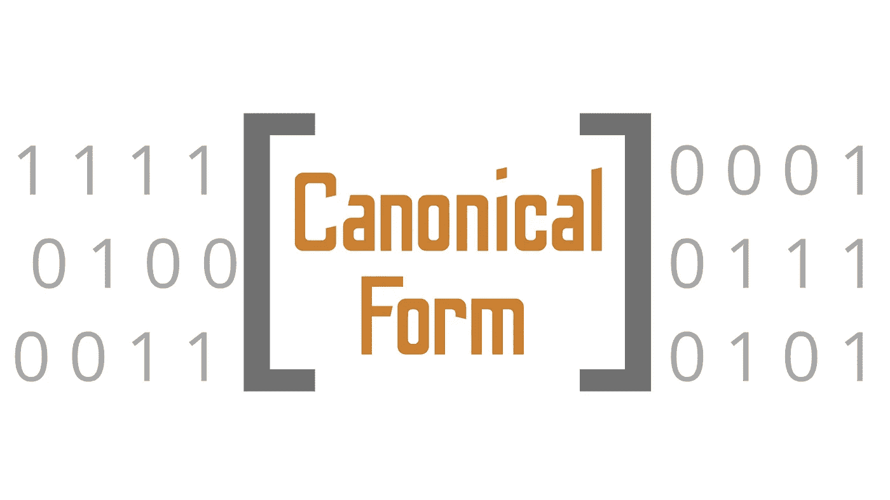

# “规范形式”到底是什么？

> 原文：<https://towardsdatascience.com/what-on-earth-is-canonical-form-23cef915601d?source=collection_archive---------51----------------------->

## 本征向量、值和计算中整体分解的数学概述

(图片由作者提供)

# 介绍

机器学习问题通常比简单地将一维数组插入模型要复杂得多。很常见的情况是，所提供的数据首先是不干净的，其次是计算机不可能在统计上完全说明所有方面的问题。在现代数据科学中，使用可能无法测量一维数据的工具进行测量是很常见的。此外，图像是一个很好的例子，说明为了使数据适用于任何模型，必须降低数据的维度。

在这里，我们遇到了一个在统计计算中很常见的概念，叫做分解。分解是获取一个给定的多维数据矩阵，然后将这些维度压缩成更易于解释的特征，实际上是固体特征和观察数据集。

这种解释能力不仅在使用分解时提供给用户，也提供给计算机。分解的目标总是最小化一个给定的数据集，甚至一个特征可能有的维数。当然，这就提出了一个问题——我们究竟如何才能降低数据的维度？

# 语言的语音典型

简化后的数据通常被称为我们数据的“个性化”版本。eigin 向量、值和任何其他你想使用 eigin 名称的度量的整体概念是，这些是我们能提供的这些矩阵的最简化的数学形式。降低数据的维度是这个新术语“规范形式”的来源。

标准形式是计算机科学家和统计学家常用的一个术语，用来表示任何尽可能简化成数学表达式的数学对象。“规范”和“标准”形式之间的区别因子领域而异，然而在大多数表示中，数学对象形式的规范版本指的是每个对象的唯一表示。

利用规范形式的分解方法的一个很好的例子实际上是一个行业标准，它很可能是您以前使用过的；可能根本没有意识到。我所指的美丽的数学公式是奇异值分解，或者 SVD，如果你喜欢昵称或写作。奇异值分解对机器学习有多重要？首先，我想强调一下 SVD 真正伟大的地方，而不是描述它在大多数机器学习问题中的作用。

# 关于分解的更多信息

奇异值分解实际上在数据科学中得到了非常好的应用，随着您对数据科学和一般数据工作的了解越来越多，您可能会发现它的名字会反复出现。大多数可用于操纵和理解数据的无监督学习方法都是利用分解方法。当然，在某些情况下，它可能是不同类型的分解，然而最流行的是 SVD。

SVD 被实现到大多数 PCA 算法中，并且是减少用于主成分分析以及聚类的数据维度的关键部分。很容易理解为什么这个工具已经很有价值，因为聚类可能是数据科学家拥有的最流行的无监督学习方法。

此外，SVD 可以用来提高大多数机器学习模型和机器学习应用程序的准确性。此外，在很多情况下，使用 SVD 是不可避免的，因此解决高维数据问题基本上是无效的。

# 结论

不用说，在处理特征并为机器学习问题做准备时，数据科学家拥有的一个非常有价值的工具是分解。分解提取某一级别数据的维度，并减少它，直到每个特征只剩下一个简单的 eigin 向量。

幸运的是，这正是计算机喜欢的输入方式！此外，我们可以通过降低数据的维度来提高性能，同时保持准确性和实际的工程特性——我认为这肯定会派上用场。我认为对于数据科学来说，分解是需要学习的最重要的概念之一，我希望这个关于规范概念的概述真的能记住并有所帮助。感谢您的阅读！