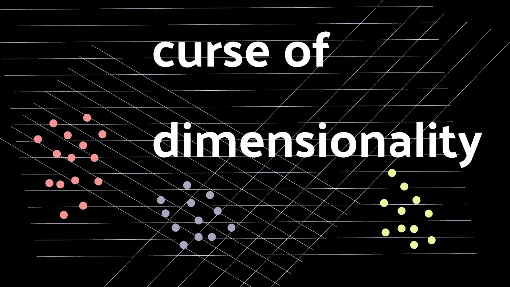

# 维度的诅咒到底是什么？

> 原文：<https://towardsdatascience.com/what-on-earth-is-the-curse-of-dimensionality-7b8815edaa1?source=collection_archive---------30----------------------->

## 了解为什么高维数据可能不像我们曾经认为的那样令人兴奋。

(图片由作者提供)

# 介绍

从事数据科学职业的一个不幸的不利方面是，理解数据有时会相当困难。对于高维数据来说尤其如此。此外，该领域新手的一个大问题是首先要对高维数据有一个坚实的理解。这是因为很难找到可以多维观察的数据。这让我们想到

> 维度的诅咒。

高维数据不仅对人类来说难以(或不可能)分析和处理，对计算机来说也是如此。虽然使用巨大的特征集是完全可能的，但是科学家可以估算的维度总是有限的。也就是说，这个等式的一个重要方面是维度到底是什么以及它的用途。

# 关于尺寸的更多信息

为了理解维度，我们需要首先理解什么是维度。这个词对于很多读者来说可能很熟悉，比如动画，动画可以是二维的也可以是三维的。在经典的数学术语中，我们可以称这些特征为 X 和 y。两者都是轴上的位置，我们可以认为是二维网格。我们也可以把它想象成一个散点图，根据这两个值之间的关系来绘制值。

将二维数据转换成三维数据意味着增加一个轴 z。当然，你可能对真实世界的三维概念很熟悉。这是因为现实生活空间中的位置不仅可以用经度和纬度来表示，还可以用高度来表示。我们可以将维度视为数据中代表某种事物的特征。

现在回到数据科学的奇妙世界，我们可以将这些相同的概念应用到我们日常处理的大多数数据中。我们可以将每个特征视为数据的一个维度。让我们考虑一个人类。人类是一种非常高维的数据类型，包含从身高、体重、鞋码到姓名、价值观和信仰的各种特征。在图表上观察人类，或者把一个完整的人解释成一台计算机，都不太可行，因为这方面有很多维度。

这给任何以高维方式描述的事物都带来了问题。

# 诅咒

既然我们对维度与数据的关系有了坚实的理解，我们现在可以讨论为什么高维数据是“被诅咒的”，并且可能相当难以处理。这是因为人类和计算机在解释高维值时都有很大的困难，因为有太多的数据需要统计。从统计学的角度来看，不太重要的特性或者有些随意的特性实际上会破坏模型的准确性，而不是提高它。

维度的诅咒在于它无法被分析。高维数据不仅会给统计和计算机带来问题，也会给使用它们的人带来问题。每当我们处理多维数据时，我们都在处理不同类型的特征(类型指的是维度描述的内容，而不是特征本身)，尤其是对于机器学习来说，许多特征可能非常成问题。如果我们被诅咒去处理一些维数非常高的数据，那么我们如何有效地将数据转化为模型，并使其足够干净以进行测试呢？解决方案是一个叫做分解的概念。

# 分解

复杂的多维数据集有很多缺点。有时候，拥有一大堆功能可能会让人不知所措，无法工作。幸运的是，对于大多数应用程序，我们可以利用分解来将这些特征分解成可以被机器学习和分析所解释的数据。数据科学家手边有几种分解方法。此外，这些分解工具中的大部分都已经在我们最喜欢的数据科学包中实现了，有时有多个版本。

有许多不同的方法和途径，我们可以用分解来解决问题。分解的基本思想是通过创建代表多个维度的新的任意值来减少数据的维度。结果是一系列的集群，对最初的构造者来说非常抽象，但实际上非常类似于我们的大脑如何利用真实物体的维度。

我喜欢用类比的方法来解释事物，但我喜欢想象一棵树。每当我看一棵树时，我可以认为这棵树是有维度的，例如:

*   高度
*   叶子形状
*   重量
*   颜色
*   增长类型

我碰巧对树很熟悉，所以我知道树很高，与其他植物相比重量很大，通常是棕色和绿色的，并且独立生长。现在观察一棵树，如果我们能够画出这些维度，我们很可能会看到这棵树与所有其他的树非常接近，这正是分解和许多机器学习的基础。这是通过特征向量在数值上实现的。

最流行的分解方法当然是奇异值分解，或 SVD。SVD 是一种简单的分解方法，它使用三个矩阵 V、U 和 S 来将维数降低到标准形式。如果你想了解更多关于标准形式的知识，我实际上有一整篇文章，你可以在这里阅读:

</what-on-earth-is-canonical-form-23cef915601d>  

虽然 SVD 是一种很好的非常流行的分解方法，但我认为记住有许多不同的分解方法是很重要的，比如随机投影。随机投影是一种以[约翰逊-林登斯特劳斯引理](https://en.wikipedia.org/wiki/Johnson-Lindenstrauss_lemma)为中心的分解方法。这基本上说明了高维的数据可以被投影到较低的维中。幸运的是，如果你想了解更多关于随机投影的知识，我有一篇文章你可以在这里找到:

</random-projection-and-its-role-in-data-science-f253dd66485b>  

# 结论

在数据科学领域，维数灾难惊人地频繁发生。这可能会被视为一个负面因素，因为这意味着这些功能可能很难使用，然而，使用适当的工具并了解它实际上可以设计一些非常有统计学意义的功能。不用说，这种处理大量数据的方法非常有用，有助于提高性能和理解。维数灾难只是对令人兴奋的数据的诅咒，但知道如何处理这些数据可以使它以一种全新的方式令人兴奋。考虑到这一点，我认为尽可能多的学习分解方法是非常有价值的，因为它们对于几乎所有的数据科学项目都是非常有用的。